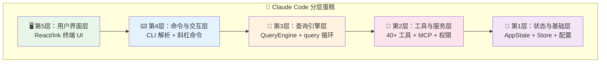
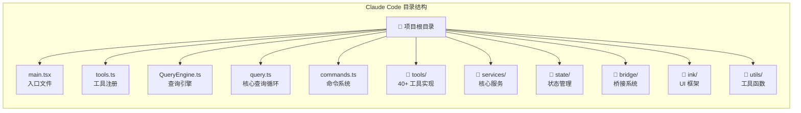
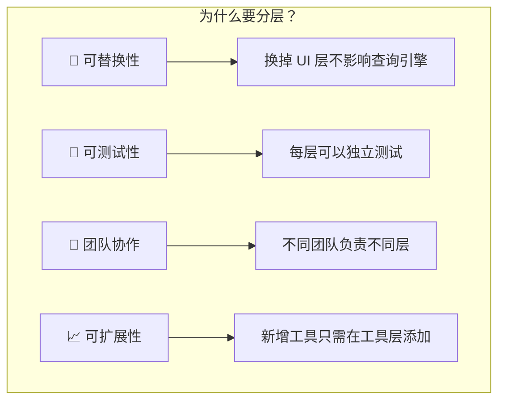

# 第1课：什么是软件架构？Claude Code 的分层蛋糕

## 学习目标

通过本课学习，你将能够：

1. 理解"软件架构"这个概念，用生活中的类比来解释它
2. 认识 Claude Code 项目的整体目录结构和分层设计
3. 理解分层架构（Layered Architecture）的核心思想
4. 找到 Claude Code 中每一层的关键文件
5. 建立对整个系统的全局认知地图

---

## 1.1 什么是软件架构？

### 生活类比：建一栋大楼

想象你要建一栋摩天大楼。你不会一上来就砌砖头——你需要先画**设计图**：

- **地基**在哪里？（基础设施层）
- **承重墙**怎么摆？（核心逻辑层）
- **电梯和楼梯**怎么布局？（通信/路由层）
- **每层楼**放什么？（功能模块层）
- **外墙装饰**怎么做？（用户界面层）

这个设计图，就是**软件架构**。

> **软件架构** = 系统的组织方式 + 各部分如何协作 + 关键的设计决策

### 为什么架构重要？

| 没有架构 | 有好的架构 |
|---------|-----------|
| 代码堆成一团 | 职责清晰，各司其职 |
| 改一处，坏十处 | 修改局部，不影响整体 |
| 新人看不懂 | 新人快速上手 |
| 扩展困难 | 轻松添加新功能 |

---

## 1.2 Claude Code 的"分层蛋糕"

Claude Code 采用了经典的**分层架构**，就像一个多层蛋糕：



每一层只和相邻的层交互，这就是**分层架构**的核心规则。

---

## 1.3 从真实源码看分层

### 第1层：状态与基础层

这是蛋糕的最底层，负责管理整个应用的"记忆"。

来看 `state/store.ts`，这是一个极简但优雅的状态管理器：

```typescript
// 源码：state/store.ts
export type Store<T> = {
  getState: () => T
  setState: (updater: (prev: T) => T) => void
  subscribe: (listener: Listener) => () => void
}

export function createStore<T>(
  initialState: T,
  onChange?: OnChange<T>,
): Store<T> {
  let state = initialState
  const listeners = new Set<Listener>()

  return {
    getState: () => state,
    setState: (updater: (prev: T) => T) => {
      const prev = state
      const next = updater(prev)
      if (Object.is(next, prev)) return
      state = next
      onChange?.({ newState: next, oldState: prev })
      for (const listener of listeners) listener()
    },
    subscribe: (listener: Listener) => {
      listeners.add(listener)
      return () => listeners.delete(listener)
    },
  }
}
```

**类比**：这就像一个**公告板**——任何人都可以看（`getState`），授权的人可以更新（`setState`），关心变化的人可以订阅通知（`subscribe`）。

### 第2层：工具与服务层

Claude Code 拥有 40+ 种工具。来看 `tools.ts` 中如何注册它们：

```typescript
// 源码：tools.ts
export function getAllBaseTools(): Tools {
  return [
    AgentTool,
    TaskOutputTool,
    BashTool,
    ...(hasEmbeddedSearchTools() ? [] : [GlobTool, GrepTool]),
    FileReadTool,
    FileEditTool,
    FileWriteTool,
    NotebookEditTool,
    WebFetchTool,
    TodoWriteTool,
    WebSearchTool,
    // ...更多工具
  ]
}
```

**类比**：这就像一个**工具箱**——不同的工具完成不同的任务，有的读文件、有的执行命令、有的搜索网页。

### 第3层：查询引擎层

这是 Claude Code 的"大脑"，来看 `QueryEngine.ts`：

```typescript
// 源码：QueryEngine.ts
export class QueryEngine {
  private config: QueryEngineConfig
  private mutableMessages: Message[]
  private abortController: AbortController
  private totalUsage: NonNullableUsage

  constructor(config: QueryEngineConfig) {
    this.config = config
    this.mutableMessages = config.initialMessages ?? []
    this.abortController = config.abortController ?? createAbortController()
    this.totalUsage = EMPTY_USAGE
  }

  async *submitMessage(
    prompt: string | ContentBlockParam[],
    options?: { uuid?: string; isMeta?: boolean },
  ): AsyncGenerator<SDKMessage, void, unknown> {
    // 处理用户输入 → 调用 API → 执行工具 → 返回结果
  }
}
```

**类比**：QueryEngine 就像一个**翻译官**——接收你说的话，翻译给 Claude AI，再把 AI 的回答翻译回来给你。

### 第4层：命令与交互层

`commands.ts` 管理所有斜杠命令：

```typescript
// 源码：commands.ts
const COMMANDS = memoize((): Command[] => [
  addDir, advisor, agents, branch, clear,
  color, compact, config, copy, desktop,
  context, cost, diff, doctor, effort,
  exit, fast, files, help, ide,
  init, keybindings, mcp, memory, model,
  permissions, plan, review, session, skills,
  status, theme, vim,
  // ...更多命令
])
```

**类比**：这就像一个**餐厅菜单**——你可以输入 `/help` 看帮助，`/compact` 压缩对话，`/mcp` 管理外部工具。

### 第5层：用户界面层

基于 React/Ink 构建的终端界面，在 `ink/` 目录下。它让命令行也能有丰富的交互体验。

---

## 1.4 目录结构全景图



关键文件说明：

| 文件/目录 | 职责 | 层级 |
|----------|------|------|
| `main.tsx` | 程序入口，CLI 解析 | 第4层 |
| `tools.ts` | 工具注册中心 | 第2层 |
| `QueryEngine.ts` | 查询生命周期管理 | 第3层 |
| `query.ts` | 核心查询循环 | 第3层 |
| `commands.ts` | 斜杠命令注册 | 第4层 |
| `state/store.ts` | 状态管理 | 第1层 |
| `bridge/` | 远程桥接 | 第2层 |
| `services/mcp/` | MCP 扩展 | 第2层 |
| `ink/` | 终端 UI | 第5层 |

---

## 1.5 分层架构的好处



### 真实例子

想给 Claude Code 添加一个新工具？只需要：

1. 在 `tools/` 目录下创建新工具文件
2. 在 `tools.ts` 的 `getAllBaseTools()` 中注册
3. 完成！其他层完全不需要改动

这就是分层架构的威力——**关注点分离**。

---

## 动手练习

### 练习1：找到关键文件

打开 Claude Code 源码，找到以下文件并记录它们的行数：

- [ ] `main.tsx` — 入口文件有多少行？
- [ ] `tools.ts` — 注册了多少个工具导入？
- [ ] `QueryEngine.ts` — QueryEngine 类有哪些主要方法？
- [ ] `state/store.ts` — Store 接口有哪三个方法？

### 练习2：画出你的理解

拿一张纸，画出 Claude Code 的五层架构，标注每层的核心职责和关键文件。

### 思考题

1. 为什么 `state/store.ts` 要用 `Object.is(next, prev)` 来判断状态是否变化？
2. 如果把所有代码都写在一个文件里会怎样？
3. 你见过的其他软件（比如微信、淘宝）可能也是分层架构吗？

---

## 本课小结

| 要点 | 内容 |
|------|------|
| 软件架构 | 系统的组织方式和设计决策 |
| 分层架构 | 各层职责明确，只与相邻层交互 |
| Claude Code 五层 | 状态层 → 工具层 → 引擎层 → 命令层 → UI 层 |
| 核心文件 | main.tsx, tools.ts, QueryEngine.ts, query.ts, commands.ts |
| 核心思想 | 关注点分离，高内聚低耦合 |

---

## 下节预告

**第2课：技术栈全解析** — 我们将深入了解 Claude Code 使用的技术栈：TypeScript 为什么是最佳选择？Bun 比 Node.js 快在哪里？React/Ink 如何在终端中渲染 UI？带你认识这些强大的技术工具！
