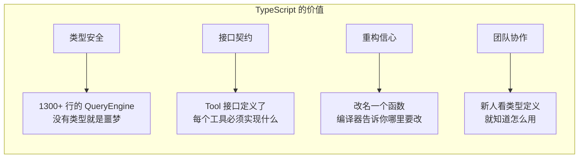
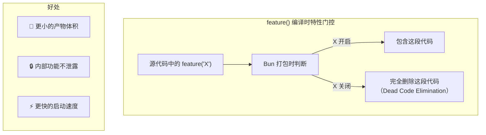
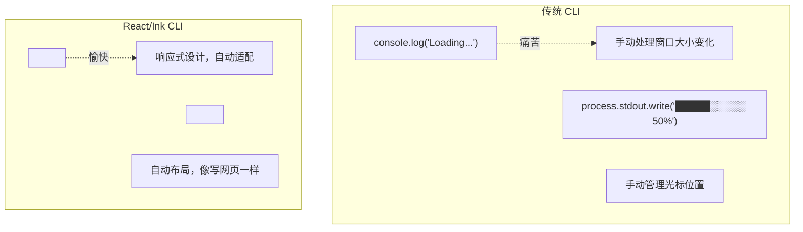
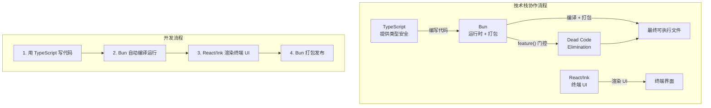
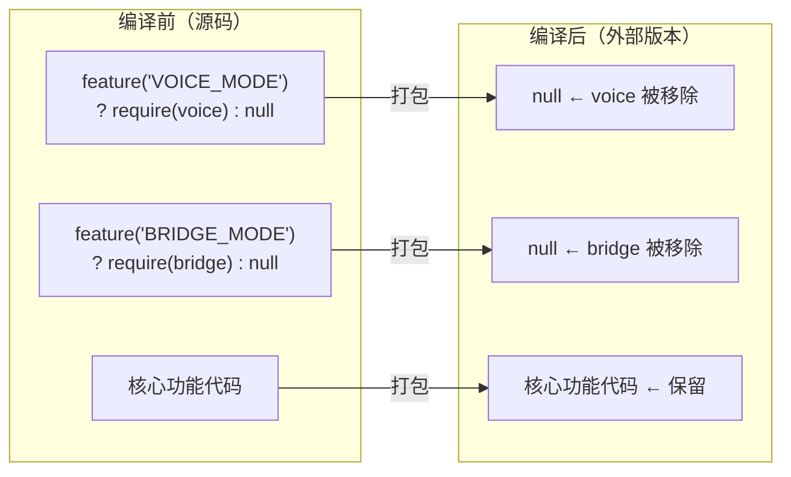

# 第2课：技术栈全解析：TypeScript + Bun + React/Ink

## 学习目标

通过本课学习，你将能够：

1. 理解 TypeScript 为什么是构建大型 CLI 工具的最佳选择
2. 认识 Bun 运行时的优势以及 Claude Code 如何利用它
3. 了解 React/Ink 如何把 React 的能力带到终端
4. 看到这三者如何在 Claude Code 中协同工作
5. 理解 `feature()` 编译时特性门控机制

---

## 2.1 TypeScript：给 JavaScript 穿上铠甲

### 生活类比：标签化的收纳箱

想象你有一个大仓库。如果所有东西都扔在一起（JavaScript），找东西就像大海捞针。但如果给每个箱子贴上标签——"厨房用品"、"书籍"、"电子产品"（TypeScript），一切都井井有条。

TypeScript 就是给代码贴标签的工具——它添加了**类型系统**。

### 真实源码中的类型

来看 `QueryEngine.ts` 中的配置类型定义：

```typescript
// 源码：QueryEngine.ts
export type QueryEngineConfig = {
  cwd: string
  tools: Tools
  commands: Command[]
  mcpClients: MCPServerConnection[]
  agents: AgentDefinition[]
  canUseTool: CanUseToolFn
  getAppState: () => AppState
  setAppState: (f: (prev: AppState) => AppState) => void
  initialMessages?: Message[]
  readFileCache: FileStateCache
  customSystemPrompt?: string
  maxTurns?: number
  maxBudgetUsd?: number
  verbose?: boolean
}
```

每个字段都有明确的类型，`?` 表示可选。这样做的好处：

- 编辑器能**自动补全**——输入 `config.` 就能看到所有可用字段
- 写错字段名会**立即报错**——不用等到运行时才发现
- 代码就是**文档**——看类型定义就知道需要传什么

### TypeScript 在 Claude Code 中的应用



---

## 2.2 Bun：闪电般的 JavaScript 运行时

### 生活类比：高铁 vs 绿皮火车

Node.js 像一辆可靠的绿皮火车——跑了十几年，哪里都能到。但 Bun 就像高铁——同样的路线，速度快好几倍！

### Bun 在 Claude Code 中的独特用法

Claude Code 使用了 Bun 的一个特殊能力——`bun:bundle` 的 `feature()` 函数：

```typescript
// 源码：tools.ts
import { feature } from 'bun:bundle'

const SleepTool = feature('PROACTIVE') || feature('KAIROS')
  ? require('./tools/SleepTool/SleepTool.js').SleepTool
  : null

const coordinatorModeModule = feature('COORDINATOR_MODE')
  ? require('./coordinator/coordinatorMode.js') as typeof import('./coordinator/coordinatorMode.js')
  : null

const SnipTool = feature('HISTORY_SNIP')
  ? require('./tools/SnipTool/SnipTool.js').SnipTool
  : null
```

### feature() 是什么？



**类比**：就像一本书的不同版本——国际版删掉了某些章节，但不是简单地涂黑，而是压根不印那些页面，书变得更薄更轻。

### Bun 的其他优势

| 特性 | Node.js | Bun |
|------|---------|-----|
| 启动速度 | ~40ms | ~6ms |
| 包管理 | npm/yarn | 内置，更快 |
| TypeScript | 需要编译 | 原生支持 |
| 打包 | 需要 webpack | 内置 bundler |
| 测试 | 需要 jest | 内置测试运行器 |

---

## 2.3 React/Ink：让终端也能用 React

### 生活类比：乐高积木

传统的命令行程序用 `console.log` 输出文字，就像用纸笔画画。而 React/Ink 就像给你一盒**乐高积木**——用组件拼出丰富的界面。

### Ink 是什么？

Ink 是一个用 React 在终端中渲染 UI 的框架。Claude Code 甚至内置了自己定制的 Ink 版本：

```typescript
// 源码：ink/components/Box.tsx —— 布局容器
// 类似于网页中的 <div>，用于终端布局

// 源码：ink/components/Text.tsx —— 文本组件
// 类似于网页中的 <span>，支持颜色和样式

// 源码：ink/components/ScrollBox.tsx —— 可滚动容器
// 让终端内容可以像网页一样滚动
```

### Claude Code 中的 React 组件示例

来看权限对话框如何用 React 组件构建：

```
📁 components/permissions/
├── PermissionDialog.tsx      ← 权限弹窗主体
├── PermissionRequest.tsx     ← 权限请求展示
├── PermissionPrompt.tsx      ← 用户选择界面
└── PermissionExplanation.tsx ← 权限说明文字
```

### 为什么用 React 做 CLI？



### 真实的 React 在 CLI 中的用法

```typescript
// 概念示例：Claude Code 中 Agent 工具的 UI 渲染
// 源码：tools/AgentTool/UI.tsx

// 工具调用时渲染进度消息
function renderToolUseProgressMessage(
  toolName: string,
  description: string,
) {
  // React 组件渲染到终端中
  return <Text color="blue">{`🔄 ${toolName}: ${description}`}</Text>
}
```

---

## 2.4 三者如何协同工作



### main.tsx 中的协作体现

```typescript
// 源码：main.tsx（入口文件）
import { feature } from 'bun:bundle'          // Bun 特性
import React from 'react'                       // React
import { Command as CommanderCommand } from '@commander-js/extra-typings'  // TypeScript 类型
import { createStore } from './state/store.js'   // TypeScript 状态管理
import { type AppState, getDefaultAppState } from './state/AppStateStore.js'  // TypeScript 类型

// feature() 控制编译时包含哪些模块
const coordinatorModeModule = feature('COORDINATOR_MODE')
  ? require('./coordinator/coordinatorMode.js')
  : null

const assistantModule = feature('KAIROS')
  ? require('./assistant/index.js')
  : null
```

这三行代码完美展示了三者的配合：
- **TypeScript** 提供类型约束
- **Bun** 的 `feature()` 在编译时决定是否包含代码
- **React** 用于后续的 UI 渲染

---

## 2.5 Dead Code Elimination 深度解析

Claude Code 大量使用了编译时代码消除，这是一个很精巧的设计：

```typescript
// 源码：commands.ts
// 只有在特定 feature 启用时，才包含这些命令
const proactive =
  feature('PROACTIVE') || feature('KAIROS')
    ? require('./commands/proactive.js').default
    : null

const bridge = feature('BRIDGE_MODE')
  ? require('./commands/bridge/index.js').default
  : null

const voiceCommand = feature('VOICE_MODE')
  ? require('./commands/voice/index.js').default
  : null
```



---

## 动手练习

### 练习1：TypeScript 类型体验

尝试用 TypeScript 写一个简单的工具类型定义：

```typescript
// 仿照 Claude Code 的 Store 类型
type MyStore<T> = {
  getState: () => T
  setState: (updater: (prev: T) => T) => void
}

// 试试创建一个计数器 Store
type CounterState = { count: number; name: string }
```

### 练习2：理解 feature() 门控

阅读 `tools.ts` 源码，回答以下问题：

- [ ] 有多少个 `feature()` 调用？
- [ ] 哪些工具是只有内部用户才能使用的？（提示：看 `process.env.USER_TYPE === 'ant'`）
- [ ] 如果 `feature('COORDINATOR_MODE')` 返回 false，会发生什么？

### 思考题

1. 为什么 Claude Code 不直接用 JavaScript，而要用 TypeScript？
2. `feature()` 和运行时的 `if` 判断有什么区别？
3. 为什么要在终端里用 React？直接 `console.log` 不好吗？

---

## 本课小结

| 技术 | 作用 | 类比 |
|------|------|------|
| TypeScript | 类型安全，防止错误 | 给箱子贴标签 |
| Bun | 快速运行时 + 打包 | 高铁 vs 绿皮火车 |
| React/Ink | 终端 UI 框架 | 乐高积木 |
| feature() | 编译时代码消除 | 书的不同版本 |

### 关键文件

| 文件 | 技术体现 |
|------|---------|
| `QueryEngine.ts` | TypeScript 类型的大规模应用 |
| `tools.ts` | `feature()` + 条件导入 |
| `ink/components/` | React/Ink 组件 |
| `main.tsx` | 三种技术的交汇点 |

---

## 下节预告

**第3课：启动流程详解** — 当你在终端输入 `claude` 时，到底发生了什么？我们将跟着源码走一遍完整的启动流程，从命令行解析到 REPL 界面的渲染。你会看到一个看似简单的命令背后，隐藏着多少精心设计的步骤！
