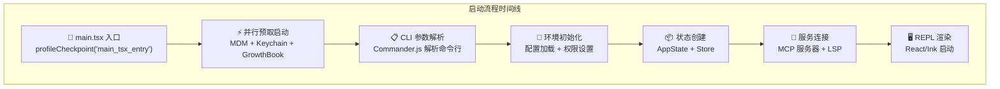
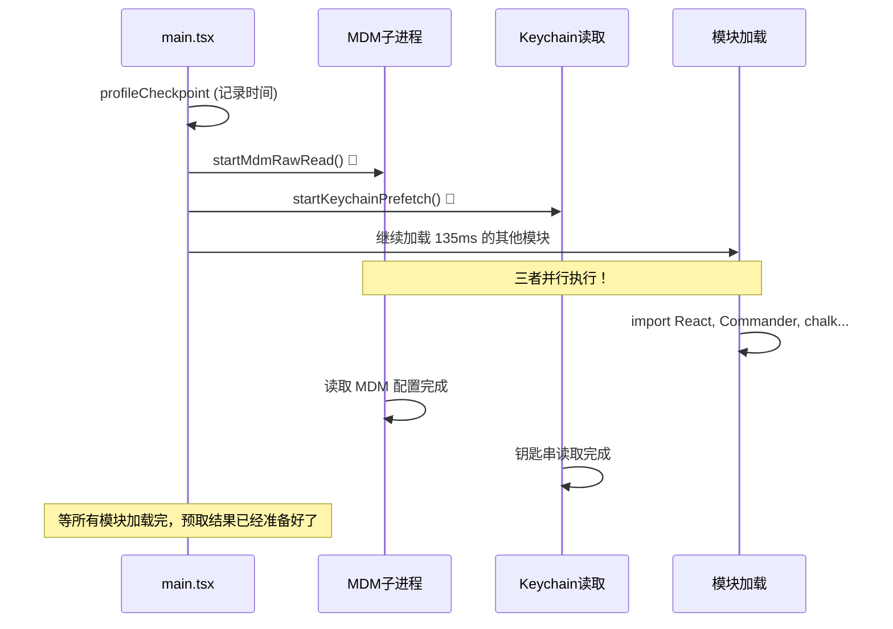
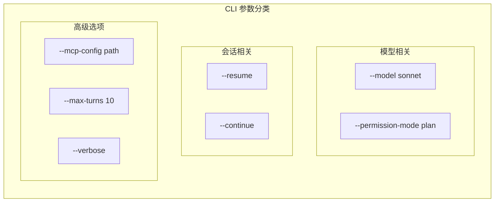
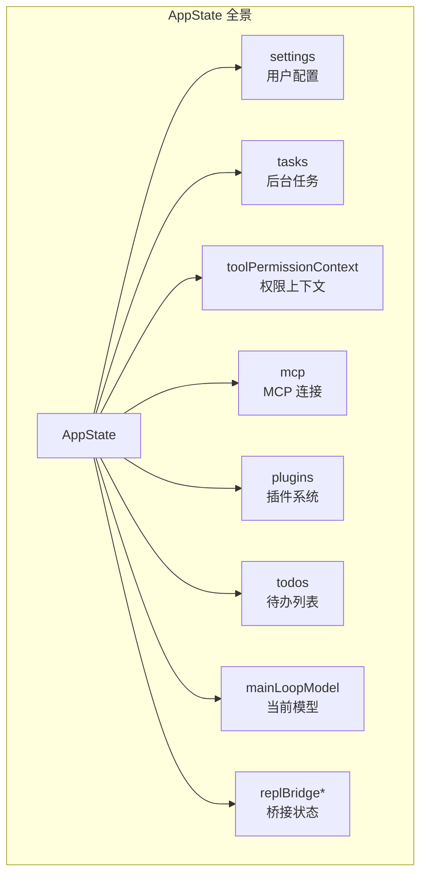
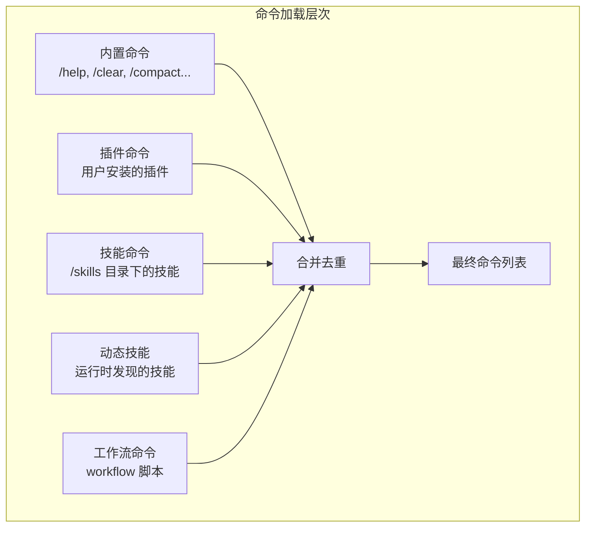
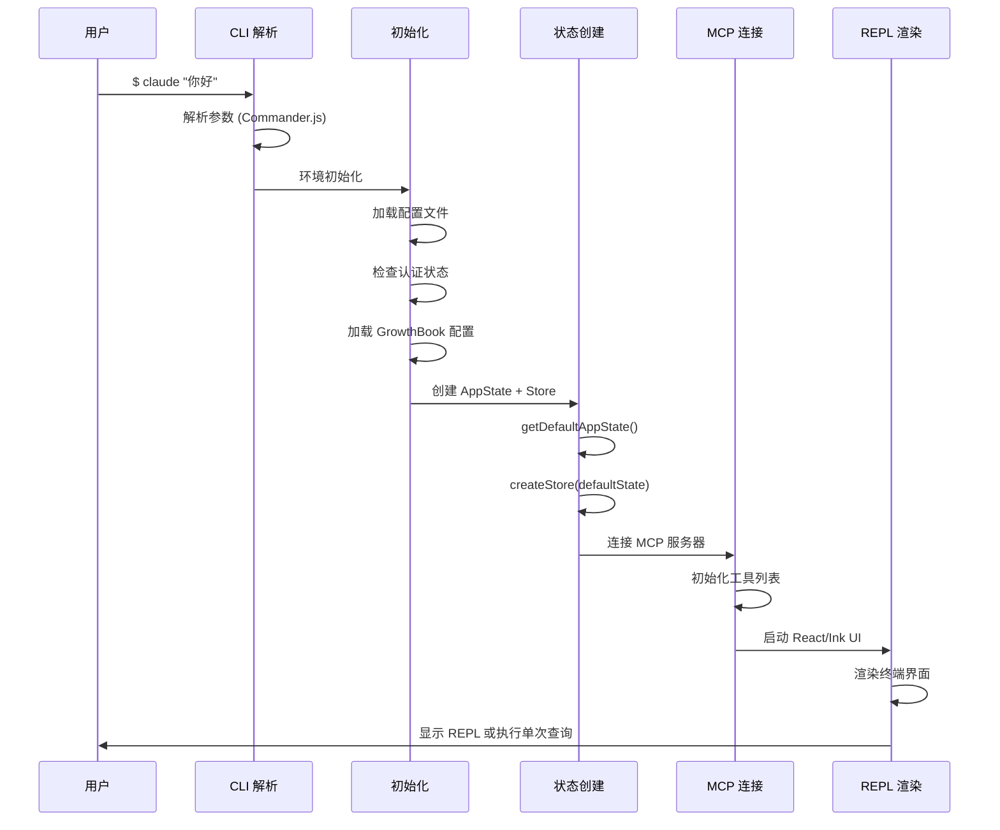
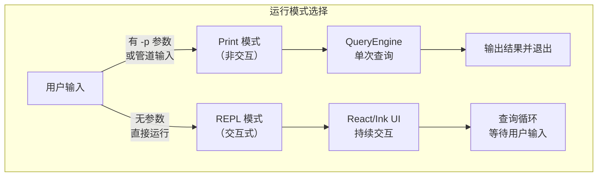

# 第3课：启动流程详解：从命令行到 REPL

## 学习目标

通过本课学习，你将能够：

1. 理解 `main.tsx` 入口文件的组织结构
2. 跟踪从用户输入 `claude` 到 REPL 启动的完整流程
3. 理解并行预取（Parallel Prefetch）的启动优化策略
4. 认识 CLI 参数解析的设计模式
5. 了解 AppState 初始化和 Store 创建过程

---

## 3.1 一切从 main.tsx 开始

### 生活类比：开一家餐厅

每天早上开店前，餐厅要做很多准备工作：

1. **开门前检查**（环境检查）
2. **打开灯和空调**（初始化基础设施）
3. **准备食材**（加载配置和数据）
4. **通知服务员就位**（启动服务）
5. **翻开"营业中"牌子**（显示 REPL 界面）

Claude Code 的启动流程也是这样——看似瞬间完成，实际上有精心编排的步骤。

---

## 3.2 启动流程全景



---

## 3.3 入口文件的前几行：速度优化的极致

打开 `main.tsx`，前 20 行就体现了对启动速度的极致追求：

```typescript
// 源码：main.tsx（前20行）

// 这些副作用必须在所有其他 import 之前运行：
// 1. profileCheckpoint 在模块加载前标记时间点
// 2. startMdmRawRead 启动 MDM 子进程（plutil/reg query），
//    让它们和后续 ~135ms 的 import 并行运行
// 3. startKeychainPrefetch 启动 macOS 钥匙串读取
import { profileCheckpoint } from './utils/startupProfiler.js';
profileCheckpoint('main_tsx_entry');

import { startMdmRawRead } from './utils/settings/mdm/rawRead.js';
startMdmRawRead();

import { startKeychainPrefetch } from './utils/secureStorage/keychainPrefetch.js';
startKeychainPrefetch();
```

### 这里有什么巧妙的设计？



**类比**：就像你边等咖啡机加热（模块加载），边去信箱拿报纸（MDM 读取），边遛狗（钥匙串读取）——三件事同时做，总时间只取决于最慢的那个。

---

## 3.4 CLI 参数解析

`main.tsx` 使用 Commander.js 来解析命令行参数：

```typescript
// 源码：main.tsx（简化版 CLI 配置）
import { Command as CommanderCommand } from '@commander-js/extra-typings'

// 创建 CLI 程序
const program = new CommanderCommand()

// 各种选项：
// --model / -m     指定模型
// --permission-mode 权限模式
// --resume / -r    恢复会话
// --verbose        详细输出
// --max-turns      最大轮数
// --mcp-config     MCP 配置文件
```

### 常见 CLI 选项一览



---

## 3.5 AppState 初始化

启动时，系统创建一个巨大的 AppState 来管理全局状态：

```typescript
// 源码：state/AppStateStore.ts
export function getDefaultAppState(): AppState {
  return {
    settings: getInitialSettings(),
    tasks: {},
    agentNameRegistry: new Map(),
    verbose: false,
    mainLoopModel: null,
    toolPermissionContext: {
      ...getEmptyToolPermissionContext(),
      mode: initialMode,
    },
    mcp: {
      clients: [],
      tools: [],
      commands: [],
      resources: {},
      pluginReconnectKey: 0,
    },
    plugins: {
      enabled: [],
      disabled: [],
      commands: [],
      errors: [],
    },
    todos: {},
    thinkingEnabled: shouldEnableThinkingByDefault(),
    // ...更多字段
  }
}
```

### AppState 的结构图



然后用 Store 包装：

```typescript
// 源码：main.tsx
import { createStore } from './state/store.js'

const appStateStore = createStore<AppState>(
  getDefaultAppState(),
  onChangeAppState  // 状态变化时的回调
)
```

**类比**：AppState 就像餐厅的**中央控制面板**——灯光状态、空调温度、客人数量、点单列表……所有信息集中管理。

---

## 3.6 命令系统加载

启动时加载所有可用命令：

```typescript
// 源码：commands.ts
export async function getCommands(cwd: string): Promise<Command[]> {
  const allCommands = await loadAllCommands(cwd)
  const dynamicSkills = getDynamicSkills()

  const baseCommands = allCommands.filter(
    _ => meetsAvailabilityRequirement(_) && isCommandEnabled(_),
  )

  // 动态技能插入
  if (dynamicSkills.length === 0) {
    return baseCommands
  }

  const baseCommandNames = new Set(baseCommands.map(c => c.name))
  const uniqueDynamicSkills = dynamicSkills.filter(
    s => !baseCommandNames.has(s.name) &&
         meetsAvailabilityRequirement(s) &&
         isCommandEnabled(s),
  )

  return [...baseCommands, ...uniqueDynamicSkills]
}
```

命令的加载是**分层**的：



---

## 3.7 工具注册

所有工具在启动时注册：

```typescript
// 源码：tools.ts
export const getTools = (permissionContext: ToolPermissionContext): Tools => {
  // 简单模式：只有 Bash、Read 和 Edit
  if (isEnvTruthy(process.env.CLAUDE_CODE_SIMPLE)) {
    const simpleTools: Tool[] = [BashTool, FileReadTool, FileEditTool]
    return filterToolsByDenyRules(simpleTools, permissionContext)
  }

  // 完整模式：获取所有工具并过滤
  const tools = getAllBaseTools().filter(tool => !specialTools.has(tool.name))
  let allowedTools = filterToolsByDenyRules(tools, permissionContext)
  const isEnabled = allowedTools.map(_ => _.isEnabled())
  return allowedTools.filter((_, i) => isEnabled[i])
}
```

注意这里的**两种模式**：

| 模式 | 工具数量 | 适用场景 |
|------|---------|---------|
| 简单模式 (`--bare`) | 3个 | 脚本化调用 |
| 完整模式 | 40+个 | 交互式使用 |

---

## 3.8 启动到 REPL 的完整流水线



---

## 3.9 两种运行模式

Claude Code 支持两种运行模式：

### 交互模式（REPL）

```bash
$ claude          # 进入交互式 REPL
$ claude          # 在 REPL 中持续对话
```

### 非交互模式（Print/Headless）

```bash
$ claude -p "解释这段代码"    # 单次查询，输出后退出
$ echo "你好" | claude        # 管道输入
```



---

## 动手练习

### 练习1：追踪启动日志

在你的终端运行 Claude Code 时加上 `--verbose` 参数，观察启动过程中的日志输出。

### 练习2：理解 AppState

打开 `state/AppStateStore.ts`，列出 `AppState` 中你能理解的前 10 个字段，用自己的话解释它们的用途。

### 练习3：命令探索

阅读 `commands.ts` 中的 `COMMANDS` 数组，回答：

- [ ] 总共有多少个内置命令？
- [ ] 哪些命令只对内部用户可用？（看 `INTERNAL_ONLY_COMMANDS`）
- [ ] `REMOTE_SAFE_COMMANDS` 包含哪些命令？为什么？

### 思考题

1. 为什么要在模块加载之前就启动 MDM 读取和钥匙串预取？
2. AppState 为什么要用 `DeepImmutable` 类型包装？
3. 如果启动时 MCP 服务器连接失败，系统会怎么处理？

---

## 本课小结

| 启动阶段 | 关键操作 | 文件 |
|---------|---------|------|
| 入口 | profileCheckpoint + 并行预取 | `main.tsx` 前20行 |
| 解析 | CLI 参数解析 | `main.tsx` Commander |
| 初始化 | 配置加载，环境设置 | `entrypoints/init.js` |
| 状态 | AppState + Store 创建 | `state/AppStateStore.ts` |
| 命令 | 加载所有命令和技能 | `commands.ts` |
| 工具 | 注册工具集 | `tools.ts` |
| 渲染 | REPL 或 Print 模式 | `ink/` + REPL |

### 关键设计模式

- **并行预取**：利用 import 时间并行执行 I/O 操作
- **延迟加载**：`feature()` 门控 + 条件 require
- **两种模式**：交互式 REPL vs 非交互式 Print

---

## 下节预告

**第4课：并行预取机制** — 我们将深入了解 Claude Code 如何在启动时同时做多件事情。MDM 配置读取、Keychain 密钥获取、GrowthBook 特性标志加载——这些操作如何精心编排，让启动速度快到感觉不到延迟？
