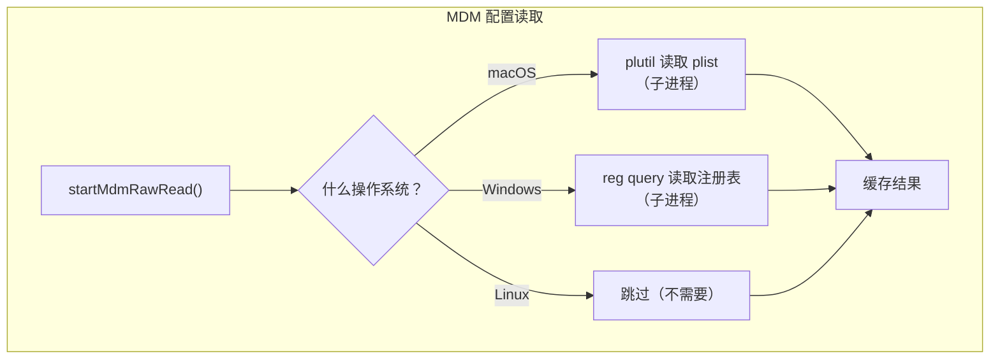
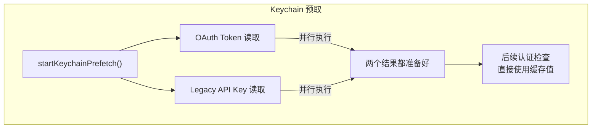
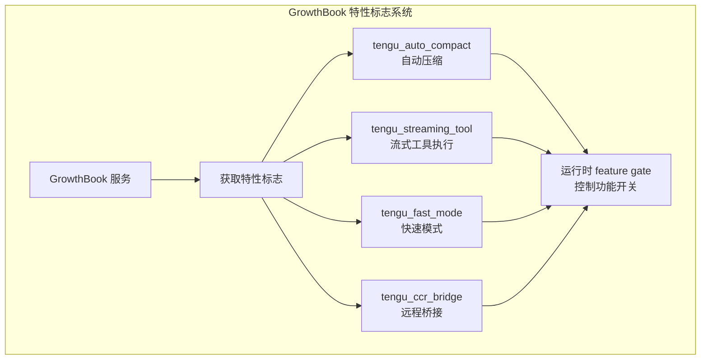
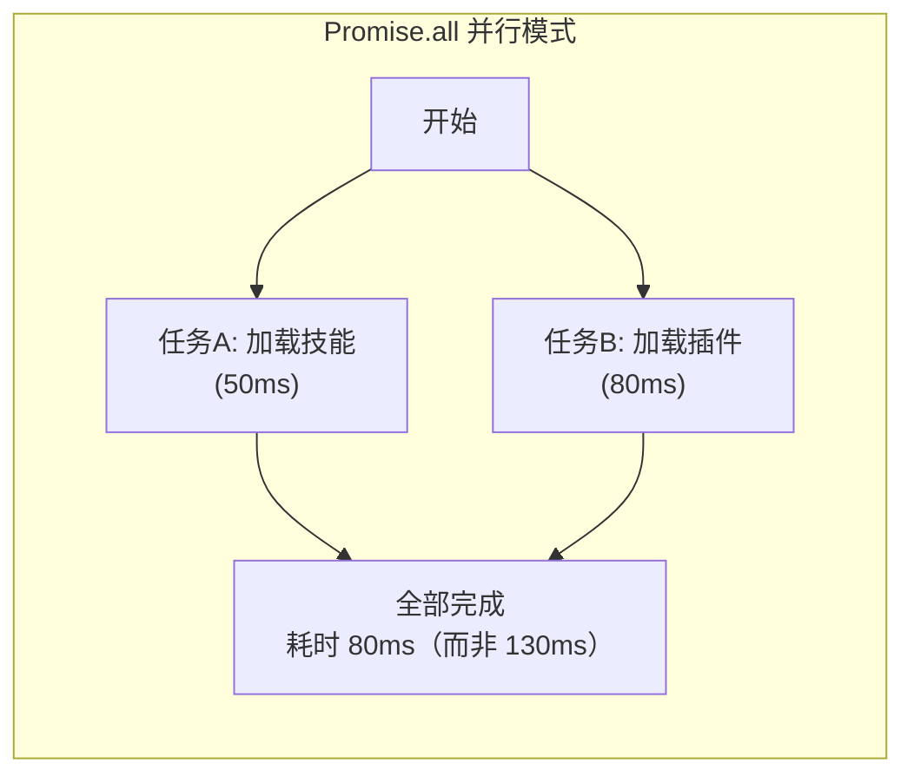
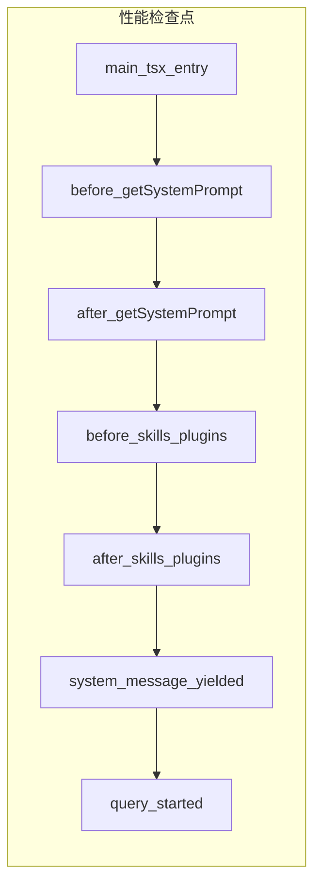
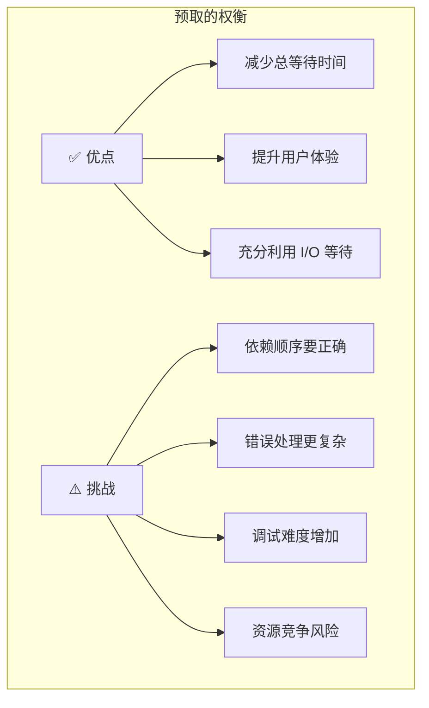

# 第4课：并行预取机制：MDM/Keychain/GrowthBook

## 学习目标

通过本课学习，你将能够：

1. 理解"并行预取"这个性能优化策略的核心思想
2. 认识 Claude Code 中三大预取子系统：MDM、Keychain、GrowthBook
3. 了解为什么启动顺序对性能至关重要
4. 掌握 Promise.all 并行执行模式
5. 学会在自己的项目中应用类似的优化

---

## 4.1 为什么需要并行预取？

### 生活类比：做早餐

假设你每天早上要准备以下食物：

| 任务 | 耗时 |
|------|------|
| 烧水泡咖啡 | 3分钟 |
| 煎鸡蛋 | 4分钟 |
| 烤面包 | 2分钟 |

**串行做法**（一个一个来）：3 + 4 + 2 = **9 分钟**

**并行做法**（同时做）：max(3, 4, 2) = **4 分钟**

Claude Code 的启动流程就是这样优化的——**能同时做的事情，绝不排队做**。

---

## 4.2 main.tsx 中的并行预取

来看 `main.tsx` 最开头的代码——每一行都经过深思熟虑：

```typescript
// 源码：main.tsx（前21行）

// 这些副作用必须在所有其他 import 之前运行：
// 1. profileCheckpoint 在模块加载前标记时间点
// 2. startMdmRawRead 启动 MDM 子进程（plutil/reg query），
//    让它们和后续 ~135ms 的 import 并行运行
// 3. startKeychainPrefetch 启动 macOS 钥匙串读取——
//    isRemoteManagedSettingsEligible() 否则会通过同步 spawn
//    串行读取两个钥匙串（每次 macOS 启动 ~65ms）
import { profileCheckpoint } from './utils/startupProfiler.js';
profileCheckpoint('main_tsx_entry');

import { startMdmRawRead } from './utils/settings/mdm/rawRead.js';
startMdmRawRead();

import { ensureKeychainPrefetchCompleted, startKeychainPrefetch }
  from './utils/secureStorage/keychainPrefetch.js';
startKeychainPrefetch();
```

### 时间线图解

```mermaid
gantt
    title Claude Code 启动时间线
    dateFormat X
    axisFormat %L ms

    section 模块加载
    import 语句加载 (~135ms)     :active, imports, 0, 135

    section 并行预取
    MDM 配置读取 (~40ms)         :mdm, 5, 45
    Keychain 读取 (~65ms)        :kc, 10, 75
    GrowthBook 初始化 (~50ms)    :gb, 15, 65

    section 后续初始化
    CLI 解析                     :cli, 135, 150
    AppState 创建                :state, 150, 160
    REPL 启动                    :repl, 160, 180
```



**关键洞察**：MDM 和 Keychain 的读取操作在 `import` 语句加载的 135ms 内完成——用户完全感受不到等待。

---

## 4.3 三大预取系统详解

### 系统一：MDM（Mobile Device Management）配置读取



MDM 是企业管理设备的标准方式。Claude Code 需要读取企业管理策略，比如：
- 是否允许使用某些工具
- API 端点配置
- 安全策略设置

**为什么要预取？** 因为 `plutil`（macOS）和 `reg query`（Windows）是**外部命令**，需要启动子进程，耗时 ~40ms。预取让这个等待"消失"了。

### 系统二：Keychain（钥匙串）预取



```typescript
// 概念：Keychain 预取的原理
// 正常情况（不预取）：
//   检查 OAuth → 等待 35ms → 检查 API Key → 等待 30ms = 65ms

// 预取后：
//   启动时并行发起两个读取 → 后续直接用结果 = 0ms（已在后台完成）
```

**类比**：就像你提前把钥匙从口袋里拿出来——到了门前不用再翻口袋。

### 系统三：GrowthBook 特性标志



GrowthBook 是 A/B 测试和特性标志平台。Claude Code 用它来：
- 灰度发布新功能
- 针对不同用户群开放不同特性
- 远程控制功能开关

```typescript
// 源码中的 GrowthBook 使用示例
import { getFeatureValue_CACHED_MAY_BE_STALE }
  from './services/analytics/growthbook.js'

// 运行时检查特性标志
const capEnabled = getFeatureValue_CACHED_MAY_BE_STALE(
  'tengu_otk_slot_v1',
  false,  // 默认值
)
```

---

## 4.4 并行预取的设计模式

### 模式一：Import 间隙预取

```typescript
// 利用 import 语句之间的时间执行预取
import { startMdmRawRead } from './mdm.js';
startMdmRawRead();  // 立即启动，不等结果

// 继续加载其他模块（~135ms）
import { React } from 'react';
import { Commander } from 'commander';
// ... 更多 import

// 等到真正需要时，结果已经准备好了
const mdmConfig = await getMdmResult();  // 瞬间返回
```

### 模式二：Promise.all 并行

```typescript
// 源码中多处使用 Promise.all 进行并行操作
// 例如 commands.ts 中加载技能和插件：
const [skills, { enabled: enabledPlugins }] = await Promise.all([
  getSlashCommandToolSkills(getCwd()),
  loadAllPluginsCacheOnly(),
])
```



### 模式三：预取 + 消费分离

```typescript
// 源码：query.ts 中的内存预取
// 在查询循环中提前启动预取
using pendingMemoryPrefetch = startRelevantMemoryPrefetch(
  state.messages,
  state.toolUseContext,
)

// ... 模型流式输出和工具执行（5-30秒）...

// 消费预取结果（如果已经完成）
if (
  pendingMemoryPrefetch &&
  pendingMemoryPrefetch.settledAt !== null &&
  pendingMemoryPrefetch.consumedOnIteration === -1
) {
  const memoryAttachments = filterDuplicateMemoryAttachments(
    await pendingMemoryPrefetch.promise,
    toolUseContext.readFileState,
  )
  // 使用预取到的内存附件
}
```

**类比**：你在等电梯的时候就掏出钥匙——到了家门口直接开门，省去了翻包的时间。

---

## 4.5 性能测量：profileCheckpoint

Claude Code 用 `profileCheckpoint` 精确测量每个阶段的耗时：

```typescript
// 源码：QueryEngine.ts
headlessProfilerCheckpoint('before_getSystemPrompt')
const { defaultSystemPrompt, userContext, systemContext } =
  await fetchSystemPromptParts({ /* ... */ })
headlessProfilerCheckpoint('after_getSystemPrompt')

headlessProfilerCheckpoint('before_skills_plugins')
const [skills, { enabled: enabledPlugins }] = await Promise.all([
  getSlashCommandToolSkills(getCwd()),
  loadAllPluginsCacheOnly(),
])
headlessProfilerCheckpoint('after_skills_plugins')
```



---

## 4.6 query.ts 中的查询级预取

不仅是启动时，在每次查询中也有预取优化：

```typescript
// 源码：query.ts
// 技能发现预取——每次迭代启动
const pendingSkillPrefetch = skillPrefetch?.startSkillDiscoveryPrefetch(
  null,
  messages,
  toolUseContext,
)

// ... 模型调用 + 工具执行 ...

// 消费技能发现结果
if (skillPrefetch && pendingSkillPrefetch) {
  const skillAttachments =
    await skillPrefetch.collectSkillDiscoveryPrefetch(pendingSkillPrefetch)
  for (const att of skillAttachments) {
    const msg = createAttachmentMessage(att)
    yield msg
  }
}
```

---

## 4.7 并行预取的挑战与注意事项



Claude Code 的解决方案：
- **依赖管理**：确保预取在需要结果之前完成
- **优雅降级**：预取失败时回退到同步方式
- **结果缓存**：预取结果缓存起来，避免重复执行

---

## 动手练习

### 练习1：测量并行加速

写一个简单的 Node.js/Bun 脚本，对比串行和并行执行的耗时：

```typescript
// 模拟三个 I/O 操作
const taskA = () => new Promise(r => setTimeout(r, 100))
const taskB = () => new Promise(r => setTimeout(r, 200))
const taskC = () => new Promise(r => setTimeout(r, 150))

// 串行执行
console.time('serial')
await taskA(); await taskB(); await taskC();
console.timeEnd('serial')  // ~450ms

// 并行执行
console.time('parallel')
await Promise.all([taskA(), taskB(), taskC()])
console.timeEnd('parallel')  // ~200ms
```

### 练习2：追踪预取链

在 `main.tsx` 中找到所有的 "prefetch" 或 "preload" 调用，列出它们：

- [ ] 每个预取操作预取什么数据？
- [ ] 预取结果在哪里被消费？
- [ ] 如果预取失败，会怎么处理？

### 思考题

1. 为什么预取操作放在 `import` 语句之间，而不是所有 `import` 完成之后？
2. `Promise.all` 中如果有一个 Promise 失败了，会怎样？Claude Code 如何处理？
3. 预取操作会不会造成资源浪费（比如预取了但没用上）？

---

## 本课小结

| 概念 | 说明 | 节省时间 |
|------|------|---------|
| Import 间隙预取 | 在模块加载的 135ms 内并行执行 I/O | ~65ms |
| MDM 预取 | 提前读取企业管理配置 | ~40ms |
| Keychain 预取 | 并行读取 OAuth + API Key | ~65ms |
| GrowthBook 预取 | 提前加载特性标志 | ~50ms |
| Promise.all | 并行执行多个异步操作 | 50%+ |
| 查询级预取 | 在模型推理期间预取附件 | 隐藏延迟 |

### 核心原则

> **预取的黄金法则**：如果一个操作不依赖前一个操作的结果，就让它们并行执行。

---

## 下节预告

**第5课：工具系统架构** — Claude Code 拥有 40+ 种工具，从文件读写到网络搜索，从代码编辑到 Agent 创建。这些工具是如何组织的？如何注册和发现？如何确保安全性？让我们一探究竟！
