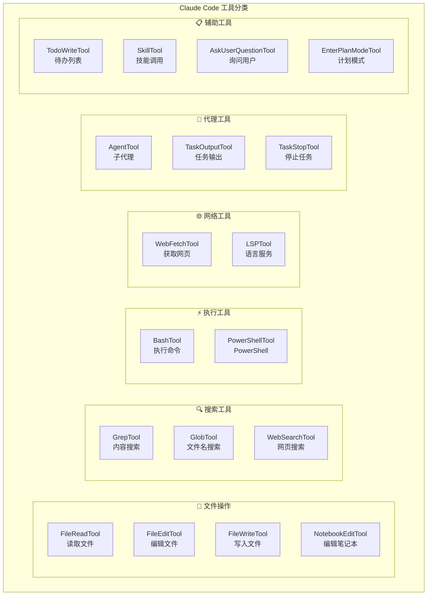
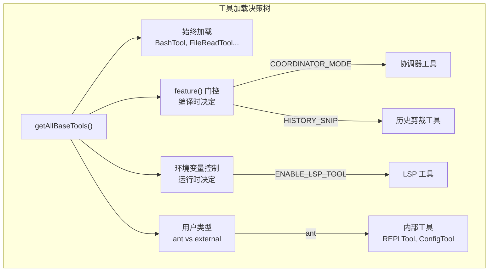
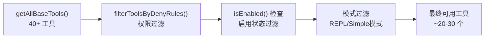
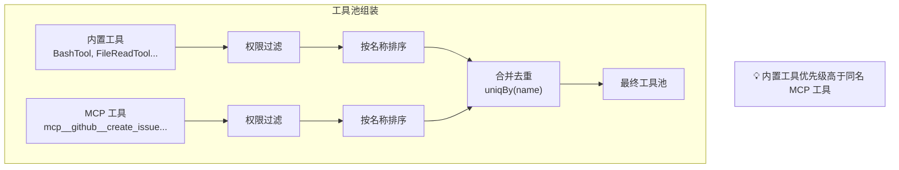
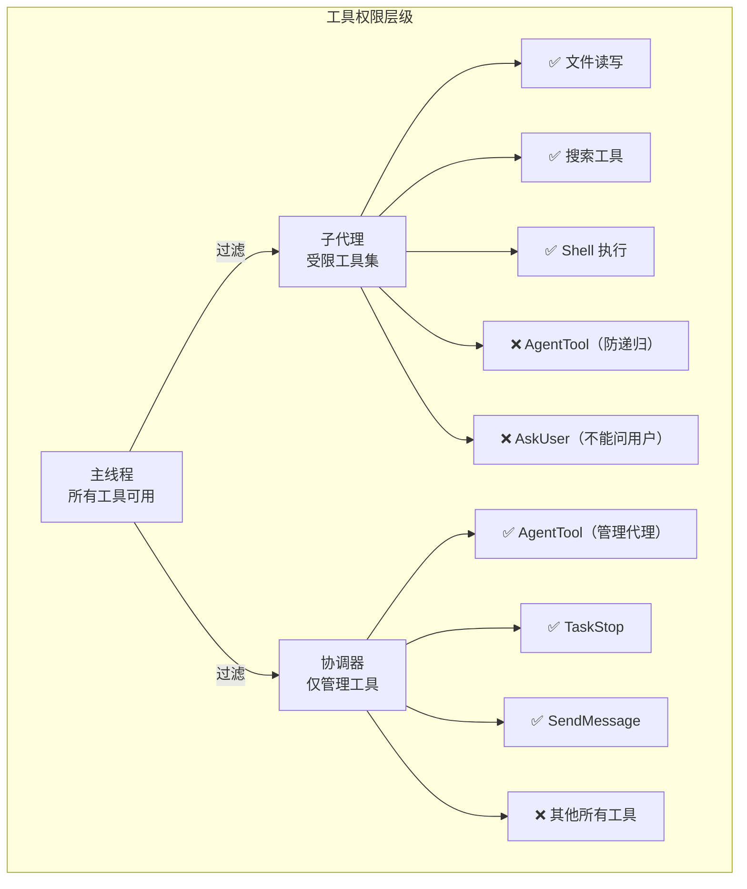
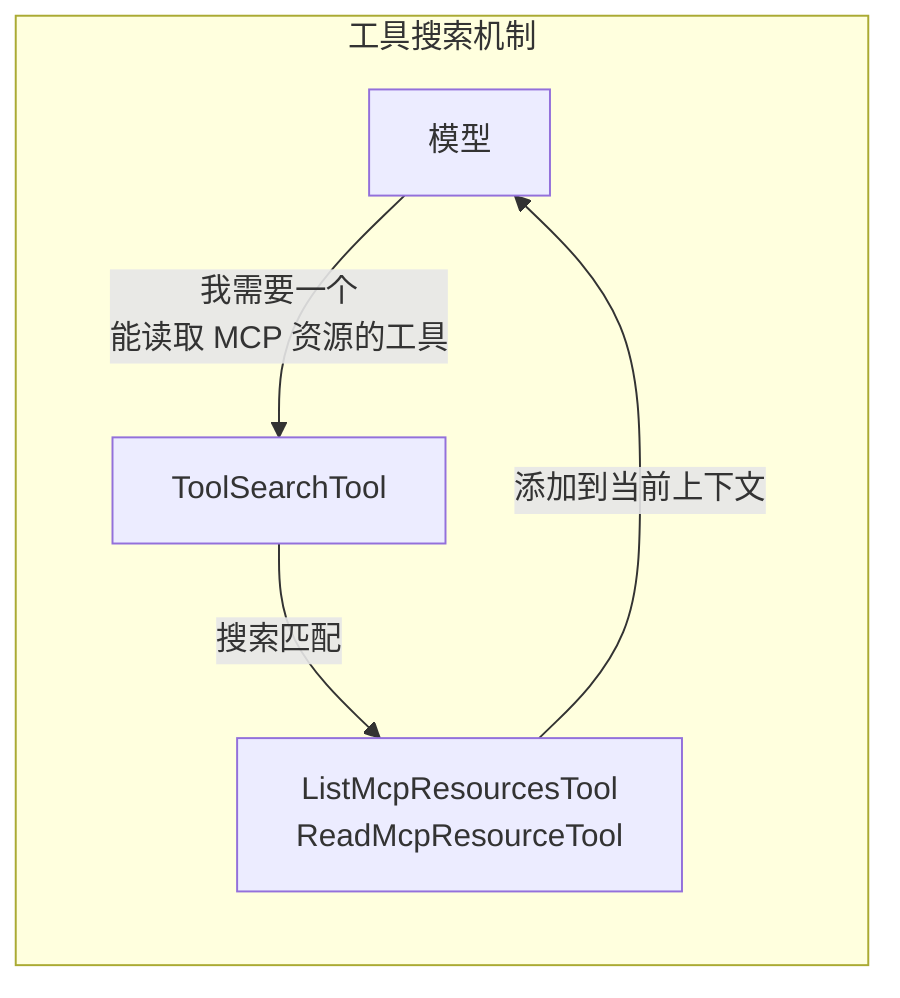

# 第5课：工具系统架构：40+ 工具如何组织

## 学习目标

通过本课学习，你将能够：

1. 理解 Claude Code 工具系统的整体架构
2. 认识 Tool 接口的设计和关键属性
3. 了解工具的分类、注册和发现机制
4. 掌握工具权限过滤的工作原理
5. 理解 MCP 工具如何与内置工具统一管理

---

## 5.1 什么是"工具"？

### 生活类比：瑞士军刀

Claude Code 的工具系统就像一把**瑞士军刀**——一个工具框架下集成了多种功能：

- 🔪 **BashTool** — 像一把刀，可以执行任何命令
- 📖 **FileReadTool** — 像放大镜，查看文件内容
- ✏️ **FileEditTool** — 像笔，修改文件
- 🔍 **GrepTool** — 像搜索引擎，在代码中搜索
- 🌐 **WebFetchTool** — 像浏览器，获取网页内容
- 🤖 **AgentTool** — 像助手，派出子代理执行任务

每个工具都有统一的"接口"——就像瑞士军刀的每个组件都从同一个把手展开。

---

## 5.2 工具大全览



---

## 5.3 工具注册中心：tools.ts

`tools.ts` 是所有工具的注册中心——来看它如何组织 40+ 种工具：

```typescript
// 源码：tools.ts
export function getAllBaseTools(): Tools {
  return [
    AgentTool,
    TaskOutputTool,
    BashTool,
    // 当嵌入式搜索工具可用时，Glob/Grep 不需要
    ...(hasEmbeddedSearchTools() ? [] : [GlobTool, GrepTool]),
    ExitPlanModeV2Tool,
    FileReadTool,
    FileEditTool,
    FileWriteTool,
    NotebookEditTool,
    WebFetchTool,
    TodoWriteTool,
    WebSearchTool,
    TaskStopTool,
    AskUserQuestionTool,
    SkillTool,
    EnterPlanModeTool,
    // 条件性加载的工具
    ...(isEnvTruthy(process.env.ENABLE_LSP_TOOL) ? [LSPTool] : []),
    ...(isWorktreeModeEnabled() ? [EnterWorktreeTool, ExitWorktreeTool] : []),
    getSendMessageTool(),
    ...(isAgentSwarmsEnabled()
      ? [getTeamCreateTool(), getTeamDeleteTool()]
      : []),
    BriefTool,
    ListMcpResourcesTool,
    ReadMcpResourceTool,
    ...(isToolSearchEnabledOptimistic() ? [ToolSearchTool] : []),
  ]
}
```

### 条件加载的设计

注意 `...()` 展开运算符的巧妙使用：

```typescript
// 模式：条件包含工具
...(条件 ? [工具] : [])

// 例子：
...(feature('COORDINATOR_MODE')   // 编译时条件
  ? [coordinatorModeTools]
  : [])

...(isEnvTruthy(process.env.X)    // 运行时条件
  ? [SomeTool]
  : [])

...(process.env.USER_TYPE === 'ant'  // 用户类型条件
  ? [InternalTool]
  : [])
```



---

## 5.4 工具过滤管道

从注册到最终可用，工具要经过多层过滤：



```typescript
// 源码：tools.ts
export const getTools = (permissionContext: ToolPermissionContext): Tools => {
  // 简单模式：只有 Bash、Read 和 Edit
  if (isEnvTruthy(process.env.CLAUDE_CODE_SIMPLE)) {
    const simpleTools: Tool[] = [BashTool, FileReadTool, FileEditTool]
    return filterToolsByDenyRules(simpleTools, permissionContext)
  }

  // 获取所有基础工具并过滤特殊工具
  const tools = getAllBaseTools().filter(tool => !specialTools.has(tool.name))

  // 按权限规则过滤
  let allowedTools = filterToolsByDenyRules(tools, permissionContext)

  // 检查每个工具是否启用
  const isEnabled = allowedTools.map(_ => _.isEnabled())
  return allowedTools.filter((_, i) => isEnabled[i])
}
```

### 权限过滤详解

```typescript
// 源码：tools.ts
export function filterToolsByDenyRules<T extends {
  name: string
  mcpInfo?: { serverName: string; toolName: string }
}>(tools: readonly T[], permissionContext: ToolPermissionContext): T[] {
  return tools.filter(tool => !getDenyRuleForTool(permissionContext, tool))
}
```

**类比**：就像机场安检——工具先通过"安全名单"检查，被禁止的工具直接拦下来，通过的才能被模型使用。

---

## 5.5 工具池组装：内置工具 + MCP 工具

Claude Code 需要把内置工具和 MCP 扩展工具合并成统一的工具池：

```typescript
// 源码：tools.ts
export function assembleToolPool(
  permissionContext: ToolPermissionContext,
  mcpTools: Tools,
): Tools {
  const builtInTools = getTools(permissionContext)

  // 过滤被禁止的 MCP 工具
  const allowedMcpTools = filterToolsByDenyRules(mcpTools, permissionContext)

  // 按名称排序以保持 prompt cache 稳定性
  const byName = (a: Tool, b: Tool) => a.name.localeCompare(b.name)
  return uniqBy(
    [...builtInTools].sort(byName).concat(allowedMcpTools.sort(byName)),
    'name',  // 按名称去重，内置工具优先
  )
}
```



### 为什么要排序？

排序是为了**Prompt Cache 稳定性**——如果工具列表的顺序变化，系统提示的哈希值就会改变，导致缓存失效。排序确保了无论工具的加载顺序如何，最终列表始终一致。

---

## 5.6 Agent 的受限工具集

当 Claude Code 派出子代理（Agent）时，不是所有工具都可用的：

```typescript
// 源码：constants/tools.ts
export const ALL_AGENT_DISALLOWED_TOOLS = new Set([
  TASK_OUTPUT_TOOL_NAME,          // 防止递归
  EXIT_PLAN_MODE_V2_TOOL_NAME,   // 计划模式是主线程概念
  ENTER_PLAN_MODE_TOOL_NAME,
  ASK_USER_QUESTION_TOOL_NAME,   // 子代理不能直接问用户
  TASK_STOP_TOOL_NAME,           // 需要主线程任务状态
])

// 异步代理允许的工具（白名单）
export const ASYNC_AGENT_ALLOWED_TOOLS = new Set([
  FILE_READ_TOOL_NAME,
  WEB_SEARCH_TOOL_NAME,
  TODO_WRITE_TOOL_NAME,
  GREP_TOOL_NAME,
  WEB_FETCH_TOOL_NAME,
  GLOB_TOOL_NAME,
  ...SHELL_TOOL_NAMES,
  FILE_EDIT_TOOL_NAME,
  FILE_WRITE_TOOL_NAME,
  NOTEBOOK_EDIT_TOOL_NAME,
  SKILL_TOOL_NAME,
])

// 协调器模式只允许的工具
export const COORDINATOR_MODE_ALLOWED_TOOLS = new Set([
  AGENT_TOOL_NAME,       // 创建子代理
  TASK_STOP_TOOL_NAME,   // 停止任务
  SEND_MESSAGE_TOOL_NAME, // 发送消息
])
```



---

## 5.7 工具搜索：按需加载

当工具数量过多时，Claude Code 引入了 ToolSearchTool：

```typescript
// 源码：tools.ts
// 当工具搜索可能启用时，包含 ToolSearchTool
...(isToolSearchEnabledOptimistic() ? [ToolSearchTool] : []),
```

模型不需要一次看到所有工具——它可以用 ToolSearchTool 来搜索需要的工具，就像在搜索引擎里搜索一样。



---

## 动手练习

### 练习1：统计工具数量

打开 `tools.ts`，数一下 `getAllBaseTools()` 中有多少个工具。按以下分类统计：

- [ ] 始终加载的工具：___ 个
- [ ] `feature()` 门控的工具：___ 个
- [ ] 环境变量控制的工具：___ 个
- [ ] 用户类型限制的工具：___ 个

### 练习2：工具目录结构

浏览 `tools/` 目录，选择一个工具（如 `BashTool`），看看它的目录结构：

```
tools/BashTool/
├── BashTool.ts       ← 工具定义
├── toolName.ts       ← 工具名称常量
├── prompt.ts         ← 提示词
├── UI.tsx            ← React 渲染
└── shouldUseSandbox.ts ← 沙箱逻辑
```

### 思考题

1. 为什么要用 `uniqBy('name')` 确保工具名称唯一？
2. 协调器模式为什么只允许 AgentTool 和 SendMessage？
3. 工具排序对 Prompt Cache 有什么影响？

---

## 本课小结

| 概念 | 说明 |
|------|------|
| getAllBaseTools() | 所有工具的注册中心 |
| 条件加载 | `feature()`、环境变量、用户类型控制 |
| filterToolsByDenyRules() | 权限过滤管道 |
| assembleToolPool() | 内置 + MCP 工具合并 |
| Agent 工具限制 | 子代理只能用受限工具集 |
| ToolSearchTool | 按需搜索和加载工具 |

---

## 下节预告

**第6课：QueryEngine 查询引擎核心原理** — 工具准备好了，但谁来调度它们？QueryEngine 就是 Claude Code 的"大脑"，负责接收用户消息、调用 AI 模型、执行工具、管理对话状态。让我们深入它的核心！
