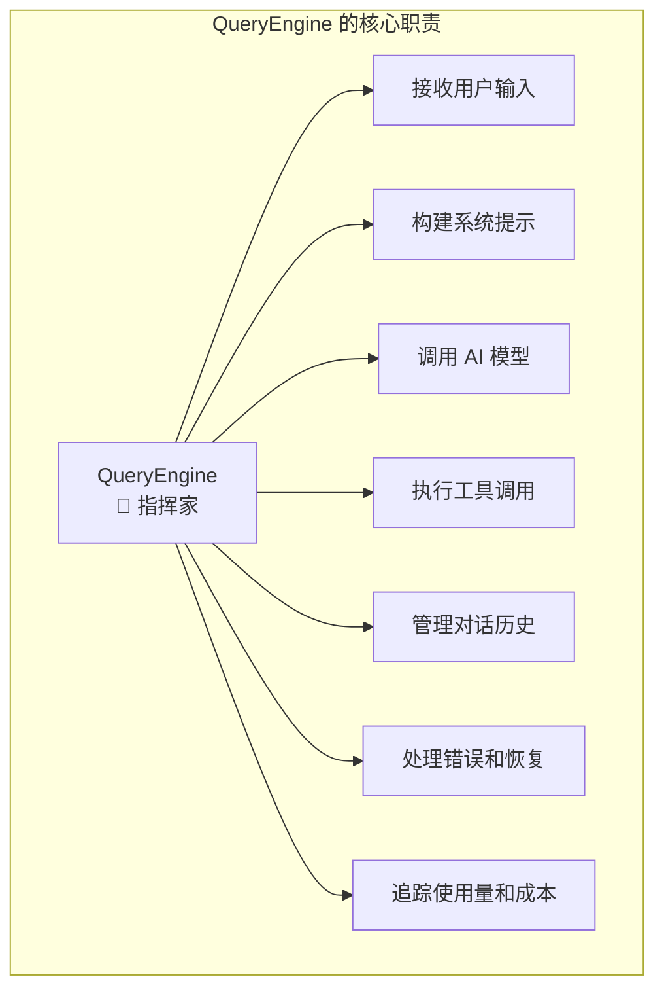
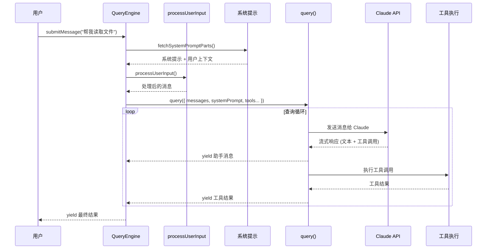
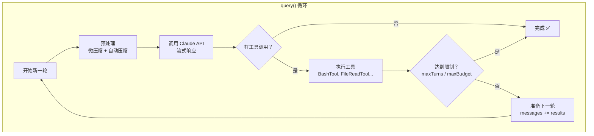
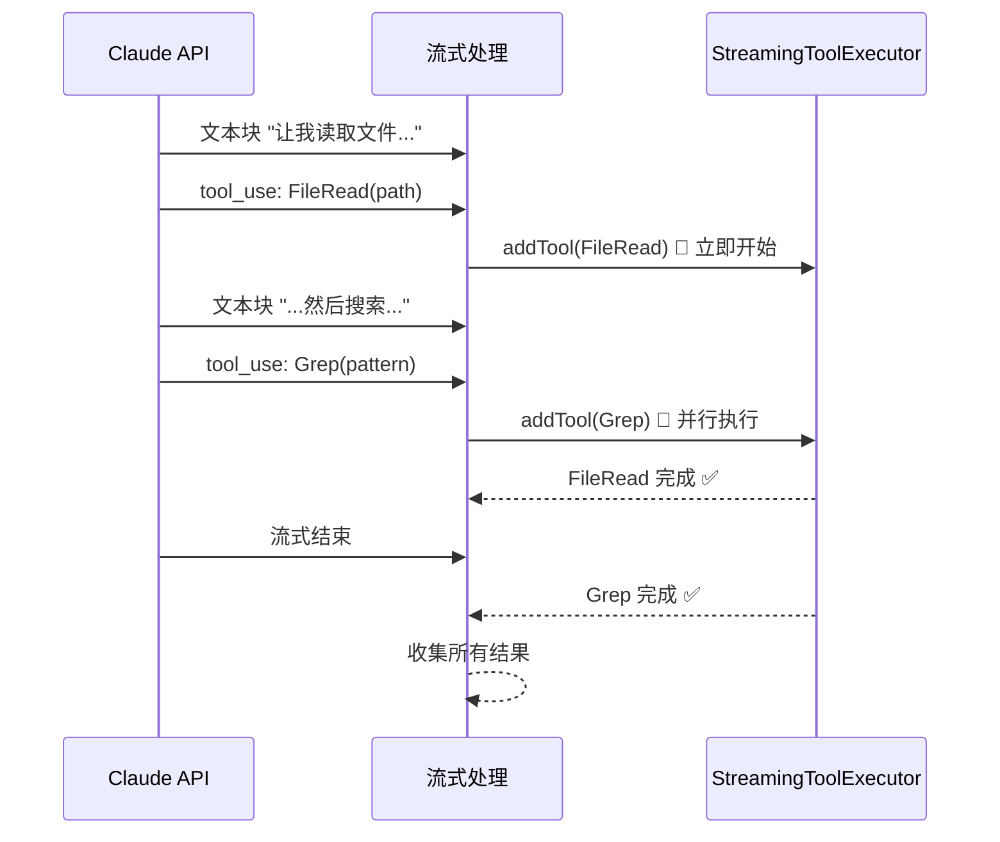
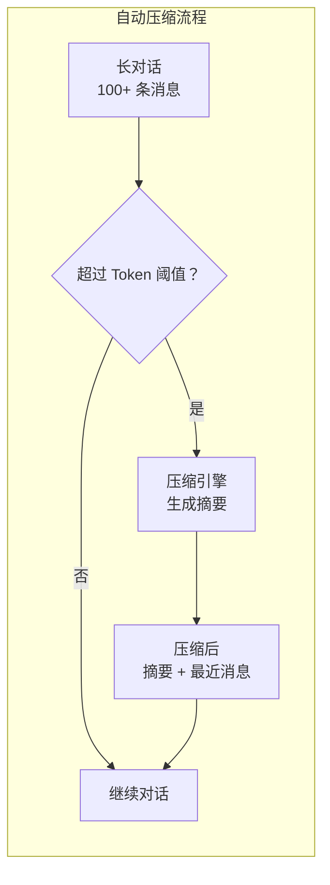
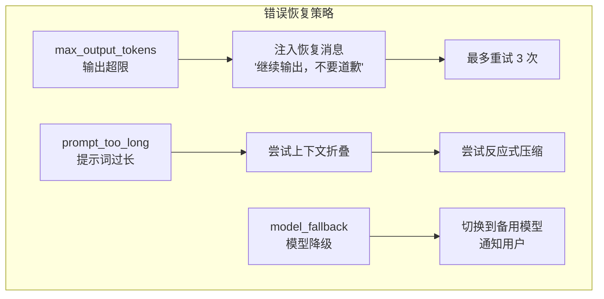

# 第6课：QueryEngine 查询引擎核心原理

## 学习目标

通过本课学习，你将能够：

1. 理解 QueryEngine 在整个系统中的核心地位
2. 掌握从用户输入到 AI 响应的完整数据流
3. 理解 query.ts 中查询循环的迭代机制
4. 认识工具执行、自动压缩、错误恢复等关键环节
5. 了解 AsyncGenerator 在流式处理中的应用

---

## 6.1 QueryEngine 的角色

### 生活类比：指挥家

如果 Claude Code 是一个交响乐团，那么 QueryEngine 就是**指挥家**：

- 它不演奏任何乐器（不执行具体工具）
- 但它决定**何时谁演奏什么**（调度消息和工具）
- 它追踪**整首曲子的进度**（管理对话状态）
- 它处理**意外情况**（错误恢复、超限处理）



---

## 6.2 QueryEngine 类结构

```typescript
// 源码：QueryEngine.ts
export class QueryEngine {
  private config: QueryEngineConfig
  private mutableMessages: Message[]
  private abortController: AbortController
  private permissionDenials: SDKPermissionDenial[]
  private totalUsage: NonNullableUsage
  private hasHandledOrphanedPermission = false
  private readFileState: FileStateCache
  private discoveredSkillNames = new Set<string>()

  constructor(config: QueryEngineConfig) {
    this.config = config
    this.mutableMessages = config.initialMessages ?? []
    this.abortController = config.abortController ?? createAbortController()
    this.permissionDenials = []
    this.readFileState = config.readFileCache
    this.totalUsage = EMPTY_USAGE
  }

  // 核心方法：提交消息并获取流式响应
  async *submitMessage(
    prompt: string | ContentBlockParam[],
    options?: { uuid?: string; isMeta?: boolean },
  ): AsyncGenerator<SDKMessage, void, unknown> {
    // ...1000+ 行的核心逻辑
  }

  interrupt(): void { this.abortController.abort() }
  getMessages(): readonly Message[] { return this.mutableMessages }
  getSessionId(): string { return getSessionId() }
  setModel(model: string): void { this.config.userSpecifiedModel = model }
}
```

### 关键属性解读

| 属性 | 用途 | 类比 |
|------|------|------|
| `mutableMessages` | 对话历史 | 聊天记录 |
| `abortController` | 中断控制 | 紧急停止按钮 |
| `permissionDenials` | 权限拒绝记录 | 安全日志 |
| `totalUsage` | API 使用量统计 | 账单 |
| `readFileState` | 文件读取缓存 | 记忆库 |

---

## 6.3 submitMessage：一次查询的完整旅程



### submitMessage 的关键步骤

```typescript
// 源码：QueryEngine.ts（简化版 submitMessage 流程）
async *submitMessage(prompt, options) {
  // 步骤1：初始化
  setCwd(cwd)
  const startTime = Date.now()

  // 步骤2：获取系统提示
  const { defaultSystemPrompt, userContext, systemContext } =
    await fetchSystemPromptParts({ tools, mainLoopModel, mcpClients })

  // 步骤3：处理用户输入（斜杠命令等）
  const { messages, shouldQuery, allowedTools } =
    await processUserInput({ input: prompt, mode: 'prompt' })

  this.mutableMessages.push(...messages)

  // 步骤4：如果不需要查询（如 /help），直接返回
  if (!shouldQuery) {
    yield { type: 'result', subtype: 'success', result: resultText }
    return
  }

  // 步骤5：进入查询循环
  for await (const message of query({
    messages, systemPrompt, userContext, canUseTool, toolUseContext
  })) {
    // 处理每个流式消息...
    switch (message.type) {
      case 'assistant':
        this.mutableMessages.push(message)
        yield* normalizeMessage(message)
        break
      case 'user':
        this.mutableMessages.push(message)
        yield* normalizeMessage(message)
        break
      // ...更多消息类型
    }
  }

  // 步骤6：返回最终结果
  yield { type: 'result', subtype: 'success', result: textResult }
}
```

---

## 6.4 query.ts：查询循环的核心

`query.ts` 实现了一个 `while(true)` 循环，这是整个系统的心跳：

```typescript
// 源码：query.ts（简化版查询循环）
export async function* query(params: QueryParams) {
  let state: State = {
    messages: params.messages,
    toolUseContext: params.toolUseContext,
    turnCount: 1,
    // ...更多状态
  }

  while (true) {
    const { messages, toolUseContext, turnCount } = state

    // 1️⃣ 预处理：微压缩、自动压缩
    messagesForQuery = await deps.microcompact(messagesForQuery)
    const { compactionResult } = await deps.autocompact(messagesForQuery)

    // 2️⃣ 调用模型 API
    for await (const message of deps.callModel({
      messages, systemPrompt, tools, signal
    })) {
      yield message  // 流式输出
      if (message.type === 'assistant') {
        assistantMessages.push(message)
        // 检测工具调用
        if (hasToolUse) needsFollowUp = true
      }
    }

    // 3️⃣ 如果没有工具调用，结束
    if (!needsFollowUp) {
      return { reason: 'completed' }
    }

    // 4️⃣ 执行工具调用
    for await (const update of runTools(toolUseBlocks)) {
      yield update.message
      toolResults.push(update.message)
    }

    // 5️⃣ 检查终止条件
    if (maxTurns && turnCount + 1 > maxTurns) {
      return { reason: 'max_turns' }
    }

    // 6️⃣ 继续下一轮
    state = {
      messages: [...messagesForQuery, ...assistantMessages, ...toolResults],
      turnCount: turnCount + 1,
    }
  }
}
```

### 查询循环图解



---

## 6.5 流式工具执行：StreamingToolExecutor

Claude Code 支持在模型响应流式传输的同时执行工具——不等模型说完就开始干活：

```typescript
// 源码：query.ts
const useStreamingToolExecution = config.gates.streamingToolExecution
let streamingToolExecutor = useStreamingToolExecution
  ? new StreamingToolExecutor(
      toolUseContext.options.tools,
      canUseTool,
      toolUseContext,
    )
  : null

// 在流式接收中，工具调用一出现就开始执行
if (streamingToolExecutor) {
  for (const toolBlock of msgToolUseBlocks) {
    streamingToolExecutor.addTool(toolBlock, message)
  }
}
```



**类比**：就像一个厨师边看菜谱边做菜——不是读完整本菜谱才开始，而是看到"先烧水"就立刻去烧水。

---

## 6.6 自动压缩机制

当对话太长时，query.ts 会自动触发压缩：

```typescript
// 源码：query.ts
const { compactionResult } = await deps.autocompact(
  messagesForQuery,
  toolUseContext,
  { systemPrompt, userContext, systemContext },
  querySource,
  tracking,
  snipTokensFreed,
)

if (compactionResult) {
  // 压缩成功 → 用压缩后的消息继续
  const postCompactMessages = buildPostCompactMessages(compactionResult)
  for (const message of postCompactMessages) {
    yield message
  }
  messagesForQuery = postCompactMessages
}
```



---

## 6.7 错误恢复机制

query.ts 内置了多种错误恢复策略：

```typescript
// 源码：query.ts（max_output_tokens 恢复）
if (isWithheldMaxOutputTokens(lastMessage)) {
  if (maxOutputTokensRecoveryCount < MAX_OUTPUT_TOKENS_RECOVERY_LIMIT) {
    const recoveryMessage = createUserMessage({
      content:
        'Output token limit hit. Resume directly — no apology, no recap.',
      isMeta: true,
    })
    // 注入恢复消息，继续循环
    state = {
      messages: [...messagesForQuery, ...assistantMessages, recoveryMessage],
      maxOutputTokensRecoveryCount: maxOutputTokensRecoveryCount + 1,
    }
    continue  // 继续 while(true) 循环
  }
}
```



---

## 6.8 ask() 便捷包装

`QueryEngine` 还提供了一个 `ask()` 便捷函数，用于一次性查询：

```typescript
// 源码：QueryEngine.ts
export async function* ask({
  prompt, cwd, tools, canUseTool, mutableMessages, ...config
}) {
  const engine = new QueryEngine({
    cwd, tools, commands, mcpClients,
    canUseTool, getAppState, setAppState,
    initialMessages: mutableMessages,
    readFileCache: cloneFileStateCache(getReadFileCache()),
    // ...更多配置
  })

  try {
    yield* engine.submitMessage(prompt, { uuid: promptUuid })
  } finally {
    setReadFileCache(engine.getReadFileState())
  }
}
```

**QueryEngine vs ask()**：

| 特性 | QueryEngine | ask() |
|------|------------|-------|
| 生命周期 | 长期存在，多轮对话 | 单次查询 |
| 状态管理 | 自己管理状态 | 自动创建和清理 |
| 适用场景 | SDK/交互模式 | 非交互/一次性 |

---

## 动手练习

### 练习1：追踪一次查询

阅读 `QueryEngine.ts` 的 `submitMessage` 方法，画出以下流程：

1. 从 `prompt` 参数开始
2. 经过哪些处理步骤
3. 在哪里调用 `query()`
4. 最终 yield 什么类型的结果

### 练习2：理解查询循环

在 `query.ts` 中找到 `while (true)` 循环，列出所有可能导致循环退出的条件：

- [ ] `return { reason: 'completed' }` — 正常完成
- [ ] `return { reason: 'max_turns' }` — 超过最大轮数
- [ ] `return { reason: '???' }` — 还有哪些？

### 思考题

1. 为什么 `submitMessage` 用 `async *`（AsyncGenerator）而不是普通 `async`？
2. 流式工具执行相比等待模型输出完成再执行，有什么优势和风险？
3. 自动压缩时如何确保不丢失重要的对话上下文？

---

## 本课小结

| 概念 | 文件 | 职责 |
|------|------|------|
| QueryEngine | `QueryEngine.ts` | 查询生命周期管理 |
| submitMessage() | `QueryEngine.ts` | 单轮对话的完整处理 |
| query() | `query.ts` | 核心查询循环（while true） |
| StreamingToolExecutor | `query.ts` | 流式工具执行 |
| autocompact | `query.ts` | 自动压缩长对话 |
| ask() | `QueryEngine.ts` | 一次性查询的便捷包装 |

---

## 下节预告

**第7课：权限系统的分层设计** — 当 Claude Code 想要执行 `rm -rf /` 时，什么机制会阻止它？权限系统是 Claude Code 安全性的基石，从全局配置到细粒度规则，多层防护确保 AI 不会做危险的事情。
