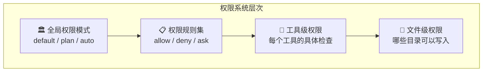
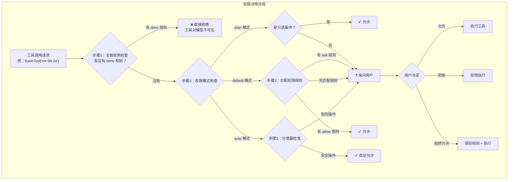
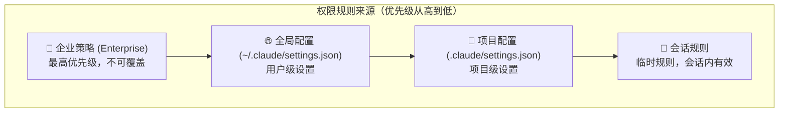
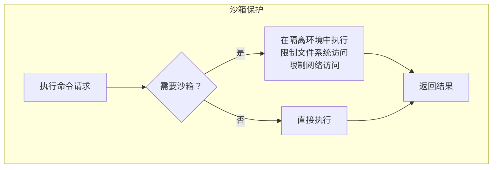
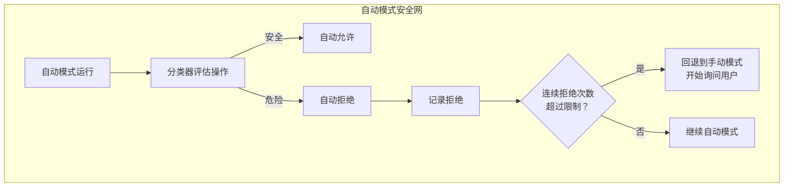

# 第7课：权限系统的分层设计

## 学习目标

通过本课学习，你将能够：

1. 理解 Claude Code 为什么需要权限系统
2. 认识权限模式（Permission Mode）的设计
3. 掌握权限规则的匹配和决策流程
4. 了解权限来源的层次结构
5. 理解自动模式（Auto/YOLO）的安全机制

---

## 7.1 为什么需要权限系统？

### 生活类比：门禁系统

想象你住在一个高档小区：

- **大门保安**（全局权限模式）：决定来访者能否进入
- **楼栋门禁**（项目级权限）：只有住户能进自己的楼
- **房间钥匙**（工具级权限）：每个房间有自己的锁
- **保险箱密码**（敏感操作权限）：最机密的东西额外保护

Claude Code 的权限系统也是多层防护：



---

## 7.2 权限模式（Permission Mode）

Claude Code 支持多种权限模式：

| 模式 | 说明 | 适用场景 |
|------|------|---------|
| `default` | 每次操作前都询问用户 | 日常使用，最安全 |
| `plan` | 只允许读取，修改需要批准 | 代码审查 |
| `auto` / `bypassPermissions` | 自动批准符合规则的操作 | 自动化脚本 |

### 权限规则的数据结构

```typescript
// 源码：utils/permissions/PermissionRule.ts（概念）
type PermissionBehavior = 'allow' | 'deny' | 'ask'

type PermissionRule = {
  tool: string          // 工具名称或模式
  behavior: PermissionBehavior
  ruleContent?: string  // 可选的细粒度匹配内容
  source: PermissionRuleSource
}

type PermissionRuleSource =
  | 'global-config'     // ~/.claude/settings.json
  | 'project-config'    // 项目目录的 .claude/settings.json
  | 'enterprise'        // 企业管理策略
  | 'session'           // 会话内临时规则
```

---

## 7.3 权限决策流程

来看 `utils/permissions/permissions.ts` 中的核心决策逻辑：

```typescript
// 源码：utils/permissions/permissions.ts（简化）
// 权限检查的分层过滤

// 1. 先检查是否有"全面拒绝"规则
export function filterToolsByDenyRules(tools, permissionContext) {
  return tools.filter(tool => !getDenyRuleForTool(permissionContext, tool))
}

// 2. 运行时权限检查（在工具执行前）
// canUseTool 函数 → 决定 allow / deny / ask
```

### 完整决策流程图



---

## 7.4 权限上下文（ToolPermissionContext）

每次查询都带有一个权限上下文：

```typescript
// 源码：state/AppStateStore.ts 中的 AppState
toolPermissionContext: {
  mode: 'default',              // 权限模式
  alwaysAllowRules: {           // 始终允许的规则
    command: allowedTools,
  },
  additionalWorkingDirectories: new Map(),  // 额外的工作目录
}
```

### 权限规则的来源层次



```typescript
// 权限来源示例
// 企业策略可能禁止某些命令：
{ tool: 'Bash', behavior: 'deny', ruleContent: 'curl*', source: 'enterprise' }

// 全局配置允许 git 操作：
{ tool: 'Bash', behavior: 'allow', ruleContent: 'git *', source: 'global-config' }

// 项目配置允许运行测试：
{ tool: 'Bash', behavior: 'allow', ruleContent: 'npm test', source: 'project-config' }

// 会话中用户临时允许：
{ tool: 'Bash', behavior: 'allow', ruleContent: 'rm temp*', source: 'session' }
```

---

## 7.5 权限跟踪：canUseTool 包装

QueryEngine 会包装 `canUseTool` 函数来跟踪权限拒绝：

```typescript
// 源码：QueryEngine.ts
const wrappedCanUseTool: CanUseToolFn = async (
  tool, input, toolUseContext, assistantMessage, toolUseID, forceDecision,
) => {
  const result = await canUseTool(
    tool, input, toolUseContext, assistantMessage, toolUseID, forceDecision,
  )

  // 跟踪拒绝情况，用于 SDK 报告
  if (result.behavior !== 'allow') {
    this.permissionDenials.push({
      tool_name: sdkCompatToolName(tool.name),
      tool_use_id: toolUseID,
      tool_input: input,
    })
  }

  return result
}
```

这样做的好处：
1. **审计追踪**——知道哪些操作被拒绝了
2. **SDK 报告**——外部集成可以看到权限拒绝
3. **不侵入原始逻辑**——装饰器模式，优雅扩展

---

## 7.6 沙箱机制

对于高风险操作，Claude Code 还有沙箱保护：

```typescript
// 源码：utils/permissions/permissions.ts
import { shouldUseSandbox } from '../../tools/BashTool/shouldUseSandbox.js'
import { SandboxManager } from '../sandbox/sandbox-adapter.js'
```



---

## 7.7 自动模式的安全机制

自动模式（`--dangerously-skip-permissions`）不是完全没有保护——它有**拒绝跟踪和回退**机制：

```typescript
// 源码：utils/permissions/permissions.ts
import {
  createDenialTrackingState,
  DENIAL_LIMITS,
  recordDenial,
  recordSuccess,
  shouldFallbackToPrompting,
} from './PermissionResult.js'
```



---

## 7.8 权限在工具执行中的应用

```typescript
// 源码：query.ts（工具执行时的权限检查）
const toolUpdates = streamingToolExecutor
  ? streamingToolExecutor.getRemainingResults()
  : runTools(toolUseBlocks, assistantMessages, canUseTool, toolUseContext)

for await (const update of toolUpdates) {
  if (update.message) {
    yield update.message

    // 如果 Hook 阻止了继续执行
    if (
      update.message.type === 'attachment' &&
      update.message.attachment.type === 'hook_stopped_continuation'
    ) {
      shouldPreventContinuation = true
    }
  }
}
```

---

## 动手练习

### 练习1：权限配置文件

查看你本机的 Claude Code 权限配置：

```bash
# 全局配置
cat ~/.claude/settings.json

# 项目配置（如果有）
cat .claude/settings.json
```

找出其中的权限规则，理解每条规则的含义。

### 练习2：权限流程追踪

在 `utils/permissions/permissions.ts` 中找到权限决策的核心函数：

- [ ] 找到 `getDenyRuleForTool` 函数——它如何匹配工具名？
- [ ] 找到权限规则的应用和持久化逻辑
- [ ] 理解 `PermissionResult` 的三种类型：allow / deny / ask

### 思考题

1. 为什么企业策略的优先级最高？
2. 如果一个工具同时匹配了 allow 和 deny 规则，应该怎么处理？
3. 自动模式为什么需要"拒绝跟踪"和"回退到手动"机制？

---

## 本课小结

| 层级 | 机制 | 文件 |
|------|------|------|
| 模式层 | default / plan / auto | `PermissionMode.ts` |
| 规则层 | allow / deny / ask 规则 | `permissions.ts` |
| 过滤层 | filterToolsByDenyRules | `tools.ts` |
| 执行层 | canUseTool 运行时检查 | `QueryEngine.ts` |
| 追踪层 | 拒绝记录和回退 | `permissions.ts` |
| 沙箱层 | 隔离执行环境 | `sandbox-adapter.ts` |

### 核心设计原则

- **纵深防御**：多层保护，不依赖单一机制
- **最小权限**：默认拒绝，需要显式授权
- **可审计**：所有权限决策可追踪
- **优雅降级**：自动模式遇到危险时回退到手动

---

## 下节预告

**第8课：Agent Swarm 多代理协作架构** — 一个 Agent 不够用？Claude Code 可以同时派出多个子代理并行工作！从 AgentTool 到协调器模式，从团队创建到消息通信——多代理系统如何协调？
