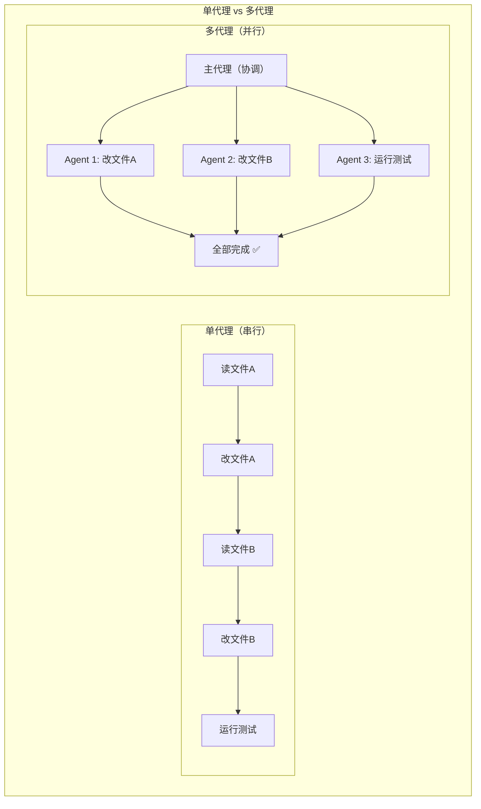
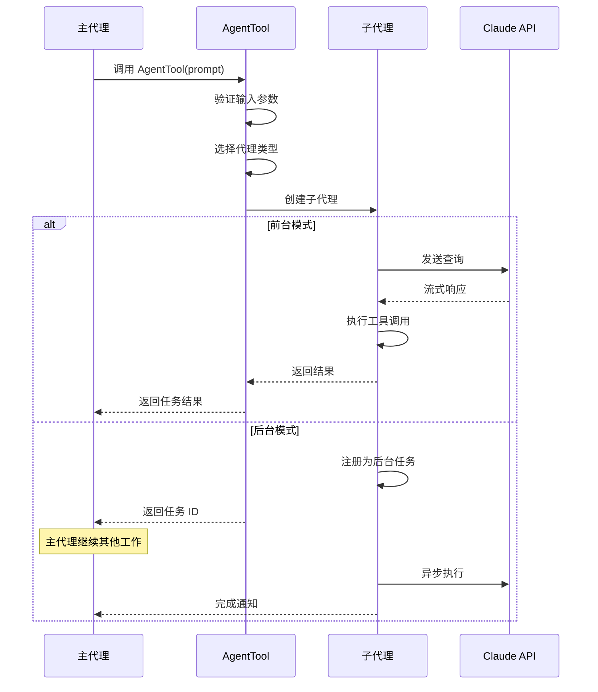
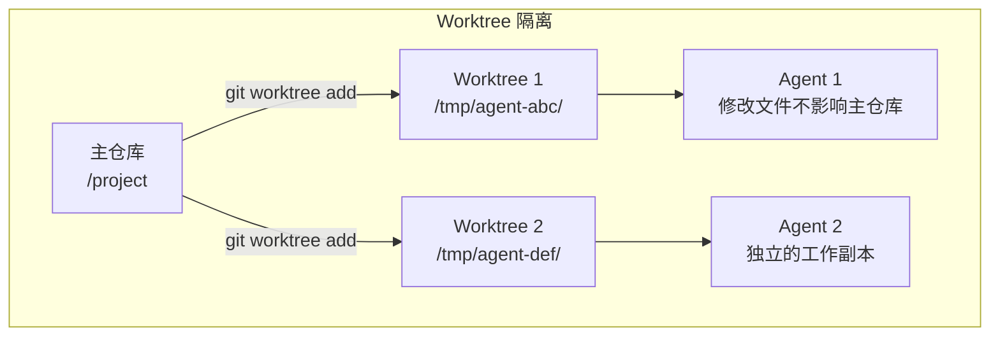
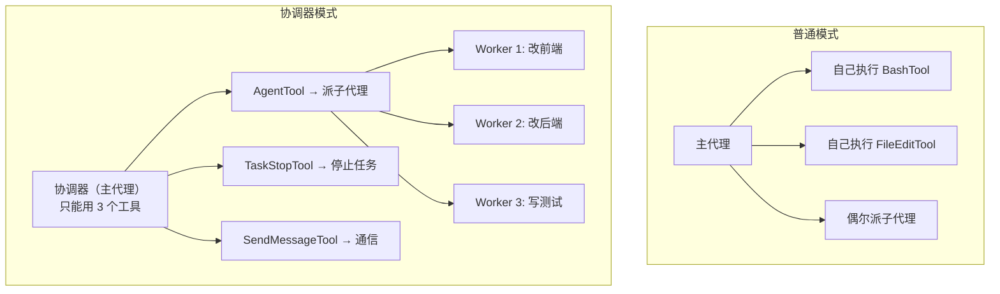
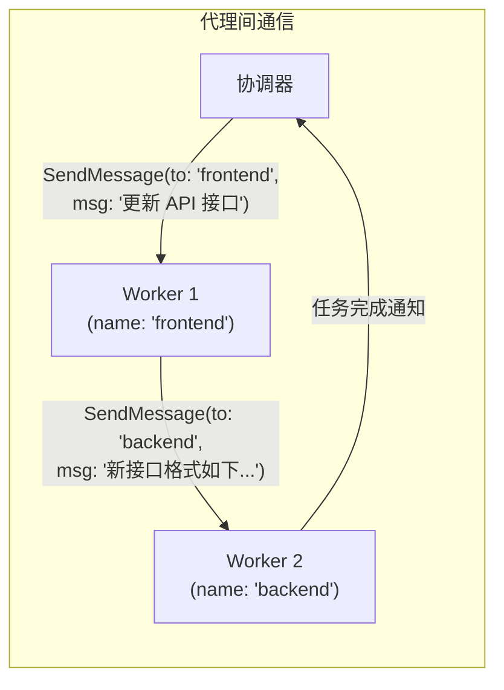
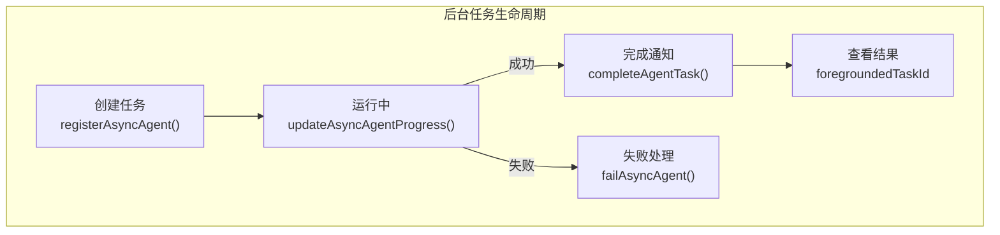
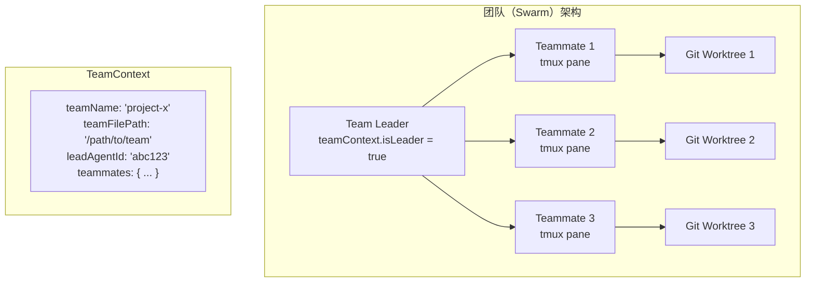
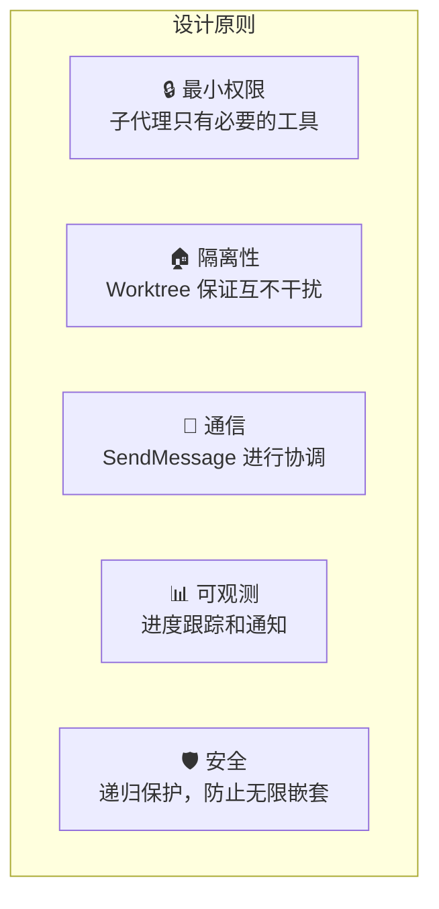

# 第8课：Agent Swarm 多代理协作架构

## 学习目标

通过本课学习，你将能够：

1. 理解 AgentTool 的设计和工作原理
2. 认识多代理系统的协调模式
3. 了解协调器模式（Coordinator Mode）的设计
4. 掌握子代理的隔离和通信机制
5. 理解团队（Swarm）的创建和管理

---

## 8.1 为什么需要多代理？

### 生活类比：项目经理和团队

想象你是一个项目经理，面对一个复杂任务：

- **单人模式**：你自己写代码、测试、部署——效率低下
- **团队模式**：你分配任务给不同的人，每人负责一块——并行高效

Claude Code 的多代理系统也是这样：



---

## 8.2 AgentTool：子代理的入口

AgentTool 是创建子代理的核心工具，来看它的定义：

```typescript
// 源码：tools/AgentTool/AgentTool.tsx
import { buildTool } from 'src/Tool.js'

// 基础输入 Schema
const baseInputSchema = lazySchema(() => z.object({
  description: z.string().describe('A short (3-5 word) description of the task'),
  prompt: z.string().describe('The task for the agent to perform'),
  subagent_type: z.string().optional()
    .describe('The type of specialized agent to use'),
  model: z.enum(['sonnet', 'opus', 'haiku']).optional()
    .describe('Optional model override for this agent'),
  run_in_background: z.boolean().optional()
    .describe('Set to true to run in the background'),
}))

// 完整 Schema（含多代理参数）
const fullInputSchema = lazySchema(() => {
  const multiAgentInputSchema = z.object({
    name: z.string().optional()
      .describe('Name for the spawned agent'),
    team_name: z.string().optional()
      .describe('Team name for spawning'),
    mode: permissionModeSchema().optional()
      .describe('Permission mode for spawned teammate'),
  })
  return baseInputSchema().merge(multiAgentInputSchema).extend({
    isolation: z.enum(['worktree']).optional()
      .describe('Isolation mode for the agent'),
    cwd: z.string().optional()
      .describe('Working directory for the agent'),
  })
})
```

### AgentTool 的关键特性

| 参数 | 说明 | 示例 |
|------|------|------|
| `prompt` | 子代理要执行的任务 | "修复 login.ts 中的 bug" |
| `subagent_type` | 代理类型 | "generalPurpose", "explore" |
| `model` | 使用的模型 | "sonnet", "haiku" |
| `run_in_background` | 是否后台运行 | true |
| `isolation` | 隔离模式 | "worktree" |
| `name` | 代理名称（可通信） | "frontend-worker" |

---

## 8.3 代理的生命周期



---

## 8.4 代理隔离机制

### Worktree 隔离



```typescript
// 源码：tools/AgentTool/AgentTool.tsx
import { createAgentWorktree, removeAgentWorktree } from '../../utils/worktree.js'

// 创建隔离的 worktree
// 子代理在自己的 worktree 中工作
// 完成后可以合并更改或丢弃
```

### 工具权限隔离

```typescript
// 源码：constants/tools.ts
// 子代理不能使用的工具
export const ALL_AGENT_DISALLOWED_TOOLS = new Set([
  TASK_OUTPUT_TOOL_NAME,          // 防止递归
  EXIT_PLAN_MODE_V2_TOOL_NAME,   // 计划模式是主线程概念
  ENTER_PLAN_MODE_TOOL_NAME,
  ASK_USER_QUESTION_TOOL_NAME,   // 子代理不能直接问用户
  TASK_STOP_TOOL_NAME,           // 需要主线程任务状态
])
```

**类比**：
- **Worktree 隔离** → 每个厨师有自己的工作台，互不干扰
- **工具权限隔离** → 实习厨师不能用炸锅（危险工具）

---

## 8.5 协调器模式（Coordinator Mode）

协调器模式是一种高级的多代理模式——主代理只做"指挥"，不做"执行"：

```typescript
// 源码：coordinator/coordinatorMode.ts
export function isCoordinatorMode(): boolean {
  if (feature('COORDINATOR_MODE')) {
    return isEnvTruthy(process.env.CLAUDE_CODE_COORDINATOR_MODE)
  }
  return false
}

export function getCoordinatorUserContext(
  mcpClients: ReadonlyArray<{ name: string }>,
  scratchpadDir?: string,
): { [k: string]: string } {
  if (!isCoordinatorMode()) return {}

  const workerTools = isEnvTruthy(process.env.CLAUDE_CODE_SIMPLE)
    ? [BASH_TOOL_NAME, FILE_READ_TOOL_NAME, FILE_EDIT_TOOL_NAME]
        .sort().join(', ')
    : Array.from(ASYNC_AGENT_ALLOWED_TOOLS)
        .filter(name => !INTERNAL_WORKER_TOOLS.has(name))
        .sort().join(', ')

  let content = `Workers spawned via the ${AGENT_TOOL_NAME} tool ` +
    `have access to these tools: ${workerTools}`

  return { coordinator_context: content }
}
```

### 协调器 vs 普通模式



```typescript
// 源码：constants/tools.ts
// 协调器只能使用这些工具
export const COORDINATOR_MODE_ALLOWED_TOOLS = new Set([
  AGENT_TOOL_NAME,       // 创建子代理
  TASK_STOP_TOOL_NAME,   // 停止任务
  SEND_MESSAGE_TOOL_NAME, // 发送消息
  SYNTHETIC_OUTPUT_TOOL_NAME,
])
```

---

## 8.6 代理间通信

### SendMessageTool



### 代理名称注册

```typescript
// 源码：state/AppStateStore.ts
// AppState 中维护代理名称注册表
agentNameRegistry: Map<string, AgentId>
// name → AgentId 映射，用于 SendMessage 路由
```

---

## 8.7 后台任务管理



```typescript
// 源码：tools/AgentTool/AgentTool.tsx
import {
  completeAgentTask as completeAsyncAgent,
  createProgressTracker,
  registerAsyncAgent,
  updateAgentProgress as updateAsyncAgentProgress,
  failAgentTask as failAsyncAgent,
} from '../../tasks/LocalAgentTask/LocalAgentTask.js'

// 自动后台：超过 120 秒自动转入后台
function getAutoBackgroundMs(): number {
  if (isEnvTruthy(process.env.CLAUDE_AUTO_BACKGROUND_TASKS) ||
      getFeatureValue_CACHED_MAY_BE_STALE('tengu_auto_background_agents', false)) {
    return 120_000  // 2分钟
  }
  return 0
}
```

---

## 8.8 团队创建（Team/Swarm）

当需要更大规模的协作时，可以创建团队：



```typescript
// 源码：state/AppStateStore.ts 中的团队上下文
teamContext?: {
  teamName: string
  teamFilePath: string
  leadAgentId: string
  selfAgentId?: string
  selfAgentName?: string
  isLeader?: boolean
  selfAgentColor?: string
  teammates: {
    [teammateId: string]: {
      name: string
      agentType?: string
      color?: string
      tmuxSessionName: string
      tmuxPaneId: string
      cwd: string
      worktreePath?: string
      spawnedAt: number
    }
  }
}
```

---

## 8.9 多代理系统的设计原则



---

## 动手练习

### 练习1：理解代理类型

阅读 `tools/AgentTool/AgentTool.tsx` 的 `inputSchema`，列出：

- [ ] `subagent_type` 有哪些可能的值？
- [ ] `isolation` 模式有哪些选项？
- [ ] 哪些参数只在多代理模式下可用？

### 练习2：追踪代理工具限制

对比 `ASYNC_AGENT_ALLOWED_TOOLS` 和 `COORDINATOR_MODE_ALLOWED_TOOLS`：

- [ ] 普通子代理能用多少个工具？
- [ ] 协调器能用多少个工具？
- [ ] 为什么协调器不能直接使用 BashTool？

### 思考题

1. 子代理为什么不能使用 `AskUserQuestionTool`？
2. Worktree 隔离和 Docker 容器隔离有什么区别？
3. 如果两个子代理修改了同一个文件，会发生什么？

---

## 本课小结

| 组件 | 职责 | 文件 |
|------|------|------|
| AgentTool | 创建和管理子代理 | `tools/AgentTool/AgentTool.tsx` |
| CoordinatorMode | 纯指挥模式 | `coordinator/coordinatorMode.ts` |
| SendMessageTool | 代理间通信 | `tools/SendMessageTool/` |
| TeamCreateTool | 团队创建 | `tools/TeamCreateTool/` |
| LocalAgentTask | 后台任务管理 | `tasks/LocalAgentTask/` |
| Worktree | 代码隔离 | `utils/worktree.ts` |

### 关键设计

- **分层权限**：不同类型的代理有不同的工具集
- **隔离执行**：Worktree 保证代码修改不冲突
- **异步协调**：后台任务 + 进度通知
- **递归保护**：限制嵌套深度，防止无限递归

---

## 下节预告

**第9课：MCP 扩展系统与外部集成** — Claude Code 的能力不限于内置工具。通过 MCP（Model Context Protocol），它可以连接 GitHub、数据库、自定义服务等外部系统。让我们探索这个强大的扩展机制！
