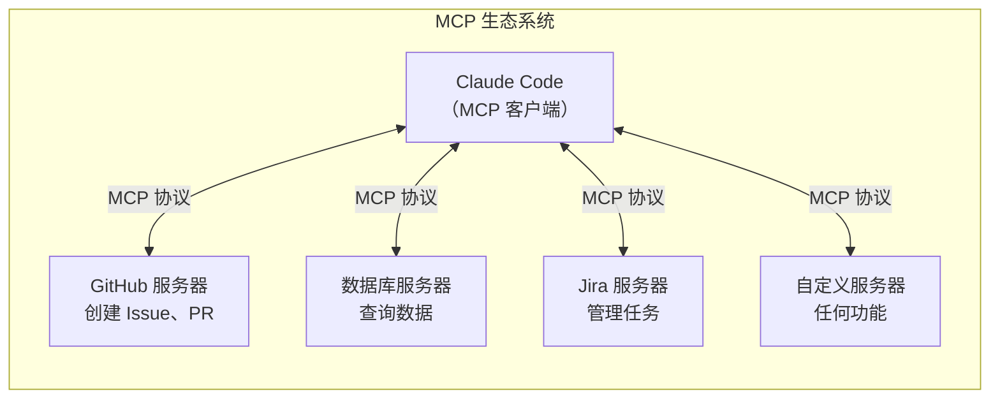
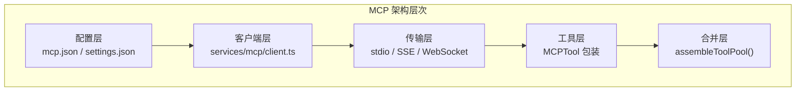
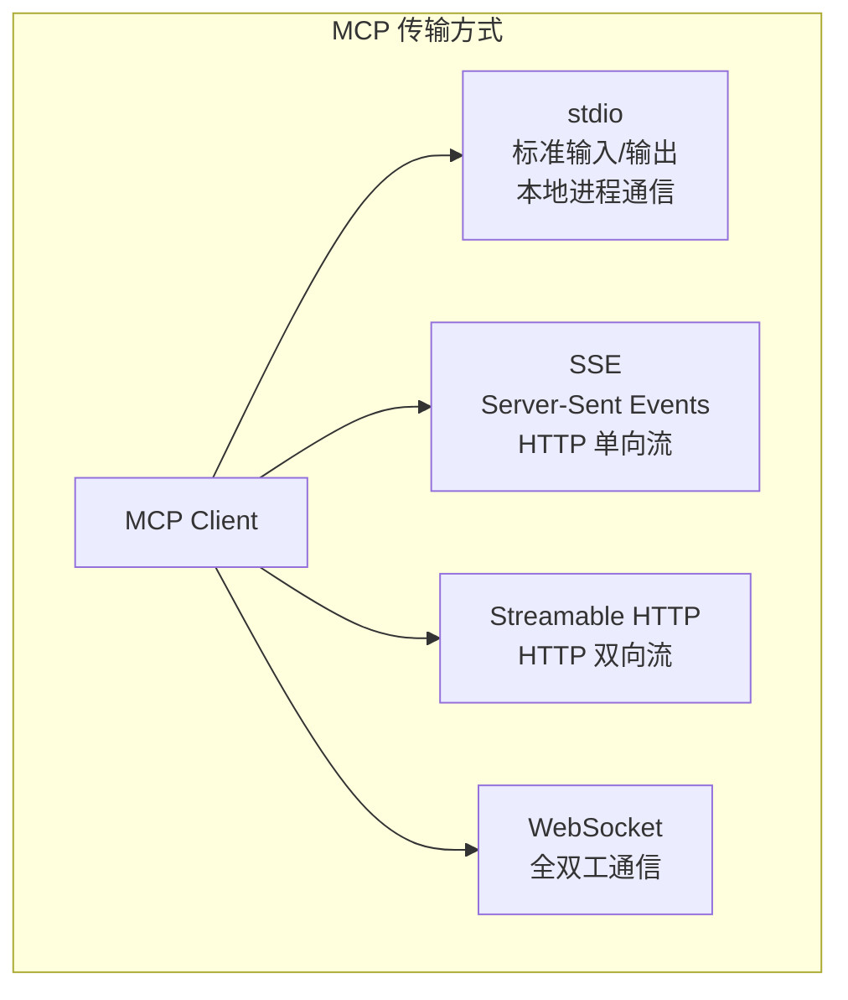
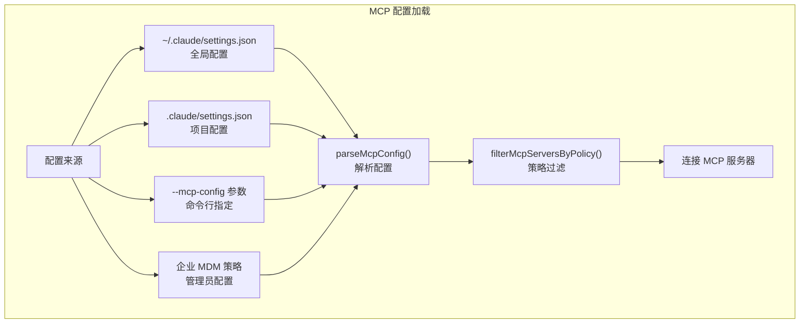
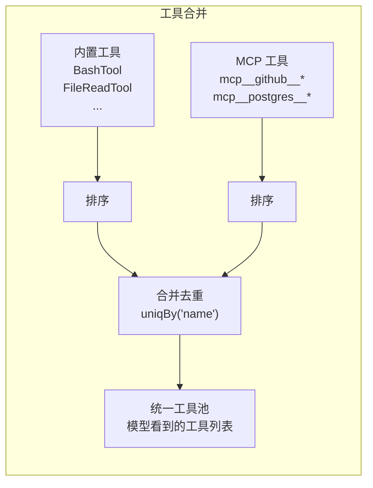
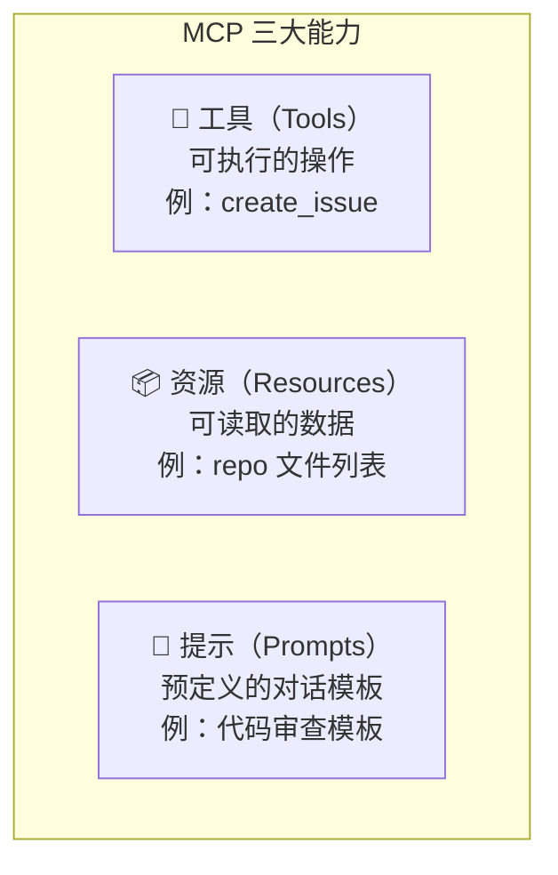
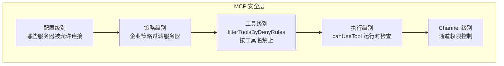
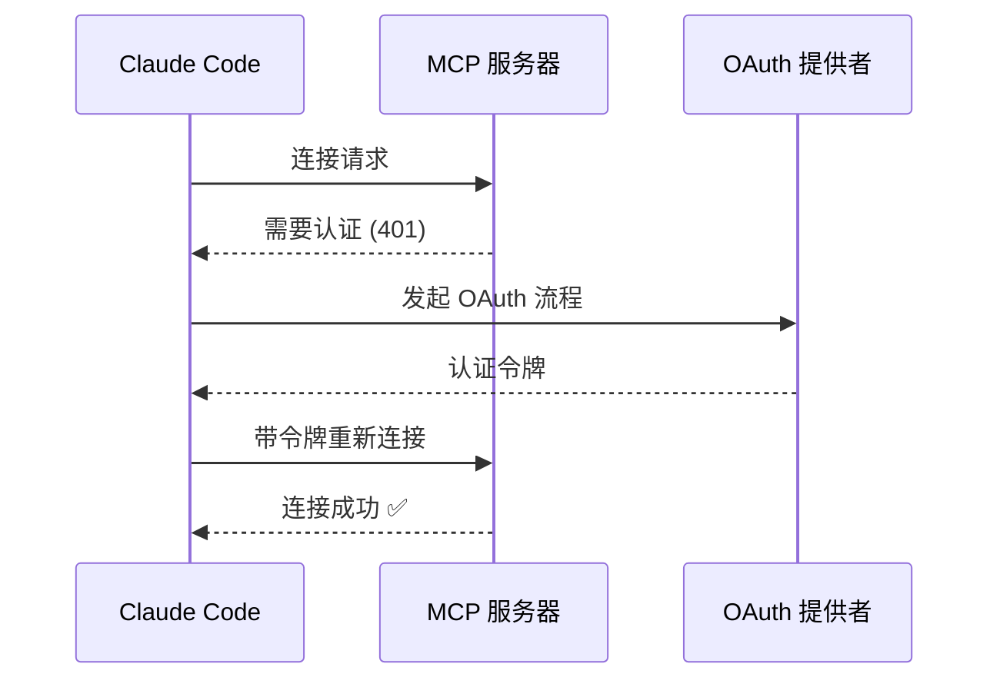
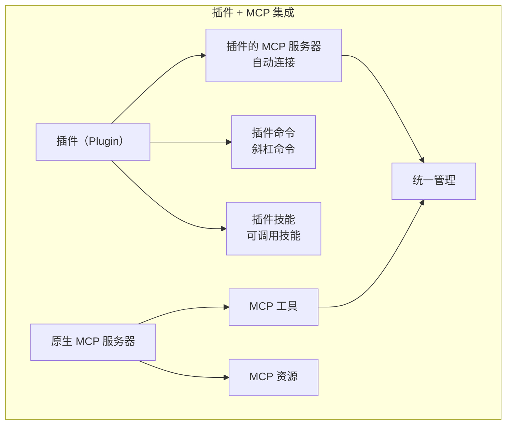
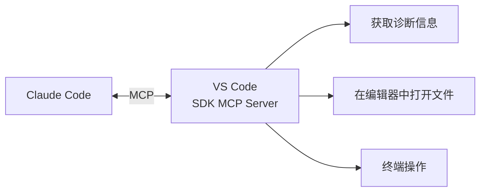

# 第9课：MCP 扩展系统与外部集成

## 学习目标

通过本课学习，你将能够：

1. 理解 MCP（Model Context Protocol）的核心概念
2. 认识 Claude Code 中 MCP 客户端的实现
3. 了解 MCP 工具如何与内置工具统一管理
4. 掌握 MCP 服务器的配置和连接机制
5. 理解 MCP 的安全模型和权限管理

---

## 9.1 什么是 MCP？

### 生活类比：USB 接口

回忆一下 USB 接口的设计——不管你插的是鼠标、键盘还是U盘，电脑都能识别和使用。这是因为 USB 定义了一个**标准协议**。

MCP（Model Context Protocol）就是 AI 模型的"USB 接口"：

- **统一协议**：任何服务只要实现 MCP 协议，就能被 Claude Code 使用
- **即插即用**：配置好就能用，不需要修改 Claude Code 核心代码
- **双向通信**：Claude Code（客户端）和外部服务（服务器）可以互相通信



---

## 9.2 MCP 在 Claude Code 中的架构



---

## 9.3 MCP 客户端实现

来看 `services/mcp/client.ts` 中的核心实现：

```typescript
// 源码：services/mcp/client.ts
import { Client } from '@modelcontextprotocol/sdk/client/index.js'
import { StdioClientTransport } from '@modelcontextprotocol/sdk/client/stdio.js'
import {
  SSEClientTransport
} from '@modelcontextprotocol/sdk/client/sse.js'
import {
  StreamableHTTPClientTransport
} from '@modelcontextprotocol/sdk/client/streamableHttp.js'
import {
  CallToolResultSchema,
  ListToolsResultSchema,
  ListPromptsResultSchema,
  ListResourcesResultSchema,
} from '@modelcontextprotocol/sdk/types.js'
```

### 支持的传输协议



| 传输方式 | 适用场景 | 特点 |
|---------|---------|------|
| stdio | 本地 MCP 服务器 | 最简单，进程间管道 |
| SSE | 远程 HTTP 服务器 | 单向流，兼容性好 |
| Streamable HTTP | 远程 HTTP 服务器 | 双向流，更强大 |
| WebSocket | 实时双向通信 | 最灵活 |

---

## 9.4 MCP 服务器配置

### 配置文件结构

```json
{
  "mcpServers": {
    "github": {
      "command": "npx",
      "args": ["-y", "@modelcontextprotocol/server-github"],
      "env": {
        "GITHUB_TOKEN": "ghp_xxxx"
      }
    },
    "postgres": {
      "command": "npx",
      "args": ["-y", "@modelcontextprotocol/server-postgres"],
      "env": {
        "DATABASE_URL": "postgresql://..."
      }
    }
  }
}
```

### 配置加载流程



---

## 9.5 MCPTool：将 MCP 工具包装为内置工具

MCP 服务器提供的工具需要被包装成 Claude Code 能理解的格式：

```typescript
// 源码：services/mcp/client.ts
// MCPTool 将 MCP 工具包装为标准 Tool 接口
import { MCPTool } from '../../tools/MCPTool/MCPTool.js'
```

### MCP 工具的命名约定

```
mcp__{服务器名}__{工具名}

例如：
mcp__github__create_issue
mcp__postgres__query
mcp__jira__create_ticket
```

### 工具合并流程

```typescript
// 源码：tools.ts
export function assembleToolPool(
  permissionContext: ToolPermissionContext,
  mcpTools: Tools,
): Tools {
  const builtInTools = getTools(permissionContext)
  const allowedMcpTools = filterToolsByDenyRules(mcpTools, permissionContext)

  // 排序保证 prompt cache 稳定性
  // 内置工具优先（名称冲突时）
  const byName = (a: Tool, b: Tool) => a.name.localeCompare(b.name)
  return uniqBy(
    [...builtInTools].sort(byName).concat(allowedMcpTools.sort(byName)),
    'name',
  )
}
```



---

## 9.6 MCP 资源和提示

MCP 不仅提供工具，还提供**资源**和**提示**：



```typescript
// 源码：tools/ListMcpResourcesTool/ListMcpResourcesTool.ts
// 列出 MCP 服务器提供的资源

// 源码：tools/ReadMcpResourceTool/ReadMcpResourceTool.ts
// 读取 MCP 服务器的资源内容
```

### 在 AppState 中管理 MCP 状态

```typescript
// 源码：state/AppStateStore.ts
mcp: {
  clients: MCPServerConnection[],  // 连接的 MCP 服务器
  tools: Tool[],                    // MCP 提供的工具
  commands: Command[],              // MCP 提供的命令（斜杠命令）
  resources: Record<string, ServerResource[]>,  // MCP 资源
  pluginReconnectKey: number,       // 重新连接触发器
}
```

---

## 9.7 MCP 安全模型

### 权限控制



### MCP 通道权限

```typescript
// 源码：services/mcp/channelPermissions.ts
// 控制 MCP 服务器的通道访问权限

// 源码：services/mcp/channelAllowlist.ts
// MCP 服务器的白名单管理
```

### OAuth 认证

```typescript
// 源码：services/mcp/auth.ts
// MCP 服务器的 OAuth 认证流程

// 源码：tools/McpAuthTool/McpAuthTool.ts
// 处理 MCP 认证的工具
```



---

## 9.8 MCP 与插件系统

Claude Code 还有一个插件系统，它与 MCP 紧密集成：



```typescript
// 源码：state/AppStateStore.ts 中的插件状态
plugins: {
  enabled: LoadedPlugin[],   // 已启用的插件
  disabled: LoadedPlugin[],  // 已禁用的插件
  commands: Command[],       // 插件提供的命令
  errors: PluginError[],     // 加载错误
  installationStatus: {      // 安装状态
    marketplaces: [...],
    plugins: [...]
  },
  needsRefresh: boolean,     // 是否需要刷新
}
```

---

## 9.9 IDE 集成：VSCode SDK MCP

Claude Code 还支持通过 MCP 与 IDE 集成：

```typescript
// 源码：services/mcp/vscodeSdkMcp.ts
// VS Code SDK MCP 服务器
// 让 Claude Code 能够与 VS Code 编辑器交互
```



---

## 动手练习

### 练习1：配置一个 MCP 服务器

在 `~/.claude/settings.json` 中添加一个简单的 MCP 服务器配置：

```json
{
  "mcpServers": {
    "filesystem": {
      "command": "npx",
      "args": ["-y", "@modelcontextprotocol/server-filesystem", "/tmp"]
    }
  }
}
```

### 练习2：探索 MCP 文件结构

浏览 `services/mcp/` 目录，理解各文件的职责：

- [ ] `client.ts` — MCP 客户端主逻辑
- [ ] `config.ts` — 配置解析
- [ ] `types.ts` — 类型定义
- [ ] `auth.ts` — 认证处理
- [ ] `channelPermissions.ts` — 通道权限

### 练习3：追踪 MCP 工具流

从配置到最终被模型使用，MCP 工具经历了哪些步骤？

- [ ] 配置文件 → 解析
- [ ] 连接服务器 → 获取工具列表
- [ ] MCPTool 包装 → 注册
- [ ] assembleToolPool → 合并
- [ ] 模型调用 → 执行

### 思考题

1. MCP 的 stdio 传输方式有什么优缺点？
2. 为什么 MCP 工具名要加 `mcp__` 前缀？
3. 如果 MCP 服务器在查询过程中断开连接，会怎样？

---

## 本课小结

| 概念 | 说明 | 文件 |
|------|------|------|
| MCP 协议 | AI 工具的标准接口 | `@modelcontextprotocol/sdk` |
| MCP Client | 客户端实现 | `services/mcp/client.ts` |
| MCPTool | 工具包装器 | `tools/MCPTool/MCPTool.ts` |
| 传输层 | stdio/SSE/HTTP/WS | `services/mcp/client.ts` |
| 配置管理 | 多来源配置 | `services/mcp/config.ts` |
| 安全模型 | 多层权限检查 | `services/mcp/channelPermissions.ts` |
| 资源/提示 | 数据和模板 | `ListMcpResourcesTool` |

### 核心价值

MCP 让 Claude Code 从一个封闭系统变成了一个**开放平台**——任何人都可以开发 MCP 服务器来扩展 Claude Code 的能力。

---

## 下节预告

**第10课：Bridge 桥接系统与全架构总结** — 最后一课！我们将探索 Bridge 远程桥接系统——它如何让 Claude Code 在云端运行并通过 Web/移动端控制。然后，我们将回顾整个架构，把所有知识串联起来形成完整的认知地图！
