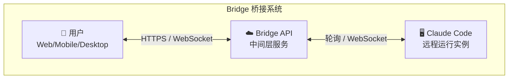
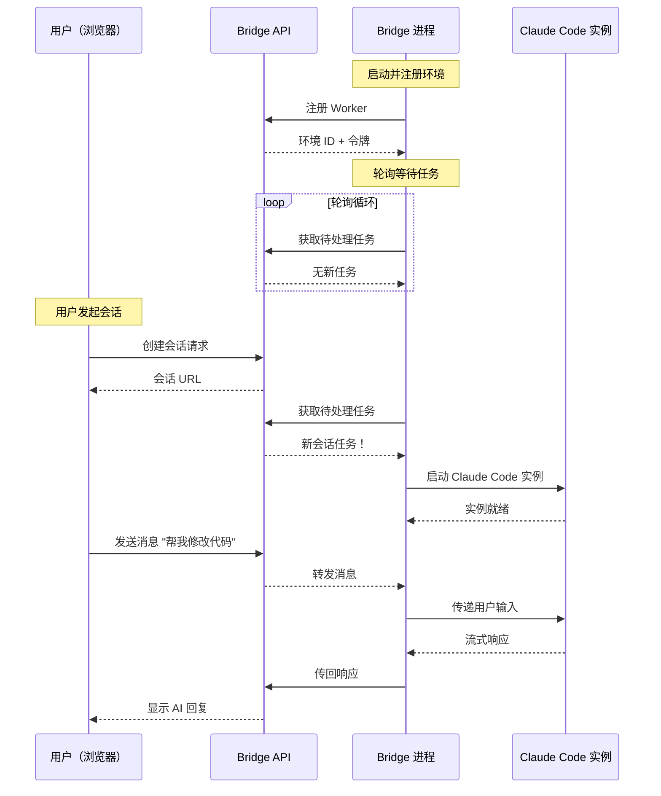
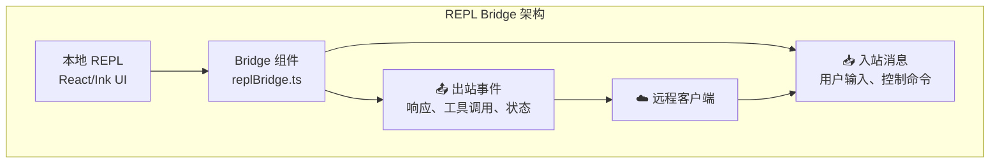
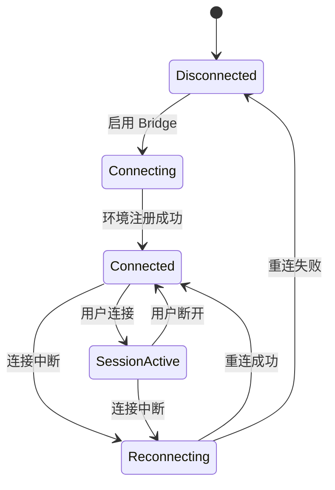
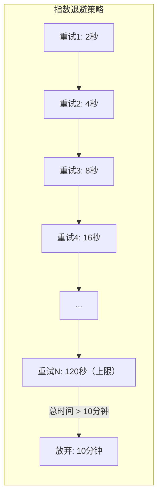
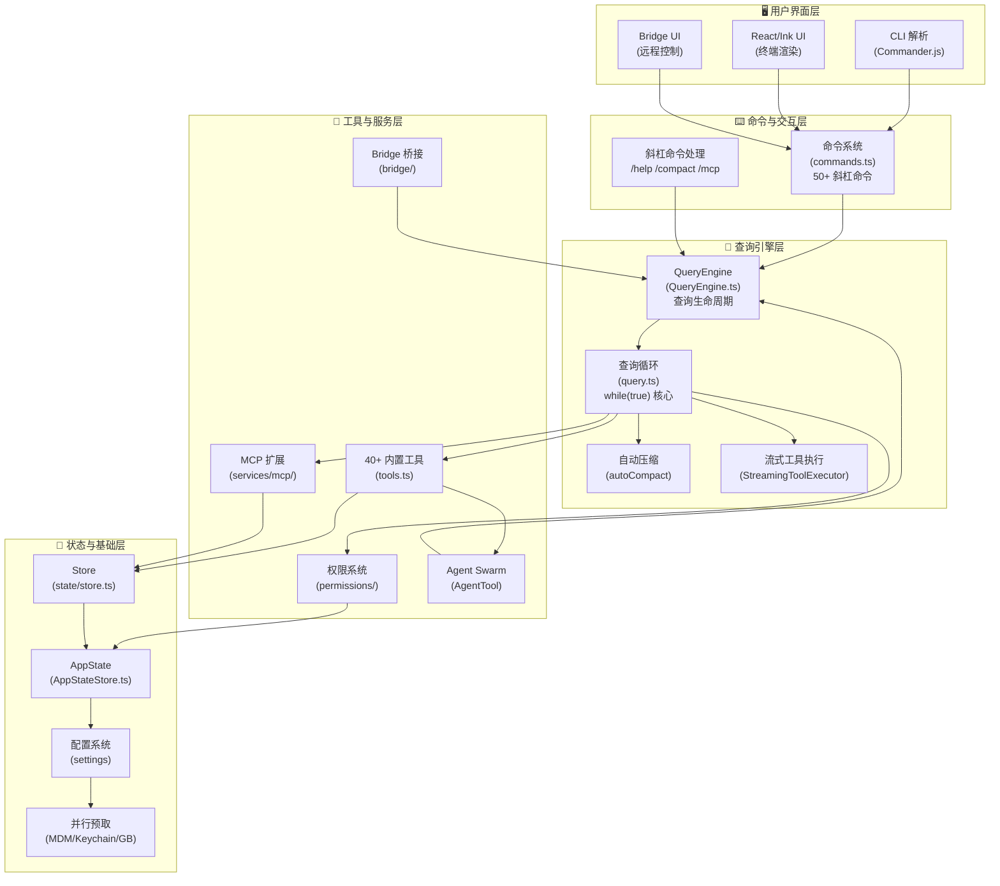
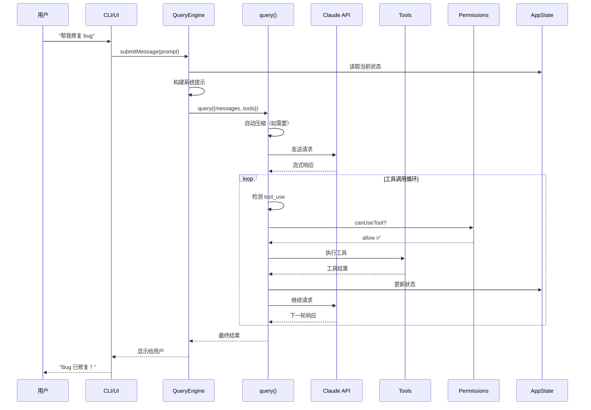

# 第10课：Bridge 桥接系统与全架构总结

## 学习目标

通过本课学习，你将能够：

1. 理解 Bridge 桥接系统的设计目标和架构
2. 认识远程会话管理和轮询机制
3. 了解 REPL Bridge 的工作原理
4. 掌握 Claude Code 的完整架构全景
5. 建立对整个系统的系统性认知

---

## 10.1 什么是 Bridge 桥接系统？

### 生活类比：远程操控无人机

想象你在办公室，但需要检查远方的建筑工地：

- **以前**：亲自开车去（只能在本地运行 Claude Code）
- **现在**：用无人机远程查看（Bridge 让你远程控制 Claude Code）

Bridge 桥接系统让 Claude Code 可以：
- 在**云端服务器**上运行
- 通过**Web 浏览器**或**手机**控制
- 保持**长时间运行**的会话



---

## 10.2 Bridge 架构详解

### bridge/ 目录结构

```
bridge/
├── bridgeMain.ts         ← 桥接主入口
├── bridgeConfig.ts       ← 配置管理
├── bridgeApi.ts          ← API 客户端
├── bridgeMessaging.ts    ← 消息传递
├── bridgeUI.ts           ← UI 日志
├── bridgePermissionCallbacks.ts ← 权限回调
├── pollConfig.ts         ← 轮询配置
├── sessionRunner.ts      ← 会话管理
├── createSession.ts      ← 会话创建
├── replBridge.ts         ← REPL 桥接
├── replBridgeTransport.ts ← 传输层
├── jwtUtils.ts           ← JWT 认证
├── trustedDevice.ts      ← 设备信任
├── capacityWake.ts       ← 容量唤醒
└── types.ts              ← 类型定义
```

### bridgeMain.ts 的核心

```typescript
// 源码：bridge/bridgeMain.ts
import { createBridgeApiClient } from './bridgeApi.js'
import { createSessionSpawner } from './sessionRunner.js'
import { getPollIntervalConfig } from './pollConfig.js'
import { getTrustedDeviceToken } from './trustedDevice.js'
import { createCapacityWake } from './capacityWake.js'

// 默认退避配置
const DEFAULT_BACKOFF: BackoffConfig = {
  connInitialMs: 2_000,       // 初始重连间隔
  connCapMs: 120_000,         // 最大重连间隔（2分钟）
  connGiveUpMs: 600_000,      // 放弃重连时间（10分钟）
  generalInitialMs: 500,
  generalCapMs: 30_000,
  generalGiveUpMs: 600_000,
}

const STATUS_UPDATE_INTERVAL_MS = 1_000  // 状态更新间隔
const SPAWN_SESSIONS_DEFAULT = 32        // 默认最大会话数
```

---

## 10.3 Bridge 的工作流程



---

## 10.4 REPL Bridge：交互式桥接

REPL Bridge 让远程用户能像本地使用一样交互：



### 安全的命令过滤

```typescript
// 源码：commands.ts
// 桥接安全命令——只有这些命令可以通过 Bridge 执行
export const BRIDGE_SAFE_COMMANDS: Set<Command> = new Set([
  compact,      // 压缩上下文
  clear,        // 清屏
  cost,         // 显示成本
  summary,      // 总结对话
  releaseNotes, // 显示更新日志
  files,        // 列出文件
])

// 判断命令是否可以通过 Bridge 执行
export function isBridgeSafeCommand(cmd: Command): boolean {
  if (cmd.type === 'local-jsx') return false    // JSX 命令不安全
  if (cmd.type === 'prompt') return true         // 提示类命令安全
  return BRIDGE_SAFE_COMMANDS.has(cmd)
}
```

---

## 10.5 会话管理和状态同步

### AppState 中的 Bridge 状态

```typescript
// 源码：state/AppStateStore.ts
// Bridge 相关的状态字段
{
  replBridgeEnabled: boolean,       // 是否启用
  replBridgeExplicit: boolean,      // 是否显式启用
  replBridgeOutboundOnly: boolean,  // 仅出站模式
  replBridgeConnected: boolean,     // 环境已注册
  replBridgeSessionActive: boolean, // WebSocket 已连接
  replBridgeReconnecting: boolean,  // 正在重连
  replBridgeConnectUrl?: string,    // 连接 URL
  replBridgeSessionUrl?: string,    // 会话 URL
  replBridgeEnvironmentId?: string, // 环境 ID
  replBridgeSessionId?: string,     // 会话 ID
  replBridgeError?: string,         // 错误信息
}
```

### 连接状态机



---

## 10.6 Bridge 的退避和容错

```typescript
// 源码：bridge/bridgeMain.ts
const DEFAULT_BACKOFF: BackoffConfig = {
  connInitialMs: 2_000,      // 首次重试等待 2 秒
  connCapMs: 120_000,        // 最长等待 2 分钟
  connGiveUpMs: 600_000,     // 10 分钟后放弃
  generalInitialMs: 500,
  generalCapMs: 30_000,
  generalGiveUpMs: 600_000,
}
```



---

## 10.7 全架构总结

现在让我们把前 9 课的所有知识串联起来！

### 完整架构图



---

## 10.8 数据流全景

一次完整的用户查询，数据如何在系统中流动：



---

## 10.9 十课知识地图

```mermaid
mindmap
    root((Claude Code<br/>架构))
        第1课 软件架构
            分层设计
            五层蛋糕
            关注点分离
        第2课 技术栈
            TypeScript 类型安全
            Bun 运行时
            React/Ink UI
            feature() 门控
        第3课 启动流程
            main.tsx 入口
            CLI 解析
            AppState 初始化
        第4课 并行预取
            MDM 预取
            Keychain 预取
            GrowthBook 预取
            Promise.all
        第5课 工具系统
            40+ 工具
            注册与发现
            条件加载
            工具池合并
        第6课 查询引擎
            QueryEngine 类
            query() 循环
            流式执行
            自动压缩
        第7课 权限系统
            权限模式
            多层规则
            运行时检查
            沙箱保护
        第8课 Agent Swarm
            AgentTool
            协调器模式
            Worktree 隔离
            团队协作
        第9课 MCP 扩展
            协议标准
            多种传输
            工具包装
            安全模型
        第10课 Bridge + 总结
            远程桥接
            会话管理
            全架构回顾
```

---

## 10.10 架构设计原则总结

通过学习 Claude Code 的架构，我们可以提炼出以下设计原则：

### 1. 分层与模块化

```
每一层职责单一，通过接口通信
→ 添加新工具不需要改查询引擎
→ 换掉 UI 层不影响核心逻辑
```

### 2. 并行优先

```
能并行的绝不串行
→ 启动时预取 MDM/Keychain/GrowthBook
→ 流式工具执行（边接收边执行）
→ Promise.all 并行加载技能和插件
```

### 3. 安全纵深

```
多层防护，不依赖单点
→ 编译时门控 → 权限模式 → 规则匹配 → 运行时检查 → 沙箱
```

### 4. 开放扩展

```
核心稳定，边缘灵活
→ MCP 协议让外部服务即插即用
→ 插件系统扩展命令和技能
→ Agent Swarm 实现多代理协作
```

### 5. 优雅降级

```
失败不是终点，恢复才是
→ 自动压缩处理上下文过长
→ 模型降级处理服务不可用
→ 权限回退从自动模式到手动模式
→ Bridge 指数退避重连
```

---

## 终极动手练习

### 练习1：架构日记

用自己的话，写一篇 200 字的短文，描述 Claude Code 的整体架构。

### 练习2：设计一个新工具

假设你要给 Claude Code 添加一个 `DocSearchTool`（文档搜索工具），思考：

- [ ] 工具定义文件放在哪个目录？
- [ ] 需要在 `tools.ts` 的哪里注册？
- [ ] 需要什么权限？
- [ ] 如何通过 MCP 提供给外部使用？

### 练习3：架构对比

选择一个你熟悉的开源项目（如 VS Code、React），对比它和 Claude Code 的架构异同：

- [ ] 分层方式有什么不同？
- [ ] 插件/扩展机制有什么相似之处？
- [ ] 状态管理方案有何差异？

---

## 课程总结

恭喜你完成了 Claude Code 架构学习之旅！让我们回顾每节课的核心收获：

| 课程 | 核心收获 |
|------|---------|
| 第1课 | 架构就是"系统的设计图"，Claude Code 是五层蛋糕 |
| 第2课 | TypeScript 保安全，Bun 求速度，React/Ink 做界面 |
| 第3课 | 启动不是一步，而是精心编排的多步骤流水线 |
| 第4课 | 能并行就并行，135ms 的 import 时间不浪费 |
| 第5课 | 40+ 工具通过统一接口管理，条件加载很灵活 |
| 第6课 | QueryEngine 是大脑，query() 循环是心跳 |
| 第7课 | 安全靠纵深防御，权限不是一刀切 |
| 第8课 | 多代理并行协作，隔离和通信缺一不可 |
| 第9课 | MCP 让 Claude Code 成为开放平台 |
| 第10课 | Bridge 打破本地限制，架构设计有章可循 |

### 继续学习的方向

1. **动手实践**：尝试给 Claude Code 贡献代码或开发 MCP 服务器
2. **深入源码**：选择一个你感兴趣的模块，完整阅读其源码
3. **架构思考**：在自己的项目中尝试应用学到的架构原则
4. **社区参与**：加入 Claude Code 社区，分享你的学习心得

> **架构不是记忆，而是理解。不是终点，而是起点。**
>
> 祝你在软件架构的世界里，越走越远！🎉
