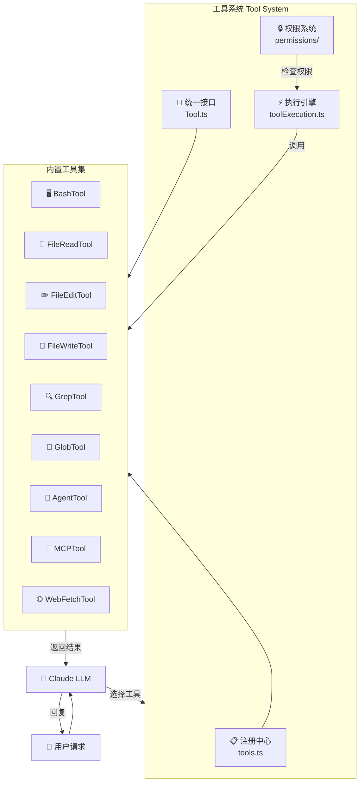
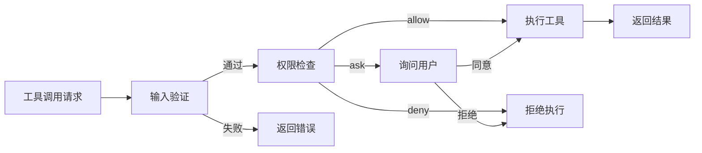
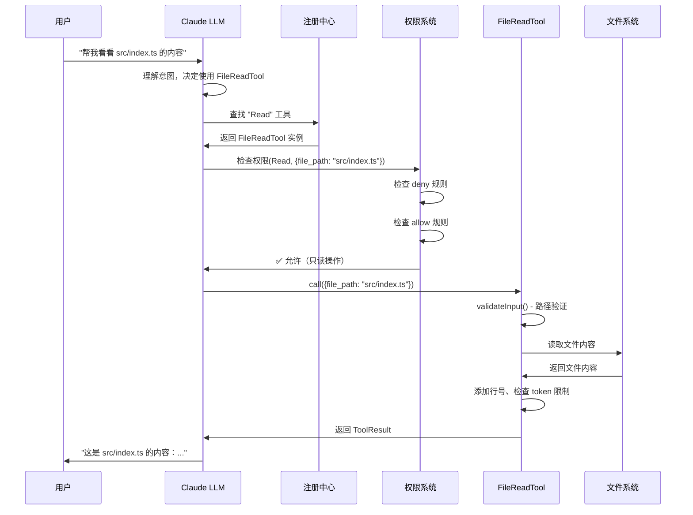
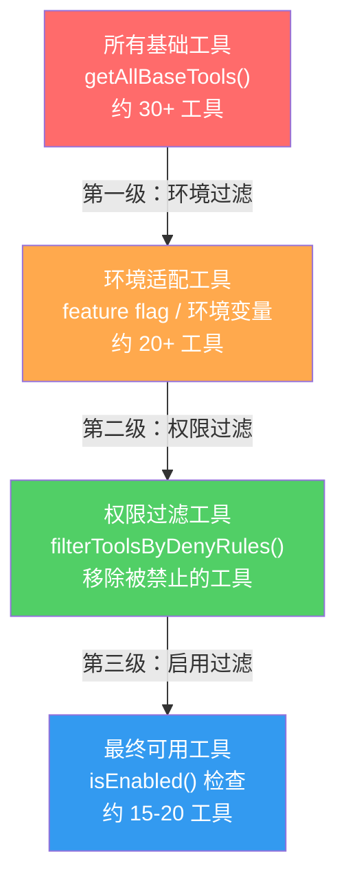

# 第 1 课：工具系统概览 —— AI 的百宝袋

> 🎯 本课目标：从宏观视角理解 Claude Code 的工具系统架构

---

## 学习目标

1. 理解 Claude Code 工具系统在整体架构中的位置和角色
2. 掌握工具系统的核心组成部分：注册、接口、权限、执行
3. 了解从用户请求到工具执行的完整生命周期
4. 认识 Claude Code 内置的主要工具分类
5. 建立对工具系统"分层设计"的直觉

---

## 1. 生活类比：AI 的百宝袋

想象你是一位新入职的办公室助理（Claude），老板（用户）给你布置各种任务：

- "帮我查一下这个文件的内容"（FileReadTool）
- "在代码里搜索一下这个函数"（GrepTool）
- "运行一下这个测试命令"（BashTool）
- "帮我改一下这个配置文件"（FileEditTool）

你面前有一个**百宝箱**（工具系统），里面整齐地摆放着各种工具。但你不能随便用——有些工具需要**经理审批**（权限系统），有些工具有**使用说明书**（接口定义），所有工具都在一个**登记簿**（注册中心）里登记在案。

这就是 Claude Code 工具系统的核心隐喻。

---

## 2. 架构全景图



---

## 3. 工具系统的四大支柱

### 3.1 注册中心（Registry）

所有工具必须在注册中心登记才能被使用。就像公司的资产管理系统，每件工具都有编号和说明。

**源码入口：`tools.ts` 中的 `getAllBaseTools()`**

```typescript
// 源码: tools.ts (第 193-251 行)
export function getAllBaseTools(): Tools {
  return [
    AgentTool,
    TaskOutputTool,
    BashTool,
    ...(hasEmbeddedSearchTools() ? [] : [GlobTool, GrepTool]),
    FileReadTool,
    FileEditTool,
    FileWriteTool,
    NotebookEditTool,
    WebFetchTool,
    TodoWriteTool,
    WebSearchTool,
    // ... 更多工具
  ]
}
```

> 📌 **关键洞察**：这里有条件加载逻辑！例如 `GlobTool` 和 `GrepTool` 只在没有内嵌搜索工具时才加载。这就像办公室里如果已经有了高级搜索软件，就不再配备基础搜索工具。

### 3.2 统一接口（Interface）

每个工具都必须遵循相同的"合同"——`Tool` 接口。这保证了系统可以一致地管理和调用所有工具。

```typescript
// 源码: Tool.ts (第 362-456 行) - 简化版
export type Tool<Input, Output, P> = {
  name: string                        // 工具名称
  inputSchema: Input                  // 输入参数定义
  call(...): Promise<ToolResult>      // 执行逻辑
  checkPermissions(...): Promise<PermissionResult>  // 权限检查
  isReadOnly(input): boolean          // 是否只读
  isEnabled(): boolean                // 是否启用
  prompt(...): Promise<string>        // 使用说明
  description(...): Promise<string>   // 描述信息
  // ... 更多方法
}
```

### 3.3 权限系统（Permissions）

每次工具调用前，系统都会检查权限。就像公司的门禁系统：

- **allow（允许）**：直接放行
- **deny（拒绝）**：直接拦截
- **ask（询问）**：弹窗让用户确认



### 3.4 执行引擎（Execution）

负责实际调用工具并处理结果。包括超时管理、并发控制、进度报告等。

---

## 4. 工具分类一览

| 分类 | 工具 | 类比 | 能力 |
|------|------|------|------|
| 🖥️ Shell | BashTool | 万能瑞士军刀 | 执行任意 Shell 命令 |
| 📁 文件 | FileReadTool | 放大镜 | 读取文件内容 |
| 📁 文件 | FileEditTool | 橡皮擦和铅笔 | 精确修改文件 |
| 📁 文件 | FileWriteTool | 打印机 | 创建/覆盖文件 |
| 🔍 搜索 | GrepTool | 侦探 | 按内容搜索代码 |
| 🔍 搜索 | GlobTool | 图书管理员 | 按文件名模式查找 |
| 🤖 Agent | AgentTool | 分身术 | 启动子 Agent |
| 🌐 网络 | WebFetchTool | 快递员 | 获取网页内容 |
| 🔗 扩展 | MCPTool | 万能插头 | 连接外部服务 |

---

## 5. 一次完整的工具调用旅程

让我们跟踪一次 "读取 src/index.ts 文件" 的完整流程：



---

## 6. 三级过滤管道

工具从"全部可用"到"实际可用"要经过三级过滤：



**源码证据**：

```typescript
// 源码: tools.ts (第 271-327 行) - getTools 函数
export const getTools = (permissionContext): Tools => {
  // 第一级：获取所有基础工具（含环境条件过滤）
  const tools = getAllBaseTools().filter(tool => !specialTools.has(tool.name))

  // 第二级：权限 deny 规则过滤
  let allowedTools = filterToolsByDenyRules(tools, permissionContext)

  // 第三级：isEnabled() 检查
  const isEnabled = allowedTools.map(_ => _.isEnabled())
  return allowedTools.filter((_, i) => isEnabled[i])
}
```

---

## 7. 关键设计理念

### 安全优先（Fail-Closed）

工具系统的默认值都是"保守"的：

```typescript
// 源码: Tool.ts (第 757-769 行) - 安全默认值
const TOOL_DEFAULTS = {
  isEnabled: () => true,
  isConcurrencySafe: (_input?) => false,   // 默认不安全
  isReadOnly: (_input?) => false,           // 默认可写
  isDestructive: (_input?) => false,        // 默认非破坏性
  checkPermissions: (input) =>
    Promise.resolve({ behavior: 'allow', updatedInput: input }),
  toAutoClassifierInput: (_input?) => '',
  userFacingName: (_input?) => '',
}
```

### 统一构建（buildTool）

所有工具通过 `buildTool` 函数构建，确保默认值统一：

```typescript
// 源码: Tool.ts (第 783-792 行)
export function buildTool<D extends AnyToolDef>(def: D): BuiltTool<D> {
  return {
    ...TOOL_DEFAULTS,
    userFacingName: () => def.name,
    ...def,
  } as BuiltTool<D>
}
```

> 这就像工厂流水线：所有工具先用默认模板"铸造"，然后再用自定义属性"打磨"。

---

## 动手练习

### 练习 1：画出你自己的工具地图

打开 Claude Code 源码目录 `tools/`，列出所有子目录名称，并尝试将它们按照上面的分类表进行分类。

### 练习 2：思考题

1. 为什么 `isConcurrencySafe` 默认为 `false`？如果默认为 `true` 会有什么风险？
2. `getAllBaseTools()` 中的条件加载（如 `feature('KAIROS')`）有什么好处？如果把所有工具都无条件加载会怎样？
3. 为什么需要 `filterToolsByDenyRules` 这一层？直接在工具执行时检查不行吗？

### 练习 3：追踪代码

在源码中找到 `assembleToolPool` 函数（`tools.ts` 第 345 行），阅读注释理解为什么内置工具要排在 MCP 工具前面（提示：与 prompt cache 有关）。

---

## 本课小结

| 要点 | 说明 |
|------|------|
| 工具系统 = 四大支柱 | 注册中心 + 统一接口 + 权限系统 + 执行引擎 |
| 三级过滤管道 | 环境过滤 → 权限过滤 → 启用检查 |
| 安全优先设计 | 默认值都是保守的（fail-closed） |
| 统一构建 | 所有工具通过 `buildTool()` 构建 |
| 工具分类 | Shell / 文件 / 搜索 / Agent / 网络 / 扩展 |

---

## 下节预告

在第 2 课中，我们将深入 `tools.ts` 文件，详细分析 `getAllBaseTools()` 的三级过滤机制。你将看到环境变量、Feature Flag 和权限规则是如何像漏斗一样层层筛选工具的。

> 📖 预习建议：先通读 `tools.ts` 全文（约 390 行），重点关注 `getAllBaseTools()`、`getTools()`、`assembleToolPool()` 三个函数。
