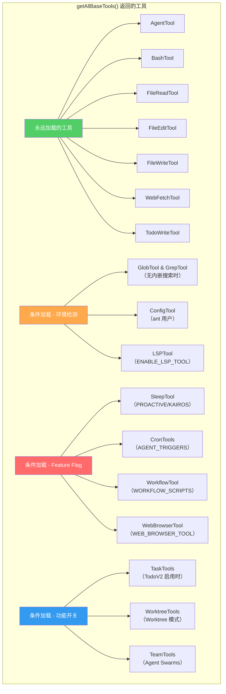
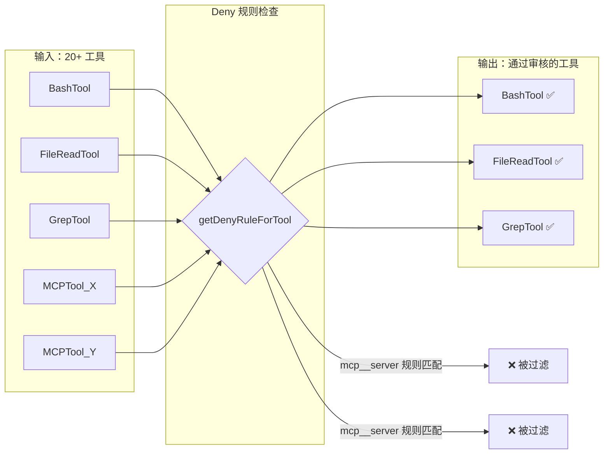
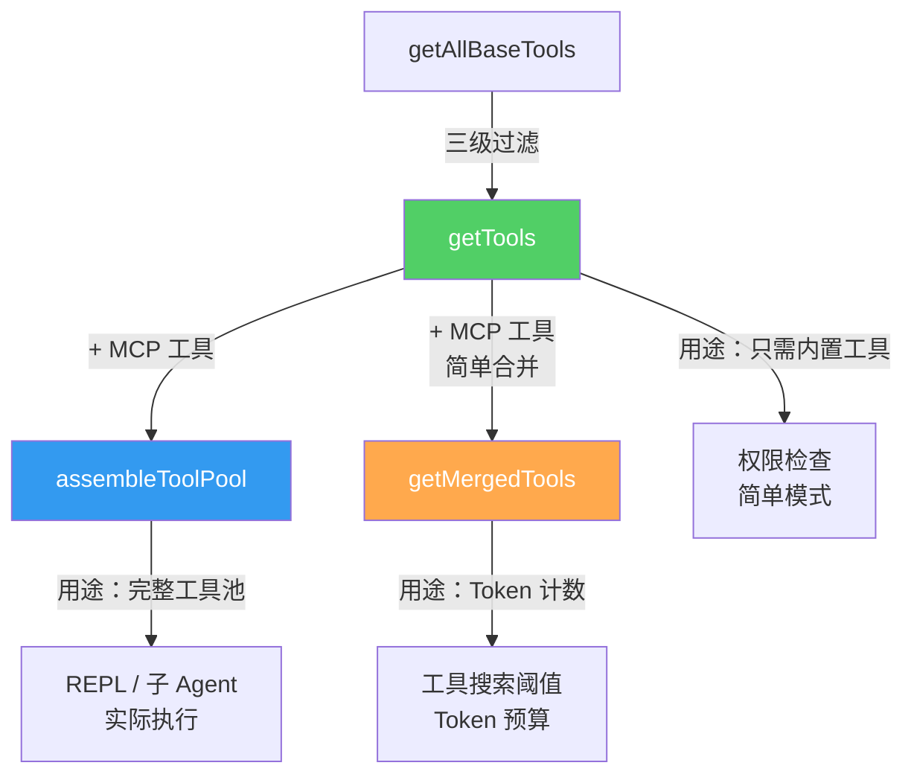

# 第 2 课：工具注册中心 —— getAllBaseTools 三级过滤

> 🎯 本课目标：深入理解工具是如何被注册、筛选和最终交付给 AI 使用的

---

## 学习目标

1. 理解 `getAllBaseTools()` 函数的完整逻辑
2. 掌握三级过滤管道：环境过滤 → 权限过滤 → 启用检查
3. 了解 Feature Flag 和条件加载的设计模式
4. 理解 `getTools()` 与 `assembleToolPool()` 的区别
5. 掌握 MCP 工具与内置工具的合并策略

---

## 1. 生活类比：超市的货架管理

想象一家超市（工具注册中心）的供货流程：

1. **仓库（getAllBaseTools）**：所有商品都在仓库里，但有些是季节限定（Feature Flag）、有些只在特定门店销售（环境变量）
2. **上架审核（filterToolsByDenyRules）**：有些商品被列入黑名单（deny 规则），不能上架
3. **保质期检查（isEnabled）**：过期商品（被禁用的工具）不能卖
4. **最终货架（getTools 返回值）**：顾客（AI）能看到和购买的商品

---

## 2. 第一级：getAllBaseTools —— 仓库盘点

这是工具系统的"源头"，定义了所有可能存在的工具。



### 源码解析：三种条件加载模式

**模式一：环境检测**

```typescript
// 源码: tools.ts (第 199-201 行)
// 如果有内嵌搜索工具（ant-native），就不加载 GlobTool 和 GrepTool
...(hasEmbeddedSearchTools() ? [] : [GlobTool, GrepTool]),
```

> 📌 类比：如果办公室已经有了企业级搜索系统，就不需要额外配备 grep 和 find 命令。

**模式二：Feature Flag（编译时常量）**

```typescript
// 源码: tools.ts (第 25-28 行)
// 使用 bun:bundle 的 feature() 实现死代码消除
const SleepTool =
  feature('PROACTIVE') || feature('KAIROS')
    ? require('./tools/SleepTool/SleepTool.js').SleepTool
    : null
```

这里的 `feature()` 是编译时常量。如果 feature flag 为 `false`，整个 `require()` 调用会被 Bun 的打包器在编译时移除，不会出现在最终产物中。

**模式三：运行时检测**

```typescript
// 源码: tools.ts (第 214-225 行)
...(process.env.USER_TYPE === 'ant' ? [ConfigTool] : []),
...(isTodoV2Enabled() ? [TaskCreateTool, TaskGetTool, ...] : []),
...(isEnvTruthy(process.env.ENABLE_LSP_TOOL) ? [LSPTool] : []),
...(isWorktreeModeEnabled() ? [EnterWorktreeTool, ExitWorktreeTool] : []),
```

### 延迟加载与循环依赖

有些工具使用延迟 `require()` 来打破循环依赖：

```typescript
// 源码: tools.ts (第 63-72 行)
// 延迟 require 打破循环依赖：tools.ts -> TeamCreateTool -> ... -> tools.ts
const getTeamCreateTool = () =>
  require('./tools/TeamCreateTool/TeamCreateTool.js').TeamCreateTool
const getTeamDeleteTool = () =>
  require('./tools/TeamDeleteTool/TeamDeleteTool.js').TeamDeleteTool
```

> 📌 类比：这就像两个部门互相依赖对方的数据。解决方法是"先登记，等需要时再去查"，而不是"启动时就要求对方的数据"。

---

## 3. 第二级：filterToolsByDenyRules —— 权限黑名单

```typescript
// 源码: tools.ts (第 262-269 行)
export function filterToolsByDenyRules<T extends { name: string }>(
  tools: readonly T[],
  permissionContext: ToolPermissionContext,
): T[] {
  return tools.filter(tool => !getDenyRuleForTool(permissionContext, tool))
}
```

这个函数做的事情非常简单：检查每个工具是否有一个"全面禁止"（blanket deny）规则。



**为什么要在注册阶段就过滤？**

如果只在执行时检查，被禁止的工具仍然会出现在 AI 的"工具列表"里。AI 可能会尝试调用一个注定失败的工具，浪费一次 API 调用。提前过滤可以让 AI 根本看不到这些工具。

---

## 4. 第三级：isEnabled —— 工具自检

每个工具都可以定义自己的 `isEnabled()` 方法：

```typescript
// 源码: tools.ts (第 325-327 行)
const isEnabled = allowedTools.map(_ => _.isEnabled())
return allowedTools.filter((_, i) => isEnabled[i])
```

大多数工具的默认实现是返回 `true`：

```typescript
// 源码: Tool.ts (第 758 行)
const TOOL_DEFAULTS = {
  isEnabled: () => true,
  // ...
}
```

但特殊工具可以根据运行时条件动态决定自己是否可用。

---

## 5. getTools vs assembleToolPool vs getMergedTools

这三个函数是工具获取的三种"视角"：



### assembleToolPool 的排序策略

```typescript
// 源码: tools.ts (第 345-367 行)
export function assembleToolPool(
  permissionContext: ToolPermissionContext,
  mcpTools: Tools,
): Tools {
  const builtInTools = getTools(permissionContext)
  const allowedMcpTools = filterToolsByDenyRules(mcpTools, permissionContext)

  // 内置工具按字母排序，MCP 工具按字母排序
  // 但内置工具始终作为连续前缀，MCP 工具在后面
  const byName = (a: Tool, b: Tool) => a.name.localeCompare(b.name)
  return uniqBy(
    [...builtInTools].sort(byName).concat(allowedMcpTools.sort(byName)),
    'name',
  )
}
```

**为什么内置工具要排在前面？**

这与 **prompt cache** 有关。Claude 的 API 会在系统提示中设置缓存断点。如果 MCP 工具插入到内置工具之间，每次 MCP 工具变化（连接/断开）都会导致缓存失效，浪费 token。

> 📌 类比：就像图书馆的固定书架（内置工具）和临时展架（MCP 工具）。固定书架永远在同一位置，这样读者（缓存）能快速定位。

---

## 6. 简单模式（CLAUDE_CODE_SIMPLE）

当设置 `CLAUDE_CODE_SIMPLE=true` 时，工具集极度精简：

```typescript
// 源码: tools.ts (第 273-298 行)
if (isEnvTruthy(process.env.CLAUDE_CODE_SIMPLE)) {
  const simpleTools: Tool[] = [BashTool, FileReadTool, FileEditTool]
  return filterToolsByDenyRules(simpleTools, permissionContext)
}
```

只保留三个最基础的工具：**Bash + 读文件 + 编辑文件**。这就像紧急情况下只带最必要的工具出门。

---

## 7. 特殊工具的处理

有些工具不直接进入标准工具池：

```typescript
// 源码: tools.ts (第 301-307 行)
const specialTools = new Set([
  ListMcpResourcesTool.name,
  ReadMcpResourceTool.name,
  SYNTHETIC_OUTPUT_TOOL_NAME,
])

const tools = getAllBaseTools().filter(tool => !specialTools.has(tool.name))
```

**ListMcpResourcesTool** 和 **ReadMcpResourceTool** 是 MCP 资源相关的辅助工具，它们在特定条件下才被添加。**SyntheticOutputTool** 是内部使用的合成输出工具，不暴露给 AI。

---

## 8. REPL 模式的工具隐藏

在 REPL 模式下，某些"原始工具"会被隐藏，因为它们被 REPL 工具包装了：

```typescript
// 源码: tools.ts (第 314-323 行)
if (isReplModeEnabled()) {
  const replEnabled = allowedTools.some(tool =>
    toolMatchesName(tool, REPL_TOOL_NAME),
  )
  if (replEnabled) {
    allowedTools = allowedTools.filter(
      tool => !REPL_ONLY_TOOLS.has(tool.name),
    )
  }
}
```

> 📌 类比：当你用了一个全功能工具箱（REPL），里面已经包含了锤子和螺丝刀，就不需要额外展示单独的锤子和螺丝刀了。

---

## 9. 工具预设（Tool Presets）

```typescript
// 源码: tools.ts (第 161-183 行)
export const TOOL_PRESETS = ['default'] as const

export function getToolsForDefaultPreset(): string[] {
  const tools = getAllBaseTools()
  const isEnabled = tools.map(tool => tool.isEnabled())
  return tools.filter((_, i) => isEnabled[i]).map(tool => tool.name)
}
```

目前只有 `default` 一个预设，但这个设计为未来扩展留下了空间（例如 `minimal`、`full`、`security` 等预设）。

---

## 动手练习

### 练习 1：工具过滤实验

假设你有以下配置：
- `USER_TYPE=external`（非 ant 用户）
- `ENABLE_LSP_TOOL=false`
- Feature Flag `KAIROS=false`
- 一条 deny 规则：禁止所有 `mcp__` 前缀的工具

请列出 `getTools()` 最终会返回哪些工具？

### 练习 2：设计你自己的 Feature Flag

假设你要添加一个新工具 `DatabaseQueryTool`，它只在设置了 `ENABLE_DB_TOOL=true` 时才可用。请写出在 `getAllBaseTools()` 中添加这个工具的代码。

### 练习 3：思考题

1. 为什么 `assembleToolPool` 使用 `uniqBy('name')` 来去重？什么情况下会出现重名？
2. 如果一个 MCP 工具和内置工具同名，谁会"胜出"？为什么？
3. Feature Flag 的"死代码消除"（Dead Code Elimination）有什么好处？

---

## 本课小结

| 要点 | 说明 |
|------|------|
| 三级过滤 | 环境/Feature → Deny 规则 → isEnabled |
| 条件加载 | 编译时 feature() / 运行时环境变量 / 功能检测 |
| 排序策略 | 内置工具前缀 + MCP 工具后缀，保护 prompt cache |
| 简单模式 | 只保留 Bash + Read + Edit 三个核心工具 |
| REPL 隐藏 | 被包装的原始工具不再单独暴露 |

---

## 下节预告

第 3 课我们将深入 `Tool.ts`，逐一解析 `Tool` 接口的每个方法。你会看到 `inputSchema`、`call()`、`checkPermissions()`、`isReadOnly()` 等方法是如何协同工作的——就像 DNA 双螺旋一样，每个方法都是工具的一条"基因"。

> 📖 预习建议：阅读 `Tool.ts` 的 `Tool` 类型定义（第 362-695 行），不需要理解每个方法的实现，先了解有哪些方法和它们的签名。
