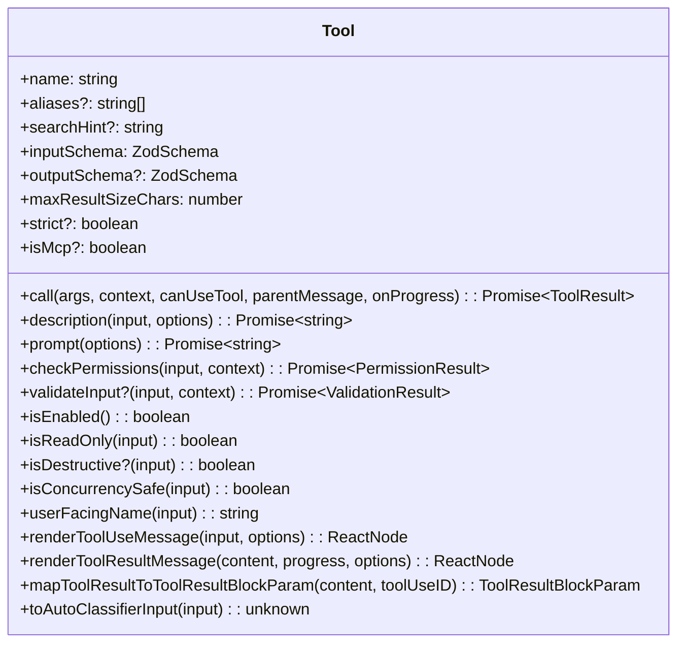
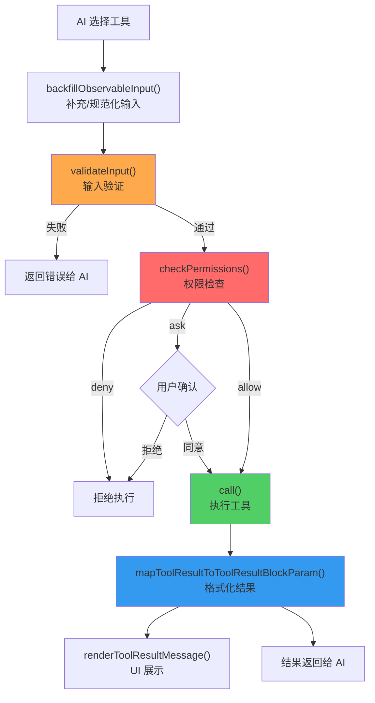
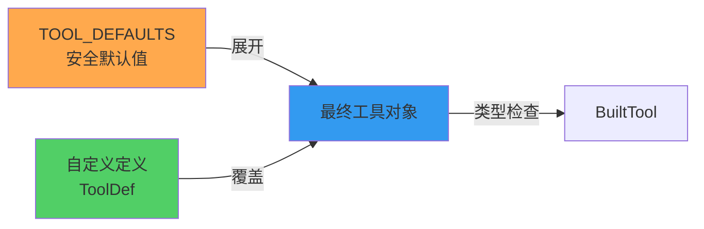

# 第 3 课：Tool 接口 DNA —— 统一接口设计详解

> 🎯 本课目标：逐一解析 Tool 接口的每个关键方法，理解工具的"遗传密码"

---

## 学习目标

1. 理解 `Tool` 类型的完整结构和设计意图
2. 掌握 `buildTool` 工厂函数的工作原理
3. 学会区分必需方法和可选方法
4. 理解 `inputSchema` / `outputSchema` 的 Zod 验证体系
5. 掌握工具生命周期：验证 → 权限 → 执行 → 结果映射

---

## 1. 生活类比：员工档案模板

每位员工（工具）入职时，都需要填写一份标准化的档案表（Tool 接口）：

| 档案字段 | 对应属性 | 说明 |
|----------|---------|------|
| 姓名 | `name` | 工具唯一标识 |
| 曾用名 | `aliases` | 历史名称兼容 |
| 技能描述 | `description` / `prompt` | 告诉 AI 何时使用 |
| 工作流程 | `call()` | 实际执行逻辑 |
| 需要审批吗 | `checkPermissions()` | 权限检查 |
| 只读岗位吗 | `isReadOnly()` | 是否修改系统 |
| 能并行工作吗 | `isConcurrencySafe()` | 并发安全性 |
| 入职体检 | `validateInput()` | 输入验证 |
| 工作报告格式 | `mapToolResultToToolResultBlockParam()` | 结果格式化 |

---

## 2. Tool 接口全景



---

## 3. 核心身份属性

### name —— 唯一标识

```typescript
// 每个工具都有一个唯一名称
readonly name: string
```

这是工具在系统中的身份证。AI 通过这个名称选择和调用工具。

### aliases —— 历史兼容

```typescript
// 源码: Tool.ts (第 371 行)
aliases?: string[]
```

当工具被重命名时，旧名称作为别名保留，确保向后兼容。

```typescript
// 源码: Tool.ts (第 348-353 行)
export function toolMatchesName(
  tool: { name: string; aliases?: string[] },
  name: string,
): boolean {
  return tool.name === name || (tool.aliases?.includes(name) ?? false)
}
```

### searchHint —— 搜索线索

```typescript
// 源码: Tool.ts (第 377 行)
searchHint?: string
```

当工具被"延迟加载"（deferred）时，AI 通过 ToolSearch 找到它。`searchHint` 提供额外的关键词线索：

```typescript
// GrepTool 的 searchHint
searchHint: 'search file contents with regex (ripgrep)'

// FileReadTool 的 searchHint
searchHint: 'read files, images, PDFs, notebooks'
```

---

## 4. 输入输出定义

### inputSchema —— 用 Zod 定义参数

每个工具用 Zod schema 严格定义输入参数：

```typescript
// GrepTool 的输入定义示例 (简化)
const inputSchema = z.strictObject({
  pattern: z.string().describe('正则表达式模式'),
  path: z.string().optional().describe('搜索路径'),
  glob: z.string().optional().describe('文件过滤模式'),
  '-i': z.boolean().optional().describe('忽略大小写'),
  head_limit: z.number().optional().describe('限制输出行数'),
})
```

**为什么用 `z.strictObject` 而不是 `z.object`？**

`strictObject` 会拒绝未定义的额外字段，防止 AI 传入无效参数。

### lazySchema —— 延迟初始化

```typescript
// 源码: GrepTool.ts (第 33 行)
const inputSchema = lazySchema(() =>
  z.strictObject({
    pattern: z.string().describe('...'),
    // ...
  })
)
```

`lazySchema` 确保 schema 只在首次访问时才创建，避免模块加载时的性能开销。

---

## 5. 工具生命周期

一个工具从被调用到返回结果，经历以下生命周期：



### validateInput —— 入口安检

在权限检查之前运行，做纯粹的输入合法性检查（通常不涉及 I/O）：

```typescript
// 源码: FileEditTool.ts (第 137 行) - 简化
async validateInput(input, toolUseContext) {
  const { file_path, old_string, new_string } = input

  // 检查 old_string 和 new_string 是否相同
  if (old_string === new_string) {
    return {
      result: false,
      message: 'No changes to make: old_string and new_string are exactly the same.',
      errorCode: 1,
    }
  }

  // 检查 deny 规则
  const denyRule = matchingRuleForInput(fullFilePath, ...)
  if (denyRule !== null) {
    return { result: false, message: '...', errorCode: 2 }
  }

  // 检查文件是否存在、是否被修改过...
  return { result: true }
}
```

### call —— 核心执行

```typescript
// 源码: Tool.ts (第 379-385 行)
call(
  args: z.infer<Input>,          // 经过验证的输入
  context: ToolUseContext,        // 执行上下文
  canUseTool: CanUseToolFn,       // 嵌套工具调用权限
  parentMessage: AssistantMessage, // 触发调用的消息
  onProgress?: ToolCallProgress,  // 进度回调
): Promise<ToolResult<Output>>
```

---

## 6. 权限与安全属性

### isReadOnly —— 是否只读

```typescript
// FileReadTool: 只读
isReadOnly() { return true }

// FileEditTool: 可写（默认 false）
// BashTool: 取决于命令内容
isReadOnly(input) {
  // 分析命令是否只包含读取操作
  return isReadOnlyCommand(input.command)
}
```

### isDestructive —— 是否有破坏性

```typescript
// 源码: Tool.ts (第 406 行)
isDestructive?(input: z.infer<Input>): boolean
```

只在工具执行不可逆操作时返回 `true`（如删除、覆盖、发送）。

### isConcurrencySafe —— 并发安全

```typescript
// GrepTool: 并发安全（只读搜索）
isConcurrencySafe() { return true }

// FileEditTool: 不安全（默认 false）
// 同时编辑同一文件可能产生冲突
```

---

## 7. buildTool —— 工具工厂

`buildTool` 是所有工具的"出生证明"：

```typescript
// 源码: Tool.ts (第 783-792 行)
export function buildTool<D extends AnyToolDef>(def: D): BuiltTool<D> {
  return {
    ...TOOL_DEFAULTS,           // 先铺上默认值
    userFacingName: () => def.name, // 默认用户面向名 = 工具名
    ...def,                     // 再用自定义属性覆盖
  } as BuiltTool<D>
}
```



**安全默认值一览**：

```typescript
// 源码: Tool.ts (第 757-769 行)
const TOOL_DEFAULTS = {
  isEnabled: () => true,           // 默认启用
  isConcurrencySafe: () => false,  // 默认不可并发 ⚠️
  isReadOnly: () => false,         // 默认可写 ⚠️
  isDestructive: () => false,      // 默认非破坏性
  checkPermissions: (input) =>     // 默认允许
    Promise.resolve({ behavior: 'allow', updatedInput: input }),
  toAutoClassifierInput: () => '', // 默认跳过分类器
  userFacingName: () => '',        // 默认空名称
}
```

> ⚠️ 注意 "fail-closed" 设计：`isConcurrencySafe` 默认 `false`（假设不安全），`isReadOnly` 默认 `false`（假设会修改）。这种保守策略确保忘记实现某个方法时不会引发安全问题。

---

## 8. UI 渲染方法

工具还负责自己在终端中的展示：

```typescript
// 展示工具调用信息
renderToolUseMessage(input, options): ReactNode

// 展示工具执行结果
renderToolResultMessage(content, progress, options): ReactNode

// 展示执行进度
renderToolUseProgressMessage?(progress, options): ReactNode

// 展示被拒绝时的信息
renderToolUseRejectedMessage?(input, options): ReactNode

// 展示执行错误
renderToolUseErrorMessage?(result, options): ReactNode
```

> 📌 Claude Code 的终端 UI 使用 React (Ink)，所以这些方法返回 `React.ReactNode`。

---

## 9. 高级特性

### interruptBehavior —— 中断策略

```typescript
// 源码: Tool.ts (第 416 行)
interruptBehavior?(): 'cancel' | 'block'
```

- `'cancel'`：用户发送新消息时，取消正在执行的工具
- `'block'`：继续执行，新消息排队等待

### maxResultSizeChars —— 结果大小限制

```typescript
// 源码: Tool.ts (第 466 行)
maxResultSizeChars: number
```

- GrepTool: `20_000`（20KB，超过后持久化到磁盘）
- FileReadTool: `Infinity`（永不持久化，避免循环读取）

### preparePermissionMatcher —— 权限匹配器

```typescript
// 源码: Tool.ts (第 514-516 行)
preparePermissionMatcher?(input): Promise<(pattern: string) => boolean>
```

预编译权限匹配逻辑，避免每条规则都重新解析输入。

---

## 10. ToolUseContext —— 执行上下文

每次工具调用都会收到一个丰富的上下文对象：

```typescript
// 源码: Tool.ts (第 158-300 行) - 简化
type ToolUseContext = {
  options: {
    tools: Tools            // 可用工具列表
    debug: boolean          // 调试模式
    mainLoopModel: string   // 当前模型
    mcpClients: MCPServerConnection[]  // MCP 连接
  }
  abortController: AbortController     // 取消控制
  readFileState: FileStateCache        // 文件状态缓存
  getAppState(): AppState              // 应用状态
  setAppState(f): void                 // 更新状态
  messages: Message[]                  // 对话历史
  // ... 更多上下文
}
```

> 📌 类比：`ToolUseContext` 就像员工（工具）的办公桌环境——不仅有任务本身，还有各种辅助设施（文件系统、网络、状态管理等）。

---

## 动手练习

### 练习 1：解剖一个工具

选择 `GlobTool`（`tools/GlobTool/GlobTool.ts`），列出它实现了哪些 Tool 接口方法，哪些用了默认值。

### 练习 2：设计 inputSchema

为一个假想的 `TranslateTool`（翻译工具）设计 Zod inputSchema：
- 必需参数：`text`（待翻译文本）、`target_language`（目标语言）
- 可选参数：`source_language`（源语言，默认自动检测）

### 练习 3：思考题

1. 为什么 `checkPermissions` 的默认实现是 `allow`，而不是 `ask`？
2. `getPath()` 方法的作用是什么？为什么只有操作文件的工具才需要它？
3. `backfillObservableInput()` 为什么要把相对路径展开为绝对路径？

---

## 本课小结

| 要点 | 说明 |
|------|------|
| 统一接口 | 所有工具遵循相同的 `Tool` 类型定义 |
| buildTool 工厂 | 提供安全默认值，简化工具创建 |
| Zod Schema | 严格的输入输出类型验证 |
| 生命周期 | validate → checkPermissions → call → mapResult |
| Fail-Closed | 默认值偏向安全（不可并发、可写） |
| UI 渲染 | 工具自己负责终端展示（React/Ink） |

---

## 下节预告

第 4 课我们将深入 Claude Code 中最复杂的工具——**BashTool**。它不仅能执行任意 Shell 命令，还有完善的安全沙箱、超时管理、命令分析和权限检查机制。可以说，BashTool 的复杂度相当于其他所有工具的总和。

> 📖 预习建议：浏览 `tools/BashTool/` 目录下的文件列表，了解 BashTool 由多少个模块组成。
