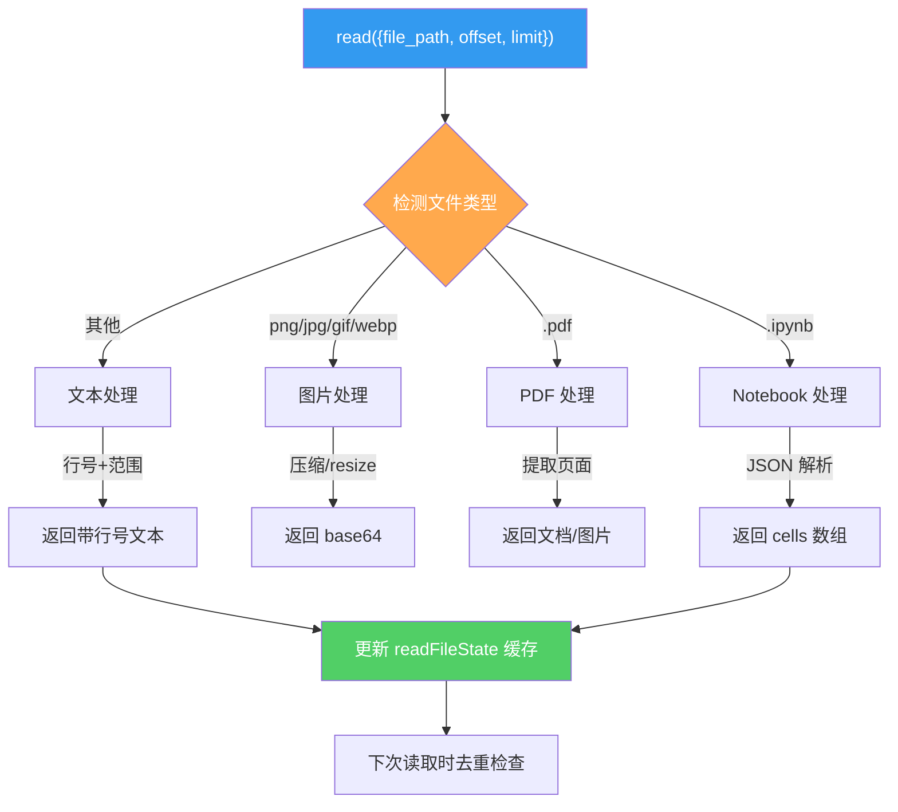
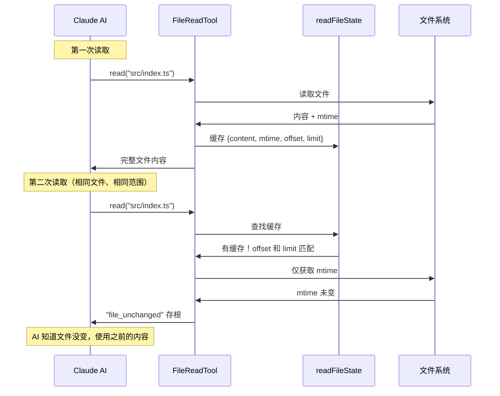
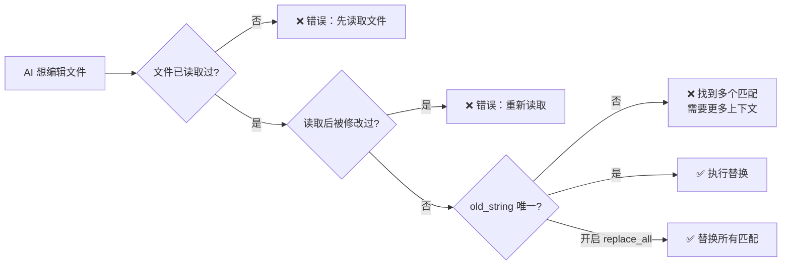
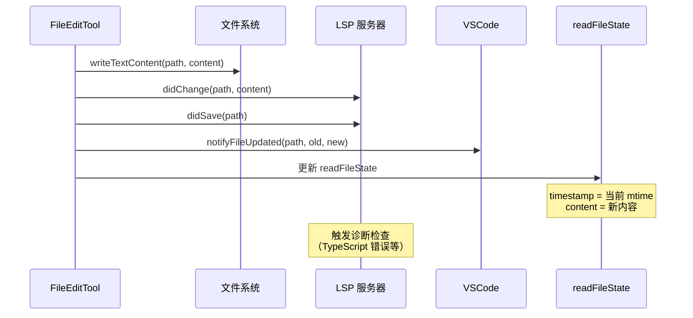

# 第 5 课：FileReadTool 与 FileEditTool —— 文件操作双雄

> 🎯 本课目标：理解 Claude Code 如何安全地读取和编辑文件

---

## 学习目标

1. 理解 FileReadTool 支持的多种文件格式（文本、图片、PDF、Notebook）
2. 掌握"先读后改"的编辑安全模型
3. 了解文件去重（dedup）机制的工作原理
4. 理解 FileEditTool 的精确替换策略
5. 掌握文件状态缓存（readFileState）的作用

---

## 1. 生活类比：图书馆的借阅与修改

- **FileReadTool** 就像图书馆的"借阅窗口"：你可以借各种类型的资料（书籍、地图、照片），但每次借阅都会记录时间戳
- **FileEditTool** 就像"校对窗口"：你必须先借阅原文，确认内容没有被别人改过，然后才能提交修改
- **FileWriteTool** 就像"新书入库"：直接创建或覆盖整个文件

---

## 2. FileReadTool 架构



### 输入参数

```typescript
// 源码: FileReadTool.ts (第 227-243 行)
z.strictObject({
  file_path: z.string().describe('文件的绝对路径'),
  offset: z.number().int().nonnegative().optional()
    .describe('起始行号（文件太大时使用）'),
  limit: z.number().int().positive().optional()
    .describe('读取行数（文件太大时使用）'),
  pages: z.string().optional()
    .describe('PDF 页码范围，如 "1-5"'),
})
```

### 文本文件读取

```typescript
// 源码: FileReadTool.ts (第 1019-1028 行) - 简化
// 使用 readFileInRange 按行读取
const { content, lineCount, totalLines, totalBytes, mtimeMs } =
  await readFileInRange(
    resolvedFilePath,
    lineOffset,       // 起始行
    limit,             // 行数限制
    maxSizeBytes,      // 最大字节数
    signal,            // 取消信号
  )

// Token 限制检查
await validateContentTokens(content, ext, maxTokens)
```

### 图片处理：Token 预算压缩

```typescript
// 源码: FileReadTool.ts (第 1097-1183 行) - 简化
export async function readImageWithTokenBudget(
  filePath: string,
  maxTokens: number,
): Promise<ImageResult> {
  // 1. 读取原始文件（一次读取，不重复读取）
  const imageBuffer = await fs.readFileBytes(filePath, maxBytes)

  // 2. 标准 resize
  const resized = await maybeResizeAndDownsampleImageBuffer(
    imageBuffer, originalSize, detectedFormat
  )

  // 3. 检查是否超出 token 预算
  const estimatedTokens = Math.ceil(result.file.base64.length * 0.125)
  if (estimatedTokens > maxTokens) {
    // 4. 激进压缩（从同一个 buffer，不重新读取文件）
    const compressed = await compressImageBufferWithTokenLimit(
      imageBuffer, maxTokens, detectedMediaType
    )
    return compressed
  }
}
```

> 📌 关键设计：文件只读取一次，所有后续处理都在同一个 buffer 上操作，避免多次 I/O。

---

## 3. 文件去重（Dedup）机制

当 AI 重复读取同一个文件时，如果文件没有变化，不需要再次发送完整内容：



**源码**：

```typescript
// 源码: FileReadTool.ts (第 536-573 行) - 简化
const existingState = readFileState.get(fullFilePath)
if (existingState && !existingState.isPartialView
    && existingState.offset !== undefined) {
  const rangeMatch =
    existingState.offset === offset && existingState.limit === limit
  if (rangeMatch) {
    const mtimeMs = await getFileModificationTimeAsync(fullFilePath)
    if (mtimeMs === existingState.timestamp) {
      // 文件没变！返回存根而非完整内容
      return {
        data: { type: 'file_unchanged', file: { filePath: file_path } },
      }
    }
  }
}
```

> 📌 这个去重机制节省了约 **18%** 的 cache_creation tokens！

---

## 4. 安全防护

### 被阻止的设备文件

```typescript
// 源码: FileReadTool.ts (第 98-115 行)
const BLOCKED_DEVICE_PATHS = new Set([
  '/dev/zero',     // 无限输出
  '/dev/random',   // 无限输出
  '/dev/urandom',  // 无限输出
  '/dev/stdin',    // 阻塞等待输入
  '/dev/tty',      // 阻塞等待输入
  '/dev/console',  // 阻塞等待输入
])
```

### 恶意代码防护

```typescript
// 源码: FileReadTool.ts (第 729-730 行)
export const CYBER_RISK_MITIGATION_REMINDER =
  '\n\n<system-reminder>\n' +
  'Whenever you read a file, you should consider whether it would be ' +
  'considered malware. You CAN and SHOULD provide analysis of malware... ' +
  'But you MUST refuse to improve or augment the code.\n</system-reminder>\n'
```

每次读取文件后，都会附加这个安全提醒，防止 AI 被诱导优化恶意代码。

---

## 5. FileEditTool 的精确替换

### 核心设计："搜索并替换"

```typescript
// 源码: FileEditTool 的输入定义（简化）
z.strictObject({
  file_path: z.string(),
  old_string: z.string(),   // 要被替换的内容
  new_string: z.string(),   // 替换后的内容
  replace_all: z.boolean().optional(),  // 是否替换所有匹配
})
```

**为什么不用"整文件覆盖"？**

精确替换（diff-based）比整文件覆盖有多个优势：
1. 减少 token 消耗（只传差异部分）
2. 避免意外覆盖其他内容
3. 可以检测并发修改冲突

### "先读后改"强制约束

```typescript
// 源码: FileEditTool.ts (第 276-287 行)
const readTimestamp = toolUseContext.readFileState.get(fullFilePath)
if (!readTimestamp || readTimestamp.isPartialView) {
  return {
    result: false,
    message: 'File has not been read yet. Read it first before writing to it.',
    errorCode: 6,
  }
}
```

**流程约束**：



### 并发修改检测

```typescript
// 源码: FileEditTool.ts (第 290-311 行) - 简化
if (readTimestamp) {
  const lastWriteTime = getFileModificationTime(fullFilePath)
  if (lastWriteTime > readTimestamp.timestamp) {
    // 文件在读取后被修改过！
    // 可能是用户手动修改或 linter 自动修改
    return {
      result: false,
      message: 'File has been modified since read. Read it again.',
      errorCode: 7,
    }
  }
}
```

### 引号智能匹配

```typescript
// 源码: FileEditTool.ts (第 316-327 行)
// 处理直引号 vs 弯引号的差异
const actualOldString = findActualString(file, old_string)
if (!actualOldString) {
  return {
    result: false,
    message: `String to replace not found in file.`,
    errorCode: 8,
  }
}

// 如果文件用弯引号，AI 传了直引号，自动适配
const actualNewString = preserveQuoteStyle(
  old_string, actualOldString, new_string
)
```

---

## 6. 写入文件后的通知链



```typescript
// 源码: FileEditTool.ts (第 491-517 行) - 简化
// 写入文件
writeTextContent(absoluteFilePath, updatedFile, encoding, endings)

// 通知 LSP 服务器
const lspManager = getLspServerManager()
if (lspManager) {
  lspManager.changeFile(absoluteFilePath, updatedFile)
  lspManager.saveFile(absoluteFilePath)
}

// 通知 VSCode
notifyVscodeFileUpdated(absoluteFilePath, originalFileContents, updatedFile)

// 更新文件状态缓存
readFileState.set(absoluteFilePath, {
  content: updatedFile,
  timestamp: getFileModificationTime(absoluteFilePath),
})
```

---

## 7. FileWriteTool vs FileEditTool

| 特性 | FileEditTool | FileWriteTool |
|------|-------------|--------------|
| 操作方式 | 搜索替换 | 整文件覆盖 |
| 需要先读取 | ✅ 必须 | ❌ 不必 |
| 并发冲突检测 | ✅ 有 | ❌ 无 |
| Token 效率 | 高（只传差异） | 低（传全文） |
| 适用场景 | 修改现有文件 | 创建新文件 |
| 安全性 | 更高 | 较低 |

---

## 8. maxResultSizeChars 策略对比

```typescript
// FileReadTool: 永不持久化
maxResultSizeChars: Infinity

// FileEditTool: 100KB 限制
maxResultSizeChars: 100_000
```

为什么 FileReadTool 设置为 `Infinity`？因为将读取结果持久化到文件再让 AI 读取会形成**循环读取**（Read → 存文件 → 再 Read 该文件），所以永远不持久化。

---

## 动手练习

### 练习 1：文件读取实验

在 Claude Code 中尝试以下操作，观察行为差异：
1. 读取一个小文本文件
2. 连续读取同一个文件两次（观察 dedup）
3. 读取一个图片文件
4. 读取一个不存在的文件

### 练习 2：编辑安全实验

1. 不先读取文件就尝试编辑，观察错误信息
2. 读取文件后，手动在编辑器中修改该文件，再让 AI 编辑，观察错误信息
3. 提供一个在文件中出现多次的 old_string（不设 replace_all），观察错误信息

### 练习 3：思考题

1. 为什么 FileEditTool 要求 `old_string` 在文件中唯一匹配？如果允许模糊匹配会有什么风险？
2. `CYBER_RISK_MITIGATION_REMINDER` 真的能阻止 AI 增强恶意代码吗？这属于什么层级的防护？
3. 文件去重机制为什么只对 `offset !== undefined` 的条目生效？

---

## 本课小结

| 要点 | 说明 |
|------|------|
| 多格式支持 | 文本 / 图片 / PDF / Notebook 统一处理 |
| 先读后改 | 必须先读取才能编辑，防止盲改 |
| 并发检测 | 通过 mtime 对比检测外部修改 |
| 文件去重 | 重复读取未改文件返回存根 |
| 引号适配 | 自动匹配直引号 / 弯引号差异 |
| 通知链 | 编辑后通知 LSP / VSCode / 缓存 |

---

## 下节预告

第 6 课我们将学习 **GrepTool** 和 **GlobTool** 这对搜索利器。它们是 AI 理解代码库的"眼睛"——GrepTool 按内容搜索（找到包含某个函数的文件），GlobTool 按名称搜索（找到所有 `.ts` 文件）。

> 📖 预习建议：阅读 `tools/GrepTool/GrepTool.ts` 的 `call()` 方法，理解 ripgrep 的参数拼接逻辑。
