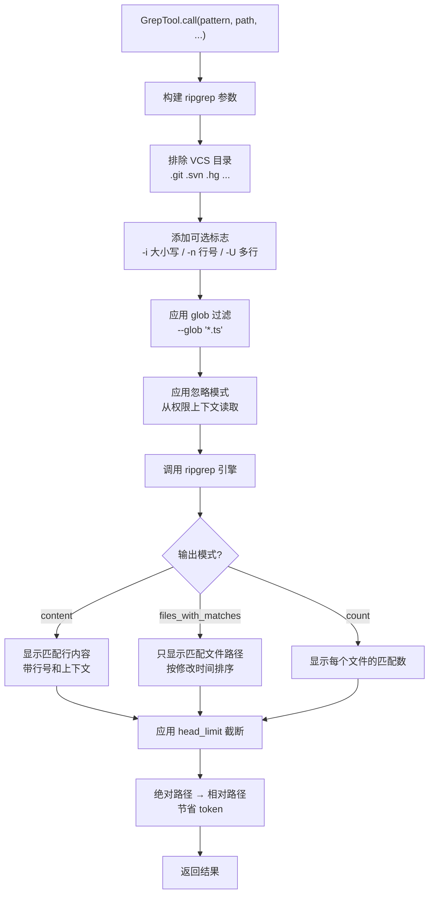
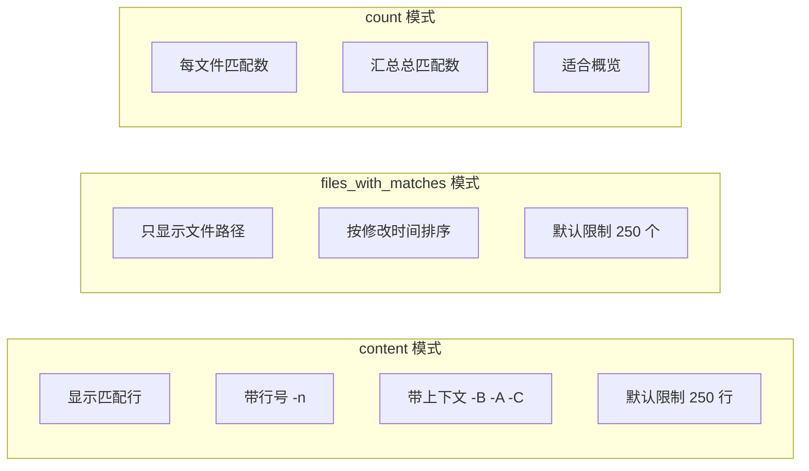
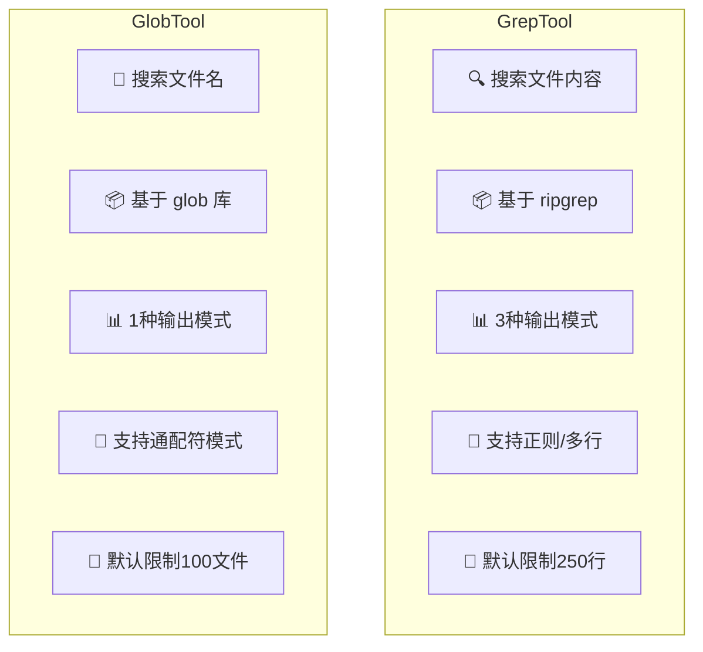
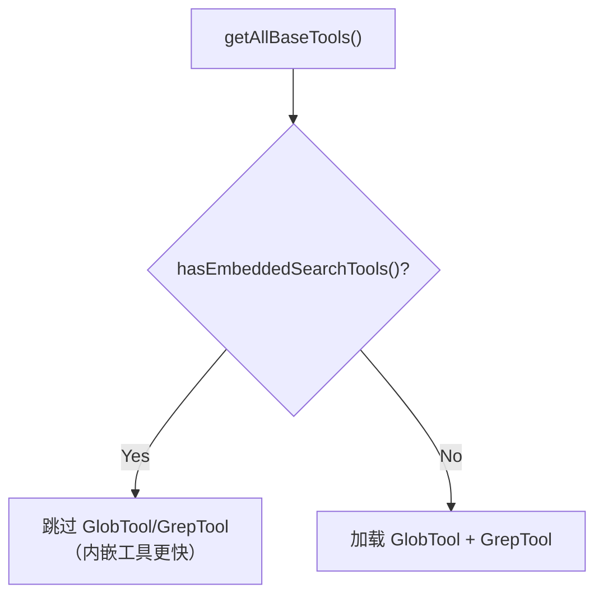

# 第 6 课：GrepTool 与 GlobTool —— 代码搜索利器

> 🎯 本课目标：深入理解 Claude Code 的两大搜索工具如何在海量代码中精准定位

---

## 学习目标

1. 理解 GrepTool 基于 ripgrep 的内容搜索原理与三种输出模式
2. 掌握 GlobTool 基于文件名模式匹配的搜索策略
3. 了解搜索工具的安全边界：VCS 目录排除、权限检查、忽略模式
4. 理解 head_limit 分页机制如何防止上下文爆炸
5. 学会在实际场景中选择合适的搜索工具

---

## 1. 生活类比：图书馆的两种找书方式

想象你走进一个巨大的图书馆（代码仓库）：

- **GlobTool** 就像按**书名目录**查找：「我要找所有以 `.test.ts` 结尾的书」——你只关心书名（文件名），不关心内容
- **GrepTool** 就像用**全文检索系统**：「我要找所有提到 `buildTool` 这个词的书」——你深入每一页（文件内容）搜索

两者各有所长，经常配合使用：先用 GlobTool 缩小范围，再用 GrepTool 精确定位。

---

## 2. GrepTool 架构全景



---

## 3. GrepTool 源码深度解析

### 3.1 输入参数设计

GrepTool 的输入参数非常丰富，这是 Claude Code 搜索能力的核心：

```typescript
// 源码: tools/GrepTool/GrepTool.ts (第 33-90 行)
const inputSchema = lazySchema(() =>
  z.strictObject({
    pattern: z.string().describe('The regular expression pattern to search for'),
    path: z.string().optional().describe('File or directory to search in'),
    glob: z.string().optional().describe('Glob pattern to filter files'),
    output_mode: z.enum(['content', 'files_with_matches', 'count']).optional(),
    '-B': semanticNumber(z.number().optional()).describe('Lines before match'),
    '-A': semanticNumber(z.number().optional()).describe('Lines after match'),
    '-C': semanticNumber(z.number().optional()).describe('Context lines'),
    '-i': semanticBoolean(z.boolean().optional()).describe('Case insensitive'),
    type: z.string().optional().describe('File type filter (js, py, rust...)'),
    head_limit: semanticNumber(z.number().optional()).describe('Limit output'),
    offset: semanticNumber(z.number().optional()).describe('Skip first N'),
    multiline: semanticBoolean(z.boolean().optional()).describe('Multiline mode'),
  }),
)
```

> 💡 **设计亮点**：参数名直接沿用 ripgrep 的 `-A`、`-B`、`-C` 命名，降低学习成本。`semanticNumber` 和 `semanticBoolean` 是特殊的类型包装器，允许模型传入字符串 `"true"` 或 `"5"` 而不会报错。

### 3.2 VCS 目录排除

搜索时自动排除版本控制系统目录，避免在 `.git` 等大量内部文件中产生噪声：

```typescript
// 源码: tools/GrepTool/GrepTool.ts (第 94-102 行)
const VCS_DIRECTORIES_TO_EXCLUDE = [
  '.git',
  '.svn',
  '.hg',
  '.bzr',
  '.jj',
  '.sl',
] as const
```

### 3.3 三种输出模式详解



#### files_with_matches 模式的排序策略

这是默认模式，但它有一个精巧的设计——按文件修改时间排序：

```typescript
// 源码: tools/GrepTool/GrepTool.ts (第 529-553 行)
const stats = await Promise.allSettled(
  results.map(_ => getFsImplementation().stat(_)),
)
const sortedMatches = results
  .map((_, i) => {
    const r = stats[i]!
    return [
      _,
      r.status === 'fulfilled' ? (r.value.mtimeMs ?? 0) : 0,
    ] as const
  })
  .sort((a, b) => {
    // 测试环境按文件名排序保证确定性
    if (process.env.NODE_ENV === 'test') {
      return a[0].localeCompare(b[0])
    }
    // 生产环境按修改时间倒序（最近修改的排前面）
    const timeComparison = b[1] - a[1]
    if (timeComparison === 0) {
      return a[0].localeCompare(b[0])  // 同时间按文件名排
    }
    return timeComparison
  })
```

> 📌 **为什么按修改时间排序？** 因为最近修改的文件往往是开发者当前正在关注的文件，把它们排在前面能帮助 AI 更快理解当前上下文。

### 3.4 head_limit 分页机制

为了防止搜索结果过大撑爆上下文窗口，GrepTool 引入了 head_limit 机制：

```typescript
// 源码: tools/GrepTool/GrepTool.ts (第 106-128 行)
const DEFAULT_HEAD_LIMIT = 250

function applyHeadLimit<T>(
  items: T[],
  limit: number | undefined,
  offset: number = 0,
): { items: T[]; appliedLimit: number | undefined } {
  // 显式传 0 = 不限制（逃生口）
  if (limit === 0) {
    return { items: items.slice(offset), appliedLimit: undefined }
  }
  const effectiveLimit = limit ?? DEFAULT_HEAD_LIMIT
  const sliced = items.slice(offset, offset + effectiveLimit)
  // 只有在真正截断时才报告 appliedLimit
  const wasTruncated = items.length - offset > effectiveLimit
  return {
    items: sliced,
    appliedLimit: wasTruncated ? effectiveLimit : undefined,
  }
}
```

> 🎯 **关键设计**：`head_limit=0` 是一个特殊的"逃生口"，允许获取所有结果。但默认值 250 能有效防止模型被海量数据淹没。

---

## 4. GlobTool 源码深度解析

### 4.1 简洁的输入设计

相比 GrepTool，GlobTool 的接口非常简洁——只需要模式和路径：

```typescript
// 源码: tools/GlobTool/GlobTool.ts (第 26-36 行)
const inputSchema = lazySchema(() =>
  z.strictObject({
    pattern: z.string().describe('The glob pattern to match files against'),
    path: z.string().optional().describe(
      'The directory to search in. If not specified, the current working directory will be used.',
    ),
  }),
)
```

### 4.2 结果限制与截断

GlobTool 默认限制返回 100 个文件，超出时标记截断：

```typescript
// 源码: tools/GlobTool/GlobTool.ts (第 154-176 行)
async call(input, { abortController, getAppState, globLimits }) {
  const start = Date.now()
  const appState = getAppState()
  const limit = globLimits?.maxResults ?? 100
  const { files, truncated } = await glob(
    input.pattern,
    GlobTool.getPath(input),
    { limit, offset: 0 },
    abortController.signal,
    appState.toolPermissionContext,
  )
  // 相对路径节省 token
  const filenames = files.map(toRelativePath)
  const output: Output = {
    filenames,
    durationMs: Date.now() - start,
    numFiles: filenames.length,
    truncated,
  }
  return { data: output }
},
```

### 4.3 截断提示

当结果被截断时，GlobTool 会友好地提醒用户缩小范围：

```typescript
// 源码: tools/GlobTool/GlobTool.ts (第 177-197 行)
mapToolResultToToolResultBlockParam(output, toolUseID) {
  if (output.filenames.length === 0) {
    return { tool_use_id: toolUseID, type: 'tool_result', content: 'No files found' }
  }
  return {
    tool_use_id: toolUseID,
    type: 'tool_result',
    content: [
      ...output.filenames,
      ...(output.truncated
        ? ['(Results are truncated. Consider using a more specific path or pattern.)']
        : []),
    ].join('\n'),
  }
},
```

---

## 5. 两者的共同基因

### 5.1 共享的安全属性

```typescript
// 两个工具都声明为并发安全 + 只读
isConcurrencySafe() { return true },   // 可以并行执行
isReadOnly() { return true },           // 不会修改文件
```

### 5.2 共享的权限检查

```typescript
// 源码: tools/GrepTool/GrepTool.ts (第 233-240 行)
async checkPermissions(input, context): Promise<PermissionDecision> {
  const appState = context.getAppState()
  return checkReadPermissionForTool(
    GrepTool,      // 或 GlobTool
    input,
    appState.toolPermissionContext,
  )
},
```

两者都委托给 `checkReadPermissionForTool`，这保证了文件读取权限的一致性。

### 5.3 路径安全检查

两个工具都对 UNC 路径做了安全检查，防止 NTLM 凭据泄露：

```typescript
// 源码: tools/GrepTool/GrepTool.ts (第 207-209 行)
// SECURITY: Skip filesystem operations for UNC paths to prevent NTLM credential leaks.
if (absolutePath.startsWith('\\\\') || absolutePath.startsWith('//')) {
  return { result: true }
}
```

---

## 6. 搜索工具对比表



| 维度 | GrepTool | GlobTool |
|------|----------|----------|
| 搜索对象 | 文件**内容** | 文件**名称** |
| 底层引擎 | ripgrep（高性能） | glob 库 |
| 匹配语法 | 正则表达式 | 通配符 `*` `**` `?` |
| 输出模式 | content / files / count | 仅文件列表 |
| 结果排序 | 按文件修改时间 | 按文件修改时间 |
| 默认限制 | 250 行/文件 | 100 文件 |
| 典型场景 | 找某个函数被调用的地方 | 找某类型的所有文件 |

---

## 7. 条件加载机制

在工具注册中心 `tools.ts` 中，GrepTool 和 GlobTool 有一个特殊的条件加载：

```typescript
// 源码: tools.ts (第 198-201 行)
export function getAllBaseTools(): Tools {
  return [
    // ...
    ...(hasEmbeddedSearchTools() ? [] : [GlobTool, GrepTool]),
    // ...
  ]
}
```

当 Anthropic 内部版本（Ant build）自带了嵌入式搜索工具（bfs/ugrep）时，GlobTool 和 GrepTool 就不会加载——因为 Shell 中的 `find`/`grep` 已经被别名到更快的内嵌工具了。



---

## 8. GrepTool 的 Prompt 设计

GrepTool 的 prompt 是一段精心编写的使用说明，直接告诉模型应该用什么、不该用什么：

```typescript
// 源码: tools/GrepTool/prompt.ts (第 6-18 行)
export function getDescription(): string {
  return `A powerful search tool built on ripgrep

  Usage:
  - ALWAYS use ${GREP_TOOL_NAME} for search tasks.
    NEVER invoke \`grep\` or \`rg\` as a ${BASH_TOOL_NAME} command.
  - Supports full regex syntax (e.g., "log.*Error", "function\\s+\\w+")
  - Filter files with glob parameter or type parameter
  - Output modes: "content" shows matching lines,
    "files_with_matches" shows only file paths (default),
    "count" shows match counts
  - Use ${AGENT_TOOL_NAME} tool for open-ended searches
    requiring multiple rounds
  `
}
```

> 🔑 **为什么要在 prompt 中强调"不要用 Bash 的 grep"？** 因为 GrepTool 内部已做好权限检查和路径安全验证。如果模型直接用 `BashTool` 调用 `grep`，会绕过这些安全机制。

---

## 动手练习

### 练习 1：模拟 GrepTool 的调用

假设你要在一个 TypeScript 项目中找到所有使用 `buildTool` 函数的地方，写出你会传给 GrepTool 的参数：

```
pattern: ?
path: ?
output_mode: ?
type: ?
```

### 练习 2：GlobTool vs GrepTool 选择

对于以下需求，你会选择哪个工具？为什么？

1. 找到所有 `.test.ts` 文件
2. 找到所有包含 `import.*React` 的文件
3. 找到 `src/components` 下的所有 `.tsx` 文件
4. 找到所有定义了 `export default` 的文件
5. 找到项目中最近修改的 10 个 TypeScript 文件

### 练习 3：思考题

1. 为什么 GrepTool 默认的 `head_limit` 是 250 而不是更大？（提示：考虑上下文窗口大小和 token 成本）
2. `files_with_matches` 模式为什么要按修改时间排序而不是文件名排序？
3. 为什么要在搜索前排除 `.git` 目录，而不是在搜索后过滤？

### 练习 4：追踪代码

在源码中找到 `ripGrep` 函数的实现（`utils/ripgrep.ts`），观察它如何处理超时和错误。

---

## 本课小结

| 要点 | 说明 |
|------|------|
| GrepTool = 内容搜索 | 基于 ripgrep，支持正则、多行、三种输出模式 |
| GlobTool = 文件名搜索 | 基于 glob，按修改时间排序，限制 100 结果 |
| head_limit 分页 | 默认 250，防止上下文爆炸，`0` 为不限制 |
| 安全设计 | VCS 排除、UNC 路径防护、权限检查统一 |
| 条件加载 | 内嵌搜索工具可用时自动跳过 |
| Prompt 引导 | 明确告诉模型用 GrepTool 而非 Bash grep |

---

## 下节预告

在第 7 课中，我们将深入权限系统——Claude Code 最核心的安全机制。你将看到一个工具调用请求是如何通过 deny → ask → allow 的多级检查管道，以及 Auto 模式下的分类器如何自动做出安全决策。

> 📖 预习建议：先阅读 `utils/permissions/permissions.ts` 中的 `hasPermissionsToUseTool` 函数，理解它的整体流程。
