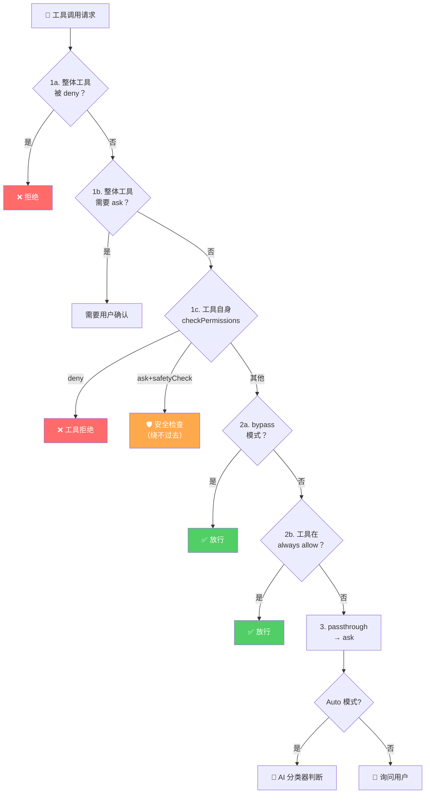
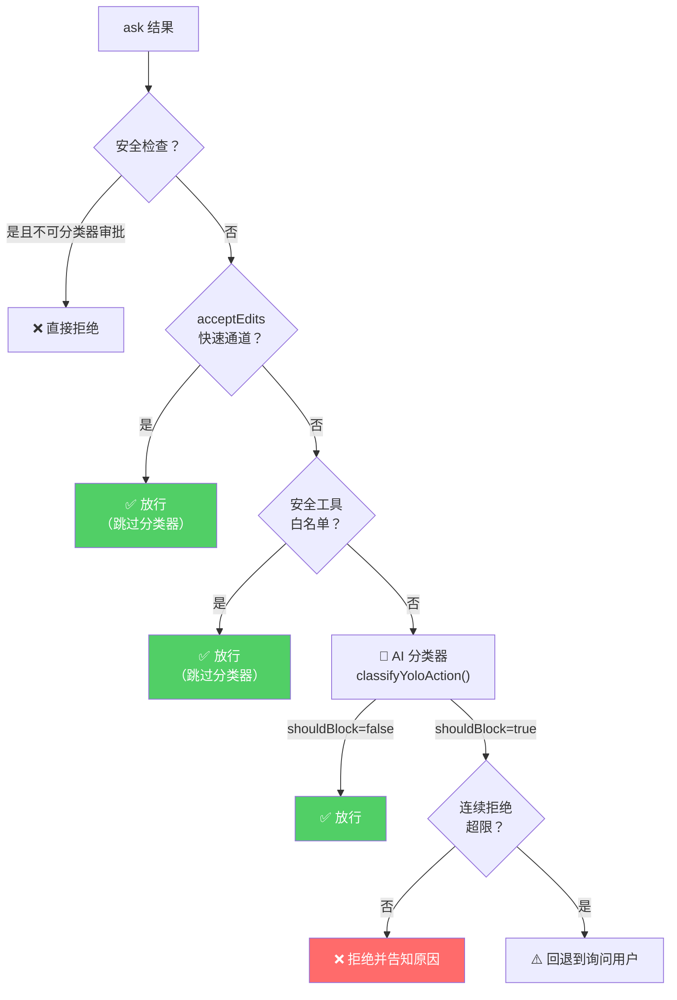
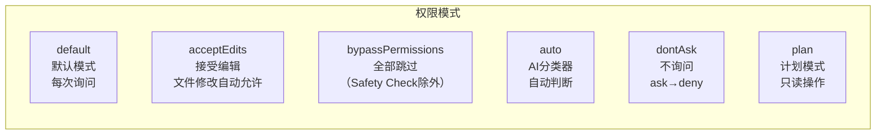

# 第 7 课：权限守门人 —— checkPermissions 全流程

> 🎯 本课目标：深入理解 Claude Code 如何在灵活性与安全性之间取得平衡

---

## 学习目标

1. 掌握权限系统的三层决策：deny → ask → allow
2. 理解 `hasPermissionsToUseTool` 的完整 7 步检查流程
3. 了解权限规则的来源与优先级（policySettings → userSettings → session）
4. 认识 Auto 模式下分类器的工作原理
5. 理解 Safety Check 机制如何保护敏感路径

---

## 1. 生活类比：机场安检系统

想象一个多层安检的机场：

- **第一关（Deny Rules）**：**黑名单检查** —— 禁飞名单上的人直接拒绝，不用往后走
- **第二关（Ask Rules）**：**证件核查** —— 需要出示证件，安检员决定放不放行
- **第三关（Tool checkPermissions）**：**行李扫描** —— 每种工具自己检查输入是否合规
- **第四关（Safety Check）**：**危险品检测** —— 不管你有多高权限，炸弹就是不能带
- **第五关（Bypass/Auto）**：**VIP通道** —— 有特殊通行证的旅客走快速通道
- **第六关（Always Allow）**：**白名单** —— 已登记的常客直接放行
- **最后决策**：**passthrough → ask** —— 没匹配到任何规则？默认询问用户



---

## 2. 权限规则的三种行为

```typescript
// 权限检查的三种可能结果
type PermissionBehavior = 'allow' | 'deny' | 'ask'
```

| 行为 | 含义 | 类比 |
|------|------|------|
| `allow` | 直接放行，不需确认 | 绿灯通行 |
| `deny` | 直接拒绝，不可上诉 | 红灯禁止 |
| `ask` | 暂停，等待用户决定 | 黄灯等待 |

还有一个特殊行为 `passthrough`：工具自己不做决定，交给上层处理（最终会变成 `ask`）。

---

## 3. 权限规则来源与优先级

### 3.1 规则来源层次

```typescript
// 源码: utils/permissions/permissions.ts (第 109-114 行)
const PERMISSION_RULE_SOURCES = [
  ...SETTING_SOURCES,   // policySettings, flagSettings, userSettings, projectSettings, localSettings
  'cliArg',             // 命令行参数
  'command',            // 运行时命令
  'session',            // 会话级别
] as const
```

```mermaid
graph TB
    subgraph 规则来源（优先级从高到低）
        Policy["🏢 policySettings<br/>企业管理员策略<br/>不可修改"]
        Flag["🚩 flagSettings<br/>Feature Flag 控制"]
        User["👤 userSettings<br/>用户全局设置<br/>~/.claude/settings.json"]
        Project["📁 projectSettings<br/>项目级设置<br/>.claude/settings.json"]
        Local["💻 localSettings<br/>本地设置<br/>.claude/settings.local.json"]
        CLI["⌨️ cliArg<br/>命令行 --allowedTools"]
        Session["🔄 session<br/>会话中用户授权"]
    end

    Policy --> Flag --> User --> Project --> Local --> CLI --> Session
```

### 3.2 规则的收集方式

```typescript
// 源码: utils/permissions/permissions.ts (第 122-132 行)
export function getAllowRules(context: ToolPermissionContext): PermissionRule[] {
  return PERMISSION_RULE_SOURCES.flatMap(source =>
    (context.alwaysAllowRules[source] || []).map(ruleString => ({
      source,
      ruleBehavior: 'allow',
      ruleValue: permissionRuleValueFromString(ruleString),
    })),
  )
}
```

同样的模式用于 `getDenyRules()` 和 `getAskRules()`。所有来源的规则被**扁平合并**后一起检查。

---

## 4. hasPermissionsToUseTool 七步流程

这是权限系统的核心函数，让我们逐步拆解：

### 步骤 1a：整体工具 Deny 检查

```typescript
// 源码: utils/permissions/permissions.ts (第 1169-1181 行)
// 1a. Entire tool is denied
const denyRule = getDenyRuleForTool(appState.toolPermissionContext, tool)
if (denyRule) {
  return {
    behavior: 'deny',
    decisionReason: { type: 'rule', rule: denyRule },
    message: `Permission to use ${tool.name} has been denied.`,
  }
}
```

> 💡 就像黑名单：如果工具整体被禁（如 `deny: ["Bash"]`），直接拒绝。

### 步骤 1b：整体工具 Ask 检查

```typescript
// 源码: utils/permissions/permissions.ts (第 1183-1206 行)
// 1b. Check if the entire tool should always ask
const askRule = getAskRuleForTool(appState.toolPermissionContext, tool)
if (askRule) {
  // 沙盒特殊处理：如果 Bash 可以在沙盒中运行，则跳过 ask
  const canSandboxAutoAllow =
    tool.name === BASH_TOOL_NAME &&
    SandboxManager.isSandboxingEnabled() &&
    SandboxManager.isAutoAllowBashIfSandboxedEnabled() &&
    shouldUseSandbox(input)

  if (!canSandboxAutoAllow) {
    return { behavior: 'ask', /* ... */ }
  }
}
```

### 步骤 1c-1g：工具自身权限检查

```typescript
// 源码: utils/permissions/permissions.ts (第 1208-1260 行)
// 1c. 工具自身的 checkPermissions
let toolPermissionResult = await tool.checkPermissions(parsedInput, context)

// 1d. 工具明确拒绝
if (toolPermissionResult?.behavior === 'deny') return toolPermissionResult

// 1e. 工具需要用户交互（如 AskUserQuestionTool）
if (tool.requiresUserInteraction?.()) return toolPermissionResult

// 1f. 内容级别的 ask 规则（如 Bash(npm publish:*)）
if (toolPermissionResult?.decisionReason?.type === 'rule' &&
    toolPermissionResult.decisionReason.rule.ruleBehavior === 'ask') {
  return toolPermissionResult
}

// 1g. 安全检查（如 .git/ .claude/ .vscode/ 路径保护）
if (toolPermissionResult?.decisionReason?.type === 'safetyCheck') {
  return toolPermissionResult  // 即使 bypass 模式也绕不过去！
}
```

> 🛡️ **Safety Check 是"免死金牌"的克星**：即使你开了 bypassPermissions 模式，修改 `.git/` 目录下的文件仍然会触发确认。这保证了核心系统文件的安全。

### 步骤 2a：Bypass 模式检查

```typescript
// 源码: utils/permissions/permissions.ts (第 1262-1281 行)
// 2a. Check if mode allows the tool to run
const shouldBypassPermissions =
  appState.toolPermissionContext.mode === 'bypassPermissions' ||
  (appState.toolPermissionContext.mode === 'plan' &&
   appState.toolPermissionContext.isBypassPermissionsModeAvailable)

if (shouldBypassPermissions) {
  return { behavior: 'allow', /* ... */ }
}
```

### 步骤 2b：Always Allow 规则匹配

```typescript
// 源码: utils/permissions/permissions.ts (第 1283-1297 行)
// 2b. Entire tool is allowed
const alwaysAllowedRule = toolAlwaysAllowedRule(
  appState.toolPermissionContext, tool
)
if (alwaysAllowedRule) {
  return { behavior: 'allow', /* ... */ }
}
```

### 步骤 3：最终 Passthrough → Ask 转换

```typescript
// 源码: utils/permissions/permissions.ts (第 1299-1310 行)
// 3. Convert "passthrough" to "ask"
const result: PermissionDecision =
  toolPermissionResult.behavior === 'passthrough'
    ? { ...toolPermissionResult, behavior: 'ask' as const, /* ... */ }
    : toolPermissionResult
```

---

## 5. Auto 模式：AI 分类器

### 5.1 Auto 模式的三级快速通道

在 Auto 模式下，系统不直接询问用户，而是由 AI 分类器自动判断安全性：



### 5.2 拒绝追踪与兜底

```typescript
// Auto 模式有连续拒绝计数器，防止 AI 陷入死循环
const denialState = context.localDenialTracking ??
  appState.denialTracking ??
  createDenialTrackingState()

// 分类器拒绝后更新计数
const newDenialState = recordDenial(denialState)

// 超过阈值就回退到人工审批
if (shouldFallbackToPrompting(denialState)) {
  // 交给用户决定
}
```

> 🎯 这是一个精妙的**安全阀设计**：Auto 模式不是"全自动"，而是"尽量自动但保留人工兜底"。

---

## 6. 权限规则匹配：工具级 vs 内容级

### 6.1 工具级匹配

```typescript
// 源码: utils/permissions/permissions.ts (第 238-269 行)
function toolMatchesRule(tool, rule): boolean {
  // 规则不能有 ruleContent 才匹配整个工具
  if (rule.ruleValue.ruleContent !== undefined) return false

  // 直接名称匹配
  if (rule.ruleValue.toolName === nameForRuleMatch) return true

  // MCP 服务器级别匹配：mcp__server1 匹配 mcp__server1__tool1
  return (
    ruleInfo !== null && toolInfo !== null &&
    (ruleInfo.toolName === undefined || ruleInfo.toolName === '*') &&
    ruleInfo.serverName === toolInfo.serverName
  )
}
```

### 6.2 内容级匹配

内容级规则可以精确到工具的具体使用方式，比如：
- `Bash(git push:*)` —— 只对 `git push` 命令生效
- `WebFetch(domain:github.com)` —— 只对 GitHub 域名生效

```typescript
// 源码: utils/permissions/permissions.ts (第 349-390 行)
export function getRuleByContentsForTool(
  context: ToolPermissionContext,
  tool: Tool,
  behavior: PermissionBehavior,
): Map<string, PermissionRule> {
  const ruleByContents = new Map<string, PermissionRule>()
  for (const rule of rules) {
    if (
      rule.ruleValue.toolName === toolName &&
      rule.ruleValue.ruleContent !== undefined &&
      rule.ruleBehavior === behavior
    ) {
      ruleByContents.set(rule.ruleValue.ruleContent, rule)
    }
  }
  return ruleByContents
}
```

---

## 7. 权限模式全览



| 模式 | ask 变为 | 适用场景 |
|------|---------|---------|
| `default` | 保持 ask（询问用户） | 日常交互使用 |
| `acceptEdits` | 文件编辑自动 allow | 信任文件修改 |
| `bypassPermissions` | 全部 allow | 完全信任（开发调试） |
| `auto` | AI 分类器判断 | 自动化流程 |
| `dontAsk` | 全部 deny | 严格模式 |
| `plan` | 保持 ask | 只做规划 |

---

## 8. ToolPermissionContext 数据结构

```typescript
// 源码: Tool.ts (第 123-138 行)
export type ToolPermissionContext = DeepImmutable<{
  mode: PermissionMode
  additionalWorkingDirectories: Map<string, AdditionalWorkingDirectory>
  alwaysAllowRules: ToolPermissionRulesBySource
  alwaysDenyRules: ToolPermissionRulesBySource
  alwaysAskRules: ToolPermissionRulesBySource
  isBypassPermissionsModeAvailable: boolean
  isAutoModeAvailable?: boolean
  shouldAvoidPermissionPrompts?: boolean      // 无头 agent 设为 true
  awaitAutomatedChecksBeforeDialog?: boolean   // 后台 agent
  prePlanMode?: PermissionMode                 // Plan 模式前的原始模式
}>
```

> 📌 注意 `DeepImmutable`——权限上下文是**不可变**的，任何修改都必须通过 `applyPermissionUpdate` 产生新对象。这防止了状态被意外篡改。

---

## 动手练习

### 练习 1：权限流程追踪

假设你配置了以下规则：
```json
{
  "allow": ["Read", "Grep"],
  "deny": ["Bash(rm -rf:*)"],
  "ask": ["Bash"]
}
```

请分析以下调用的权限结果：
1. `Read({ file_path: "src/index.ts" })` → ?
2. `Grep({ pattern: "TODO" })` → ?
3. `Bash({ command: "ls -la" })` → ?
4. `Bash({ command: "rm -rf /tmp" })` → ?
5. `FileEdit({ file_path: ".git/config", ... })` → ?

### 练习 2：思考题

1. 为什么 Safety Check（步骤 1g）要放在 Bypass 模式检查（步骤 2a）之前？如果调换顺序会怎样？
2. Auto 模式的拒绝计数器为什么对「连续拒绝」和「总拒绝」分别计数？
3. `passthrough` 行为存在的意义是什么？为什么不直接让工具返回 `ask`？

### 练习 3：追踪代码

在源码中找到 `checkRuleBasedPermissions` 函数（约第 1071 行），它是 `hasPermissionsToUseTool` 的精简版——只检查基于规则的步骤。比较两者的差异，理解为什么需要两个版本。

---

## 本课小结

| 要点 | 说明 |
|------|------|
| 七步检查流程 | deny → ask(全局) → 工具自检 → safety → bypass → allow → passthrough→ask |
| 三种行为 | allow（放行）、deny（拒绝）、ask（询问） |
| 多来源规则 | policy → flag → user → project → local → cli → session |
| Safety Check | 保护 .git/.claude/.vscode 等敏感路径，不可绕过 |
| Auto 模式 | AI 分类器 + acceptEdits 快速通道 + 拒绝限额兜底 |
| 不可变设计 | DeepImmutable 确保权限状态不被篡改 |

---

## 下节预告

在第 8 课中，我们将探索 AgentTool——Claude Code 中最强大也最复杂的工具。你将看到子 Agent 是如何诞生的、它们的工具集如何被隔离、以及同步/异步执行模式的区别。

> 📖 预习建议：阅读 `tools/AgentTool/runAgent.ts` 的 `runAgent` 函数签名和参数列表，感受子 Agent 启动时需要多少配置。
