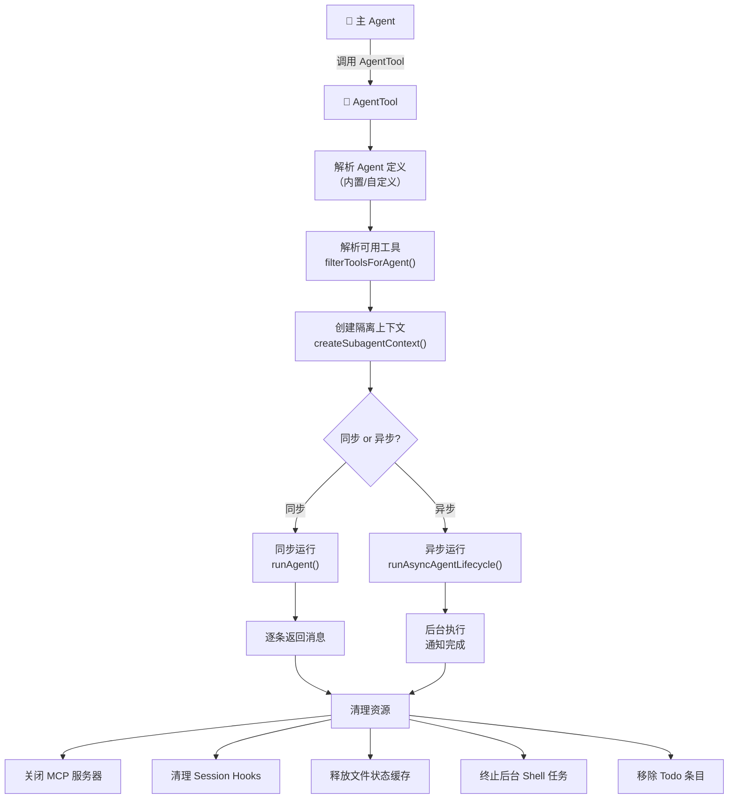
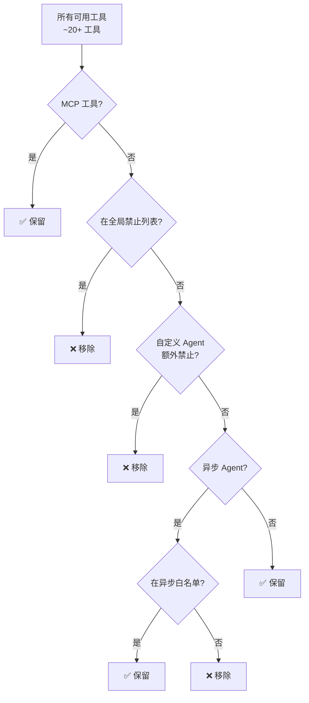
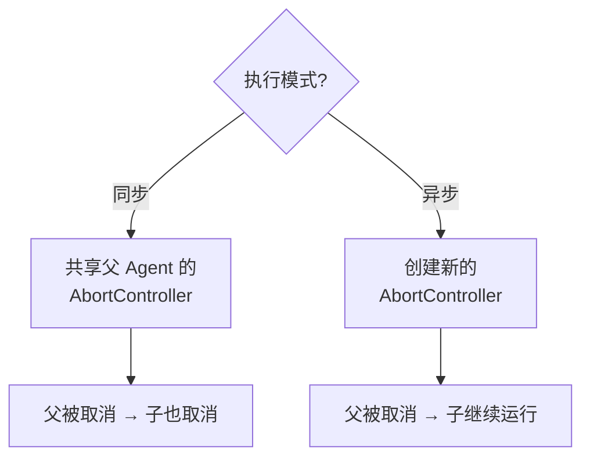
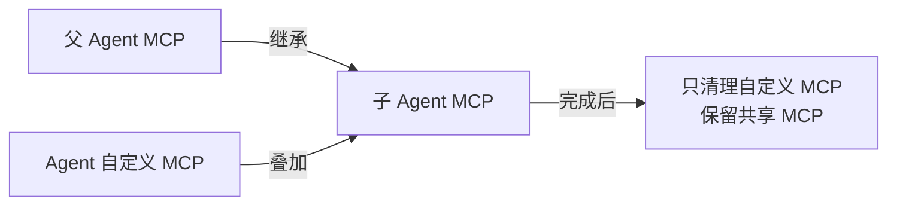

# 第 8 课：AgentTool —— 子 Agent 的诞生与隔离

> 🎯 本课目标：理解 Claude Code 如何通过 AgentTool 创建隔离的子 Agent 执行复杂任务

---

## 学习目标

1. 理解 AgentTool 的核心价值：分而治之的任务执行
2. 掌握子 Agent 的完整生命周期：诞生 → 运行 → 清理
3. 了解子 Agent 的工具隔离机制：哪些工具可用、哪些被禁
4. 理解同步 vs 异步两种执行模式的区别
5. 认识内置 Agent 类型（Explore、Plan、GeneralPurpose）

---

## 1. 生活类比：公司的项目外包

想象你是一位项目经理（主 Agent），需要完成一个大项目：

- 你可以自己做所有事（但效率低、容易混乱）
- 更好的做法：**外包子任务**给专业团队（子 Agent）

就像外包一样，你需要：
- **明确任务描述**（prompt）
- **提供必要资源**（上下文消息）
- **限定权限范围**（不能让外包团队访问公司核心系统）
- **选择执行方式**：等外包完成再继续（同步），还是外包和主线并行（异步）
- **回收结果**：外包团队交付成果后清理现场

这就是 AgentTool 的核心机制。

---

## 2. AgentTool 架构全景



---

## 3. 内置 Agent 类型

Claude Code 内置了几种专业的 Agent 类型：

```typescript
// 源码: tools/AgentTool/builtInAgents.ts (第 45-72 行)
export function getBuiltInAgents(): AgentDefinition[] {
  const agents: AgentDefinition[] = [
    GENERAL_PURPOSE_AGENT,     // 通用 Agent
    STATUSLINE_SETUP_AGENT,    // 状态栏设置
  ]

  if (areExplorePlanAgentsEnabled()) {
    agents.push(EXPLORE_AGENT, PLAN_AGENT)  // 探索 + 计划
  }

  // ...
  return agents
}
```

| Agent 类型 | 用途 | 特点 |
|-----------|------|------|
| **Explore** | 代码探索、搜索 | 只读、省略 CLAUDE.md 节省 token |
| **Plan** | 任务规划、方案设计 | 只读 |
| **GeneralPurpose** | 通用多步任务 | 拥有大部分工具 |

### 一次性 Agent 优化

Explore 和 Plan 是"一次性"Agent——执行完就返回结果，不需要后续交互：

```typescript
// 源码: tools/AgentTool/constants.ts (第 6-12 行)
export const ONE_SHOT_BUILTIN_AGENT_TYPES: ReadonlySet<string> = new Set([
  'Explore',
  'Plan',
])
```

> 这些 Agent 的结果不需要附带 agentId 和 SendMessage 提示，每次省下约 135 字符。当 Explore 每周被调用 3400 万次时，这就是可观的 token 节约。

---

## 4. 工具隔离：子 Agent 能用什么

### 4.1 工具过滤逻辑

子 Agent 不能使用所有工具——有些工具被明确禁止：

```typescript
// 源码: tools/AgentTool/agentToolUtils.ts (第 70-116 行)
export function filterToolsForAgent({
  tools, isBuiltIn, isAsync, permissionMode,
}: { tools: Tools; isBuiltIn: boolean; isAsync?: boolean; permissionMode?: PermissionMode }): Tools {
  return tools.filter(tool => {
    // MCP 工具始终允许
    if (tool.name.startsWith('mcp__')) return true

    // Plan 模式下允许 ExitPlanMode
    if (toolMatchesName(tool, EXIT_PLAN_MODE_V2_TOOL_NAME) && permissionMode === 'plan') {
      return true
    }

    // 全局禁止列表（所有 Agent 都不能用）
    if (ALL_AGENT_DISALLOWED_TOOLS.has(tool.name)) return false

    // 自定义 Agent 额外禁止列表
    if (!isBuiltIn && CUSTOM_AGENT_DISALLOWED_TOOLS.has(tool.name)) return false

    // 异步 Agent 只能用白名单工具
    if (isAsync && !ASYNC_AGENT_ALLOWED_TOOLS.has(tool.name)) return false

    return true
  })
}
```



### 4.2 工具解析（resolveAgentTools）

Agent 定义可以指定具体需要的工具，支持通配符 `*`：

```typescript
// 源码: tools/AgentTool/agentToolUtils.ts (第 122-225 行)
export function resolveAgentTools(
  agentDefinition, availableTools, isAsync, isMainThread
): ResolvedAgentTools {
  // 通配符：允许所有（过滤后的）工具
  const hasWildcard =
    agentTools === undefined ||
    (agentTools.length === 1 && agentTools[0] === '*')
  if (hasWildcard) {
    return { hasWildcard: true, resolvedTools: allowedAvailableTools, /* ... */ }
  }

  // 精确匹配：只允许指定的工具
  for (const toolSpec of agentTools) {
    const { toolName, ruleContent } = permissionRuleValueFromString(toolSpec)
    const tool = availableToolMap.get(toolName)
    if (tool) {
      validTools.push(toolSpec)
      resolved.push(tool)
    } else {
      invalidTools.push(toolSpec)
    }
  }
  return { resolvedTools: resolved, /* ... */ }
}
```

---

## 5. runAgent：子 Agent 的生命周期

### 5.1 初始化阶段

```typescript
// 源码: tools/AgentTool/runAgent.ts (第 248-329 行)
export async function* runAgent({
  agentDefinition,      // Agent 定义（类型、系统提示、工具列表...）
  promptMessages,       // 提示消息（任务描述）
  toolUseContext,       // 工具使用上下文（父 Agent 的）
  canUseTool,           // 权限检查函数
  isAsync,              // 是否异步执行
  forkContextMessages,  // 可选：共享父 Agent 的上下文消息
  querySource,          // 来源标识
  model,                // 可选：指定模型
  maxTurns,             // 最大轮次限制
  availableTools,       // 预计算的工具池
  allowedTools,         // 权限规则白名单
  // ... 更多参数
}) { /* ... */ }
```

### 5.2 权限隔离

子 Agent 的权限模式可以独立于父 Agent：

```typescript
// 源码: tools/AgentTool/runAgent.ts (第 415-498 行)
const agentGetAppState = () => {
  const state = toolUseContext.getAppState()
  let toolPermissionContext = state.toolPermissionContext

  // Agent 自定义权限模式（除非父级是 bypass/acceptEdits/auto）
  if (agentPermissionMode &&
      state.toolPermissionContext.mode !== 'bypassPermissions' &&
      state.toolPermissionContext.mode !== 'acceptEdits') {
    toolPermissionContext = { ...toolPermissionContext, mode: agentPermissionMode }
  }

  // 异步 Agent 不能显示权限弹窗
  if (shouldAvoidPrompts) {
    toolPermissionContext = {
      ...toolPermissionContext,
      shouldAvoidPermissionPrompts: true,
    }
  }

  // 作用域隔离：只使用指定的工具权限
  if (allowedTools !== undefined) {
    toolPermissionContext = {
      ...toolPermissionContext,
      alwaysAllowRules: {
        cliArg: state.toolPermissionContext.alwaysAllowRules.cliArg,  // 保留 SDK 权限
        session: [...allowedTools],  // 用 allowedTools 替换 session 规则
      },
    }
  }
}
```

> 🔑 **关键设计**：`cliArg` 级别的权限（来自 SDK 的 `--allowedTools`）永远被保留，但 `session` 级别的权限被替换。这防止了父 Agent 的临时授权泄漏给子 Agent。

### 5.3 AbortController 策略



```typescript
// 源码: tools/AgentTool/runAgent.ts (第 524-528 行)
const agentAbortController = override?.abortController
  ? override.abortController
  : isAsync
    ? new AbortController()     // 异步：独立生命周期
    : toolUseContext.abortController  // 同步：共享生命周期
```

### 5.4 系统提示优化

Explore 和 Plan 类型的 Agent 会自动省略不必要的上下文信息：

```typescript
// 源码: tools/AgentTool/runAgent.ts (第 386-410 行)
// 只读 Agent 不需要 CLAUDE.md 中的 commit/PR/lint 规则
const shouldOmitClaudeMd = agentDefinition.omitClaudeMd && !override?.userContext

// Explore/Plan 不需要 stale 的 gitStatus
const resolvedSystemContext =
  agentDefinition.agentType === 'Explore' || agentDefinition.agentType === 'Plan'
    ? systemContextNoGit   // 省略 gitStatus（可达 40KB）
    : baseSystemContext
```

> 💰 **每周节省 1-3 Gtok**：Explore Agent 每周被调用数千万次，每次省下 CLAUDE.md 和 gitStatus 上下文，累计节省巨大。

---

## 6. 资源清理：Agent 的善后

Agent 完成后有一套完整的清理流程：

```typescript
// 源码: tools/AgentTool/runAgent.ts (第 816-858 行)
} finally {
  // 1. 关闭 Agent 专属的 MCP 服务器
  await mcpCleanup()

  // 2. 清理 Session Hooks
  if (agentDefinition.hooks) {
    clearSessionHooks(rootSetAppState, agentId)
  }

  // 3. 清理 Prompt Cache 追踪
  cleanupAgentTracking(agentId)

  // 4. 释放文件状态缓存内存
  agentToolUseContext.readFileState.clear()

  // 5. 释放上下文消息引用
  initialMessages.length = 0

  // 6. 清理 Perfetto 追踪条目
  unregisterPerfettoAgent(agentId)

  // 7. 清理 Todo 条目（防止内存泄漏）
  rootSetAppState(prev => {
    if (!(agentId in prev.todos)) return prev
    const { [agentId]: _removed, ...todos } = prev.todos
    return { ...prev, todos }
  })

  // 8. 终止后台 Shell 任务
  killShellTasksForAgent(agentId, toolUseContext.getAppState, rootSetAppState)
}
```

> ⚠️ **内存泄漏防护**：注意第 7 步清理 Todo 条目——如果不清理，每个子 Agent 都会在 `AppState.todos` 中留下一个键。在长时间会话中，数百个 Agent 会导致可观的内存泄漏。

---

## 7. Agent 专属 MCP 服务器

Agent 可以定义自己的 MCP 服务器，叠加在父 Agent 的服务器之上：

```typescript
// 源码: tools/AgentTool/runAgent.ts (第 95-218 行)
async function initializeAgentMcpServers(
  agentDefinition: AgentDefinition,
  parentClients: MCPServerConnection[],
) {
  for (const spec of agentDefinition.mcpServers) {
    if (typeof spec === 'string') {
      // 按名称引用已有服务器（共享连接）
      config = getMcpConfigByName(spec)
    } else {
      // 内联定义新服务器（Agent 专属）
      isNewlyCreated = true
    }
    const client = await connectToServer(name, config)
    agentClients.push(client)
  }

  // 清理函数只关闭新创建的连接，不关闭共享的
  const cleanup = async () => {
    for (const client of newlyCreatedClients) {  // 注意：只是 newlyCreatedClients
      if (client.type === 'connected') await client.cleanup()
    }
  }

  return { clients: [...parentClients, ...agentClients], tools: agentTools, cleanup }
}
```



---

## 8. 不完整消息过滤

当子 Agent 共享父 Agent 的上下文时，需要过滤掉未完成的工具调用：

```typescript
// 源码: tools/AgentTool/runAgent.ts (第 866-904 行)
export function filterIncompleteToolCalls(messages: Message[]): Message[] {
  // 第一步：收集所有有结果的 tool_use_id
  const toolUseIdsWithResults = new Set<string>()
  for (const message of messages) {
    if (message?.type === 'user') {
      for (const block of message.message.content) {
        if (block.type === 'tool_result' && block.tool_use_id) {
          toolUseIdsWithResults.add(block.tool_use_id)
        }
      }
    }
  }

  // 第二步：过滤掉有未完成 tool_use 的助手消息
  return messages.filter(message => {
    if (message?.type === 'assistant') {
      const hasIncompleteToolCall = message.message.content.some(
        block => block.type === 'tool_use' && !toolUseIdsWithResults.has(block.id)
      )
      return !hasIncompleteToolCall
    }
    return true
  })
}
```

> 💡 **为什么要过滤？** API 要求每个 `tool_use` 必须有对应的 `tool_result`。如果父 Agent 正在执行一个工具调用时 fork 了上下文给子 Agent，那个未完成的 `tool_use` 会导致 API 报错。

---

## 动手练习

### 练习 1：设计一个 Agent

假设你要实现一个 "CodeReview" Agent，它的职责是审查代码质量。请思考：
1. 它需要哪些工具？（提示：读文件、搜索代码、但不能修改）
2. 它的权限模式应该是什么？
3. 它应该同步还是异步执行？
4. 需要 CLAUDE.md 上下文吗？

### 练习 2：思考题

1. 为什么 MCP 工具不受 `ALL_AGENT_DISALLOWED_TOOLS` 限制？（提示：考虑 MCP 是外部定义的）
2. 为什么同步 Agent 共享父 Agent 的 AbortController？取消后果是什么？
3. `filterIncompleteToolCalls` 中为什么要构建一个 Set 而不是逐条检查？

### 练习 3：追踪代码

找到 `EXPLORE_AGENT` 的定义文件（`tools/AgentTool/built-in/exploreAgent.ts`），看看它的：
- `tools` 列表限制了哪些工具？
- `omitClaudeMd` 是否为 true？
- `maxTurns` 限制了多少轮？

---

## 本课小结

| 要点 | 说明 |
|------|------|
| Agent 本质 | 隔离环境中运行的子 LLM 会话 |
| 工具隔离 | 通过 filterToolsForAgent 三级过滤 |
| 权限隔离 | 独立权限模式，cliArg 规则保留但 session 规则替换 |
| 执行模式 | 同步（共享 AbortController）vs 异步（独立生命周期） |
| 资源清理 | 8 步清理流程，防止内存泄漏 |
| 内置类型 | Explore（只读搜索）、Plan（规划）、GeneralPurpose（通用） |
| 上下文优化 | 省略 CLAUDE.md 和 gitStatus 节省 token |

---

## 下节预告

在第 9 课中，我们将走出 Claude Code 的"城堡"，看看它如何通过 MCP、LSP、WebFetch 三种外部集成机制连接整个世界。你将了解这些外部工具是如何被封装、安全隔离、并融入统一的工具系统的。

> 📖 预习建议：阅读 `tools/MCPTool/MCPTool.ts` 和 `tools/LSPTool/LSPTool.ts`，注意它们与内置工具在 `buildTool` 用法上的差异。
