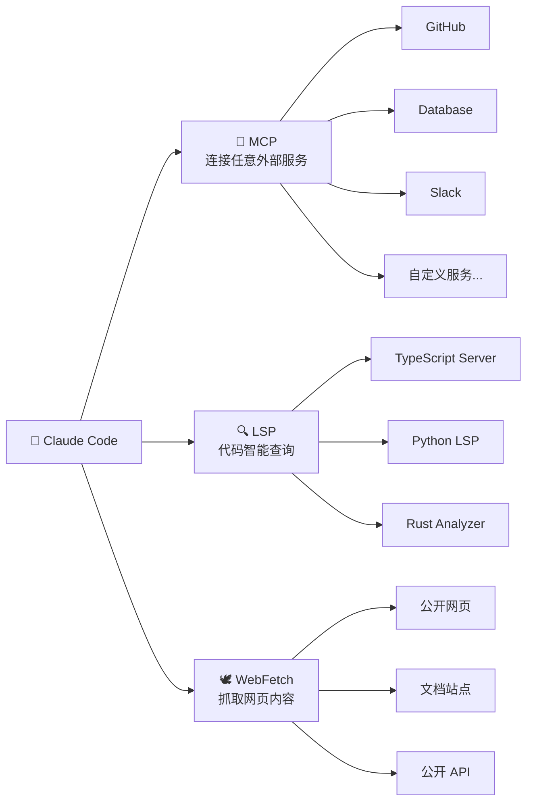
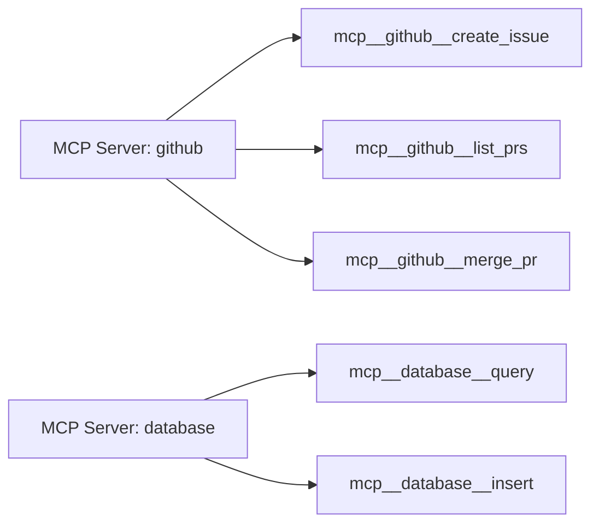
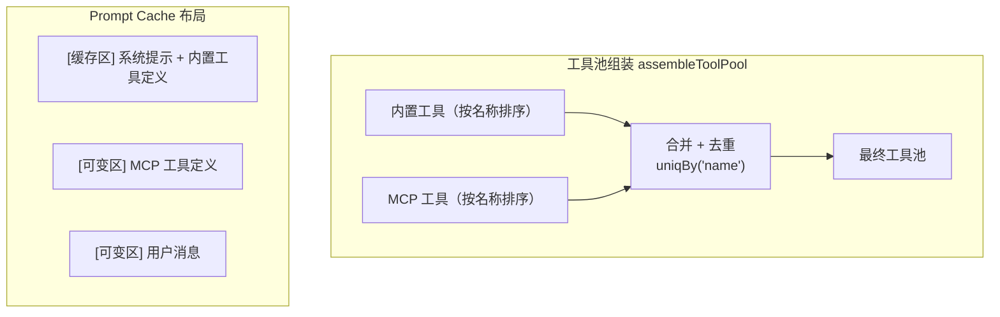
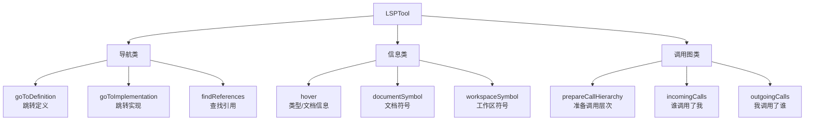
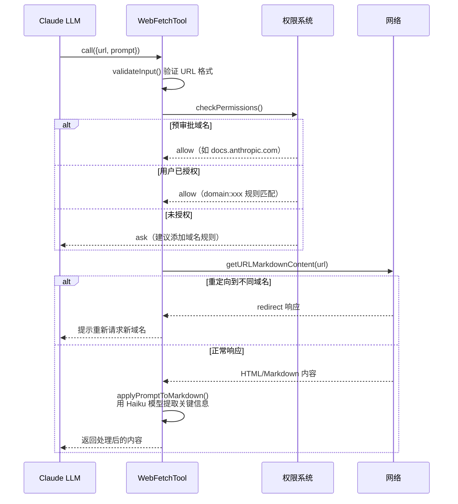
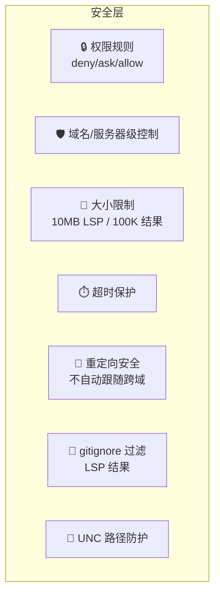

# 第 9 课：MCP / LSP / WebFetch —— 外部工具集成

> 🎯 本课目标：理解 Claude Code 如何通过三种不同机制连接外部世界

---

## 学习目标

1. 理解 MCP（Model Context Protocol）工具的动态注册与权限管理
2. 掌握 LSP（Language Server Protocol）工具的代码智能能力
3. 了解 WebFetch 工具的 URL 抓取、预审批与内容处理机制
4. 认识外部工具与内置工具的融合策略（assembleToolPool）
5. 理解外部工具的安全边界设计

---

## 1. 生活类比：三种连接外界的方式

想象 Claude Code 是一个城堡里的工匠：

- **MCP 工具** 就像**万能邮局**：任何外部服务都可以通过标准信件格式（MCP 协议）与工匠通信。GitHub、数据库、Slack…… 都能接入
- **LSP 工具** 就像**翻译官**：它连接着各种编程语言的"语法专家"（语言服务器），能提供跳转定义、查找引用等精确的代码智能
- **WebFetch 工具** 就像**信鸽**：飞出去抓取网页内容带回来，但只能访问公开页面



---

## 2. MCP 工具：万能插头

### 2.1 MCPTool 的"骨架"设计

MCPTool 本身只是一个**模板**——所有属性都会在运行时被 `mcpClient.ts` 覆盖：

```typescript
// 源码: tools/MCPTool/MCPTool.ts (第 27-77 行)
export const MCPTool = buildTool({
  isMcp: true,
  // ↓ 这些全部会被 mcpClient.ts 在运行时覆盖
  name: 'mcp',                     // 实际会变成 mcp__serverName__toolName
  async description() { return DESCRIPTION },  // 实际会用 MCP 服务器提供的描述
  async prompt() { return PROMPT },
  async call() { return { data: '' } },
  userFacingName: () => 'mcp',

  // ↓ 这些是 MCPTool 的固有属性
  maxResultSizeChars: 100_000,
  isConcurrencySafe() { return true },
  isReadOnly() { return true },

  async checkPermissions(): Promise<PermissionResult> {
    return {
      behavior: 'passthrough',      // 交给上层权限系统决定
      message: 'MCPTool requires permission.',
    }
  },

  mapToolResultToToolResultBlockParam(content, toolUseID) {
    return { tool_use_id: toolUseID, type: 'tool_result', content }
  },
})
```

> 💡 **为什么 MCPTool 的 `checkPermissions` 返回 `passthrough`？** 因为 MCP 工具是动态的、由外部定义的，MCPTool 无法自行判断安全性。它把决定权交给上层的权限系统（参见第 7 课的步骤 3：passthrough → ask）。

### 2.2 MCP 工具的命名规则

MCP 工具使用三段式命名：`mcp__服务器名__工具名`



这种命名使得权限规则可以在不同粒度上生效：
- `deny: ["mcp__github"]` —— 禁用 GitHub 服务器的所有工具
- `deny: ["mcp__github__merge_pr"]` —— 只禁用 merge PR 工具
- `allow: ["mcp__github__list_prs"]` —— 只允许列出 PR

### 2.3 MCP 与内置工具的融合

MCP 工具和内置工具通过 `assembleToolPool` 函数融合：

```typescript
// 源码: tools.ts (第 345-367 行)
export function assembleToolPool(
  permissionContext: ToolPermissionContext,
  mcpTools: Tools,
): Tools {
  const builtInTools = getTools(permissionContext)
  const allowedMcpTools = filterToolsByDenyRules(mcpTools, permissionContext)

  // 内置工具排在前面，MCP 工具在后面
  // 保证 prompt cache 稳定性
  const byName = (a: Tool, b: Tool) => a.name.localeCompare(b.name)
  return uniqBy(
    [...builtInTools].sort(byName).concat(allowedMcpTools.sort(byName)),
    'name',  // 同名时内置工具优先
  )
}
```

> 🔑 **为什么内置工具要排在前面？** 这与 Anthropic API 的 prompt cache 机制有关。缓存断点在最后一个内置工具之后。如果 MCP 工具插入到内置工具之间，会导致缓存失效。



---

## 3. LSP 工具：代码智能

### 3.1 LSP 的九种操作

LSPTool 支持九种 Language Server Protocol 操作：

```typescript
// 源码: tools/LSPTool/LSPTool.ts (第 60-86 行)
const inputSchema = lazySchema(() =>
  z.strictObject({
    operation: z.enum([
      'goToDefinition',        // 跳转到定义
      'findReferences',        // 查找所有引用
      'hover',                 // 悬停信息（类型、文档）
      'documentSymbol',        // 文档符号列表
      'workspaceSymbol',       // 工作区符号搜索
      'goToImplementation',    // 跳转到实现
      'prepareCallHierarchy',  // 准备调用层次
      'incomingCalls',         // 谁调用了这个函数
      'outgoingCalls',         // 这个函数调用了谁
    ]),
    filePath: z.string(),      // 文件路径
    line: z.number().int().positive(),      // 行号（1-based）
    character: z.number().int().positive(), // 列号（1-based）
  }),
)
```



### 3.2 关键设计：条件启用 + 延迟加载

```typescript
// 源码: tools/LSPTool/LSPTool.ts (第 127-139 行)
export const LSPTool = buildTool({
  name: LSP_TOOL_NAME,
  isLsp: true,
  shouldDefer: true,      // 延迟加载（需要 ToolSearch 发现）

  isEnabled() {
    return isLspConnected()  // 只在 LSP 连接成功时才启用
  },
  // ...
})
```

- `shouldDefer: true` —— LSPTool 不会默认出现在模型的工具列表中，需要通过 ToolSearch 发现。这减少了没有 LSP 时的噪声
- `isEnabled()` —— 运行时检查 LSP 服务器是否真的连接上了

### 3.3 安全过滤：排除 gitignore 文件

LSPTool 在返回结果前会过滤掉被 gitignore 的文件，防止 AI 看到不应该看的文件：

```typescript
// 源码: tools/LSPTool/LSPTool.ts (第 556-611 行)
async function filterGitIgnoredLocations<T extends Location>(
  locations: T[], cwd: string
): Promise<T[]> {
  // 收集唯一路径，批量检查
  const BATCH_SIZE = 50
  for (let i = 0; i < uniquePaths.length; i += BATCH_SIZE) {
    const batch = uniquePaths.slice(i, i + BATCH_SIZE)
    const result = await execFileNoThrowWithCwd(
      'git', ['check-ignore', ...batch], { cwd, timeout: 5_000 }
    )
    // 收集被忽略的路径
  }
  return locations.filter(loc => !ignoredPaths.has(filePath))
}
```

### 3.4 文件大小保护

```typescript
// 源码: tools/LSPTool/LSPTool.ts (第 53 行)
const MAX_LSP_FILE_SIZE_BYTES = 10_000_000  // 10MB

// 在 call() 中检查
if (stats.size > MAX_LSP_FILE_SIZE_BYTES) {
  return { data: { result: `File too large for LSP analysis (${...}MB exceeds 10MB limit)` } }
}
```

---

## 4. WebFetch 工具：网页抓取

### 4.1 核心流程



### 4.2 域名级别的权限控制

WebFetch 的权限是按**域名**而非 URL 级别管理的：

```typescript
// 源码: tools/WebFetchTool/WebFetchTool.ts (第 50-64 行)
function webFetchToolInputToPermissionRuleContent(input) {
  try {
    const parsedInput = WebFetchTool.inputSchema.safeParse(input)
    if (!parsedInput.success) return `input:${input.toString()}`
    const { url } = parsedInput.data
    const hostname = new URL(url).hostname
    return `domain:${hostname}`    // 提取域名作为权限规则
  } catch {
    return `input:${input.toString()}`
  }
}
```

权限检查的优先级：

```typescript
// 源码: tools/WebFetchTool/WebFetchTool.ts (第 104-180 行)
async checkPermissions(input, context) {
  // 1. 预审批域名直接放行
  if (isPreapprovedHost(parsedUrl.hostname, parsedUrl.pathname)) {
    return { behavior: 'allow' }
  }

  // 2. 检查 deny 规则
  const denyRule = getRuleByContentsForTool(context, WebFetchTool, 'deny').get(ruleContent)
  if (denyRule) return { behavior: 'deny' }

  // 3. 检查 ask 规则
  const askRule = getRuleByContentsForTool(context, WebFetchTool, 'ask').get(ruleContent)
  if (askRule) return { behavior: 'ask', suggestions: buildSuggestions(ruleContent) }

  // 4. 检查 allow 规则
  const allowRule = getRuleByContentsForTool(context, WebFetchTool, 'allow').get(ruleContent)
  if (allowRule) return { behavior: 'allow' }

  // 5. 默认询问，并建议"记住这个域名"
  return { behavior: 'ask', suggestions: buildSuggestions(ruleContent) }
},
```

### 4.3 权限建议（suggestions）

WebFetch 提供智能建议，让用户一键授权整个域名：

```typescript
// 源码: tools/WebFetchTool/WebFetchTool.ts (第 309-318 行)
function buildSuggestions(ruleContent: string): PermissionUpdate[] {
  return [{
    type: 'addRules',
    destination: 'localSettings',
    rules: [{ toolName: WEB_FETCH_TOOL_NAME, ruleContent }],
    behavior: 'allow',
  }]
}
```

> 用户看到的效果：「Claude 想访问 github.com，是否允许？[允许一次] [始终允许此域名]」

### 4.4 重定向安全处理

WebFetch 对跨域重定向做了特殊处理——不自动跟随，而是告知模型重新请求：

```typescript
// 源码: tools/WebFetchTool/WebFetchTool.ts (第 217-249 行)
if ('type' in response && response.type === 'redirect') {
  const message = `REDIRECT DETECTED: The URL redirects to a different host.
Original URL: ${response.originalUrl}
Redirect URL: ${response.redirectUrl}
To complete your request, please use WebFetch again with the redirected URL.`
  return { data: { result: message } }
}
```

> 🛡️ **为什么不自动跟随重定向？** 因为重定向的目标域名可能需要不同的权限审批。如果自动跟随，会绕过权限检查。

### 4.5 Prompt 中的认证警告

```typescript
// 源码: tools/WebFetchTool/WebFetchTool.ts (第 187-189 行)
async prompt() {
  return `IMPORTANT: WebFetch WILL FAIL for authenticated or private URLs.
Before using this tool, check if the URL points to an authenticated service
(e.g. Google Docs, Confluence, Jira, GitHub). If so, look for a specialized
MCP tool that provides authenticated access.
${DESCRIPTION}`
},
```

> 这段提示告诉模型：如果目标 URL 需要认证，应该去找对应的 MCP 工具而不是用 WebFetch。

---

## 5. 三种外部工具对比

| 维度 | MCP 工具 | LSP 工具 | WebFetch |
|------|---------|---------|----------|
| 协议 | MCP（自定义） | LSP（标准） | HTTP |
| 用途 | 任意外部服务 | 代码智能 | 网页抓取 |
| 动态性 | 完全动态 | 半动态（需连接） | 静态 |
| 命名 | `mcp__server__tool` | `LSP` | `WebFetch` |
| 权限级别 | 服务器/工具 | 文件读取 | 域名 |
| 延迟加载 | 否 | 是（shouldDefer） | 否 |
| 结果持久化 | 100K 字符 | 100K 字符 | 100K 字符 |
| 并发安全 | 是 | 是 | 是 |
| 只读 | 不一定 | 是 | 是 |

---

## 6. 注册中心的外部工具管理

### ListMcpResourcesTool 和 ReadMcpResourceTool

除了 MCP 工具调用，Claude Code 还支持浏览 MCP 资源：

```typescript
// 源码: tools.ts (第 245-249 行)
export function getAllBaseTools(): Tools {
  return [
    // ... 其他工具
    ListMcpResourcesTool,   // 列出 MCP 服务器提供的资源
    ReadMcpResourceTool,    // 读取特定 MCP 资源
  ]
}
```

这两个工具被归为"特殊工具"，不在默认工具列表中，但会在需要时加入：

```typescript
// 源码: tools.ts (第 301-306 行)
const specialTools = new Set([
  ListMcpResourcesTool.name,
  ReadMcpResourceTool.name,
  SYNTHETIC_OUTPUT_TOOL_NAME,
])
const tools = getAllBaseTools().filter(tool => !specialTools.has(tool.name))
```

---

## 7. 外部工具的安全边界汇总



---

## 动手练习

### 练习 1：MCP 权限规则设计

假设你有一个 MCP 服务器 `my-database`，它提供 `query`（查询）、`insert`（插入）和 `delete`（删除）工具。设计权限规则，使得：
- 查询操作自动允许
- 插入操作需要确认
- 删除操作被禁止

### 练习 2：LSP 操作选择

对于以下需求，你会使用 LSPTool 的哪个操作？
1. 想知道某个函数在哪里被定义的
2. 想找到某个类的所有引用位置
3. 想了解某个变量的类型信息
4. 想看某个文件有哪些导出的函数和类
5. 想知道某个函数调用了哪些其他函数

### 练习 3：思考题

1. 为什么 MCPTool 的 `checkPermissions` 返回 `passthrough` 而非 `ask`？
2. WebFetch 为什么不支持需要认证的 URL？有没有替代方案？
3. 如果一个 MCP 工具和内置工具同名，会发生什么？（提示：看 `uniqBy` 的行为）

### 练习 4：追踪代码

找到 `tools/WebFetchTool/preapproved.ts`，看看哪些域名是预审批的。思考为什么这些域名被信任。

---

## 本课小结

| 要点 | 说明 |
|------|------|
| MCP = 万能插头 | 通过标准协议连接任意外部服务，动态注册 |
| LSP = 代码智能 | 9 种操作，条件启用 + 延迟加载 |
| WebFetch = 网页抓取 | 域名级权限，不跟随跨域重定向 |
| 融合策略 | assembleToolPool 内置优先 + 按名排序 |
| 安全原则 | passthrough 权限 / 重定向保护 / gitignore 过滤 |
| 预审批机制 | WebFetch 信任特定域名，MCP 按服务器/工具控制 |

---

## 下节预告

恭喜你完成了所有工具系统的学习！在第 10 课（最终课）中，我们将学以致用——从零开始实现一个自定义工具。你将亲手编写一个完整的工具，涵盖 inputSchema、checkPermissions、call、UI 渲染等所有环节。

> 📖 预习建议：回顾 `Tool.ts` 中 `Tool` 类型的完整接口定义和 `buildTool` 函数。
