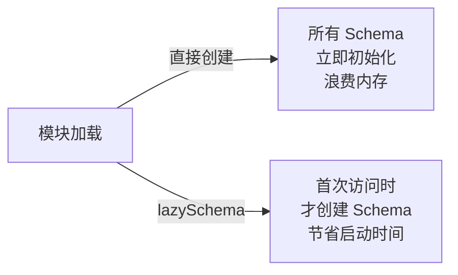
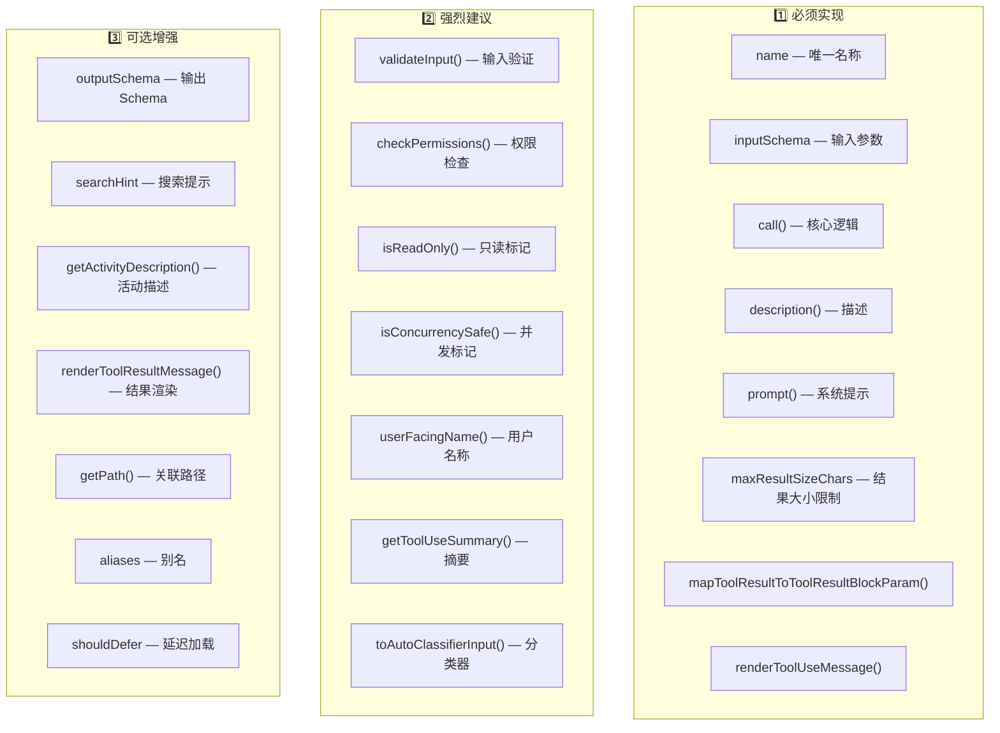
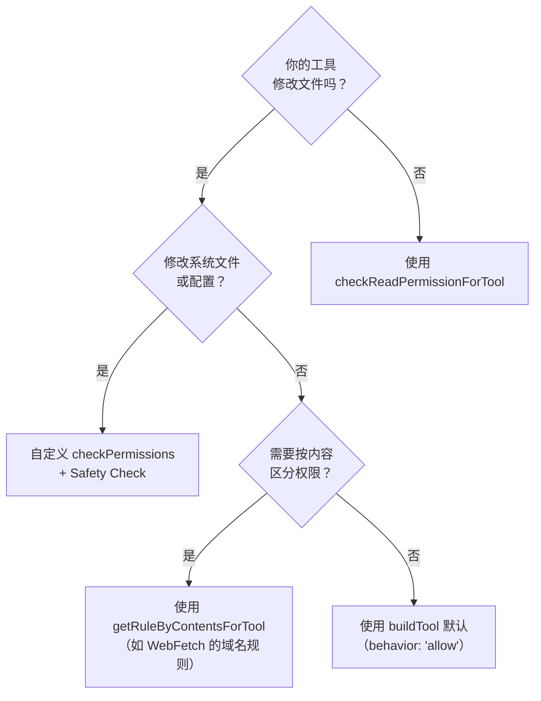
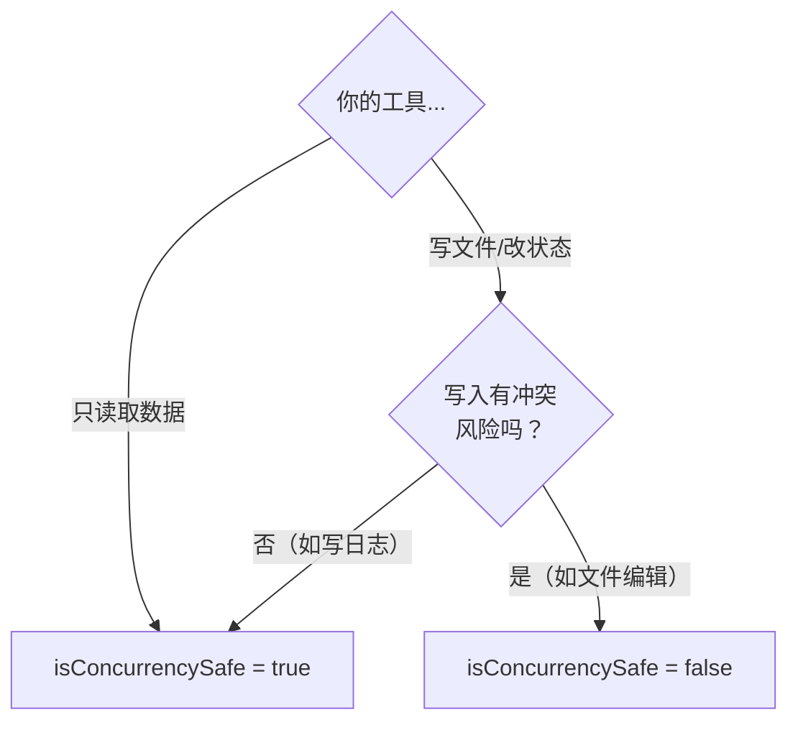
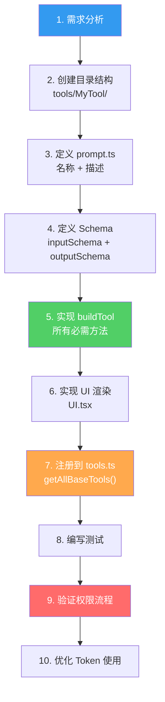
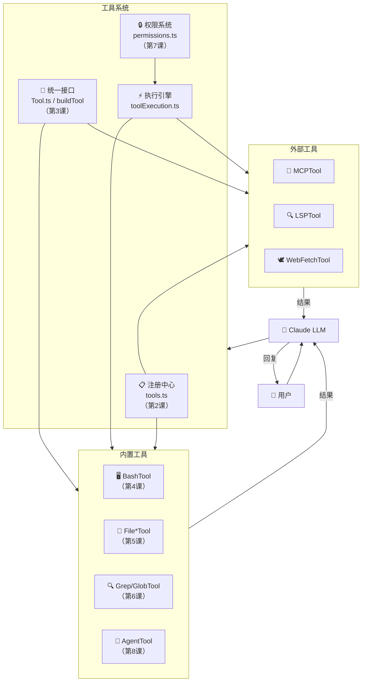

# 第 10 课：如何自己实现一个新工具（实战）

> 🎯 本课目标：融会贯通前 9 课所学，从零实现一个完整的自定义工具

---

## 学习目标

1. 掌握 Claude Code 工具开发的完整流程：从需求到注册
2. 理解 `buildTool` 工厂函数的每个参数含义
3. 学会编写类型安全的 inputSchema 和 outputSchema
4. 实现合理的 checkPermissions 权限策略
5. 掌握工具的 UI 渲染和结果映射

---

## 1. 回顾：Tool 接口全景

经过前 9 课的学习，我们已经见过了 Tool 接口的方方面面。现在让我们把它完整地梳理一遍：

```typescript
// 源码: Tool.ts (第 362-695 行) - 核心接口简化版
export type Tool<Input, Output, P> = {
  // ═══════════════════════════════════════════
  // 📛 标识与元数据
  // ═══════════════════════════════════════════
  name: string                          // 唯一工具名
  aliases?: string[]                    // 向后兼容的别名
  searchHint?: string                   // ToolSearch 搜索关键词
  shouldDefer?: boolean                 // 是否延迟加载
  maxResultSizeChars: number            // 结果持久化阈值
  strict?: boolean                      // 严格模式

  // ═══════════════════════════════════════════
  // 📋 Schema 定义
  // ═══════════════════════════════════════════
  inputSchema: Input                    // Zod 输入参数定义
  outputSchema?: z.ZodType<unknown>     // Zod 输出结构定义

  // ═══════════════════════════════════════════
  // 🔧 核心方法
  // ═══════════════════════════════════════════
  call(...): Promise<ToolResult<Output>>       // 执行逻辑（必须）
  description(...): Promise<string>            // 工具描述（必须）
  prompt(...): Promise<string>                 // 系统提示（必须）
  validateInput?(...): Promise<ValidationResult>  // 输入验证
  checkPermissions(...): Promise<PermissionResult> // 权限检查

  // ═══════════════════════════════════════════
  // 🏷️ 属性标记
  // ═══════════════════════════════════════════
  isEnabled(): boolean                  // 是否启用
  isReadOnly(input): boolean            // 是否只读
  isConcurrencySafe(input): boolean     // 是否并发安全
  isDestructive?(input): boolean        // 是否破坏性

  // ═══════════════════════════════════════════
  // 🎨 UI 渲染
  // ═══════════════════════════════════════════
  userFacingName(input): string                    // 用户可见名称
  renderToolUseMessage(input, options): ReactNode  // 渲染工具调用
  renderToolResultMessage?(output, ...): ReactNode // 渲染执行结果
  mapToolResultToToolResultBlockParam(output, id)  // 结果 → API 格式

  // ═══════════════════════════════════════════
  // 📊 辅助方法
  // ═══════════════════════════════════════════
  getToolUseSummary?(input): string | null         // 简要摘要
  getActivityDescription?(input): string | null    // 活动描述
  toAutoClassifierInput(input): unknown            // 分类器输入
  getPath?(input): string                          // 关联文件路径
}
```

### buildTool 的默认值

不用全部实现！`buildTool` 提供了安全的默认值：

```typescript
// 源码: Tool.ts (第 757-769 行)
const TOOL_DEFAULTS = {
  isEnabled: () => true,
  isConcurrencySafe: (_input?) => false,     // 默认不安全（保守）
  isReadOnly: (_input?) => false,             // 默认可写（保守）
  isDestructive: (_input?) => false,
  checkPermissions: (input) =>                // 默认放行
    Promise.resolve({ behavior: 'allow', updatedInput: input }),
  toAutoClassifierInput: (_input?) => '',
  userFacingName: (_input?) => '',
}
```

---

## 2. 实战：实现一个 WordCountTool

我们来实现一个统计文件字数的工具 `WordCountTool`，涵盖完整的开发流程。

### 2.1 需求分析

| 项目 | 描述 |
|------|------|
| 功能 | 统计指定文件的行数、单词数、字符数 |
| 输入 | 文件路径 |
| 输出 | 行数、单词数、字符数 |
| 权限 | 只读操作，使用文件读取权限 |
| 并发 | 安全（不修改文件） |

### 2.2 目录结构

```
tools/
  WordCountTool/
    WordCountTool.ts   ← 工具主体
    prompt.ts          ← 工具名称和描述
    UI.tsx             ← UI 渲染组件
```

---

## 3. 第一步：定义常量和描述（prompt.ts）

```typescript
// tools/WordCountTool/prompt.ts

export const WORD_COUNT_TOOL_NAME = 'WordCount'

export const DESCRIPTION = `Count lines, words, and characters in a file.
- Works with any text file
- Returns structured counts
- Use this instead of running 'wc' via Bash for better security`
```

> 📌 **注意 prompt 中的引导**：明确告诉模型用 WordCountTool 而不是 Bash 的 `wc`，和 GrepTool 的设计理念一致。

---

## 4. 第二步：定义 Schema（输入输出）

```typescript
// tools/WordCountTool/WordCountTool.ts - Schema 部分

import { z } from 'zod/v4'
import { lazySchema } from '../../utils/lazySchema.js'

// 输入 Schema：使用 lazySchema 延迟创建
const inputSchema = lazySchema(() =>
  z.strictObject({
    file_path: z
      .string()
      .describe('The path to the file to count'),
  }),
)
type InputSchema = ReturnType<typeof inputSchema>

// 输出 Schema：结构化结果
const outputSchema = lazySchema(() =>
  z.object({
    lines: z.number().describe('Number of lines'),
    words: z.number().describe('Number of words'),
    characters: z.number().describe('Number of characters'),
    filePath: z.string().describe('The counted file path'),
  }),
)
type OutputSchema = ReturnType<typeof outputSchema>

export type Output = z.infer<OutputSchema>
```

### 为什么用 lazySchema？



`lazySchema` 确保 Schema 对象只在第一次被访问时创建，避免在模块导入阶段就分配大量内存——当有 30+ 工具时，这是一个显著的优化。

---

## 5. 第三步：实现核心逻辑

```typescript
// tools/WordCountTool/WordCountTool.ts - 核心实现

import { buildTool, type ToolDef } from '../../Tool.js'
import { getCwd } from '../../utils/cwd.js'
import { expandPath, toRelativePath } from '../../utils/path.js'
import { getFsImplementation } from '../../utils/fsOperations.js'
import { checkReadPermissionForTool } from '../../utils/permissions/filesystem.js'
import type { PermissionDecision } from '../../utils/permissions/PermissionResult.js'
import { WORD_COUNT_TOOL_NAME, DESCRIPTION } from './prompt.js'

export const WordCountTool = buildTool({
  // ═══ 标识 ═══
  name: WORD_COUNT_TOOL_NAME,
  searchHint: 'count lines words characters in file',
  maxResultSizeChars: 1_000,  // 结果很小
  strict: true,

  // ═══ 描述和提示 ═══
  async description() {
    return `Claude wants to count words in a file`
  },
  async prompt() {
    return DESCRIPTION
  },

  // ═══ Schema ═══
  get inputSchema(): InputSchema {
    return inputSchema()  // 惰性求值
  },
  get outputSchema(): OutputSchema {
    return outputSchema()
  },

  // ═══ 属性标记 ═══
  userFacingName() {
    return 'Count'
  },
  isConcurrencySafe() {
    return true    // 不修改文件，并发安全
  },
  isReadOnly() {
    return true    // 只读操作
  },

  // ═══ 辅助方法 ═══
  getToolUseSummary(input) {
    return input?.file_path
      ? toRelativePath(expandPath(input.file_path))
      : null
  },
  getActivityDescription(input) {
    const summary = this.getToolUseSummary?.(input)
    return summary ? `Counting ${summary}` : 'Counting words'
  },
  getPath({ file_path }): string {
    return expandPath(file_path)
  },
  toAutoClassifierInput(input) {
    return input.file_path
  },

  // ═══ 输入验证 ═══
  async validateInput({ file_path }) {
    const fs = getFsImplementation()
    const absolutePath = expandPath(file_path)

    // 安全检查：UNC 路径防护
    if (absolutePath.startsWith('\\\\') || absolutePath.startsWith('//')) {
      return { result: true }
    }

    try {
      const stats = await fs.stat(absolutePath)
      if (!stats.isFile()) {
        return {
          result: false,
          message: `Path is not a file: ${file_path}`,
          errorCode: 2,
        }
      }
    } catch {
      return {
        result: false,
        message: `File does not exist: ${file_path}`,
        errorCode: 1,
      }
    }
    return { result: true }
  },

  // ═══ 权限检查 ═══
  async checkPermissions(input, context): Promise<PermissionDecision> {
    const appState = context.getAppState()
    return checkReadPermissionForTool(
      WordCountTool,
      input,
      appState.toolPermissionContext,
    )
  },

  // ═══ 核心执行 ═══
  async call({ file_path }, { abortController }) {
    const absolutePath = expandPath(file_path)
    const fs = getFsImplementation()
    const content = await fs.readFile(absolutePath, 'utf-8')

    // 检查 AbortSignal
    if (abortController.signal.aborted) {
      throw new Error('Operation aborted')
    }

    const lines = content.split('\n').length
    const words = content.split(/\s+/).filter(Boolean).length
    const characters = content.length

    const output: Output = {
      lines,
      words,
      characters,
      filePath: toRelativePath(absolutePath),
    }

    return { data: output }
  },

  // ═══ 结果映射（给 API） ═══
  mapToolResultToToolResultBlockParam(output, toolUseID) {
    return {
      tool_use_id: toolUseID,
      type: 'tool_result',
      content: `${output.filePath}: ${output.lines} lines, ${output.words} words, ${output.characters} characters`,
    }
  },

  // ═══ UI 渲染 ═══
  renderToolUseMessage(input, { verbose }) {
    // 实际项目中这里返回 React 组件
    return null  // 简化示例
  },
  renderToolResultMessage(output, progressMessages, { verbose }) {
    return null  // 简化示例
  },
} satisfies ToolDef<InputSchema, Output>)
```

---

## 6. 第四步：注册工具

在 `tools.ts` 中导入并注册：

```typescript
// tools.ts - 添加导入
import { WordCountTool } from './tools/WordCountTool/WordCountTool.js'

// 在 getAllBaseTools() 中注册
export function getAllBaseTools(): Tools {
  return [
    AgentTool,
    TaskOutputTool,
    BashTool,
    // ... 其他工具
    WordCountTool,    // ← 添加到这里
    // ...
  ]
}
```

---

## 7. 开发检查清单

以下是实现一个工具时需要验证的完整检查清单：



---

## 8. 常见模式与最佳实践

### 8.1 权限模式选择



### 8.2 错误处理模式

```typescript
// 模式 1: validateInput 中做前置检查
async validateInput({ file_path }) {
  // 检查文件是否存在、类型是否正确
  // 返回友好的错误消息
}

// 模式 2: call() 中的业务错误
async call(input, context) {
  try {
    // 执行核心逻辑
    return { data: output }
  } catch (error) {
    // 不要吞掉 AbortError！
    if (error instanceof AbortError) throw error
    // 其他错误返回友好消息
    return { data: { error: errorMessage(error) } }
  }
}
```

### 8.3 Token 优化模式

```typescript
// 1. 路径相对化
const filenames = files.map(toRelativePath)

// 2. 结果截断
const { items, appliedLimit } = applyHeadLimit(results, head_limit)

// 3. maxResultSizeChars 控制持久化
maxResultSizeChars: 20_000,  // 超过则存文件，返回预览
```

### 8.4 并发安全判断



---

## 9. 工具开发流程总结



---

## 10. 课程系列总回顾

恭喜你完成了全部 10 课的学习！让我们回顾整个旅程：

| 课程 | 主题 | 核心收获 |
|------|------|---------|
| 第 1 课 | 工具系统概览 | 四大支柱：注册、接口、权限、执行 |
| 第 2 课 | 工具注册中心 | getAllBaseTools 三级过滤 |
| 第 3 课 | Tool 接口 | buildTool + 安全默认值 |
| 第 4 课 | BashTool | Shell 命令安全执行 |
| 第 5 课 | 文件工具 | 先读后改的编辑安全模型 |
| 第 6 课 | 搜索工具 | ripgrep + glob + head_limit |
| 第 7 课 | 权限系统 | 七步检查 + Auto 分类器 |
| 第 8 课 | AgentTool | 工具隔离 + 生命周期管理 |
| 第 9 课 | 外部工具 | MCP/LSP/WebFetch 集成 |
| 第 10 课 | 实战 | 从零实现一个完整工具 |

### 整体架构回顾



---

## 动手练习

### 最终挑战：实现一个 GitStatusTool

结合前 9 课所学，设计并实现一个 `GitStatusTool`：

1. **功能**：返回当前 git 仓库的状态（类似 `git status --porcelain`）
2. **要求**：
   - 使用 `buildTool` 构建
   - 定义合理的 inputSchema（如可选的路径参数）
   - 实现 `validateInput` 检查目录是否为 git 仓库
   - 实现 `checkPermissions` 使用读取权限
   - 标记为只读 + 并发安全
   - 结果映射包含修改/新增/删除文件列表
   - 在 prompt 中说明应使用此工具而非 `Bash(git status)`
3. **进阶**：
   - 在 Auto 模式下不应该被分类器拦截（它是只读的）
   - 支持 `toAutoClassifierInput` 为分类器提供上下文
   - 思考是否需要 `shouldDefer`

### 思考题

1. 如果你要实现一个 `DatabaseQueryTool`，它和 MCP 方案相比有什么优缺点？
2. Claude Code 工具系统的设计中，你觉得最精妙的 3 个设计是什么？为什么？
3. 如果要给工具系统添加"工具版本管理"，你会怎么设计？

---

## 本课小结

| 要点 | 说明 |
|------|------|
| Tool 接口 | 三层方法：必须 / 建议 / 可选 |
| buildTool | 提供安全默认值，降低开发门槛 |
| 开发流程 | 需求 → Schema → 实现 → 注册 → 测试 |
| 权限选择 | 根据读写/内容/安全需求选择合适模式 |
| Token 优化 | 路径相对化 + 结果截断 + maxResultSizeChars |
| 最佳实践 | AbortError 不吞掉、lazySchema 惰性加载、UNC 路径防护 |

---

## 🎓 课程结语

你已经完成了 Claude Code 工具系统漫画配套课程的全部学习！

从第 1 课的宏观概览，到第 10 课的动手实战，你已经：
- 理解了工具系统的**四大支柱**
- 掌握了工具注册的**三级过滤**机制
- 深入了**每一种核心工具**的实现细节
- 学会了**权限系统**的七步检查流程
- 认识了**外部集成**的三种机制
- 具备了**自己实现工具**的能力

工具系统是 Claude Code 最核心的基础设施之一。它的设计体现了几个关键原则：
- **安全优先**（fail-closed 默认值）
- **统一抽象**（buildTool 一致接口）
- **灵活扩展**（MCP 无限扩展）
- **性能意识**（token 优化、prompt cache、lazySchema）

希望这些知识能帮助你更深入地理解 AI 编程助手的内部工作原理！
