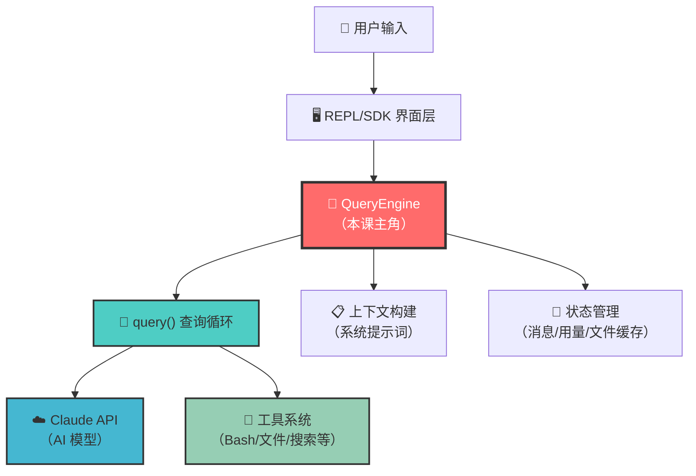
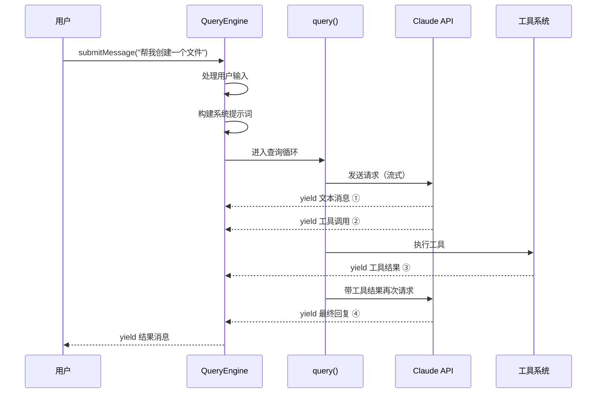
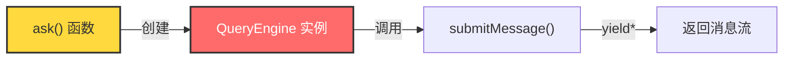
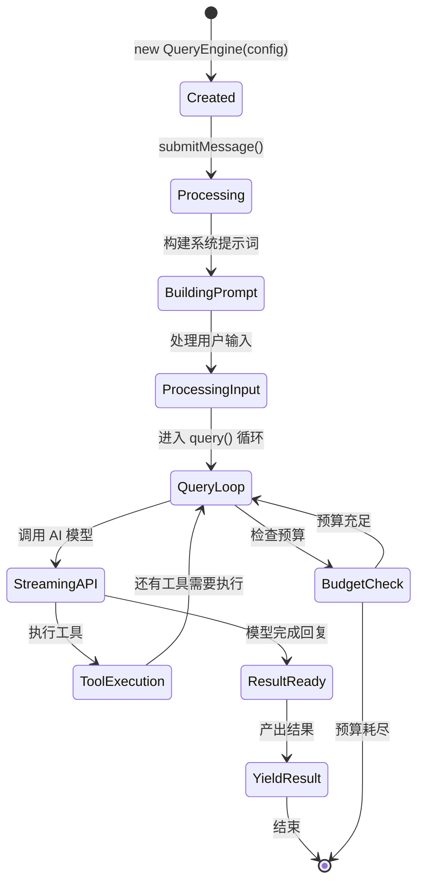

# 第1课：QueryEngine 是什么？Claude Code 的大脑

## 🎯 学习目标

学完本课，你将能够：

1. 理解 QueryEngine 在 Claude Code 中的核心地位
2. 掌握 QueryEngine 的主要职责和功能模块
3. 了解 QueryEngine 与其他组件的关系
4. 看懂 QueryEngine 类的基本结构
5. 建立对整个查询引擎系统的全局认知

---

## 一、生活类比：QueryEngine 就像一位超级管家

想象你有一位全能管家，当你说"帮我打扫房间"时，这位管家会：

1. **听懂你的话**（接收用户输入）
2. **想一想怎么做**（构建系统提示词，调用 AI 模型）
3. **拿出合适的工具**（选择扫帚、拖把等 → 选择 BashTool、FileReadTool 等）
4. **动手干活**（执行工具操作）
5. **检查结果**（查看输出，决定是否需要继续）
6. **向你汇报**（返回结果）

QueryEngine 就是 Claude Code 里的这位"超级管家"。它管理着整个对话的生命周期——从你输入第一句话，到最终得到答案的全过程。

```
你说一句话 → QueryEngine 接收 → 调用 AI 模型 → 使用工具 → 返回结果
              ↑                                              |
              └──────────── 如果需要继续 ←──────────────────┘
```

---

## 二、QueryEngine 在 Claude Code 中的位置



如上图所示，QueryEngine 处于系统的"心脏"位置，它向上对接用户界面（REPL 或 SDK），向下协调 AI 模型和工具系统。

---

## 三、源码解析：QueryEngine 类的核心结构

让我们打开真实的源码文件 `QueryEngine.ts`，看看它的"骨架"：

### 3.1 配置类型 — QueryEngine 需要知道什么

```typescript
// 源码文件：QueryEngine.ts（第130-173行）
export type QueryEngineConfig = {
  cwd: string              // 当前工作目录
  tools: Tools             // 可用工具列表
  commands: Command[]      // 可用命令列表
  mcpClients: MCPServerConnection[]  // MCP 服务器连接
  agents: AgentDefinition[]          // Agent 定义
  canUseTool: CanUseToolFn           // 工具权限检查函数
  getAppState: () => AppState        // 获取应用状态
  setAppState: (f: (prev: AppState) => AppState) => void  // 设置应用状态
  initialMessages?: Message[]        // 初始消息
  readFileCache: FileStateCache      // 文件读取缓存
  customSystemPrompt?: string        // 自定义系统提示词
  thinkingConfig?: ThinkingConfig    // 思维模式配置
  maxTurns?: number                  // 最大轮次限制
  maxBudgetUsd?: number              // 最大预算（美元）
  // ... 更多配置
}
```

**类比理解**：这就像给管家一份"工作说明书"——告诉他在哪里工作（cwd）、有哪些工具可用（tools）、预算是多少（maxBudgetUsd）、需要什么权限（canUseTool）。

### 3.2 QueryEngine 类 — 大脑本体

```typescript
// 源码文件：QueryEngine.ts（第184-207行）
export class QueryEngine {
  private config: QueryEngineConfig           // 配置信息
  private mutableMessages: Message[]          // 对话消息列表（可变）
  private abortController: AbortController    // 中止控制器
  private permissionDenials: SDKPermissionDenial[]  // 权限拒绝记录
  private totalUsage: NonNullableUsage        // 总使用量统计
  private readFileState: FileStateCache       // 文件状态缓存

  constructor(config: QueryEngineConfig) {
    this.config = config
    this.mutableMessages = config.initialMessages ?? []
    this.abortController = config.abortController ?? createAbortController()
    this.permissionDenials = []
    this.readFileState = config.readFileCache
    this.totalUsage = EMPTY_USAGE
  }
}
```

**类比理解**：管家上岗时，他会准备好以下东西：
- **config** → 工作说明书
- **mutableMessages** → 一个记事本，记录所有对话
- **abortController** → 一个"紧急停止"按钮
- **totalUsage** → 一个计价器，记录花了多少钱

### 3.3 核心方法 `submitMessage` — 管家接到任务

```typescript
// 源码文件：QueryEngine.ts（第209-212行）
async *submitMessage(
  prompt: string | ContentBlockParam[],
  options?: { uuid?: string; isMeta?: boolean },
): AsyncGenerator<SDKMessage, void, unknown> {
```

注意这个 `async *` 语法，这是一个**异步生成器**（AsyncGenerator）。它意味着 QueryEngine 不会一次性返回所有结果，而是像水流一样**持续不断地产出**消息——这就是"流式响应"的基础。



---

## 四、QueryEngine 的五大职责

### 职责 1：系统提示词构建

```typescript
// 源码文件：QueryEngine.ts（第289-325行）
const {
  defaultSystemPrompt,
  userContext: baseUserContext,
  systemContext,
} = await fetchSystemPromptParts({
  tools,
  mainLoopModel: initialMainLoopModel,
  additionalWorkingDirectories: Array.from(/*...*/),
  mcpClients,
  customSystemPrompt: customPrompt,
})

const systemPrompt = asSystemPrompt([
  ...(customPrompt !== undefined ? [customPrompt] : defaultSystemPrompt),
  ...(memoryMechanicsPrompt ? [memoryMechanicsPrompt] : []),
  ...(appendSystemPrompt ? [appendSystemPrompt] : []),
])
```

系统提示词就像给 AI 的"角色说明书"，告诉它：你是谁、你能做什么、现在是什么时间、项目有什么规则。

### 职责 2：用户输入处理

```typescript
// 源码文件：QueryEngine.ts（第410-428行）
const {
  messages: messagesFromUserInput,
  shouldQuery,          // 是否需要调用 AI
  allowedTools,         // 允许的工具
  model: modelFromUserInput,  // 用户指定的模型
  resultText,           // 本地命令的结果
} = await processUserInput({
  input: prompt,
  mode: 'prompt',
  // ...
})
```

### 职责 3：启动查询循环

```typescript
// 源码文件：QueryEngine.ts（第675-686行）
for await (const message of query({
  messages,
  systemPrompt,
  userContext,
  systemContext,
  canUseTool: wrappedCanUseTool,
  toolUseContext: processUserInputContext,
  fallbackModel,
  querySource: 'sdk',
  maxTurns,
  taskBudget,
})) {
  // 处理每一条返回的消息...
}
```

### 职责 4：用量追踪与预算控制

```typescript
// 源码文件：QueryEngine.ts（第972-1002行）
// 检查是否超出预算
if (maxBudgetUsd !== undefined && getTotalCost() >= maxBudgetUsd) {
  yield {
    type: 'result',
    subtype: 'error_max_budget_usd',
    is_error: true,
    errors: [`Reached maximum budget ($${maxBudgetUsd})`],
    // ...
  }
  return
}
```

### 职责 5：会话持久化

```typescript
// 源码文件：QueryEngine.ts（第450-463行）
if (persistSession && messagesFromUserInput.length > 0) {
  const transcriptPromise = recordTranscript(messages)
  if (isBareMode()) {
    void transcriptPromise  // 后台保存
  } else {
    await transcriptPromise // 等待保存完成
  }
}
```

---

## 五、QueryEngine 与 ask() 的关系

在源码中，`ask()` 函数是 QueryEngine 的**便捷包装**，适用于一次性的查询场景：

```typescript
// 源码文件：QueryEngine.ts（第1186-1295行）
export async function* ask({ prompt, cwd, tools, ... }) {
  const engine = new QueryEngine({
    cwd,
    tools,
    commands,
    // ... 传入所有配置
  })

  try {
    yield* engine.submitMessage(prompt, { uuid: promptUuid })
  } finally {
    setReadFileCache(engine.getReadFileState())
  }
}
```



**类比**：`ask()` 就像"叫一次外卖"——创建一个临时管家、完成一次任务、然后解散。而直接使用 QueryEngine，就像"雇一个常驻管家"——可以持续接任务。

---

## 六、消息流转的数据结构

QueryEngine 管理的核心数据是 **Message** 数组。每条消息都有类型：

| 消息类型 | 说明 | 类比 |
|---------|------|------|
| `user` | 用户的输入 | 你对管家说的话 |
| `assistant` | AI 的回复 | 管家的回答 |
| `system` | 系统消息（错误/压缩边界等） | 管理层的通知 |
| `progress` | 进度更新 | 管家报告工作进度 |
| `attachment` | 附件（文件变更等） | 管家递交的文件 |
| `stream_event` | 流式事件 | 管家实时通报 |

---

## 七、QueryEngine 的生命周期



---

## 八、动手练习

### 练习 1：找到关键属性

打开 `QueryEngine.ts`，回答以下问题：
1. `mutableMessages` 的初始值是什么？
2. `totalUsage` 的初始值是什么？
3. `interrupt()` 方法做了什么？

### 练习 2：追踪消息类型

在 `submitMessage` 方法的 `switch (message.type)` 部分（约第757行），列出所有处理的消息类型，并用一句话描述每种类型的处理方式。

### 练习 3：思考题

1. 为什么 `submitMessage` 要用 `async *`（异步生成器）而不是普通的 `async` 函数？
2. 如果你要给 QueryEngine 加一个"暂停/恢复"功能，你会修改哪些地方？

---

## 九、本课小结

| 概念 | 一句话理解 |
|------|-----------|
| QueryEngine | Claude Code 的核心引擎，管理对话生命周期 |
| QueryEngineConfig | 引擎的"说明书"，包含工具/权限/预算等配置 |
| submitMessage() | 引擎的"入口"，接收用户消息并启动处理 |
| ask() | QueryEngine 的一次性便捷包装 |
| AsyncGenerator | 流式返回结果的技术基础 |
| Message | 引擎管理的核心数据结构 |

### 核心公式

```
QueryEngine = 系统提示词构建 + 用户输入处理 + 查询循环 + 用量追踪 + 会话持久化
```

---

## 📖 下节预告

在第2课 **Agent Loop 核心循环详解** 中，我们将深入 `query()` 函数——QueryEngine 的"心跳"。我们将看到：
- 查询循环是如何工作的（while(true) 的秘密）
- AI 模型是如何被调用的
- 工具执行后如何决定"继续还是停止"
- 自动压缩（Auto Compact）机制

这是整个系统最核心、最精彩的部分，敬请期待！
