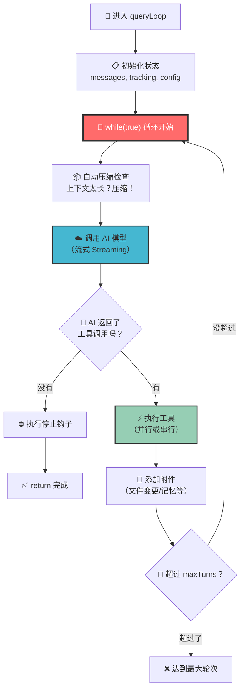
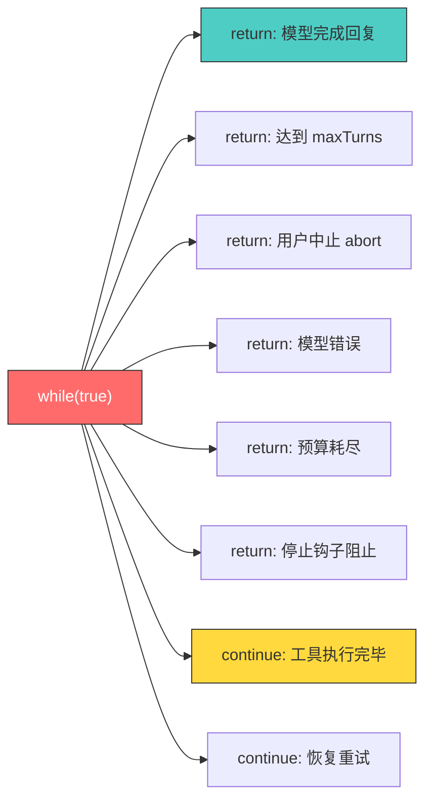
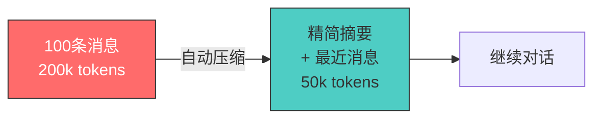
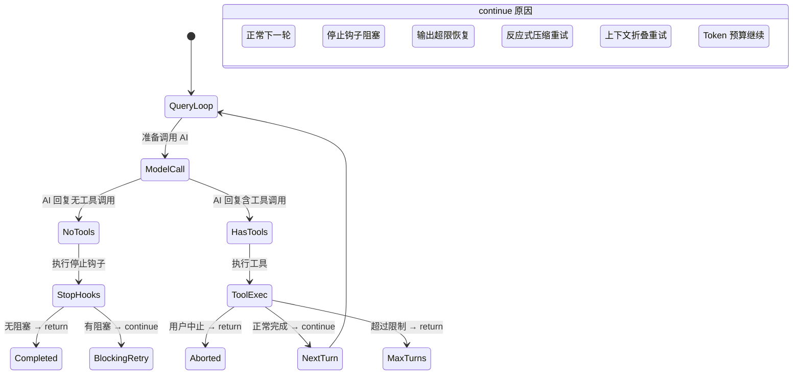
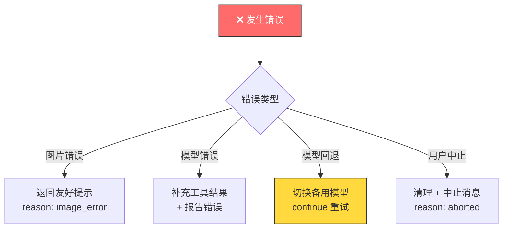

# 第2课：Agent Loop 核心循环详解

## 🎯 学习目标

学完本课，你将能够：

1. 理解 Agent Loop 的工作原理和 while(true) 循环的秘密
2. 掌握"调用模型 → 执行工具 → 再次调用"的核心流程
3. 了解循环的终止条件和状态转换机制
4. 理解自动压缩（Auto Compact）在循环中的作用
5. 能读懂 query.ts 中 queryLoop 函数的主体逻辑

---

## 一、生活类比：Agent Loop 就像厨师做菜

想象一个厨师在做一道复杂的菜：

1. **看菜谱**（读取系统提示词和历史消息）
2. **思考下一步**（调用 AI 模型，获得回复）
3. **动手操作**（切菜、炒菜 → 执行工具）
4. **尝一口**（检查结果）
5. **决定**：做完了吗？
   - 还没完 → 回到第2步继续
   - 做好了 → 出锅！

Agent Loop 就是这个"循环做菜"的过程。每一轮叫一个 **turn**（回合），循环会一直进行，直到 AI 说"我做完了"。

---

## 二、Agent Loop 整体架构



---

## 三、源码解析：queryLoop 函数

### 3.1 入口函数 query()

```typescript
// 源码文件：query.ts（第219-239行）
export async function* query(
  params: QueryParams,
): AsyncGenerator<
  StreamEvent | RequestStartEvent | Message | TombstoneMessage | ToolUseSummaryMessage,
  Terminal
> {
  const consumedCommandUuids: string[] = []
  const terminal = yield* queryLoop(params, consumedCommandUuids)
  for (const uuid of consumedCommandUuids) {
    notifyCommandLifecycle(uuid, 'completed')
  }
  return terminal
}
```

`query()` 是一个简单的外壳，真正的逻辑在 `queryLoop()` 里面。

### 3.2 循环状态 — State 对象

```typescript
// 源码文件：query.ts（第204-217行）
type State = {
  messages: Message[]              // 当前消息列表
  toolUseContext: ToolUseContext    // 工具执行上下文
  autoCompactTracking: AutoCompactTrackingState | undefined  // 压缩追踪
  maxOutputTokensRecoveryCount: number   // 输出超限恢复次数
  hasAttemptedReactiveCompact: boolean   // 是否尝试过反应式压缩
  maxOutputTokensOverride: number | undefined  // 输出 token 覆盖
  pendingToolUseSummary: Promise<ToolUseSummaryMessage | null> | undefined
  stopHookActive: boolean | undefined    // 停止钩子是否激活
  turnCount: number                      // 当前轮次
  transition: Continue | undefined       // 上一次的转换原因
}
```

**类比**：这就像厨师桌上的"状态板"——记录着当前做到哪一步了、用了多少食材、有没有失败过。

### 3.3 循环主体 — while(true) 的秘密

```typescript
// 源码文件：query.ts（第241-307行，简化版）
async function* queryLoop(params, consumedCommandUuids) {
  // 初始化状态
  let state: State = {
    messages: params.messages,
    toolUseContext: params.toolUseContext,
    turnCount: 1,
    // ...
  }

  const config = buildQueryConfig()  // 快照环境配置

  // 预取记忆
  using pendingMemoryPrefetch = startRelevantMemoryPrefetch(
    state.messages,
    state.toolUseContext,
  )

  while (true) {
    // ① 解构状态
    let { toolUseContext } = state
    const { messages, turnCount, ... } = state

    // ② 压缩检查
    // ③ 调用 AI 模型
    // ④ 执行工具
    // ⑤ 决定是否继续

    // 如果需要继续，更新 state 并 continue
    state = { ...next }
  }
}
```

注意这里的 `while (true)` — 它**并不是**一个死循环！有多种条件可以终止它：



---

## 四、循环的六个阶段

### 阶段 1：上下文压缩

在每次调用 AI 之前，系统会检查消息列表是否太长，需要压缩：

```typescript
// 源码文件：query.ts（第453-468行）
const { compactionResult, consecutiveFailures } = await deps.autocompact(
  messagesForQuery,
  toolUseContext,
  {
    systemPrompt,
    userContext,
    systemContext,
    toolUseContext,
    forkContextMessages: messagesForQuery,
  },
  querySource,
  tracking,
  snipTokensFreed,
)
```

**类比**：做菜做到一半，桌子上堆满了食材和半成品。管家来帮你收拾桌面，把不需要的东西打包存好（压缩历史消息），腾出空间继续工作。



### 阶段 2：调用 AI 模型（流式响应）

```typescript
// 源码文件：query.ts（第659-708行，简化版）
for await (const message of deps.callModel({
  messages: prependUserContext(messagesForQuery, userContext),
  systemPrompt: fullSystemPrompt,
  thinkingConfig: toolUseContext.options.thinkingConfig,
  tools: toolUseContext.options.tools,
  signal: toolUseContext.abortController.signal,
  options: {
    model: currentModel,
    fallbackModel,
    querySource,
    // ...
  },
})) {
  // 处理流式返回的每一条消息
  if (message.type === 'assistant') {
    assistantMessages.push(message)
    // 检查是否包含工具调用
    const msgToolUseBlocks = message.message.content.filter(
      content => content.type === 'tool_use',
    )
    if (msgToolUseBlocks.length > 0) {
      toolUseBlocks.push(...msgToolUseBlocks)
      needsFollowUp = true  // 标记需要后续处理
    }
  }
}
```

### 阶段 3：判断是否需要执行工具

```typescript
// 源码文件：query.ts（第1062行）
if (!needsFollowUp) {
  // 没有工具调用 → 准备结束
  // 执行停止钩子检查...
  return { reason: 'completed' }
}
```

这是 Agent Loop 最关键的分支点：
- **needsFollowUp = false**：AI 没有请求使用工具 → 对话结束
- **needsFollowUp = true**：AI 请求使用工具 → 执行工具后继续循环

### 阶段 4：执行工具

```typescript
// 源码文件：query.ts（第1380-1408行）
const toolUpdates = streamingToolExecutor
  ? streamingToolExecutor.getRemainingResults()      // 流式工具执行器
  : runTools(toolUseBlocks, assistantMessages, canUseTool, toolUseContext)

for await (const update of toolUpdates) {
  if (update.message) {
    yield update.message      // 产出工具执行结果
    toolResults.push(...)     // 收集结果
  }
  if (update.newContext) {
    updatedToolUseContext = { ...update.newContext }
  }
}
```

### 阶段 5：添加附件和检查

工具执行完毕后，系统会：

```typescript
// 源码文件：query.ts（第1580-1590行）
// 获取附件（文件变更、记忆注入等）
for await (const attachment of getAttachmentMessages(
  null,
  updatedToolUseContext,
  null,
  queuedCommandsSnapshot,
  [...messagesForQuery, ...assistantMessages, ...toolResults],
  querySource,
)) {
  yield attachment
  toolResults.push(attachment)
}
```

### 阶段 6：构建下一轮状态

```typescript
// 源码文件：query.ts（第1715-1728行）
const next: State = {
  messages: [...messagesForQuery, ...assistantMessages, ...toolResults],
  toolUseContext: toolUseContextWithQueryTracking,
  autoCompactTracking: tracking,
  turnCount: nextTurnCount,
  maxOutputTokensRecoveryCount: 0,
  hasAttemptedReactiveCompact: false,
  pendingToolUseSummary: nextPendingToolUseSummary,
  maxOutputTokensOverride: undefined,
  stopHookActive,
  transition: { reason: 'next_turn' },
}
state = next
// while(true) 回到顶部，开始下一轮
```

---

## 五、状态转换图：循环怎样"继续"或"结束"



每次 `continue` 都会设置 `transition.reason`，标记为什么继续循环。这对调试非常有用。

---

## 六、QueryParams — 循环的输入参数

```typescript
// 源码文件：query.ts（第181-199行）
export type QueryParams = {
  messages: Message[]           // 历史消息
  systemPrompt: SystemPrompt    // 系统提示词
  userContext: { [k: string]: string }   // 用户上下文
  systemContext: { [k: string]: string } // 系统上下文
  canUseTool: CanUseToolFn      // 工具权限检查
  toolUseContext: ToolUseContext // 工具使用上下文
  fallbackModel?: string        // 备用模型
  querySource: QuerySource      // 查询来源标识
  maxTurns?: number             // 最大轮次
  taskBudget?: { total: number } // 任务预算
}
```

---

## 七、错误处理：循环中的"意外"

循环中可能发生多种错误，queryLoop 对它们有不同的处理策略：

```typescript
// 源码文件：query.ts（第955-997行）
} catch (error) {
  logError(error)

  // 图片大小/缩放错误 → 友好提示
  if (error instanceof ImageSizeError || error instanceof ImageResizeError) {
    yield createAssistantAPIErrorMessage({ content: error.message })
    return { reason: 'image_error' }
  }

  // 其他错误 → 补充缺失的工具结果 + 报告错误
  yield* yieldMissingToolResultBlocks(assistantMessages, errorMessage)
  yield createAssistantAPIErrorMessage({ content: errorMessage })
  return { reason: 'model_error', error }
}
```



---

## 八、maxTurns — 安全阀

为了防止 AI 无限循环，queryLoop 有一个安全阀：

```typescript
// 源码文件：query.ts（第1704-1712行）
// 检查是否达到最大轮次
if (maxTurns && nextTurnCount > maxTurns) {
  yield createAttachmentMessage({
    type: 'max_turns_reached',
    maxTurns,
    turnCount: nextTurnCount,
  })
  return { reason: 'max_turns', turnCount: nextTurnCount }
}
```

**类比**：就像厨师有一个计时器——"最多炒30分钟，不管做没做完都要出锅"。这保证了系统不会因为 AI 的无限循环而耗尽资源。

---

## 九、动手练习

### 练习 1：追踪一次完整的循环

假设用户输入 "读取 package.json 并告诉我项目名称"，请画出这个请求在 queryLoop 中经历的完整路径：
1. 第1轮：AI 决定使用什么工具？
2. 工具返回什么结果？
3. 第2轮：AI 如何生成最终回复？
4. 循环如何终止？

### 练习 2：分析 transition 原因

在 query.ts 中找到所有 `transition: { reason: '...' }` 的位置，列出所有可能的 transition reason，并解释每个的触发条件。

### 练习 3：思考题

1. 为什么 queryLoop 用 `while(true)` 而不是递归？（提示：考虑内存和调用栈）
2. 如果 AI 持续返回工具调用但 maxTurns 没有设置，会发生什么？
3. `pendingMemoryPrefetch` 使用了 `using` 关键字，这是 TypeScript/JavaScript 的什么特性？

---

## 十、本课小结

| 概念 | 一句话理解 |
|------|-----------|
| Agent Loop | QueryEngine 的"心跳"，不断循环直到任务完成 |
| queryLoop | 核心循环函数，使用 while(true) 驱动 |
| State | 循环的可变状态，在每轮之间传递 |
| needsFollowUp | 决定循环继续还是结束的关键标志 |
| transition | 记录循环继续的原因 |
| maxTurns | 安全阀，防止无限循环 |
| autocompact | 自动压缩，保持上下文在限制范围内 |

### 核心公式

```
Agent Loop = while(true) {
    压缩 → 调用AI → 有工具? → 执行工具 → 更新状态 → continue
                       ↓
                    无工具 → return 完成
}
```

---

## 📖 下节预告

在第3课 **系统提示词构建：Git + CLAUDE.md + 工具** 中，我们将深入探索 AI 收到的"角色说明书"是如何一步步构建出来的：
- Git 状态信息怎样被注入
- CLAUDE.md 文件的发现和加载机制
- 工具列表如何变成提示词的一部分
- 用户上下文和系统上下文的拼接逻辑

了解提示词构建，你就能理解为什么 Claude Code 知道你的项目结构！
