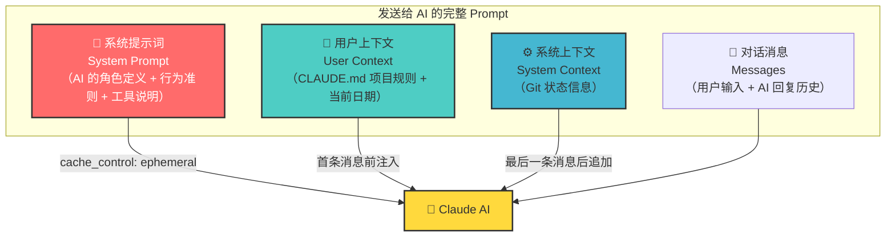
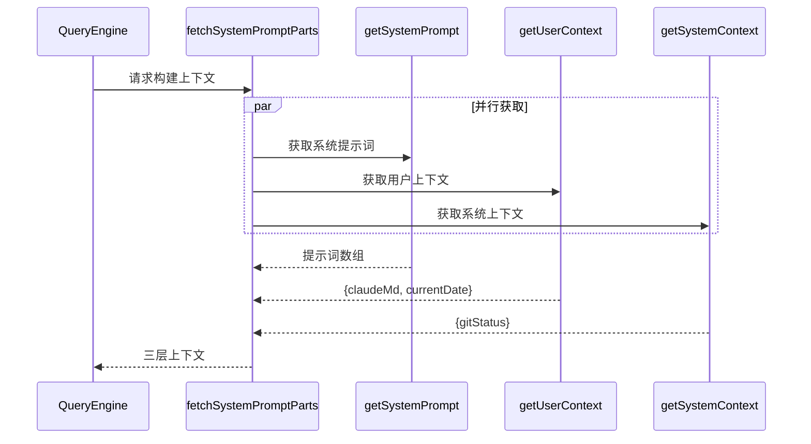
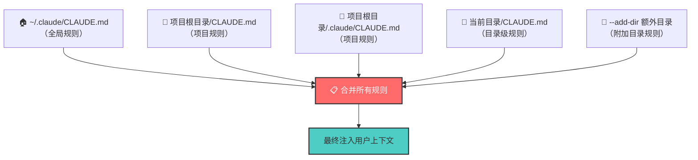
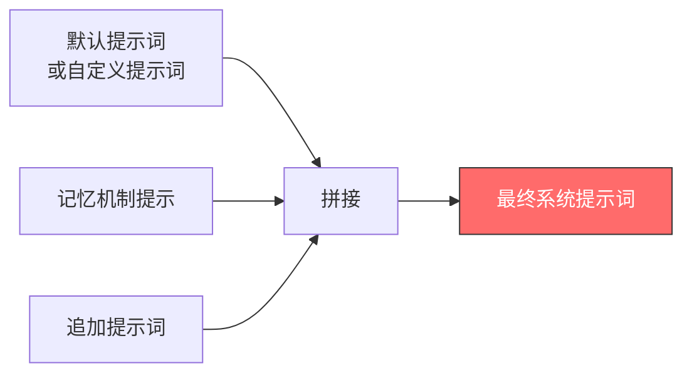
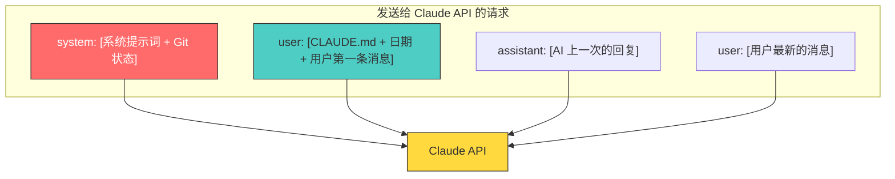

# 第3课：系统提示词构建：Git + CLAUDE.md + 工具

## 🎯 学习目标

学完本课，你将能够：

1. 理解系统提示词在 AI 对话中的关键作用
2. 掌握三层上下文（系统提示词/用户上下文/系统上下文）的构建流程
3. 了解 Git 状态信息如何被注入上下文
4. 理解 CLAUDE.md 文件的发现、加载和合并机制
5. 知道工具描述如何变成提示词的一部分

---

## 一、生活类比：提示词就像演员的角色说明

想象你是一个导演，要给演员一份"角色说明书"：

- **第一页：你是谁**（系统提示词 — "你是一个专业的编程助手"）
- **第二页：你在哪里**（系统上下文 — Git 状态、当前日期）
- **第三页：项目规则**（用户上下文 — CLAUDE.md 项目规则）
- **第四页：你能做什么**（工具描述 — 可用工具列表）

每次 AI 收到你的问题时，它同时也收到了这份完整的"角色说明书"。这就是为什么 Claude Code 能理解你的项目结构和代码规范。

---

## 二、三层上下文架构



---

## 三、源码解析：fetchSystemPromptParts

整个构建过程从 `fetchSystemPromptParts` 开始：

```typescript
// 源码文件：utils/queryContext.ts（第44-74行）
export async function fetchSystemPromptParts({
  tools,
  mainLoopModel,
  additionalWorkingDirectories,
  mcpClients,
  customSystemPrompt,
}: { /* ... */ }): Promise<{
  defaultSystemPrompt: string[]
  userContext: { [k: string]: string }
  systemContext: { [k: string]: string }
}> {
  const [defaultSystemPrompt, userContext, systemContext] = await Promise.all([
    customSystemPrompt !== undefined
      ? Promise.resolve([])
      : getSystemPrompt(tools, mainLoopModel, additionalWorkingDirectories, mcpClients),
    getUserContext(),
    customSystemPrompt !== undefined ? Promise.resolve({}) : getSystemContext(),
  ])
  return { defaultSystemPrompt, userContext, systemContext }
}
```

注意 `Promise.all` — 三个上下文是**并行获取**的，这样可以加速启动。



---

## 四、系统上下文：Git 状态信息

### 4.1 getSystemContext

```typescript
// 源码文件：context.ts（第116-150行）
export const getSystemContext = memoize(
  async (): Promise<{ [k: string]: string }> => {
    // 跳过 CCR（远程）或禁用 Git 的情况
    const gitStatus =
      isEnvTruthy(process.env.CLAUDE_CODE_REMOTE) ||
      !shouldIncludeGitInstructions()
        ? null
        : await getGitStatus()

    return {
      ...(gitStatus && { gitStatus }),
    }
  },
)
```

注意 `memoize` — 系统上下文在整个对话期间只构建**一次**，后续使用缓存。

### 4.2 getGitStatus — 读取 Git 信息

```typescript
// 源码文件：context.ts（第36-111行）
export const getGitStatus = memoize(async (): Promise<string | null> => {
  const isGit = await getIsGit()
  if (!isGit) return null

  try {
    const [branch, mainBranch, status, log, userName] = await Promise.all([
      getBranch(),            // 当前分支
      getDefaultBranch(),     // 主分支
      execFileNoThrow(gitExe(), ['--no-optional-locks', 'status', '--short'], ...),
      execFileNoThrow(gitExe(), ['--no-optional-locks', 'log', '--oneline', '-n', '5'], ...),
      execFileNoThrow(gitExe(), ['config', 'user.name'], ...),
    ])

    // 截断过长的 status（最多 2000 字符）
    const truncatedStatus = status.length > MAX_STATUS_CHARS
      ? status.substring(0, MAX_STATUS_CHARS) + '\n... (truncated...)'
      : status

    return [
      `This is the git status at the start of the conversation...`,
      `Current branch: ${branch}`,
      `Main branch: ${mainBranch}`,
      ...(userName ? [`Git user: ${userName}`] : []),
      `Status:\n${truncatedStatus || '(clean)'}`,
      `Recent commits:\n${log}`,
    ].join('\n\n')
  } catch (error) {
    logError(error)
    return null
  }
})
```

**类比**：这就像管家先检查你的工作环境——"主人，您目前在 feature/login 分支上，有3个文件未提交，最近改了登录页面。"

Git 状态最终会包含：

| 信息 | 来源 | 用途 |
|------|------|------|
| 当前分支 | `git branch --show-current` | AI 知道在哪个分支工作 |
| 主分支 | `git config init.defaultBranch` | AI 知道 PR 该往哪里合 |
| 文件状态 | `git status --short` | AI 知道哪些文件改了 |
| 最近提交 | `git log --oneline -n 5` | AI 了解最近的变更 |
| 用户名 | `git config user.name` | AI 知道提交者是谁 |

---

## 五、用户上下文：CLAUDE.md 和日期

### 5.1 getUserContext

```typescript
// 源码文件：context.ts（第155-189行）
export const getUserContext = memoize(
  async (): Promise<{ [k: string]: string }> => {
    // 检查是否禁用 CLAUDE.md
    const shouldDisableClaudeMd =
      isEnvTruthy(process.env.CLAUDE_CODE_DISABLE_CLAUDE_MDS) ||
      (isBareMode() && getAdditionalDirectoriesForClaudeMd().length === 0)

    const claudeMd = shouldDisableClaudeMd
      ? null
      : getClaudeMds(filterInjectedMemoryFiles(await getMemoryFiles()))

    // 缓存供其他模块使用
    setCachedClaudeMdContent(claudeMd || null)

    return {
      ...(claudeMd && { claudeMd }),
      currentDate: `Today's date is ${getLocalISODate()}.`,
    }
  },
)
```

### 5.2 CLAUDE.md 的加载层次

CLAUDE.md 是项目级的"规则文件"，Claude Code 会在多个位置搜索它：



CLAUDE.md 的内容可以包含：

```markdown
# CLAUDE.md 示例

## 项目约定
- 使用 TypeScript 编写所有代码
- 所有函数必须有 JSDoc 注释
- 测试覆盖率不低于 80%

## 代码风格
- 缩进使用 2 个空格
- 文件名使用 camelCase
```

---

## 六、系统提示词：角色定义 + 行为准则

### 6.1 在 QueryEngine 中的组装

```typescript
// 源码文件：QueryEngine.ts（第321-325行）
const systemPrompt = asSystemPrompt([
  ...(customPrompt !== undefined ? [customPrompt] : defaultSystemPrompt),
  ...(memoryMechanicsPrompt ? [memoryMechanicsPrompt] : []),
  ...(appendSystemPrompt ? [appendSystemPrompt] : []),
])
```

最终的系统提示词是多段内容**拼接**而成的：



### 6.2 getSystemPrompt — 默认提示词的构成

在 `constants/prompts.ts` 中，默认系统提示词由多个 section 组成：

```typescript
// 源码文件：constants/prompts.ts（简化概念）
export async function getSystemPrompt(
  tools: Tools,
  mainLoopModel: string,
  additionalWorkingDirectories: string[],
  mcpClients: MCPServerConnection[],
): Promise<string[]> {
  return resolveSystemPromptSections([
    // 核心身份和行为准则
    systemPromptSection('identity', identityPrompt),
    // 工具使用说明
    systemPromptSection('tools', toolsPrompt(tools)),
    // 工作环境信息
    systemPromptSection('environment', envPrompt(mainLoopModel)),
    // MCP 服务器信息
    systemPromptSection('mcp', mcpPrompt(mcpClients)),
    // 更多 section...
  ])
}
```

---

## 七、上下文如何注入 API 请求

### 7.1 用户上下文注入

```typescript
// 源码文件：query.ts（第660行）
messages: prependUserContext(messagesForQuery, userContext),
```

`prependUserContext` 会将用户上下文（CLAUDE.md + 日期）插入到第一条用户消息**之前**，作为一条特殊的用户消息。

### 7.2 系统上下文注入

```typescript
// 源码文件：query.ts（第449-451行）
const fullSystemPrompt = asSystemPrompt(
  appendSystemContext(systemPrompt, systemContext),
)
```

`appendSystemContext` 将 Git 状态等信息追加到系统提示词的**末尾**。

### 完整的请求结构



---

## 八、缓存优化：memoize 的妙用

注意 `getUserContext` 和 `getSystemContext` 都用了 `memoize`：

```typescript
export const getUserContext = memoize(async () => { ... })
export const getSystemContext = memoize(async () => { ... })
```

这意味着：
- **首次调用**：执行 Git 命令、读取 CLAUDE.md 文件
- **后续调用**：直接返回缓存结果

**类比**：管家第一天上班时会仔细检查整个家，之后每天就不需要重复检查了——除非主人搬了家。

但也有例外——如果需要刷新缓存：

```typescript
// 源码文件：context.ts（第29-34行）
export function setSystemPromptInjection(value: string | null): void {
  systemPromptInjection = value
  getUserContext.cache.clear?.()    // 清除缓存
  getSystemContext.cache.clear?.()  // 清除缓存
}
```

---

## 九、特殊场景处理

### 9.1 自定义系统提示词

当使用 SDK 且设置了 `customSystemPrompt` 时，默认提示词和系统上下文都被跳过：

```typescript
// 源码文件：utils/queryContext.ts（第61-72行）
const [defaultSystemPrompt, userContext, systemContext] = await Promise.all([
  customSystemPrompt !== undefined
    ? Promise.resolve([])           // 跳过默认提示词
    : getSystemPrompt(tools, ...),
  getUserContext(),                   // 用户上下文总是获取
  customSystemPrompt !== undefined
    ? Promise.resolve({})           // 跳过系统上下文
    : getSystemContext(),
])
```

### 9.2 Bare 模式

`--bare` 模式会跳过 CLAUDE.md 的自动发现，但仍尊重 `--add-dir` 指定的目录：

```typescript
// 源码文件：context.ts（第165-167行）
const shouldDisableClaudeMd =
  isEnvTruthy(process.env.CLAUDE_CODE_DISABLE_CLAUDE_MDS) ||
  (isBareMode() && getAdditionalDirectoriesForClaudeMd().length === 0)
```

---

## 十、动手练习

### 练习 1：检查你的 Git 状态

在你的项目目录运行以下命令，对比 Claude Code 注入的 Git 信息：

```bash
git branch --show-current
git status --short
git log --oneline -n 5
git config user.name
```

### 练习 2：创建 CLAUDE.md

在你的项目根目录创建一个 `CLAUDE.md`，写入一些项目规则，然后启动 Claude Code 观察它是否被加载。

### 练习 3：思考题

1. 为什么 Git 状态要在对话开始时获取一次就够了（memoize），而不是每轮都刷新？
2. CLAUDE.md 支持 `@include` 引用外部文件，这可能带来什么安全风险？
3. 如果你要给系统提示词添加一个新的 section（比如"代码审查规则"），你需要修改哪些文件？

---

## 十一、本课小结

| 概念 | 一句话理解 |
|------|-----------|
| System Prompt | AI 的角色定义和行为准则 |
| User Context | CLAUDE.md 项目规则 + 当前日期 |
| System Context | Git 状态信息（分支/提交/变更） |
| fetchSystemPromptParts | 三层上下文的并行获取入口 |
| memoize | 缓存策略，对话期间只构建一次 |
| asSystemPrompt | 将多段文本拼接为最终提示词 |

### 核心公式

```
最终提示词 = (默认提示词 | 自定义提示词)
           + 记忆机制提示
           + 追加提示词
           + Git 状态（系统上下文）
           + CLAUDE.md + 日期（用户上下文）
```

---

## 📖 下节预告

在第4课 **流式响应 Streaming 源码解析** 中，我们将探索 Claude Code 是如何实现"打字机效果"的：
- 什么是 Server-Sent Events (SSE)
- 流式响应中的消息类型（message_start/content_block_delta/message_delta）
- 如何在流式过程中同时开始执行工具
- 流式响应与 AsyncGenerator 的完美搭配

这是理解 Claude Code 实时交互体验的关键！
