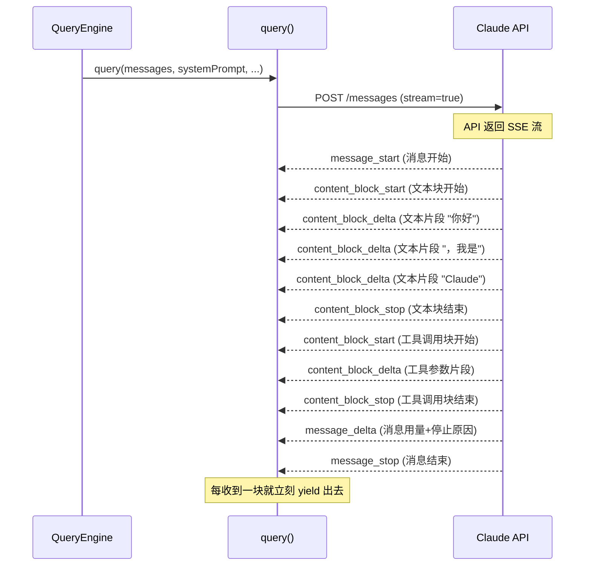
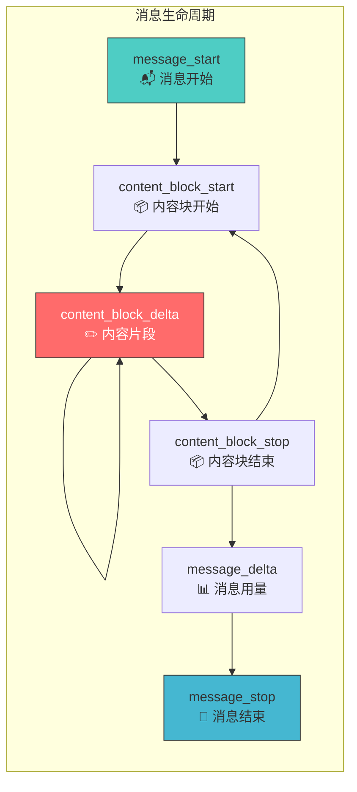
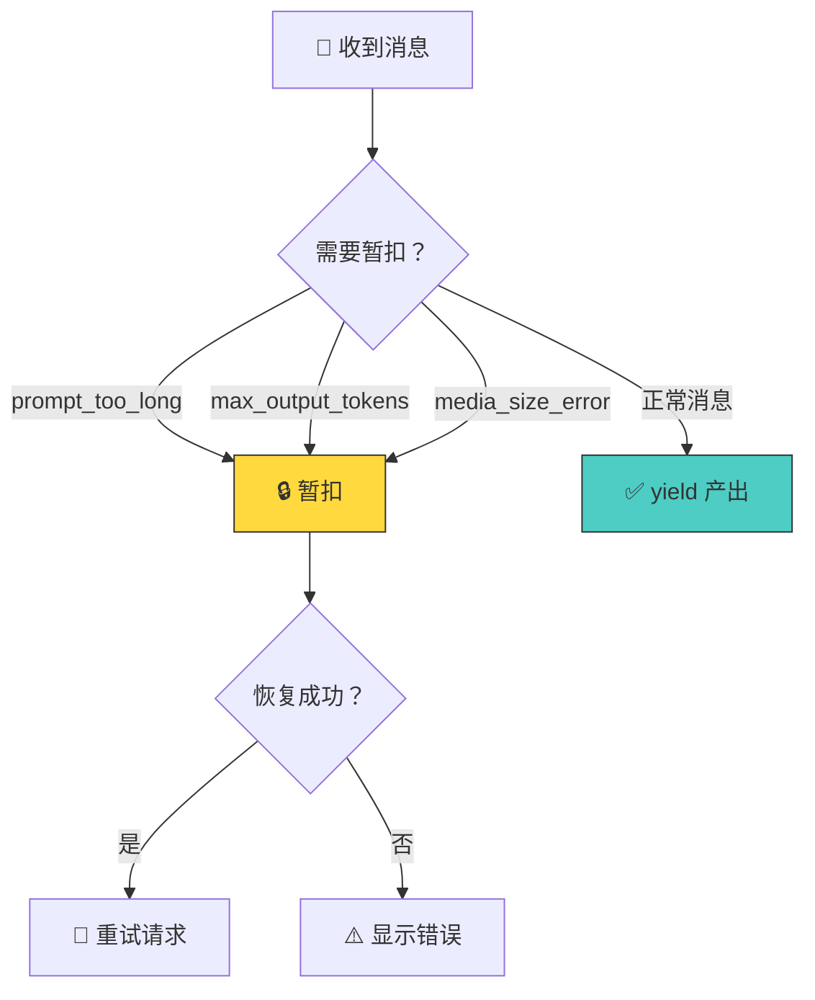
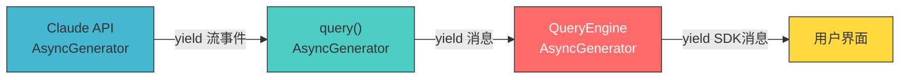
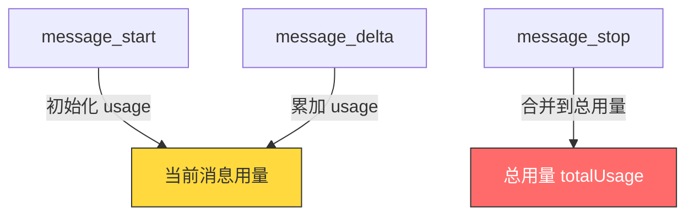
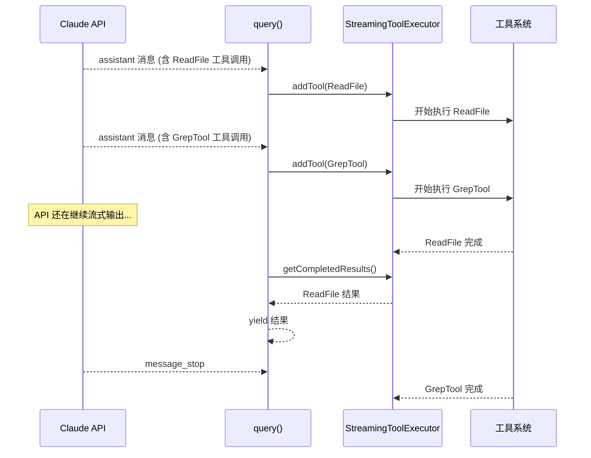

# 第4课：流式响应 Streaming 源码解析

## 🎯 学习目标

学完本课，你将能够：

1. 理解流式响应的必要性和工作原理
2. 掌握 Claude API 流式事件的类型和生命周期
3. 了解 query.ts 中如何处理流式消息
4. 理解 AsyncGenerator 在流式传输中的作用
5. 知道流式过程中如何同步启动工具执行

---

## 一、生活类比：流式响应就像自来水

传统的请求-响应模式像是打井水——你得等水桶装满才能用：

```
❌ 传统模式：发送请求 → 等待10秒 → 一次性收到全部回复
```

流式响应则像自来水——打开水龙头，水就持续流出来：

```
✅ 流式模式：发送请求 → 立刻开始收到文字 → 持续流入 → 完成
                         "你"  "好"  "，"  "我"  "是"  "Claude"  ...
```

这就是为什么 Claude Code 能像"打字"一样逐字显示回复，而不用让你干等几秒钟。

---

## 二、流式响应全景图



---

## 三、流式事件的六种类型



| 事件类型 | 说明 | 关键数据 |
|---------|------|---------|
| `message_start` | 新消息开始 | model, usage |
| `content_block_start` | 内容块开始 | 类型（text/tool_use/thinking） |
| `content_block_delta` | 内容增量 | 文本片段/工具参数片段 |
| `content_block_stop` | 内容块结束 | 块索引 |
| `message_delta` | 消息元信息 | stop_reason, usage |
| `message_stop` | 消息结束 | - |

---

## 四、源码解析：queryLoop 中的流式处理

### 4.1 发起流式请求

```typescript
// 源码文件：query.ts（第659-708行）
for await (const message of deps.callModel({
  messages: prependUserContext(messagesForQuery, userContext),
  systemPrompt: fullSystemPrompt,
  thinkingConfig: toolUseContext.options.thinkingConfig,
  tools: toolUseContext.options.tools,
  signal: toolUseContext.abortController.signal,
  options: {
    model: currentModel,
    fallbackModel,
    querySource,
    // ...
  },
})) {
  // 处理每一条流式消息
}
```

`deps.callModel` 返回一个 `AsyncGenerator`，每产出一条消息，`for await` 就会执行一次循环体。

### 4.2 处理流式消息

在循环体中，消息被分类处理：

```typescript
// 源码文件：query.ts（第747-863行，简化版）
for await (const message of deps.callModel({ ... })) {
  // 处理回退
  if (streamingFallbackOccured) {
    assistantMessages.length = 0  // 清空之前的结果
    toolResults.length = 0
    // ...
  }

  // 判断是否应该暂扣
  let withheld = false
  if (reactiveCompact?.isWithheldPromptTooLong(message)) {
    withheld = true  // 暂扣 prompt-too-long 错误
  }
  if (isWithheldMaxOutputTokens(message)) {
    withheld = true  // 暂扣 max-output-tokens 错误
  }

  // 如果不需暂扣，立即产出
  if (!withheld) {
    yield yieldMessage
  }

  // 收集 assistant 消息和工具调用
  if (message.type === 'assistant') {
    assistantMessages.push(message)
    const msgToolUseBlocks = message.message.content
      .filter(content => content.type === 'tool_use')
    if (msgToolUseBlocks.length > 0) {
      toolUseBlocks.push(...msgToolUseBlocks)
      needsFollowUp = true
    }
  }
}
```

**类比**：就像接收快递——快递员（API）不断送来包裹（消息），你每收到一个就立刻拆开检查（处理）并转交给收件人（yield 给上层）。

### 4.3 暂扣机制

某些错误消息会被"暂扣"（withheld），不立即产出：



为什么要暂扣？因为有些"错误"是可以恢复的——比如上下文太长可以压缩后重试。如果立即把错误传给用户，等恢复成功后用户就会看到一个"虚假"的错误。

---

## 五、AsyncGenerator — 流式传输的语言基础

### 5.1 什么是 AsyncGenerator

```typescript
// 普通函数：一次返回一个值
function getNumber(): number {
  return 42
}

// Generator：可以多次产出值
function* getNumbers(): Generator<number> {
  yield 1
  yield 2
  yield 3
}

// AsyncGenerator：可以异步地多次产出值
async function* getNumbersAsync(): AsyncGenerator<number> {
  yield await fetchNumber1()
  yield await fetchNumber2()
  yield await fetchNumber3()
}
```

### 5.2 在 Claude Code 中的应用

整个消息流是一个 AsyncGenerator 链条：



```typescript
// 层层嵌套的 yield* 语法
// QueryEngine.ts
for await (const message of query({ ... })) {
  yield* normalizeMessage(message)  // yield* 将内部 generator 的所有值透传
}

// query.ts
for await (const message of deps.callModel({ ... })) {
  yield message  // 每条消息都 yield 出去
}
```

---

## 六、流式过程中的 Usage 追踪

### 6.1 QueryEngine 中的 usage 累积

```typescript
// 源码文件：QueryEngine.ts（第788-816行）
case 'stream_event':
  if (message.event.type === 'message_start') {
    // 新消息开始，重置当前消息用量
    currentMessageUsage = EMPTY_USAGE
    currentMessageUsage = updateUsage(
      currentMessageUsage,
      message.event.message.usage,
    )
  }
  if (message.event.type === 'message_delta') {
    // 消息增量，更新用量
    currentMessageUsage = updateUsage(
      currentMessageUsage,
      message.event.usage,
    )
    // 捕获停止原因
    if (message.event.delta.stop_reason != null) {
      lastStopReason = message.event.delta.stop_reason
    }
  }
  if (message.event.type === 'message_stop') {
    // 消息结束，累积到总用量
    this.totalUsage = accumulateUsage(
      this.totalUsage,
      currentMessageUsage,
    )
  }
```



---

## 七、流式工具执行 — 边流边跑

Claude Code 有一个巧妙的优化：在 AI 回复还在流式传输的过程中，已经可以开始执行工具了！

```typescript
// 源码文件：query.ts（第836-862行）
if (message.type === 'assistant') {
  // ...收集工具调用块
  if (streamingToolExecutor && !toolUseContext.abortController.signal.aborted) {
    for (const toolBlock of msgToolUseBlocks) {
      // 流式过程中就开始执行工具！
      streamingToolExecutor.addTool(toolBlock, message)
    }
  }
}

// 同时检查已完成的工具结果
if (streamingToolExecutor && !toolUseContext.abortController.signal.aborted) {
  for (const result of streamingToolExecutor.getCompletedResults()) {
    if (result.message) {
      yield result.message      // 立即产出完成的结果
      toolResults.push(...)
    }
  }
}
```



这就是为什么 Claude Code 感觉很快——它不会等到 AI 说完所有的话才开始干活，而是"边说边干"。

---

## 八、流式回退机制

有时候主模型不可用，需要回退到备用模型：

```typescript
// 源码文件：query.ts（第710-741行）
if (streamingFallbackOccured) {
  // 清理已产出的孤立消息
  for (const msg of assistantMessages) {
    yield { type: 'tombstone' as const, message: msg }  // 标记为墓碑
  }

  assistantMessages.length = 0   // 清空
  toolResults.length = 0
  toolUseBlocks.length = 0
  needsFollowUp = false

  // 重建工具执行器
  if (streamingToolExecutor) {
    streamingToolExecutor.discard()  // 丢弃旧的
    streamingToolExecutor = new StreamingToolExecutor(...)  // 创建新的
  }
}
```

**类比**：你点了外卖A，送到一半说没了，换了外卖B重新送。已经送到的那部分（tombstone）要标记作废，从头开始用外卖B。

---

## 九、信号中止 — 紧急刹车

```typescript
// 源码文件：query.ts（第1015-1051行）
if (toolUseContext.abortController.signal.aborted) {
  if (streamingToolExecutor) {
    // 收集剩余结果（生成合成的 tool_result）
    for await (const update of streamingToolExecutor.getRemainingResults()) {
      if (update.message) {
        yield update.message
      }
    }
  } else {
    yield* yieldMissingToolResultBlocks(
      assistantMessages,
      'Interrupted by user',
    )
  }
  yield createUserInterruptionMessage({ toolUse: false })
  return { reason: 'aborted_streaming' }
}
```

当用户按 Ctrl+C 或 ESC 时，`abortController` 发出中止信号。此时流式过程需要：
1. 停止接收 API 数据
2. 为已发出但未完成的工具调用生成合成的 `tool_result`
3. 优雅地退出循环

---

## 十、动手练习

### 练习 1：理解流式事件顺序

如果 AI 的回复包含一段文字和一个工具调用，请画出完整的流式事件序列（从 message_start 到 message_stop）。

### 练习 2：跟踪 yield 链

从 `deps.callModel` 的第一个 `yield`，追踪到最终用户看到文字的整个 yield 链。列出经过的每一层函数。

### 练习 3：思考题

1. 为什么流式传输要使用 `for await...of` 而不是回调函数（callback）？
2. 如果流式过程中网络断开，会发生什么？系统如何恢复？
3. "暂扣"机制可能导致用户在恢复期间看不到任何输出，这种体验如何优化？

---

## 十一、本课小结

| 概念 | 一句话理解 |
|------|-----------|
| 流式响应 | 像自来水一样持续流入，而非一桶桶运 |
| SSE 事件 | API 返回的流式事件序列 |
| AsyncGenerator | 异步生成器，流式传输的语言基础 |
| yield/yield* | 产出值/透传内部生成器的值 |
| 暂扣机制 | 延迟错误产出，等待恢复尝试 |
| 流式工具执行 | 边接收 AI 回复边开始执行工具 |
| tombstone | 回退时清理已产出的消息 |

### 核心公式

```
流式响应 = for await (消息 of callModel()) {
    暂扣检查 → yield 消息 → 收集工具 → 流式启动工具
}
```

---

## 📖 下节预告

在第5课 **StreamingToolExecutor 并行工具执行** 中，我们将深入"边流边执行"的核心组件：
- StreamingToolExecutor 的队列管理
- 并发安全（isConcurrencySafe）的判断逻辑
- 错误级联和兄弟工具取消
- 进度消息的即时传递

这是 Claude Code 性能优化的核心武器！
