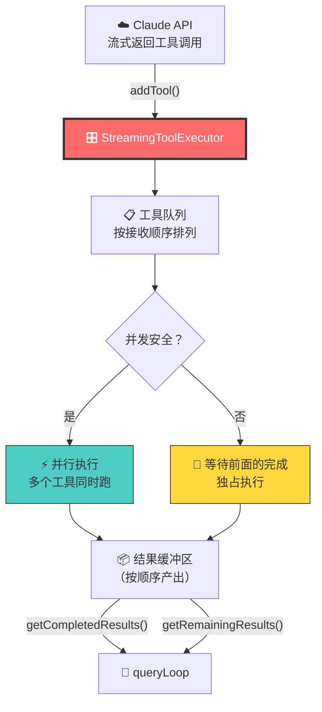
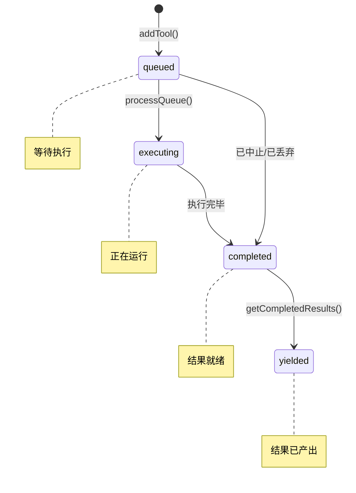
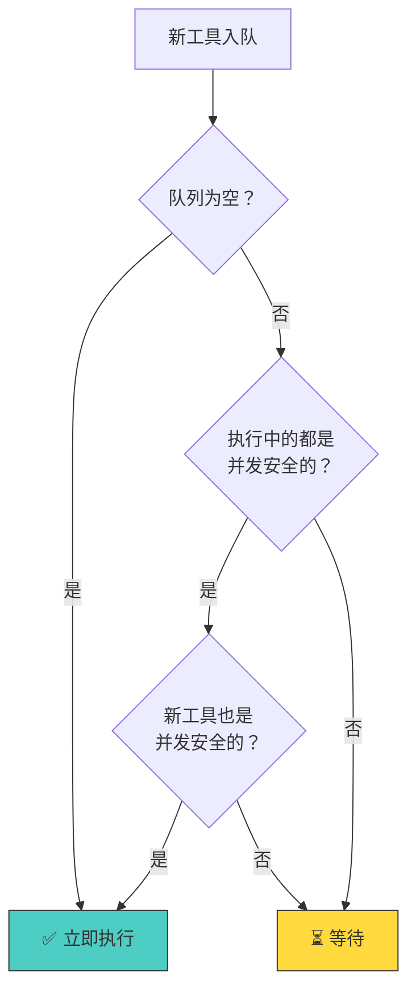
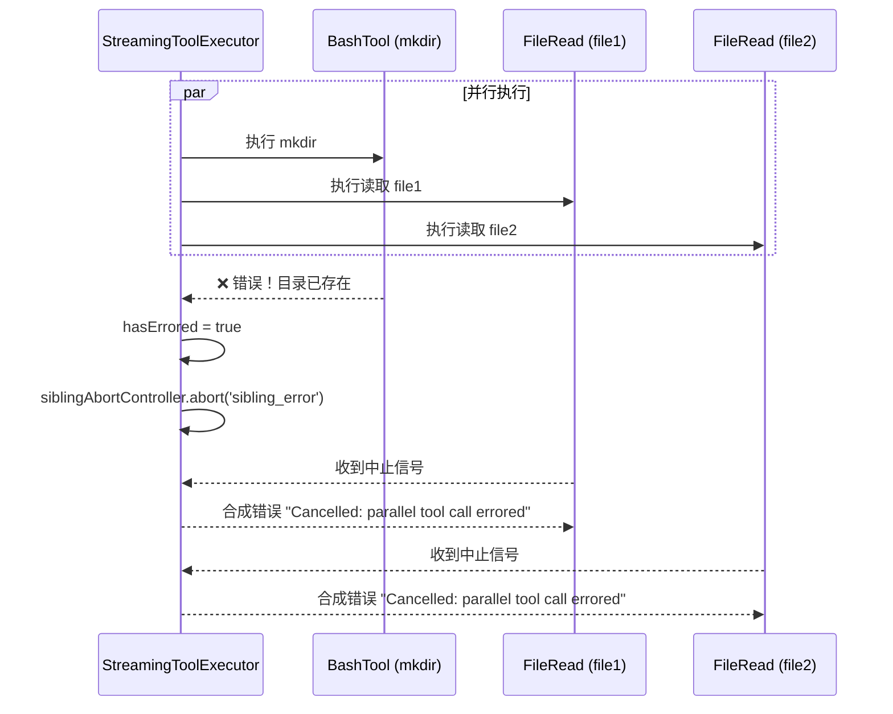
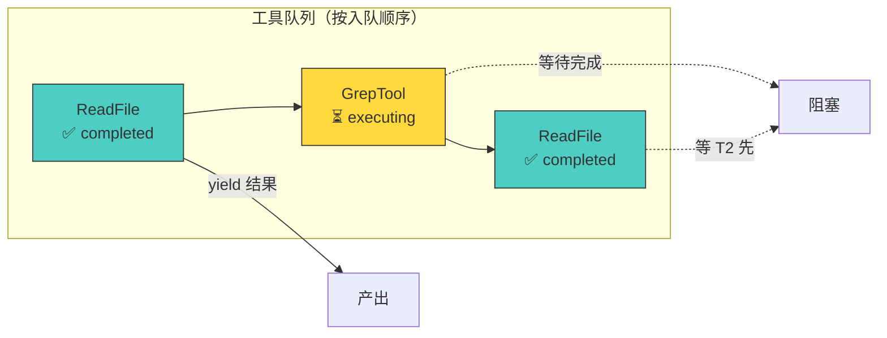
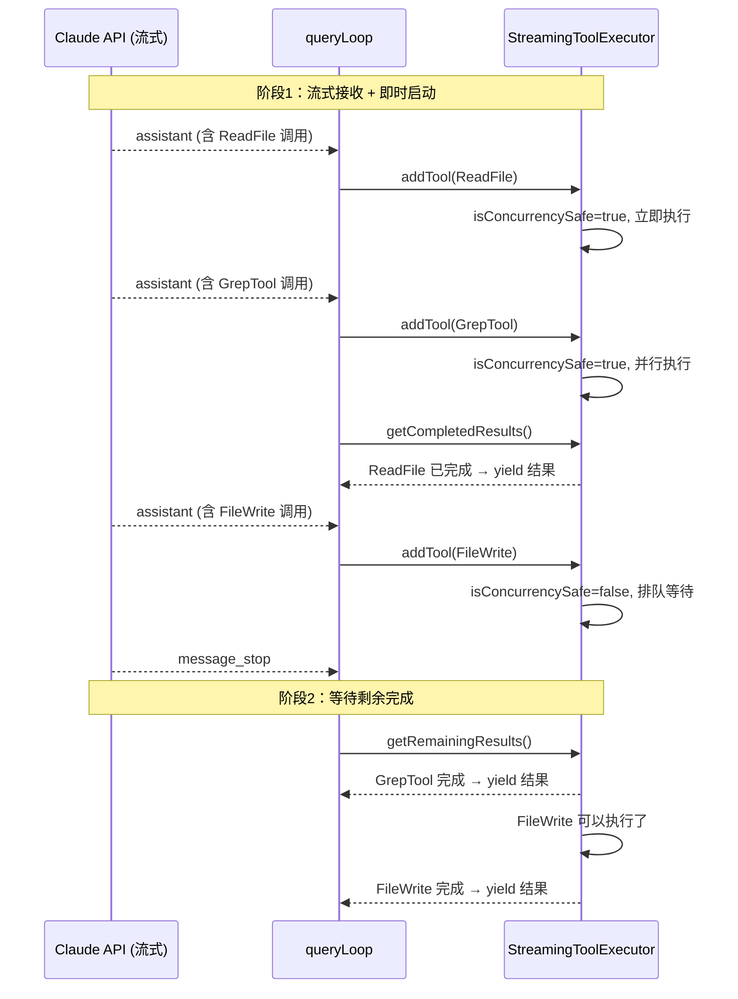

# 第5课：StreamingToolExecutor 并行工具执行

## 🎯 学习目标

学完本课，你将能够：

1. 理解 StreamingToolExecutor 的设计目标和工作原理
2. 掌握并发安全（isConcurrencySafe）的判断逻辑
3. 了解工具执行的队列管理和调度策略
4. 理解错误级联和兄弟工具取消机制
5. 知道进度消息如何被即时传递

---

## 一、生活类比：餐厅的多口炒锅

想象一个中餐厨房有多口炒锅：

- **可以同时炒的菜**（并发安全）：炒白菜和炒土豆可以同时进行，互不干扰
- **必须单独炒的菜**（非并发安全）：先炒肉，肉熟了才能加配菜——顺序很重要
- **一口锅出问题**（错误级联）：一口锅着火了，相邻的锅都要关掉
- **上菜顺序**（结果顺序）：不管哪个先炒好，都按点菜顺序上桌

StreamingToolExecutor 就是这个厨房的"调度员"——它决定哪些工具可以并行跑，哪些必须串行，出错了怎么处理。

---

## 二、架构概览



---

## 三、源码解析：核心数据结构

### 3.1 TrackedTool — 被跟踪的工具

```typescript
// 源码文件：services/tools/StreamingToolExecutor.ts（第19-32行）
type ToolStatus = 'queued' | 'executing' | 'completed' | 'yielded'

type TrackedTool = {
  id: string                     // 工具调用 ID
  block: ToolUseBlock            // 工具调用块（名称+参数）
  assistantMessage: AssistantMessage  // 所属的 AI 消息
  status: ToolStatus             // 当前状态
  isConcurrencySafe: boolean     // 是否可以并行
  promise?: Promise<void>        // 执行 Promise
  results?: Message[]            // 执行结果
  pendingProgress: Message[]     // 待产出的进度消息
  contextModifiers?: Array<(context: ToolUseContext) => ToolUseContext>
}
```



### 3.2 StreamingToolExecutor 类

```typescript
// 源码文件：services/tools/StreamingToolExecutor.ts（第40-62行）
export class StreamingToolExecutor {
  private tools: TrackedTool[] = []          // 工具列表
  private toolUseContext: ToolUseContext      // 执行上下文
  private hasErrored = false                 // 是否有工具出错
  private erroredToolDescription = ''        // 出错工具的描述
  private siblingAbortController: AbortController  // 兄弟中止控制器
  private discarded = false                  // 是否被丢弃
  private progressAvailableResolve?: () => void    // 进度通知

  constructor(
    private readonly toolDefinitions: Tools,
    private readonly canUseTool: CanUseToolFn,
    toolUseContext: ToolUseContext,
  ) {
    this.toolUseContext = toolUseContext
    this.siblingAbortController = createChildAbortController(
      toolUseContext.abortController,
    )
  }
}
```

---

## 四、addTool — 工具入队

当 AI 流式返回一个工具调用时，它被加入队列：

```typescript
// 源码文件：services/tools/StreamingToolExecutor.ts（第76-124行）
addTool(block: ToolUseBlock, assistantMessage: AssistantMessage): void {
  const toolDefinition = findToolByName(this.toolDefinitions, block.name)
  if (!toolDefinition) {
    // 工具不存在 → 直接标记为 completed 并写入错误结果
    this.tools.push({
      id: block.id,
      status: 'completed',
      results: [createUserMessage({
        content: [{
          type: 'tool_result',
          content: `Error: No such tool available: ${block.name}`,
          is_error: true,
          tool_use_id: block.id,
        }],
      })],
      // ...
    })
    return
  }

  // 解析输入并判断是否并发安全
  const parsedInput = toolDefinition.inputSchema.safeParse(block.input)
  const isConcurrencySafe = parsedInput?.success
    ? (() => {
        try {
          return Boolean(toolDefinition.isConcurrencySafe(parsedInput.data))
        } catch {
          return false  // 解析失败视为不安全
        }
      })()
    : false

  this.tools.push({
    id: block.id,
    block,
    assistantMessage,
    status: 'queued',
    isConcurrencySafe,
    pendingProgress: [],
  })

  void this.processQueue()  // 立即尝试执行
}
```

**关键点**：`isConcurrencySafe` 由每个工具自己决定。例如：
- `FileReadTool` — 并发安全（只读操作）
- `FileWriteTool` — 不安全（修改文件）
- `BashTool` — 取决于命令内容

---

## 五、processQueue — 队列调度

```typescript
// 源码文件：services/tools/StreamingToolExecutor.ts（第129-151行）
private canExecuteTool(isConcurrencySafe: boolean): boolean {
  const executingTools = this.tools.filter(t => t.status === 'executing')
  return (
    executingTools.length === 0 ||
    (isConcurrencySafe && executingTools.every(t => t.isConcurrencySafe))
  )
}

private async processQueue(): Promise<void> {
  for (const tool of this.tools) {
    if (tool.status !== 'queued') continue

    if (this.canExecuteTool(tool.isConcurrencySafe)) {
      await this.executeTool(tool)
    } else {
      // 非并发安全工具要等前面的完成
      if (!tool.isConcurrencySafe) break
    }
  }
}
```

调度规则用一张表来理解：

| 当前执行中 | 新工具 | 能执行吗？ |
|-----------|--------|-----------|
| 无 | 任意 | ✅ 可以 |
| 全部并发安全 | 并发安全 | ✅ 可以并行 |
| 全部并发安全 | 非并发安全 | ❌ 等待 |
| 有非并发安全 | 任意 | ❌ 等待 |



---

## 六、executeTool — 工具执行

```typescript
// 源码文件：services/tools/StreamingToolExecutor.ts（第265-405行，简化版）
private async executeTool(tool: TrackedTool): Promise<void> {
  tool.status = 'executing'

  const collectResults = async () => {
    // 检查是否已中止
    const initialAbortReason = this.getAbortReason(tool)
    if (initialAbortReason) {
      messages.push(this.createSyntheticErrorMessage(
        tool.id, initialAbortReason, tool.assistantMessage
      ))
      tool.status = 'completed'
      return
    }

    // 创建子中止控制器
    const toolAbortController = createChildAbortController(
      this.siblingAbortController,
    )

    // 实际执行工具
    const generator = runToolUse(
      tool.block,
      tool.assistantMessage,
      this.canUseTool,
      { ...this.toolUseContext, abortController: toolAbortController },
    )

    for await (const update of generator) {
      // 检查兄弟工具是否出错
      const abortReason = this.getAbortReason(tool)
      if (abortReason && !thisToolErrored) {
        messages.push(this.createSyntheticErrorMessage(...))
        break
      }

      // 检查是否是错误结果
      if (isErrorResult) {
        thisToolErrored = true
        if (tool.block.name === BASH_TOOL_NAME) {
          this.hasErrored = true
          this.siblingAbortController.abort('sibling_error')  // 取消兄弟工具
        }
      }

      // 收集结果
      if (update.message.type === 'progress') {
        tool.pendingProgress.push(update.message)  // 进度消息即时传递
        this.progressAvailableResolve?.()
      } else {
        messages.push(update.message)
      }
    }

    tool.results = messages
    tool.status = 'completed'
  }

  const promise = collectResults()
  tool.promise = promise
  // 完成后继续处理队列
  void promise.finally(() => void this.processQueue())
}
```

---

## 七、错误级联 — Bash 出错，全部取消



**重要设计决策**：只有 **BashTool 的错误**才会取消兄弟工具。原因在源码注释中说得很清楚：

```typescript
// 源码文件：services/tools/StreamingToolExecutor.ts（第358-363行）
// Only Bash errors cancel siblings. Bash commands often have implicit
// dependency chains (e.g. mkdir fails → subsequent commands pointless).
// Read/WebFetch/etc are independent — one failure shouldn't nuke the rest.
if (tool.block.name === BASH_TOOL_NAME) {
  this.hasErrored = true
  this.siblingAbortController.abort('sibling_error')
}
```

---

## 八、结果产出 — 保持顺序

### 8.1 getCompletedResults — 非阻塞获取

```typescript
// 源码文件：services/tools/StreamingToolExecutor.ts（第412-440行）
*getCompletedResults(): Generator<MessageUpdate, void> {
  if (this.discarded) return

  for (const tool of this.tools) {
    // 进度消息总是立即产出
    while (tool.pendingProgress.length > 0) {
      const progressMessage = tool.pendingProgress.shift()!
      yield { message: progressMessage, newContext: this.toolUseContext }
    }

    if (tool.status === 'yielded') continue

    if (tool.status === 'completed' && tool.results) {
      tool.status = 'yielded'
      for (const message of tool.results) {
        yield { message, newContext: this.toolUseContext }
      }
    } else if (tool.status === 'executing' && !tool.isConcurrencySafe) {
      break  // 非并发安全工具在执行中，停止遍历
    }
  }
}
```

**关键**：结果按照工具入队的顺序产出，即使后面的工具先完成。



### 8.2 getRemainingResults — 等待所有完成

```typescript
// 源码文件：services/tools/StreamingToolExecutor.ts（第453-490行）
async *getRemainingResults(): AsyncGenerator<MessageUpdate, void> {
  if (this.discarded) return

  while (this.hasUnfinishedTools()) {
    await this.processQueue()

    for (const result of this.getCompletedResults()) {
      yield result
    }

    // 等待任一工具完成或有新进度
    if (this.hasExecutingTools() && !this.hasCompletedResults() && !this.hasPendingProgress()) {
      const executingPromises = this.tools
        .filter(t => t.status === 'executing' && t.promise)
        .map(t => t.promise!)

      const progressPromise = new Promise<void>(resolve => {
        this.progressAvailableResolve = resolve
      })

      if (executingPromises.length > 0) {
        await Promise.race([...executingPromises, progressPromise])
      }
    }
  }

  // 最终收集
  for (const result of this.getCompletedResults()) {
    yield result
  }
}
```

`Promise.race` 是一个巧妙的设计——等待**最先完成的**工具或进度消息，而不是等全部完成。

---

## 九、discard — 回退时的清理

```typescript
// 源码文件：services/tools/StreamingToolExecutor.ts（第69-71行）
discard(): void {
  this.discarded = true
}
```

当流式回退发生时（主模型切换到备用模型），整个 executor 被丢弃：

```typescript
// 源码文件：query.ts（第733-740行）
if (streamingToolExecutor) {
  streamingToolExecutor.discard()
  streamingToolExecutor = new StreamingToolExecutor(
    toolUseContext.options.tools,
    canUseTool,
    toolUseContext,
  )
}
```

---

## 十、完整执行时序



---

## 十一、动手练习

### 练习 1：设计并发安全判断

假设你要为 `WebSearchTool` 实现 `isConcurrencySafe` 方法，你会怎么设计？考虑以下场景：
1. 同时搜索两个不同的关键词
2. 搜索量超过 API 限制

### 练习 2：画出错误传播图

假设有 5 个工具 [Read1, Bash1, Read2, Read3, Write1] 入队，画出 Bash1 出错时的完整传播路径和每个工具的最终状态。

### 练习 3：思考题

1. 为什么只有 Bash 错误会取消兄弟工具，而 FileRead 错误不会？
2. `siblingAbortController` 是 `toolUseContext.abortController` 的**子控制器**，这样设计有什么好处？
3. 如果要实现"工具执行优先级"（重要的工具先执行），你会怎么修改 `processQueue`？

---

## 十二、本课小结

| 概念 | 一句话理解 |
|------|-----------|
| StreamingToolExecutor | 边流式接收边执行工具的调度器 |
| isConcurrencySafe | 每个工具自行声明是否可以并行 |
| processQueue | 根据并发安全性决定执行策略 |
| 错误级联 | Bash 出错 → 取消所有兄弟工具 |
| siblingAbortController | 兄弟工具间的中止信号传递 |
| 顺序产出 | 结果按入队顺序产出，不按完成顺序 |
| discard | 流式回退时丢弃所有待执行工具 |

### 核心公式

```
StreamingToolExecutor = 队列管理 + 并发控制 + 错误级联 + 顺序产出
```

---

## 📖 下节预告

在第6课 **工具执行：串行 vs 并发策略** 中，我们将看到 StreamingToolExecutor 的"前辈"—— toolOrchestration.ts 中的传统工具编排策略：
- partitionToolCalls 如何将工具分批
- runToolsSerially vs runToolsConcurrently
- 并发限制（MAX_TOOL_USE_CONCURRENCY）
- 两种策略的对比和适用场景

这是理解 Claude Code 工具系统的另一个关键视角！
