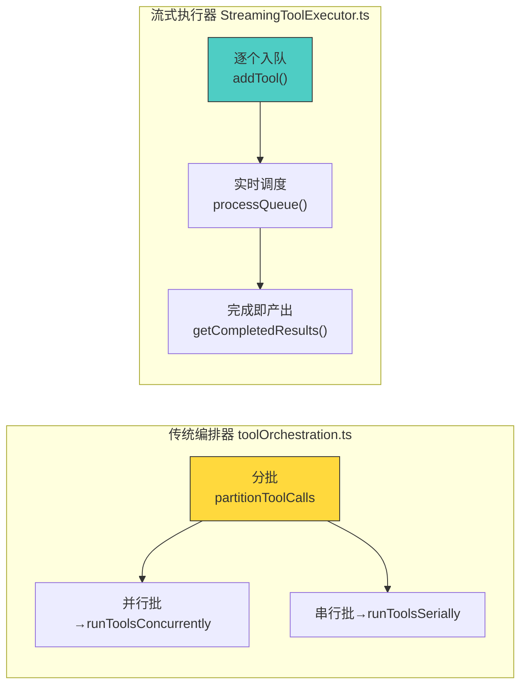
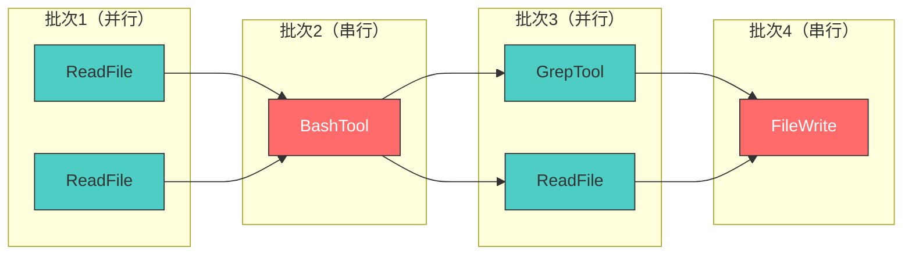
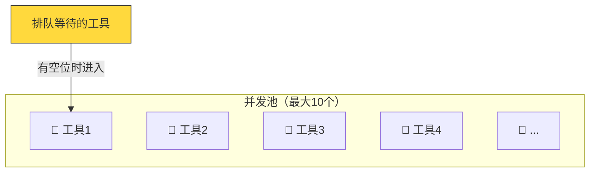
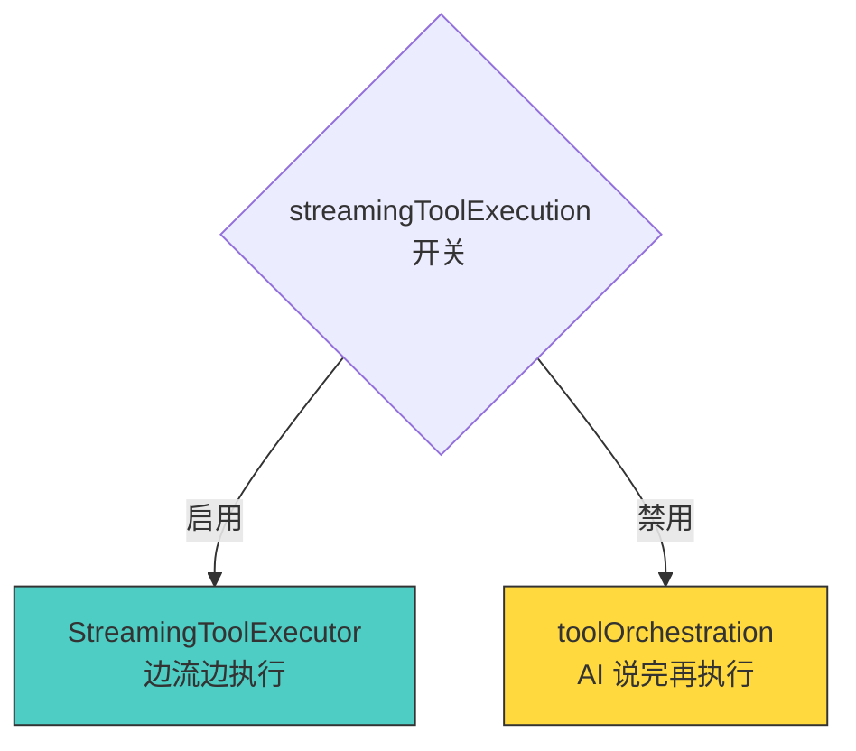
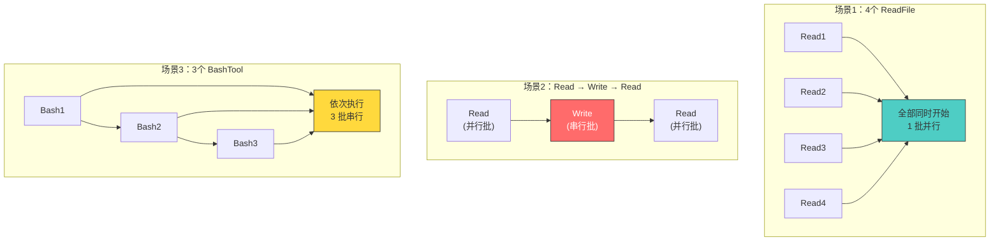

# 第6课：工具执行：串行 vs 并发策略

## 🎯 学习目标

学完本课，你将能够：

1. 理解 toolOrchestration.ts 中的工具编排策略
2. 掌握 partitionToolCalls 的工具分批逻辑
3. 对比串行执行（runToolsSerially）和并发执行（runToolsConcurrently）
4. 了解并发限制（MAX_TOOL_USE_CONCURRENCY）的作用
5. 对比两种工具执行器的适用场景

---

## 一、生活类比：工厂流水线 vs 多工位并行

想象一个组装工厂：

**串行模式**（流水线）：
```
工位1（拧螺丝）→ 工位2（焊接）→ 工位3（测试）
每个工位必须等前一个完成
```

**并行模式**（多工位）：
```
工位A（质检零件1）  ┐
工位B（质检零件2）  ├→ 全部完成后 → 组装
工位C（质检零件3）  ┘
```

**混合模式**（Claude Code 的策略）：
```
[质检1, 质检2, 质检3]  →  [焊接]  →  [测试1, 测试2]
    并行批次              串行批次       并行批次
```

---

## 二、两种执行器对比



| 特性 | toolOrchestration | StreamingToolExecutor |
|------|-------------------|----------------------|
| 启动时机 | AI 说完后统一执行 | AI 说话过程中就开始 |
| 分批方式 | 预先分批 | 实时调度 |
| 进度反馈 | 批次完成后 | 实时进度 |
| 适用场景 | 流式执行未启用时的后备 | 默认策略 |

---

## 三、源码解析：partitionToolCalls — 智能分批

```typescript
// 源码文件：services/tools/toolOrchestration.ts（第91-116行）
function partitionToolCalls(
  toolUseMessages: ToolUseBlock[],
  toolUseContext: ToolUseContext,
): Batch[] {
  return toolUseMessages.reduce((acc: Batch[], toolUse) => {
    const tool = findToolByName(toolUseContext.options.tools, toolUse.name)
    const parsedInput = tool?.inputSchema.safeParse(toolUse.input)
    const isConcurrencySafe = parsedInput?.success
      ? (() => {
          try {
            return Boolean(tool?.isConcurrencySafe(parsedInput.data))
          } catch {
            return false  // 保守处理
          }
        })()
      : false

    // 连续的并发安全工具合并为一批
    if (isConcurrencySafe && acc[acc.length - 1]?.isConcurrencySafe) {
      acc[acc.length - 1]!.blocks.push(toolUse)
    } else {
      acc.push({ isConcurrencySafe, blocks: [toolUse] })
    }
    return acc
  }, [])
}
```

### 分批示例

假设 AI 返回了以下工具调用序列：

```
ReadFile → ReadFile → BashTool → GrepTool → ReadFile → FileWrite
```

partitionToolCalls 会将它们分成：



---

## 四、runToolsSerially — 串行执行

```typescript
// 源码文件：services/tools/toolOrchestration.ts（第118-150行）
async function* runToolsSerially(
  toolUseMessages: ToolUseBlock[],
  assistantMessages: AssistantMessage[],
  canUseTool: CanUseToolFn,
  toolUseContext: ToolUseContext,
): AsyncGenerator<MessageUpdate, void> {
  let currentContext = toolUseContext

  for (const toolUse of toolUseMessages) {
    // 标记工具为进行中
    toolUseContext.setInProgressToolUseIDs(prev =>
      new Set(prev).add(toolUse.id),
    )

    // 逐个执行
    for await (const update of runToolUse(
      toolUse,
      assistantMessages.find(/* 找到对应的 assistant 消息 */),
      canUseTool,
      currentContext,
    )) {
      if (update.contextModifier) {
        currentContext = update.contextModifier.modifyContext(currentContext)
      }
      yield {
        message: update.message,
        newContext: currentContext,
      }
    }

    // 标记完成
    markToolUseAsComplete(toolUseContext, toolUse.id)
  }
}
```

**关键特征**：
- 逐个执行，前一个完成后才执行下一个
- 支持 `contextModifier`——工具可以修改上下文
- 确保写操作的顺序性

---

## 五、runToolsConcurrently — 并发执行

```typescript
// 源码文件：services/tools/toolOrchestration.ts（第152-177行）
async function* runToolsConcurrently(
  toolUseMessages: ToolUseBlock[],
  assistantMessages: AssistantMessage[],
  canUseTool: CanUseToolFn,
  toolUseContext: ToolUseContext,
): AsyncGenerator<MessageUpdateLazy, void> {
  yield* all(
    toolUseMessages.map(async function* (toolUse) {
      toolUseContext.setInProgressToolUseIDs(prev =>
        new Set(prev).add(toolUse.id),
      )
      yield* runToolUse(
        toolUse,
        assistantMessages.find(/* ... */),
        canUseTool,
        toolUseContext,
      )
      markToolUseAsComplete(toolUseContext, toolUse.id)
    }),
    getMaxToolUseConcurrency(),  // 并发限制
  )
}
```

### 并发限制

```typescript
// 源码文件：services/tools/toolOrchestration.ts（第8-11行）
function getMaxToolUseConcurrency(): number {
  return (
    parseInt(process.env.CLAUDE_CODE_MAX_TOOL_USE_CONCURRENCY || '', 10) || 10
  )
}
```

默认最多 **10 个工具**并发执行，可通过环境变量调整。



---

## 六、runTools — 统一入口

```typescript
// 源码文件：services/tools/toolOrchestration.ts（第19-82行）
export async function* runTools(
  toolUseMessages: ToolUseBlock[],
  assistantMessages: AssistantMessage[],
  canUseTool: CanUseToolFn,
  toolUseContext: ToolUseContext,
): AsyncGenerator<MessageUpdate, void> {
  let currentContext = toolUseContext

  for (const { isConcurrencySafe, blocks } of partitionToolCalls(
    toolUseMessages,
    currentContext,
  )) {
    if (isConcurrencySafe) {
      // 并行批次
      for await (const update of runToolsConcurrently(
        blocks, assistantMessages, canUseTool, currentContext,
      )) {
        // 延迟 contextModifier 到批次完成后
        yield { message: update.message, newContext: currentContext }
      }
      // 批次完成后统一应用 contextModifier
      for (const block of blocks) {
        const modifiers = queuedContextModifiers[block.id]
        if (modifiers) {
          for (const modifier of modifiers) {
            currentContext = modifier(currentContext)
          }
        }
      }
      yield { newContext: currentContext }
    } else {
      // 串行批次
      for await (const update of runToolsSerially(
        blocks, assistantMessages, canUseTool, currentContext,
      )) {
        if (update.newContext) {
          currentContext = update.newContext
        }
        yield { message: update.message, newContext: currentContext }
      }
    }
  }
}
```

---

## 七、在 queryLoop 中的选择

queryLoop 根据配置决定使用哪种执行器：

```typescript
// 源码文件：query.ts（第561-568行）
const useStreamingToolExecution = config.gates.streamingToolExecution
let streamingToolExecutor = useStreamingToolExecution
  ? new StreamingToolExecutor(
      toolUseContext.options.tools,
      canUseTool,
      toolUseContext,
    )
  : null

// ... 后面在工具执行时 ...

// 源码文件：query.ts（第1380-1383行）
const toolUpdates = streamingToolExecutor
  ? streamingToolExecutor.getRemainingResults()       // 流式执行器
  : runTools(toolUseBlocks, assistantMessages, canUseTool, toolUseContext)
                                                       // 传统编排器
```



---

## 八、contextModifier — 工具改变世界

某些工具执行后需要修改上下文（比如 cd 命令改变了工作目录）：

```typescript
// 串行模式：立即应用
for await (const update of runToolsSerially(...)) {
  if (update.contextModifier) {
    currentContext = update.contextModifier.modifyContext(currentContext)
  }
}

// 并行模式：延迟到批次结束后再应用
const queuedContextModifiers = {}
for await (const update of runToolsConcurrently(...)) {
  if (update.contextModifier) {
    queuedContextModifiers[toolUseID].push(update.contextModifier.modifyContext)
  }
}
// 批次完成后统一应用
```

**为什么并行模式要延迟？** 因为多个工具同时修改上下文可能导致冲突。等全部完成后再按顺序应用，确保结果一致。

---

## 九、执行策略对比总结



---

## 十、动手练习

### 练习 1：分批练习

给定工具序列：`[GrepTool, ReadFile, BashTool("ls"), ReadFile, FileWrite, GrepTool]`

假设 GrepTool 和 ReadFile 是并发安全的，BashTool("ls") 也被判定为并发安全的，FileWrite 不是。请画出 partitionToolCalls 的分批结果。

### 练习 2：性能对比

假设每个工具执行需要 1 秒。对比以下两种策略对 `[Read, Read, Read, Write, Read, Read]` 的总执行时间：
1. 全部串行
2. partitionToolCalls + 并行/串行混合

### 练习 3：思考题

1. 为什么默认并发限制是 10 而不是更大？（考虑系统资源和 API 限制）
2. StreamingToolExecutor 相比 toolOrchestration 最大的性能优势是什么？
3. 如果一个工具既需要读文件又需要写文件，它的 `isConcurrencySafe` 应该返回什么？

---

## 十一、本课小结

| 概念 | 一句话理解 |
|------|-----------|
| partitionToolCalls | 将工具列表按并发安全性分批 |
| runToolsSerially | 逐个执行，确保顺序和 context 一致 |
| runToolsConcurrently | 批量并行，受并发限制保护 |
| runTools | 统一入口，自动混合串行和并行 |
| MAX_CONCURRENCY | 并发上限，默认 10 |
| contextModifier | 工具修改执行上下文的机制 |

### 核心公式

```
工具执行 = partitionToolCalls(按安全性分批)
         → 并行批 → runToolsConcurrently(最多10并发)
         → 串行批 → runToolsSerially(逐个执行)
```

---

## 📖 下节预告

在第7课 **重试与错误处理：指数退避详解** 中，我们将探索 Claude Code 面对网络错误、API 限制时的"韧性"机制：
- withRetry 函数的重试循环
- 指数退避算法（Exponential Backoff）
- 429/529 错误的不同处理策略
- 模型回退（Fallback）机制
- 持久重试模式

了解重试机制，你就能理解 Claude Code 为什么这么"坚韧"！
