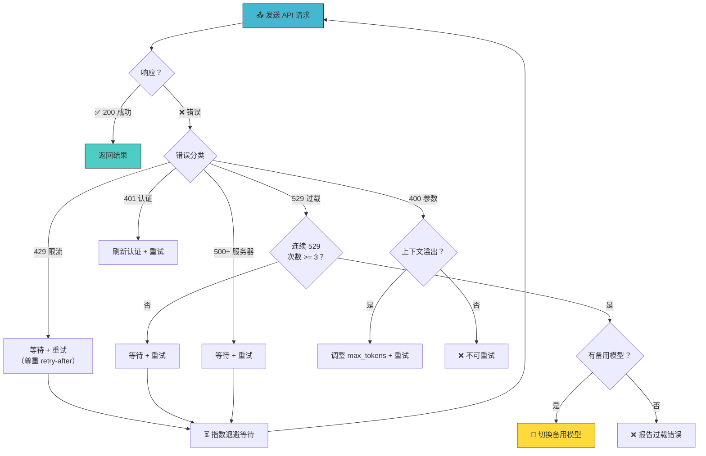
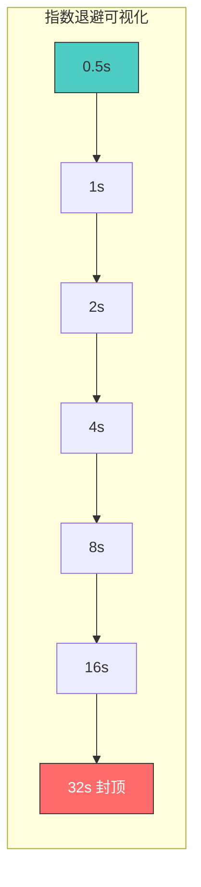
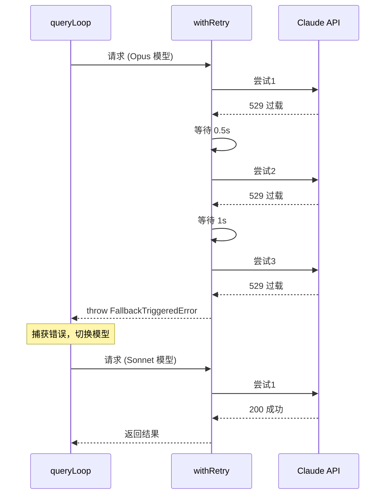
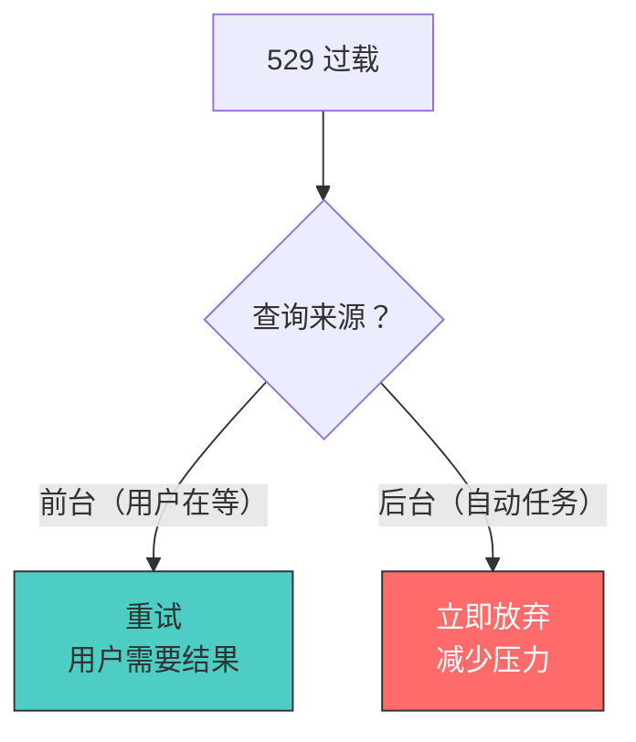
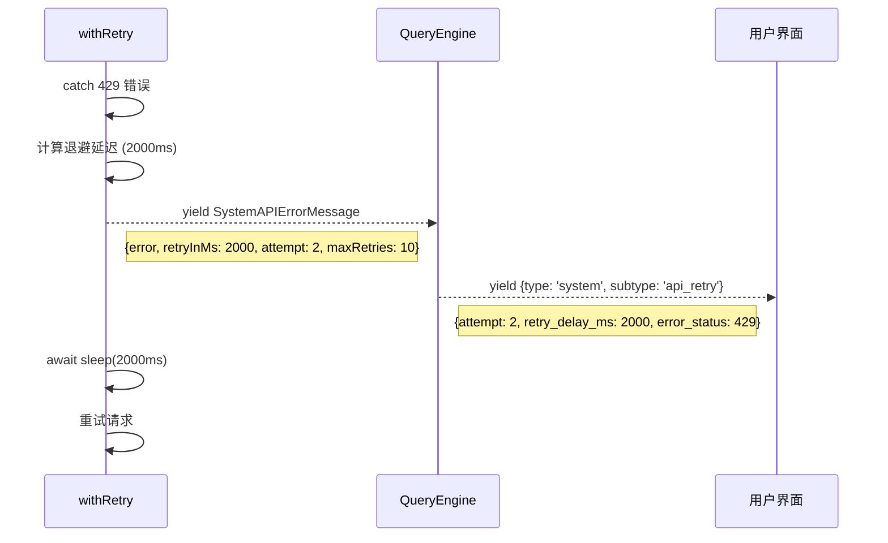

# 第7课：重试与错误处理：指数退避详解

## 🎯 学习目标

学完本课，你将能够：

1. 理解 withRetry 函数的工作原理
2. 掌握指数退避（Exponential Backoff）算法
3. 了解不同 HTTP 错误码的处理策略
4. 理解模型回退（Fallback）机制
5. 知道持久重试模式的适用场景

---

## 一、生活类比：打电话占线的策略

想象你给一个热门餐厅打电话订座：

- **第1次**：占线 → 等 0.5 秒后重试
- **第2次**：占线 → 等 1 秒后重试
- **第3次**：占线 → 等 2 秒后重试
- **第4次**：占线 → 等 4 秒后重试
- ...
- **第11次**：放弃（"对不起，暂时无法接通"）

这就是**指数退避**——每次等待时间翻倍，避免同时有太多人不断拨打（"重试风暴"）。

如果连续3次听到"餐厅满员"（529 错误），你可能会说："那换一家餐厅吧！"——这就是**模型回退**。

---

## 二、重试架构全景



---

## 三、源码解析：withRetry 函数

### 3.1 函数签名

```typescript
// 源码文件：services/api/withRetry.ts（第170-178行）
export async function* withRetry<T>(
  getClient: () => Promise<Anthropic>,
  operation: (client: Anthropic, attempt: number, context: RetryContext) => Promise<T>,
  options: RetryOptions,
): AsyncGenerator<SystemAPIErrorMessage, T> {
```

注意这也是一个 `AsyncGenerator`，它在重试等待期间可以 `yield` 系统消息（告诉用户"正在重试"）。

### 3.2 主循环

```typescript
// 源码文件：services/api/withRetry.ts（第180-514行，简化版）
const maxRetries = getMaxRetries(options)  // 默认 10 次
const retryContext: RetryContext = {
  model: options.model,
  thinkingConfig: options.thinkingConfig,
}
let client: Anthropic | null = null
let consecutive529Errors = options.initialConsecutive529Errors ?? 0

for (let attempt = 1; attempt <= maxRetries + 1; attempt++) {
  // 检查是否被中止
  if (options.signal?.aborted) {
    throw new APIUserAbortError()
  }

  try {
    // 认证错误时重新创建客户端
    if (client === null || isAuthError(lastError)) {
      client = await getClient()
    }

    // 执行操作
    return await operation(client, attempt, retryContext)

  } catch (error) {
    lastError = error
    // ... 错误处理逻辑
  }
}
```

---

## 四、指数退避算法

### 4.1 核心计算

```typescript
// 源码文件：services/api/withRetry.ts（第530-548行）
export const BASE_DELAY_MS = 500

export function getRetryDelay(
  attempt: number,
  retryAfterHeader?: string | null,
  maxDelayMs = 32000,
): number {
  // 如果服务器指定了 retry-after，使用它
  if (retryAfterHeader) {
    const seconds = parseInt(retryAfterHeader, 10)
    if (!isNaN(seconds)) {
      return seconds * 1000
    }
  }

  // 指数退避 + 随机抖动
  const baseDelay = Math.min(
    BASE_DELAY_MS * Math.pow(2, attempt - 1),
    maxDelayMs,
  )
  const jitter = Math.random() * 0.25 * baseDelay
  return baseDelay + jitter
}
```

### 4.2 延迟时间表

| 重试次数 | 基础延迟 | 加上抖动后 | 说明 |
|---------|---------|-----------|------|
| 第1次 | 500ms | 500-625ms | 半秒 |
| 第2次 | 1000ms | 1000-1250ms | 1秒 |
| 第3次 | 2000ms | 2000-2500ms | 2秒 |
| 第4次 | 4000ms | 4000-5000ms | 4秒 |
| 第5次 | 8000ms | 8000-10000ms | 8秒 |
| 第6次 | 16000ms | 16000-20000ms | 16秒 |
| 第7次+ | 32000ms | 32000-40000ms | 封顶32秒 |



### 4.3 为什么要加随机抖动？

```
没有抖动：
用户A: ─────────重试──────────重试──────────重试
用户B: ─────────重试──────────重试──────────重试
                  ↑同时发送！          ↑又同时发送！

有抖动：
用户A: ─────────重试────────────重试──────────重试
用户B: ───────────重试──────────重试────────────重试
                  ↑错开了            ↑分散了压力
```

---

## 五、429 vs 529 — 两种过载的区别

| 错误码 | 含义 | 处理策略 |
|-------|------|---------|
| **429** | 速率限制 (Rate Limit) | 尊重 retry-after 头 → 等待 → 重试 |
| **529** | 服务器过载 (Overloaded) | 指数退避 → 重试 → 3次后考虑回退 |

### 5.1 429 处理

```typescript
// 源码文件：services/api/withRetry.ts（第267-305行，简化版）
// 快速模式下的特殊处理
if (wasFastModeActive && (error.status === 429 || is529Error(error))) {
  const retryAfterMs = getRetryAfterMs(error)

  if (retryAfterMs !== null && retryAfterMs < SHORT_RETRY_THRESHOLD_MS) {
    // 等待时间短（<20秒）→ 保持快速模式重试
    await sleep(retryAfterMs, options.signal)
    continue
  }

  // 等待时间长 → 切换到标准模式
  const cooldownMs = Math.max(
    retryAfterMs ?? DEFAULT_FAST_MODE_FALLBACK_HOLD_MS,
    MIN_COOLDOWN_MS,
  )
  triggerFastModeCooldown(Date.now() + cooldownMs, cooldownReason)
  retryContext.fastMode = false
  continue
}
```

### 5.2 529 处理与模型回退

```typescript
// 源码文件：services/api/withRetry.ts（第326-365行）
if (is529Error(error)) {
  consecutive529Errors++

  if (consecutive529Errors >= MAX_529_RETRIES) {  // MAX_529_RETRIES = 3
    if (options.fallbackModel) {
      // 触发模型回退
      throw new FallbackTriggeredError(
        options.model,
        options.fallbackModel,
      )
    }

    // 没有备用模型 → 报告错误
    throw new CannotRetryError(
      new Error(REPEATED_529_ERROR_MESSAGE),
      retryContext,
    )
  }
}
```



---

## 六、前台 vs 后台查询源

```typescript
// 源码文件：services/api/withRetry.ts（第62-82行）
const FOREGROUND_529_RETRY_SOURCES = new Set<QuerySource>([
  'repl_main_thread',
  'sdk',
  'agent:custom',
  'agent:default',
  'compact',
  'auto_mode',
  // ...
])

function shouldRetry529(querySource: QuerySource | undefined): boolean {
  return querySource === undefined || FOREGROUND_529_RETRY_SOURCES.has(querySource)
}
```

**设计理念**：
- **前台查询**（用户在等）：重试，因为用户需要结果
- **后台查询**（标题生成、摘要等）：不重试，因为每次重试都在加剧过载



---

## 七、上下文溢出恢复

```typescript
// 源码文件：services/api/withRetry.ts（第384-427行）
if (error instanceof APIError) {
  const overflowData = parseMaxTokensContextOverflowError(error)
  if (overflowData) {
    const { inputTokens, contextLimit } = overflowData

    const safetyBuffer = 1000
    const availableContext = Math.max(0, contextLimit - inputTokens - safetyBuffer)

    if (availableContext < FLOOR_OUTPUT_TOKENS) {
      throw error  // 空间太少，无法恢复
    }

    // 调整 max_tokens 重试
    const adjustedMaxTokens = Math.max(
      FLOOR_OUTPUT_TOKENS,       // 至少 3000
      availableContext,
      minRequired,
    )
    retryContext.maxTokensOverride = adjustedMaxTokens
    continue  // 使用新的 max_tokens 重试
  }
}
```

**类比**：你的行李箱装不下了，错误信息告诉你"箱子最多装100升，你的衣服占了95升"。于是你缩小预留空间（max_tokens），让行李刚好装得下。

---

## 八、持久重试模式

对于无人值守的会话（如后台任务），Claude Code 支持一种特殊的"永不放弃"模式：

```typescript
// 源码文件：services/api/withRetry.ts（第96-104行）
const PERSISTENT_MAX_BACKOFF_MS = 5 * 60 * 1000      // 最大退避 5 分钟
const PERSISTENT_RESET_CAP_MS = 6 * 60 * 60 * 1000   // 最长等待 6 小时
const HEARTBEAT_INTERVAL_MS = 30_000                   // 心跳间隔 30 秒

function isPersistentRetryEnabled(): boolean {
  return isEnvTruthy(process.env.CLAUDE_CODE_UNATTENDED_RETRY)
}
```

持久模式的特殊处理：

```typescript
// 源码文件：services/api/withRetry.ts（第477-512行）
if (persistent) {
  // 分段等待 + 心跳
  let remaining = delayMs
  while (remaining > 0) {
    if (options.signal?.aborted) throw new APIUserAbortError()

    // 每 30 秒发送一个心跳消息
    yield createSystemAPIErrorMessage(error, remaining, reportedAttempt, maxRetries)

    const chunk = Math.min(remaining, HEARTBEAT_INTERVAL_MS)
    await sleep(chunk, options.signal)
    remaining -= chunk
  }

  // 永远不让 attempt 计数器到达上限
  if (attempt >= maxRetries) attempt = maxRetries
}
```

**类比**：你在排一个超长的队（比如演唱会门票），你决定"不管多久我都等"。但每隔30秒你发一条消息告诉朋友："我还在排，大概还要等5分钟。"

---

## 九、重试通知链路



用户会看到类似：`正在重试 (2/10)，等待 2 秒...`

---

## 十、shouldRetry — 重试决策树

```typescript
// 源码文件：services/api/withRetry.ts（第696-787行）
function shouldRetry(error: APIError): boolean {
  // 模拟错误不重试
  if (isMockRateLimitError(error)) return false

  // 持久模式下 429/529 总是重试
  if (isPersistentRetryEnabled() && isTransientCapacityError(error))
    return true

  // 上下文溢出可以重试
  if (parseMaxTokensContextOverflowError(error)) return true

  // 检查 x-should-retry 头
  const shouldRetryHeader = error.headers?.get('x-should-retry')
  if (shouldRetryHeader === 'true' && canRetry) return true
  if (shouldRetryHeader === 'false' && !is5xxForAnts) return false

  // 连接错误可以重试
  if (error instanceof APIConnectionError) return true

  // 按状态码判断
  if (error.status === 408) return true   // 超时
  if (error.status === 409) return true   // 锁冲突
  if (error.status === 429) return canRetry // 限流
  if (error.status === 401) return true   // 认证
  if (error.status >= 500) return true    // 服务器错误

  return false
}
```

---

## 十一、动手练习

### 练习 1：计算退避延迟

假设 BASE_DELAY_MS = 500，计算以下场景的延迟时间（忽略抖动）：
1. 第1次重试
2. 第5次重试
3. 第10次重试

### 练习 2：错误处理路径

画出以下错误的完整处理路径：
1. 连续4次 529 错误，有备用模型
2. 1次 401 错误
3. 400 错误，消息 "input length and max_tokens exceed context limit: 180000 + 20000 > 200000"

### 练习 3：思考题

1. 为什么抖动用 `Math.random() * 0.25 * baseDelay` 而不是更大的范围？
2. 持久重试模式为什么需要心跳？不发心跳会怎样？
3. 如果你要实现一个"智能退避"算法（根据错误类型调整退避策略），你会怎么设计？

---

## 十二、本课小结

| 概念 | 一句话理解 |
|------|-----------|
| withRetry | 包装 API 调用的重试循环 |
| 指数退避 | 每次等待时间翻倍（0.5s→1s→2s→...→32s） |
| 随机抖动 | 在基础延迟上加随机偏移，避免重试风暴 |
| 429 | 速率限制，尊重 retry-after 头 |
| 529 | 服务器过载，3次后可能触发模型回退 |
| FallbackTriggeredError | 触发模型回退的信号 |
| 持久重试 | 无人值守模式，永不放弃 + 心跳 |
| shouldRetry | 根据错误类型决定是否重试的决策函数 |

### 核心公式

```
重试延迟 = min(500ms × 2^(attempt-1), 32000ms) + random(0, 25%)
重试策略 = shouldRetry(error) ? 指数退避重试 : 放弃/回退
```

---

## 📖 下节预告

在第8课 **Token 计数与成本控制** 中，我们将探索 Claude Code 如何"精打细算"：
- Token 是什么？如何计数？
- 粗估 vs 精确计数的取舍
- 自动压缩的触发条件
- 预算控制（maxBudgetUsd）的实现
- 成本追踪和用量报告

了解 Token 经济学，你就能优化使用成本！
