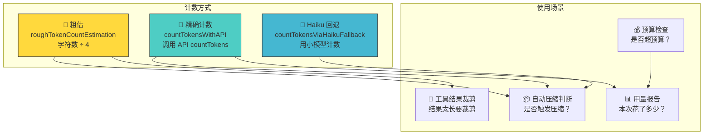
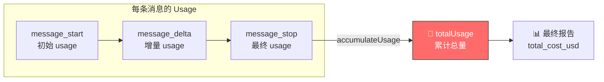
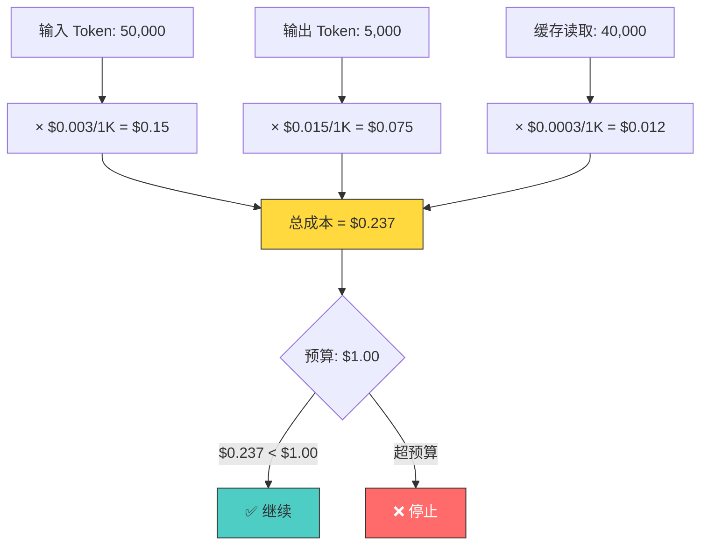
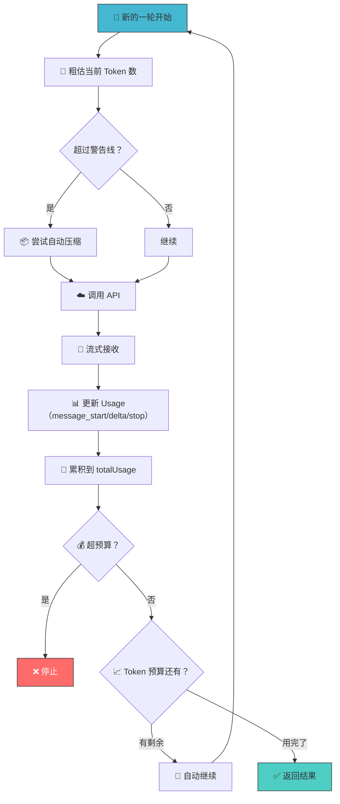

# 第8课：Token 计数与成本控制

## 🎯 学习目标

学完本课，你将能够：

1. 理解 Token 的概念和计数方式
2. 掌握粗估（rough estimation）和精确计数（API count）的区别
3. 了解自动压缩的触发条件与 Token 的关系
4. 理解预算控制（maxBudgetUsd）的实现机制
5. 知道 Usage 统计如何在系统中流转

---

## 一、生活类比：Token 就像超市的购物点数

想象你在超市购物：

- 每买一件商品消耗一些**积分**（Token）
- 不同商品价格不同（一个汉字 ≈ 2-3 Token，一个英文单词 ≈ 1 Token）
- 购物车有**容量限制**（上下文窗口 = 最大 Token 数）
- 你有**预算**（maxBudgetUsd）
- 积分用完了？→ 清空购物车，保留最重要的（自动压缩）

在 AI 领域：
- **输入 Token**：你发给 AI 的所有内容（系统提示词 + 历史消息 + 当前问题）
- **输出 Token**：AI 回复的内容
- **费用** = 输入 Token × 输入单价 + 输出 Token × 输出单价

---

## 二、Token 计数架构



---

## 三、粗估算法 — 快速但不精确

### 3.1 基本粗估

```typescript
// 源码文件：services/tokenEstimation.ts（第203-208行）
export function roughTokenCountEstimation(
  content: string,
  bytesPerToken: number = 4,
): number {
  return Math.round(content.length / bytesPerToken)
}
```

**公式**：`Token 数 ≈ 字符数 ÷ 4`

这是一个经验值——对英文文本来说，平均每个 Token 约 4 个字符。

### 3.2 文件类型感知

```typescript
// 源码文件：services/tokenEstimation.ts（第215-224行）
export function bytesPerTokenForFileType(fileExtension: string): number {
  switch (fileExtension) {
    case 'json':
    case 'jsonl':
    case 'jsonc':
      return 2   // JSON 更密集，每 Token 约 2 字符
    default:
      return 4   // 其他文件每 Token 约 4 字符
  }
}
```

**为什么 JSON 不同？** JSON 有很多单字符 Token：`{`、`}`、`:`、`,`、`"`，所以每个 Token 对应的字符更少。

### 3.3 消息级粗估

```typescript
// 源码文件：services/tokenEstimation.ts（第391-434行，简化版）
function roughTokenCountEstimationForBlock(block): number {
  if (typeof block === 'string') {
    return roughTokenCountEstimation(block)
  }
  if (block.type === 'text') {
    return roughTokenCountEstimation(block.text)
  }
  if (block.type === 'image' || block.type === 'document') {
    return 2000  // 图片/PDF 用固定估值
  }
  if (block.type === 'tool_use') {
    return roughTokenCountEstimation(
      block.name + JSON.stringify(block.input ?? {})
    )
  }
  if (block.type === 'thinking') {
    return roughTokenCountEstimation(block.thinking)
  }
  // 其他类型：序列化后估算
  return roughTokenCountEstimation(JSON.stringify(block))
}
```

| 内容类型 | 估算方式 | 说明 |
|---------|---------|------|
| 文本 | 字符数 ÷ 4 | 标准估算 |
| 图片 | 固定 2000 | (宽×高)/750 的保守估值 |
| PDF | 固定 2000 | 同图片 |
| 工具调用 | 名称+参数序列化 ÷ 4 | 包含工具名 |
| thinking | thinking 文本 ÷ 4 | 思维内容 |

---

## 四、精确计数 — 调用 API

### 4.1 countMessagesTokensWithAPI

```typescript
// 源码文件：services/tokenEstimation.ts（第140-201行）
export async function countMessagesTokensWithAPI(
  messages: BetaMessageParam[],
  tools: BetaToolUnion[],
): Promise<number | null> {
  return withTokenCountVCR(messages, tools, async () => {
    try {
      const model = getMainLoopModel()
      const betas = getModelBetas(model)
      const containsThinking = hasThinkingBlocks(messages)

      const anthropic = await getAnthropicClient({
        maxRetries: 1,
        model,
        source: 'count_tokens',
      })

      const response = await anthropic.beta.messages.countTokens({
        model: normalizeModelStringForAPI(model),
        messages: messages.length > 0
          ? messages
          : [{ role: 'user', content: 'foo' }],
        tools,
        ...(containsThinking && {
          thinking: {
            type: 'enabled',
            budget_tokens: TOKEN_COUNT_THINKING_BUDGET,
          },
        }),
      })

      return response.input_tokens
    } catch (error) {
      logError(error)
      return null  // 失败时返回 null，允许降级到粗估
    }
  })
}
```

### 4.2 Haiku 回退

当主模型的 countTokens API 不可用时，使用 Haiku 小模型来计数：

```typescript
// 源码文件：services/tokenEstimation.ts（第251-325行）
export async function countTokensViaHaikuFallback(
  messages: BetaMessageParam[],
  tools: BetaToolUnion[],
): Promise<number | null> {
  // 选择计数用的模型
  const model = isVertexGlobalEndpoint || isBedrockWithThinking || isVertexWithThinking
    ? getDefaultSonnetModel()  // 某些环境 Haiku 不可用
    : getSmallFastModel()      // 默认用 Haiku

  // 用 max_tokens=1 发一个请求，只看 usage
  const response = await anthropic.beta.messages.create({
    model: normalizeModelStringForAPI(model),
    max_tokens: containsThinking ? TOKEN_COUNT_MAX_TOKENS : 1,
    messages: messagesToSend,
    tools: tools.length > 0 ? tools : undefined,
  })

  const usage = response.usage
  return usage.input_tokens + (usage.cache_creation_input_tokens || 0)
       + (usage.cache_read_input_tokens || 0)
}
```

**为什么不直接用主模型计数？** 因为不同 API 提供商（Bedrock、Vertex）的 countTokens 支持程度不同。Haiku 便宜且快速，是很好的回退选择。

---

## 五、Usage 流转 — Token 的"记账"

### 5.1 QueryEngine 中的 Usage 追踪

```typescript
// 源码文件：QueryEngine.ts（第788-816行）
case 'stream_event':
  if (message.event.type === 'message_start') {
    currentMessageUsage = EMPTY_USAGE
    currentMessageUsage = updateUsage(currentMessageUsage, message.event.message.usage)
  }
  if (message.event.type === 'message_delta') {
    currentMessageUsage = updateUsage(currentMessageUsage, message.event.usage)
  }
  if (message.event.type === 'message_stop') {
    this.totalUsage = accumulateUsage(this.totalUsage, currentMessageUsage)
  }
```



### 5.2 Usage 的组成

```typescript
type Usage = {
  input_tokens: number                    // 输入 Token
  output_tokens: number                   // 输出 Token
  cache_creation_input_tokens?: number    // 缓存创建 Token
  cache_read_input_tokens?: number        // 缓存读取 Token
}
```

---

## 六、预算控制 — maxBudgetUsd

### 6.1 检查预算

```typescript
// 源码文件：QueryEngine.ts（第972-1002行）
if (maxBudgetUsd !== undefined && getTotalCost() >= maxBudgetUsd) {
  yield {
    type: 'result',
    subtype: 'error_max_budget_usd',
    is_error: true,
    errors: [`Reached maximum budget ($${maxBudgetUsd})`],
    total_cost_usd: getTotalCost(),
    usage: this.totalUsage,
    // ...
  }
  return
}
```

这个检查在每轮循环结束后执行——**每处理完一条消息就检查一次**。

### 6.2 成本计算



---

## 七、自动压缩与 Token 的关系

### 7.1 Token 告警状态

```typescript
// 在自动压缩模块中（概念性代码）
const { isAtBlockingLimit } = calculateTokenWarningState(
  tokenCountWithEstimation(messagesForQuery) - snipTokensFreed,
  toolUseContext.options.mainLoopModel,
)
```

| Token 使用率 | 状态 | 行为 |
|-------------|------|------|
| < 50% | 正常 | 无动作 |
| 50-80% | 警告 | 可能触发自动压缩 |
| 80-95% | 高危 | 触发自动压缩 |
| > 95% | 阻塞 | 不允许新请求，提示运行 /compact |

### 7.2 queryLoop 中的阻塞检查

```typescript
// 源码文件：query.ts（第637-648行）
if (!compactionResult && querySource !== 'compact' && ...) {
  const { isAtBlockingLimit } = calculateTokenWarningState(
    tokenCountWithEstimation(messagesForQuery) - snipTokensFreed,
    toolUseContext.options.mainLoopModel,
  )
  if (isAtBlockingLimit) {
    yield createAssistantAPIErrorMessage({
      content: PROMPT_TOO_LONG_ERROR_MESSAGE,
    })
    return { reason: 'blocking_limit' }
  }
}
```

---

## 八、结构化输出的重试限制

```typescript
// 源码文件：QueryEngine.ts（第1005-1048行）
if (message.type === 'user' && jsonSchema) {
  const currentCalls = countToolCalls(
    this.mutableMessages,
    SYNTHETIC_OUTPUT_TOOL_NAME,
  )
  const callsThisQuery = currentCalls - initialStructuredOutputCalls
  const maxRetries = parseInt(
    process.env.MAX_STRUCTURED_OUTPUT_RETRIES || '5',
    10,
  )
  if (callsThisQuery >= maxRetries) {
    yield {
      type: 'result',
      subtype: 'error_max_structured_output_retries',
      errors: [`Failed to provide valid structured output after ${maxRetries} attempts`],
      // ...
    }
    return
  }
}
```

---

## 九、Token Budget — 自动继续机制

```typescript
// 源码文件：query.ts（第1308-1355行）
if (feature('TOKEN_BUDGET')) {
  const decision = checkTokenBudget(
    budgetTracker!,
    toolUseContext.agentId,
    getCurrentTurnTokenBudget(),
    getTurnOutputTokens(),
  )

  if (decision.action === 'continue') {
    // 还有预算 → 自动继续
    incrementBudgetContinuationCount()
    state = {
      messages: [
        ...messagesForQuery,
        ...assistantMessages,
        createUserMessage({
          content: decision.nudgeMessage,  // "继续工作"
          isMeta: true,
        }),
      ],
      transition: { reason: 'token_budget_continuation' },
      // ...
    }
    continue  // 继续循环
  }
}
```

**类比**：你给了管家10万积分的预算，他做完一个任务只用了5万。系统自动说："还有预算，继续干吧！"

---

## 十、Token 计数完整流程



---

## 十一、动手练习

### 练习 1：估算 Token 数

估算以下内容的 Token 数（使用粗估算法）：
1. `"Hello, world!"` — 13 个字符
2. 一个 1000 行的 TypeScript 文件（平均每行 40 个字符）
3. 一个 JSON 配置文件（5000 个字符）

### 练习 2：成本计算

假设一次对话中：
- 输入 Token：100,000（输入价格 $3/1M Token）
- 输出 Token：10,000（输出价格 $15/1M Token）
- 缓存读取：80,000（缓存价格 $0.3/1M Token）

计算总成本。

### 练习 3：思考题

1. 为什么粗估使用 `字符数 ÷ 4` 而不是 `单词数`？
2. 图片为什么固定估为 2000 Token 而不是根据实际大小？
3. 如果要支持多种货币（不只是 USD）的预算控制，你会怎么设计？

---

## 十二、本课小结

| 概念 | 一句话理解 |
|------|-----------|
| Token | AI 处理文本的基本单位 |
| 粗估 | 字符数 ÷ 4，快但不精确 |
| API 计数 | 调用 countTokens API，精确但需要网络 |
| Haiku 回退 | 用小模型间接计数 |
| totalUsage | 整个对话的累计用量 |
| maxBudgetUsd | 预算控制，超出则停止 |
| Token Budget | 自动继续机制，预算内自动续干 |

### 核心公式

```
粗估 Token = 字符数 ÷ bytesPerToken（默认4，JSON=2）
总成本 = 输入Token × 输入单价 + 输出Token × 输出单价 + 缓存Token × 缓存单价
```

---

## 📖 下节预告

在第9课 **Thinking 扩展思维三种模式** 中，我们将探索 Claude 的"深度思考"能力：
- disabled / enabled / adaptive 三种模式的区别
- Thinking 对输出质量的影响
- ultrathink 关键词的彩蛋
- 模型支持矩阵

了解 Thinking 模式，你就能让 Claude 在复杂任务中表现更好！
