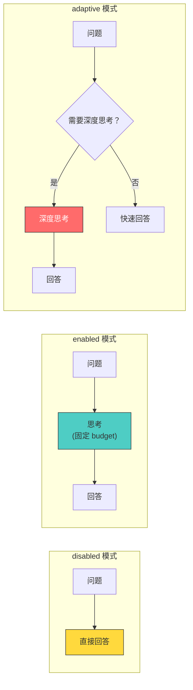
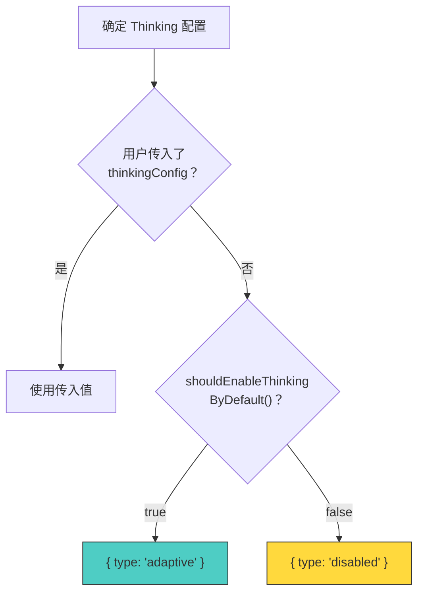
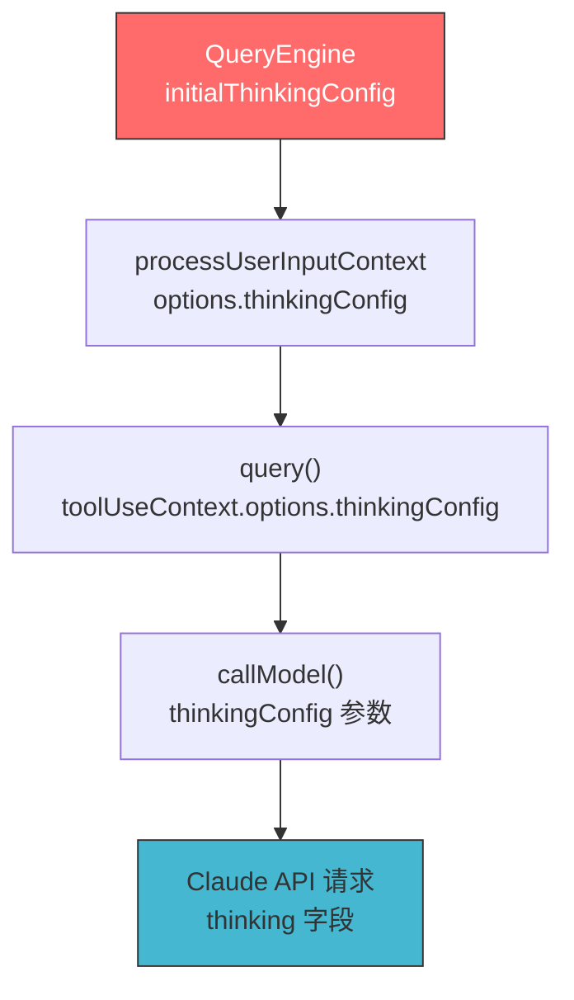
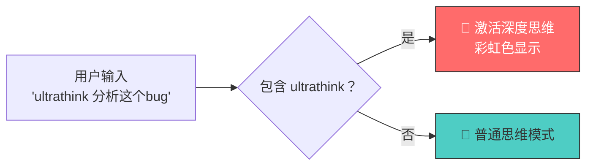
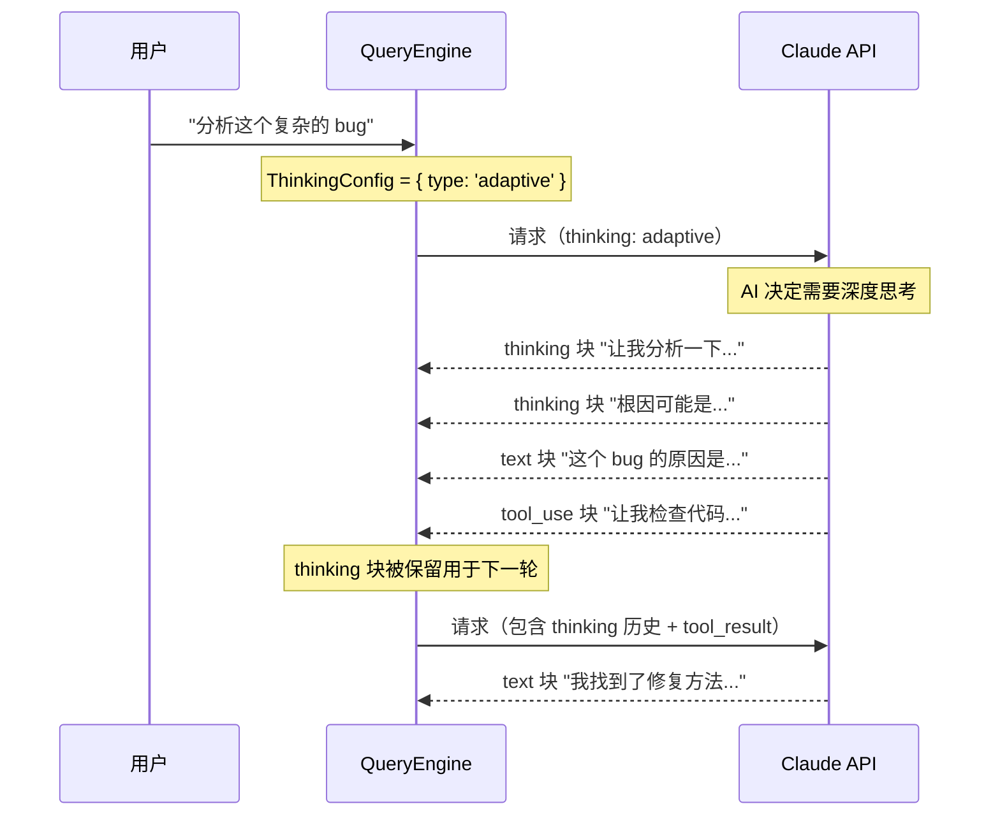
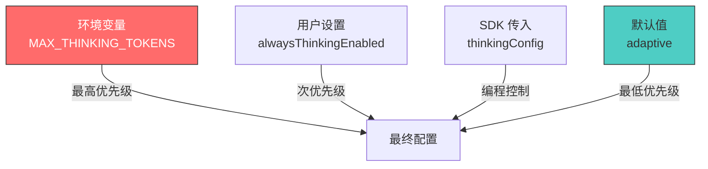

# 第9课：Thinking 扩展思维三种模式

## 🎯 学习目标

学完本课，你将能够：

1. 理解 Thinking（扩展思维）的概念和三种模式
2. 掌握 disabled / enabled / adaptive 的区别和适用场景
3. 了解 Thinking 配置在代码中的传递路径
4. 知道 ultrathink 关键词的触发机制
5. 理解 Thinking 对 Token 消耗和输出质量的影响

---

## 一、生活类比：考试中的思考时间

想象三种考试策略：

- **不思考直接答（disabled）**：看到题就写答案，速度快但可能出错
- **思考5分钟再答（enabled + 固定预算）**：给自己固定的思考时间
- **看题目难度决定思考多久（adaptive）**：简单题快答，难题多想想

Claude 的 Thinking 模式也是类似的：

```
❌ disabled：不使用扩展思维，直接回答
✅ enabled：使用固定预算的思维 Token
🧠 adaptive：AI 自行决定是否需要深度思考
```

---

## 二、三种模式对比



| 模式 | 思维 Token | 适用场景 | 成本 |
|------|-----------|---------|------|
| `disabled` | 0 | 简单问答、快速操作 | 最低 |
| `enabled` | 固定预算 | 复杂推理、数学证明 | 中等（可控） |
| `adaptive` | AI 自行决定 | 通用场景（默认） | 自适应 |

---

## 三、源码解析：ThinkingConfig 类型

```typescript
// 源码文件：utils/thinking.ts（第10-13行）
export type ThinkingConfig =
  | { type: 'adaptive' }
  | { type: 'enabled'; budgetTokens: number }
  | { type: 'disabled' }
```

这是一个 TypeScript **联合类型**——ThinkingConfig 只能是三种之一。

### 3.1 默认配置

```typescript
// 源码文件：utils/thinking.ts（第146-162行）
export function shouldEnableThinkingByDefault(): boolean {
  // 环境变量覆盖
  if (process.env.MAX_THINKING_TOKENS) {
    return parseInt(process.env.MAX_THINKING_TOKENS, 10) > 0
  }

  // 用户设置覆盖
  const { settings } = getSettingsWithErrors()
  if (settings.alwaysThinkingEnabled === false) {
    return false
  }

  // 默认启用
  return true
}
```

### 3.2 QueryEngine 中的配置

```typescript
// 源码文件：QueryEngine.ts（第278-283行）
const initialThinkingConfig: ThinkingConfig = thinkingConfig
  ? thinkingConfig                          // 使用传入的配置
  : shouldEnableThinkingByDefault() !== false
    ? { type: 'adaptive' }                  // 默认使用 adaptive
    : { type: 'disabled' }                  // 明确禁用
```



---

## 四、Thinking 的传递路径



在 API 请求中，Thinking 配置被转化为：

```typescript
// API 请求格式（概念性）
{
  model: "claude-sonnet-4-20250514",
  messages: [...],
  // adaptive 模式
  thinking: { type: "enabled", budget_tokens: "adaptive" }
  // enabled 模式
  thinking: { type: "enabled", budget_tokens: 10000 }
  // disabled 模式：不包含 thinking 字段
}
```

---

## 五、模型支持矩阵

```typescript
// 源码文件：utils/thinking.ts（第90-110行）
export function modelSupportsThinking(model: string): boolean {
  const supported3P = get3PModelCapabilityOverride(model, 'thinking')
  if (supported3P !== undefined) return supported3P

  const canonical = getCanonicalName(model)
  const provider = getAPIProvider()

  // 1P 和 Foundry：所有 Claude 4+ 模型支持
  if (provider === 'foundry' || provider === 'firstParty') {
    return !canonical.includes('claude-3-')
  }
  // 3P（Bedrock/Vertex）：仅 Opus 4+ 和 Sonnet 4+
  return canonical.includes('sonnet-4') || canonical.includes('opus-4')
}
```

```typescript
// 源码文件：utils/thinking.ts（第113-144行）
export function modelSupportsAdaptiveThinking(model: string): boolean {
  const canonical = getCanonicalName(model)
  // 仅 4.6+ 版本支持
  if (canonical.includes('opus-4-6') || canonical.includes('sonnet-4-6')) {
    return true
  }
  // 已知旧模型不支持
  if (canonical.includes('opus') || canonical.includes('sonnet') || canonical.includes('haiku')) {
    return false
  }
  // 1P/Foundry 上的未知模型默认支持
  const provider = getAPIProvider()
  return provider === 'firstParty' || provider === 'foundry'
}
```

| 模型 | Thinking | Adaptive Thinking |
|------|---------|-------------------|
| Claude 3 系列 | ❌ 不支持 | ❌ 不支持 |
| Claude 4 Haiku | ✅ 支持 (1P) | ❌ 不支持 |
| Claude 4 Sonnet | ✅ 支持 | ❌ 不支持 |
| Claude 4.6 Sonnet | ✅ 支持 | ✅ 支持 |
| Claude 4.6 Opus | ✅ 支持 | ✅ 支持 |

---

## 六、Ultrathink — 深度思考关键词

```typescript
// 源码文件：utils/thinking.ts（第19-24行）
export function isUltrathinkEnabled(): boolean {
  if (!feature('ULTRATHINK')) return false
  return getFeatureValue_CACHED_MAY_BE_STALE('tengu_turtle_carbon', true)
}

// 源码文件：utils/thinking.ts（第29-31行）
export function hasUltrathinkKeyword(text: string): boolean {
  return /\bultrathink\b/i.test(text)
}
```

当用户在消息中包含 `ultrathink` 关键词时，系统会激活更深度的思维模式。这是一个"彩蛋"功能——让 AI 花更多时间思考复杂问题。

### 关键词高亮

```typescript
// 源码文件：utils/thinking.ts（第36-58行）
export function findThinkingTriggerPositions(text: string): Array<{
  word: string
  start: number
  end: number
}> {
  const positions = []
  const matches = text.matchAll(/\bultrathink\b/gi)

  for (const match of matches) {
    if (match.index !== undefined) {
      positions.push({
        word: match[0],
        start: match.index,
        end: match.index + match[0].length,
      })
    }
  }
  return positions
}
```

### 彩虹色显示

```typescript
// 源码文件：utils/thinking.ts（第60-86行）
const RAINBOW_COLORS: Array<keyof Theme> = [
  'rainbow_red',
  'rainbow_orange',
  'rainbow_yellow',
  'rainbow_green',
  'rainbow_blue',
  'rainbow_indigo',
  'rainbow_violet',
]

export function getRainbowColor(
  charIndex: number,
  shimmer: boolean = false,
): keyof Theme {
  const colors = shimmer ? RAINBOW_SHIMMER_COLORS : RAINBOW_COLORS
  return colors[charIndex % colors.length]!
}
```

当 `ultrathink` 被激活时，UI 中的 thinking 指示器会显示为彩虹色！



---

## 七、Thinking 对 Token 消耗的影响

### 7.1 Thinking 块的 Token 计数

```typescript
// 源码文件：services/tokenEstimation.ts（第424-429行）
if (block.type === 'thinking') {
  return roughTokenCountEstimation(block.thinking)
}
if (block.type === 'redacted_thinking') {
  return roughTokenCountEstimation(block.data)
}
```

### 7.2 Token 计数时的 Thinking 处理

```typescript
// 源码文件：services/tokenEstimation.ts（第38-56行）
function hasThinkingBlocks(
  messages: BetaMessageParam[],
): boolean {
  for (const message of messages) {
    if (message.role === 'assistant' && Array.isArray(message.content)) {
      for (const block of message.content) {
        if (block.type === 'thinking' || block.type === 'redacted_thinking') {
          return true
        }
      }
    }
  }
  return false
}
```

如果消息中包含 thinking 块，Token 计数 API 调用需要特殊处理（启用 thinking 参数）。

---

## 八、Thinking 的"规则"

源码中有一段精彩的注释，用魔法师的口吻描述了 Thinking 的规则：

```typescript
// 源码文件：query.ts（第152-163行）
/**
 * The rules of thinking are lengthy and fortuitous. They require plenty of thinking
 * of most long duration and deep meditation for a wizard to wrap one's noggin around.
 *
 * The rules follow:
 * 1. 包含 thinking/redacted_thinking 块的消息必须用 max_thinking_length > 0 的请求
 * 2. thinking 块不能是消息的最后一个块
 * 3. thinking 块必须在整个 assistant 轨迹中保留（包括 tool_use → tool_result → 下一条 assistant）
 *
 * Heed these rules well, young wizard. For they are the rules of thinking, and
 * the rules of thinking are the rules of the universe.
 */
```

翻译成表格：

| 规则 | 说明 | 违反后果 |
|------|------|---------|
| 规则1 | 含 thinking 的消息必须在启用了 thinking 的请求中 | API 报错 |
| 规则2 | thinking 块不能是消息的最后一个块 | API 报错 |
| 规则3 | thinking 块必须在整个工具调用链中保留 | "一整天的调试和掉头发" |

---

## 九、Thinking 流程图



---

## 十、配置优先级



---

## 十一、动手练习

### 练习 1：配置 Thinking

尝试在环境变量中设置以下值，观察行为变化：
```bash
MAX_THINKING_TOKENS=0      # 禁用
MAX_THINKING_TOKENS=5000   # 固定预算
MAX_THINKING_TOKENS=        # 默认（adaptive）
```

### 练习 2：识别 Thinking 块

在以下 API 响应中，标出 thinking 块和常规内容块：
```json
{
  "content": [
    {"type": "thinking", "thinking": "这个问题需要..."},
    {"type": "text", "text": "答案是..."},
    {"type": "tool_use", "name": "FileRead", "input": {...}}
  ]
}
```

### 练习 3：思考题

1. 为什么 adaptive 模式比固定预算的 enabled 模式更受欢迎？
2. `redacted_thinking` 是什么？为什么需要"编辑过的思维"？
3. 如果你要实现一个"思维预算自动调整"功能（根据任务复杂度自动设置 budgetTokens），你会怎么设计？

---

## 十二、本课小结

| 概念 | 一句话理解 |
|------|-----------|
| ThinkingConfig | Thinking 模式的配置类型（disabled/enabled/adaptive） |
| disabled | 不使用扩展思维 |
| enabled | 使用固定预算的思维 Token |
| adaptive | AI 自行决定思考深度 |
| ultrathink | 深度思考彩蛋关键词 |
| thinking 规则 | thinking 块的三条必须遵守的规则 |

### 核心公式

```
Thinking 配置 = ENV(MAX_THINKING_TOKENS)
              > 用户设置(alwaysThinkingEnabled)
              > SDK 传入(thinkingConfig)
              > 默认值(adaptive)
```

---

## 📖 下节预告

在第10课 **QueryEngine 与其他系统的协作全景** 中，我们将站在最高视角俯瞰整个系统：
- QueryEngine 如何与 REPL、SDK、MCP 协作
- Agent 系统（子代理）的运作方式
- 插件和技能系统的集成
- 会话持久化和恢复机制
- 完整的系统架构图

这是系列课程的大结局，我们将把所有知识串联起来！
