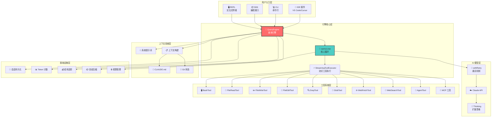
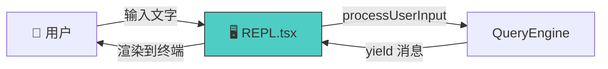
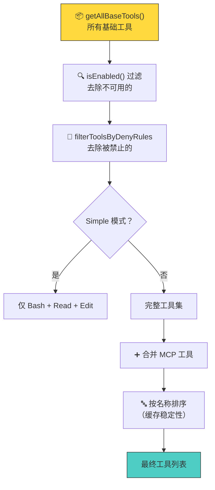
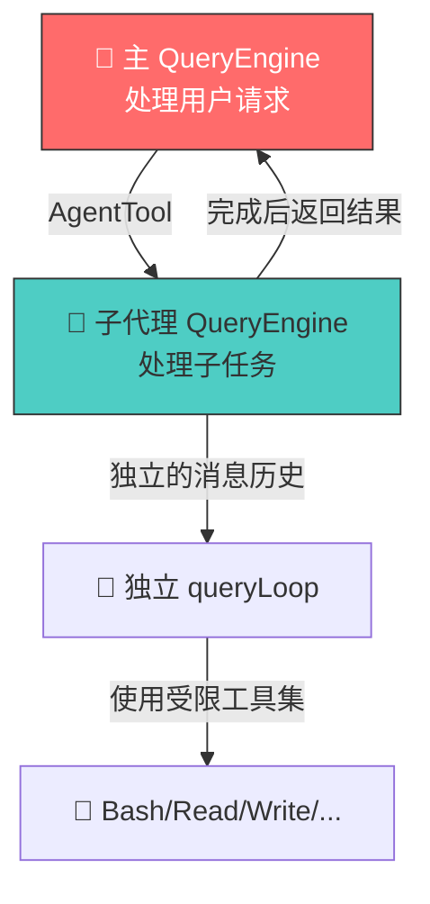
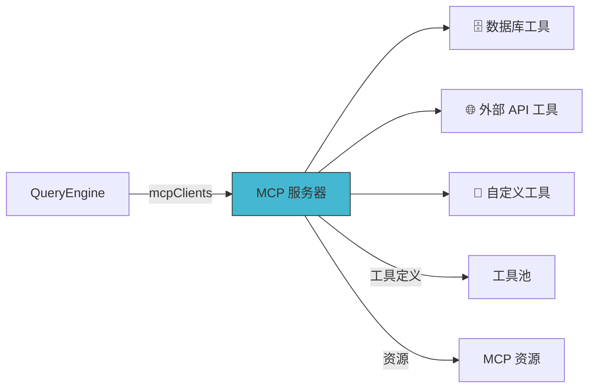
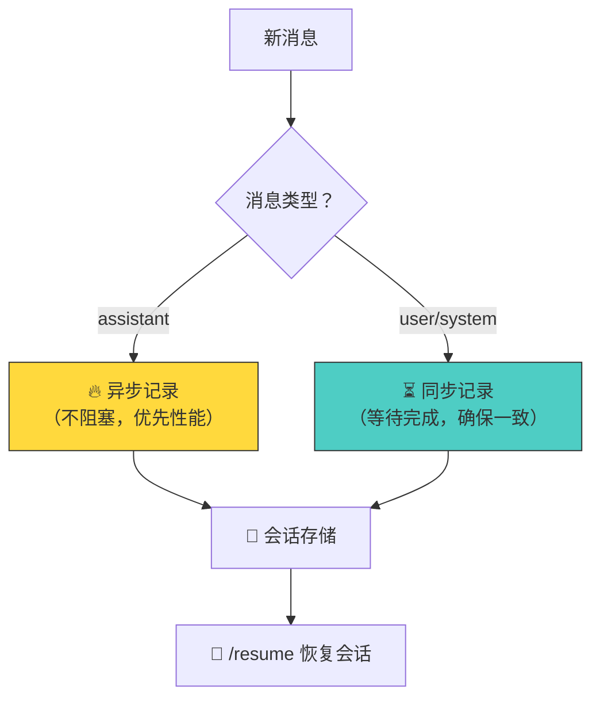
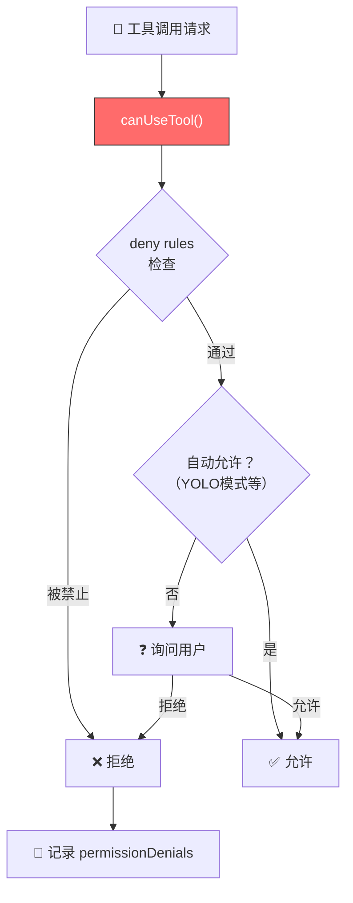
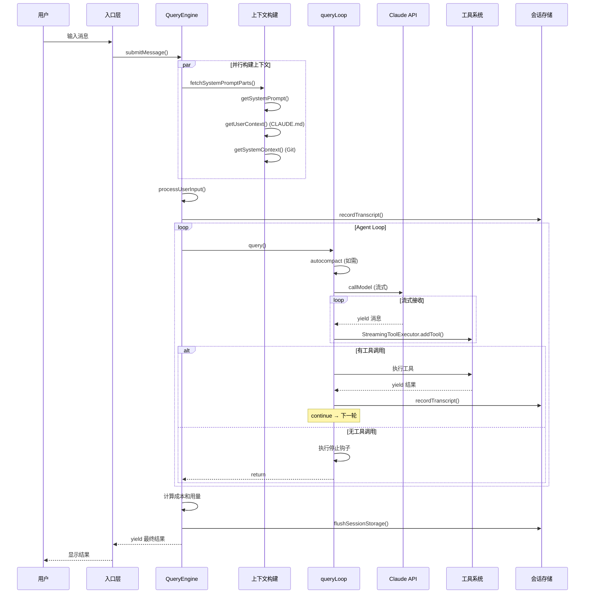

# 第10课：QueryEngine 与其他系统的协作全景

## 🎯 学习目标

学完本课，你将能够：

1. 理解 QueryEngine 在整个 Claude Code 生态中的位置
2. 掌握 QueryEngine 与 REPL、SDK、MCP 的协作方式
3. 了解 Agent 子系统（子代理）的工作原理
4. 理解会话持久化和恢复机制
5. 建立对 Claude Code 完整架构的全局认知

---

## 一、生活类比：QueryEngine 就像城市的交通枢纽

想象一个城市的交通枢纽（如大型火车站）：

- **乘客入口**：REPL（终端交互）、SDK（编程接口）、CLI（命令行）
- **调度中心**：QueryEngine（调度所有请求）
- **铁路网络**：AI 模型、工具系统、MCP 服务器
- **站内设施**：会话存储、Token 计量、权限管理
- **子线路**：Agent 子代理（分支任务）

所有的"旅客"（用户请求）都从不同入口进来，经过"调度中心"（QueryEngine），被分配到正确的"线路"上，最终到达目的地。

---

## 二、系统全景架构



---

## 三、入口层：三种使用方式

### 3.1 REPL（交互式终端）



REPL 是 Claude Code 的主要交互方式。用户在终端输入消息，REPL 调用 QueryEngine，然后将流式结果渲染为终端输出。

### 3.2 SDK（编程接口）

```typescript
// SDK 使用方式（概念性）
const engine = new QueryEngine({
  cwd: '/my/project',
  tools: getTools(permissionContext),
  // ...
})

for await (const message of engine.submitMessage("读取 package.json")) {
  console.log(message)
}
```

SDK 允许开发者以编程方式使用 QueryEngine。`ask()` 函数是一个便捷包装：

```typescript
// 源码文件：QueryEngine.ts（第1186-1295行）
export async function* ask({ prompt, cwd, tools, ... }) {
  const engine = new QueryEngine({ cwd, tools, ... })
  try {
    yield* engine.submitMessage(prompt)
  } finally {
    setReadFileCache(engine.getReadFileState())
  }
}
```

### 3.3 CLI（命令行）

```bash
# 非交互式使用
claude -p "读取 package.json 并告诉我项目名称"

# 带管道
cat error.log | claude -p "分析这个错误日志"
```

---

## 四、工具系统注册

### 4.1 工具注册表

```typescript
// 源码文件：tools.ts（第193-251行）
export function getAllBaseTools(): Tools {
  return [
    AgentTool,           // 子代理工具
    TaskOutputTool,      // 任务输出工具
    BashTool,            // Bash 命令执行
    GlobTool,            // 文件搜索
    GrepTool,            // 内容搜索
    ExitPlanModeV2Tool,  // 退出计划模式
    FileReadTool,        // 文件读取
    FileEditTool,        // 文件编辑
    FileWriteTool,       // 文件写入
    NotebookEditTool,    // Notebook 编辑
    WebFetchTool,        // 网页获取
    TodoWriteTool,       // 待办事项
    WebSearchTool,       // 网页搜索
    TaskStopTool,        // 任务停止
    AskUserQuestionTool, // 向用户提问
    SkillTool,           // 技能工具
    EnterPlanModeTool,   // 进入计划模式
    // ... 更多工具
  ]
}
```

### 4.2 工具过滤管道



```typescript
// 源码文件：tools.ts（第345-367行）
export function assembleToolPool(
  permissionContext: ToolPermissionContext,
  mcpTools: Tools,
): Tools {
  const builtInTools = getTools(permissionContext)
  const allowedMcpTools = filterToolsByDenyRules(mcpTools, permissionContext)

  // 排序保持缓存稳定
  const byName = (a: Tool, b: Tool) => a.name.localeCompare(b.name)
  return uniqBy(
    [...builtInTools].sort(byName).concat(allowedMcpTools.sort(byName)),
    'name',
  )
}
```

---

## 五、Agent 子系统

### 5.1 AgentTool — 创建子代理



子代理有独立的：
- 消息历史
- 工具集（受限，某些工具不可用）
- Token 预算
- 中止控制器

### 5.2 子代理的限制

```typescript
// 源码文件：tools.ts（第99-103行）
export {
  ALL_AGENT_DISALLOWED_TOOLS,     // 所有子代理禁用的工具
  CUSTOM_AGENT_DISALLOWED_TOOLS,   // 自定义子代理禁用的工具
  ASYNC_AGENT_ALLOWED_TOOLS,       // 异步子代理允许的工具
  COORDINATOR_MODE_ALLOWED_TOOLS,  // 协调者模式允许的工具
} from './constants/tools.js'
```

---

## 六、MCP（Model Context Protocol）集成



MCP 服务器提供的工具会被合并到工具池中，与内置工具一起使用。

```typescript
// 源码文件：QueryEngine.ts（第134行）
mcpClients: MCPServerConnection[]  // MCP 服务器连接列表
```

---

## 七、会话持久化

### 7.1 Transcript 记录

```typescript
// 源码文件：QueryEngine.ts（第716-731行）
if (persistSession) {
  if (message.type === 'assistant') {
    void recordTranscript(messages)   // 异步记录（不阻塞）
  } else {
    await recordTranscript(messages)  // 同步记录（等待完成）
  }
}
```



### 7.2 会话恢复

用户可以通过 `--resume` 恢复之前的对话。为此，QueryEngine 在每次用户消息后都会保存 transcript：

```typescript
// 源码文件：QueryEngine.ts（第439-463行）
// 在进入 query loop 之前持久化用户消息
// 如果进程在 API 响应前被杀掉，transcript 仍可用于恢复
if (persistSession && messagesFromUserInput.length > 0) {
  const transcriptPromise = recordTranscript(messages)
  if (isBareMode()) {
    void transcriptPromise  // bare 模式不等待
  } else {
    await transcriptPromise  // 等待保存完成
  }
}
```

---

## 八、权限系统



```typescript
// 源码文件：QueryEngine.ts（第244-271行）
const wrappedCanUseTool: CanUseToolFn = async (
  tool, input, toolUseContext, assistantMessage, toolUseID, forceDecision,
) => {
  const result = await canUseTool(
    tool, input, toolUseContext, assistantMessage, toolUseID, forceDecision,
  )

  // 跟踪拒绝记录（用于 SDK 报告）
  if (result.behavior !== 'allow') {
    this.permissionDenials.push({
      tool_name: sdkCompatToolName(tool.name),
      tool_use_id: toolUseID,
      tool_input: input,
    })
  }

  return result
}
```

---

## 九、完整的请求生命周期



---

## 十、知识串联：10课回顾

```mermaid
mindmap
    root["🧠 QueryEngine<br/>查询引擎"]
        第1课 基础
            什么是 QueryEngine
            核心职责
            类结构
        第2课 循环
            Agent Loop
            while(true) 循环
            状态转换
        第3课 提示词
            系统提示词
            CLAUDE.md
            Git 状态
        第4课 流式
            Streaming 响应
            AsyncGenerator
            SSE 事件
        第5课 流式执行器
            StreamingToolExecutor
            并发控制
            错误级联
        第6课 工具编排
            串行 vs 并发
            partitionToolCalls
            MAX_CONCURRENCY
        第7课 重试
            指数退避
            429/529 处理
            模型回退
        第8课 Token
            粗估 vs 精确
            预算控制
            自动压缩
        第9课 Thinking
            三种模式
            ultrathink
            模型支持
        第10课 全景
            系统协作
            Agent 子代理
            会话持久化
```

---

## 十一、核心设计原则总结

### 原则 1：流式优先

整个系统基于 `AsyncGenerator` 构建，确保用户尽快看到输出。

### 原则 2：韧性设计

`withRetry` + 指数退避 + 模型回退，确保在各种网络条件下都能工作。

### 原则 3：资源感知

Token 计数 + 预算控制 + 自动压缩，确保资源高效使用。

### 原则 4：安全可控

权限系统 + maxTurns + maxBudgetUsd + abort 控制，确保系统行为可预测。

### 原则 5：可扩展

MCP 协议 + 插件系统 + Agent 子代理，确保能力可以持续扩展。

---

## 十二、动手练习

### 练习 1：绘制你的架构图

选择 Claude Code 的一个使用场景（如"用 Claude Code 重构一个 React 组件"），画出完整的数据流图，标注经过的每一个模块。

### 练习 2：设计新功能

如果你要给 QueryEngine 添加一个"自动生成单元测试"的功能，你需要：
1. 创建哪些新的 Tool？
2. 修改 QueryEngine 的哪些配置？
3. 如何控制测试生成的质量和数量？

### 练习 3：终极思考题

1. QueryEngine 为什么选择 `AsyncGenerator` 而不是 `Observable`（RxJS）或 `EventEmitter`？
2. 如果要支持多个 AI 模型同时工作（一个做代码生成，一个做代码审查），你会如何扩展 QueryEngine？
3. 本系列课程中，你认为哪个设计决策最精妙？为什么？

---

## 十三、本课小结

| 系统 | 与 QueryEngine 的关系 |
|------|---------------------|
| REPL | 交互式用户界面，调用 submitMessage |
| SDK | 编程接口，通过 ask() 或直接实例化 |
| MCP | 提供额外工具能力 |
| Agent | 子代理，独立的 QueryEngine 实例 |
| 会话存储 | 持久化 transcript，支持恢复 |
| 权限系统 | 控制工具使用权限 |
| 压缩系统 | 管理上下文窗口 |
| 工具注册 | 提供可执行能力 |

---

## 系列课程总结

恭喜你完成了 QueryEngine 系列全部 10 课！让我们用一个公式总结整个系统：

```
Claude Code = QueryEngine(
  入口层(REPL | SDK | CLI),
  上下文(系统提示词 + CLAUDE.md + Git),
  循环(
    while(true) {
      压缩(autoCompact) →
      调用(Claude API + Thinking + Retry) →
      执行(StreamingToolExecutor | toolOrchestration) →
      检查(预算 + 轮次 + 停止钩子) →
      continue | return
    }
  ),
  基础设施(Token计数 + 成本追踪 + 会话持久化 + 权限管理)
)
```

### 推荐学习路径

1. **入门**：先读第1、2课，理解核心概念
2. **进阶**：读第3-6课，深入各子系统
3. **高级**：读第7-9课，理解优化策略
4. **全局**：读第10课，建立全景认知
5. **实践**：阅读源码，做练习题，尝试修改代码

### 源码文件速查表

| 文件 | 核心职责 |
|------|---------|
| `QueryEngine.ts` | 引擎主类，管理对话生命周期 |
| `query.ts` | 核心查询循环（queryLoop） |
| `context.ts` | Git 状态 + CLAUDE.md 加载 |
| `tools.ts` | 工具注册与过滤 |
| `services/api/claude.ts` | API 调用和流式处理 |
| `services/api/withRetry.ts` | 重试和指数退避 |
| `services/tools/StreamingToolExecutor.ts` | 流式工具执行 |
| `services/tools/toolOrchestration.ts` | 传统工具编排 |
| `services/tokenEstimation.ts` | Token 计数 |
| `utils/thinking.ts` | Thinking 模式配置 |
| `utils/queryContext.ts` | 系统提示词构建 |
| `constants/prompts.ts` | 系统提示词内容 |
| `utils/claudemd.ts` | CLAUDE.md 发现和加载 |

---

祝你在 Claude Code 的源码世界中探索愉快！ 🎉
