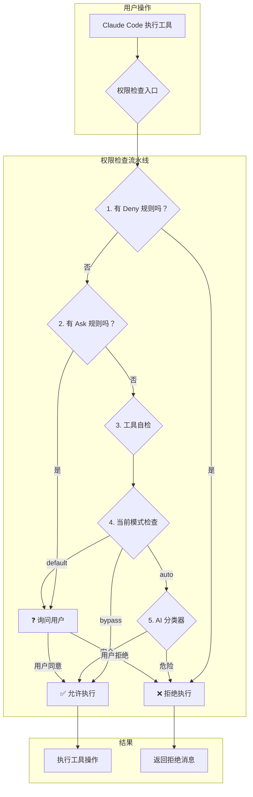
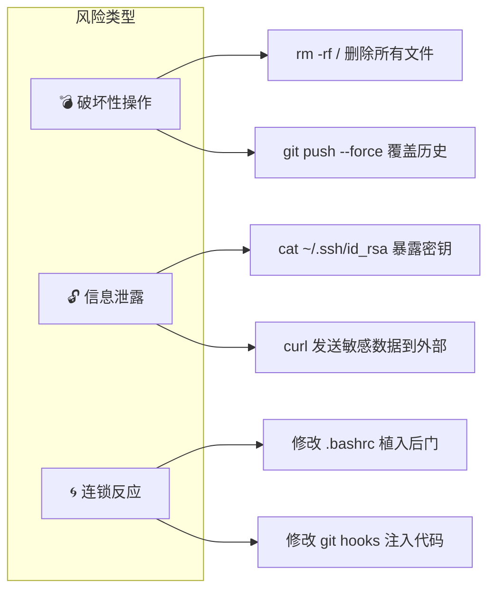

# 第一课：为什么 AI Agent 需要权限控制？

> 🎯 从一个"删库跑路"的故事说起，理解为什么给 AI 加上权限系统至关重要。

---

## 📋 学习目标

学完本课，你将能够：

1. 理解 AI Agent 与传统程序在"权限"上的本质区别
2. 解释为什么 Claude Code 需要一套完整的权限系统
3. 列举 AI Agent 可能造成的三类风险
4. 认识 Claude Code 中五种权限模式的基本概念
5. 看懂权限系统的整体架构图

---

## 🏠 生活类比：AI 就像你请来的装修工人

想象你请了一个非常能干的装修工人来你家装修。这个工人：

- **能力超强**：会水电、会木工、会粉刷，无所不能
- **效率极高**：给他一个任务，他马上就能动手
- **但有个问题**：他不一定知道哪些东西不该动

如果你不设任何规矩，这个工人可能：

| 场景 | 你期望的 | 他可能做的 |
|------|---------|-----------|
| "帮我整理一下厨房" | 整理橱柜 | 把你收藏的老酒都扔了 |
| "把客厅弄亮一点" | 换灯泡 | 把墙砸了开个天窗 |
| "网络不好修一下" | 检查路由器 | 把你的密码发到论坛求助 |

**AI Agent 就是这个"超能装修工"。** Claude Code 能读写文件、执行命令、访问网络——如果没有权限控制，后果不堪设想。

---

## 🔍 源码直击：权限行为的三种结果

在 Claude Code 源码中，每一次权限检查的结果只有三种：

```typescript
// 源码位置：types/permissions.ts
export type PermissionBehavior = 'allow' | 'deny' | 'ask'
```

就这三个单词，构成了整个权限系统的基石：

| 行为 | 含义 | 类比 |
|------|------|------|
| `allow` | 直接放行 | 工人进自己的工作间 |
| `deny` | 直接拒绝 | 禁止进入保险箱房间 |
| `ask` | 先问你再决定 | 进主卧前先敲门 |

---

## 🎭 五种权限模式：从"全看紧"到"全放开"

Claude Code 设计了五种主要的权限模式，就像你家的安保等级：

```typescript
// 源码位置：types/permissions.ts
export const EXTERNAL_PERMISSION_MODES = [
  'acceptEdits',       // 接受编辑模式
  'bypassPermissions', // 绕过权限模式
  'default',           // 默认模式
  'dontAsk',           // 别问了模式
  'plan',              // 规划模式
] as const

// 内部还有一个 auto 模式（AI 分类器自动判断）
export type InternalPermissionMode = ExternalPermissionMode | 'auto' | 'bubble'
```

用安保等级来理解：

```
┌─────────────┐
│   plan       │ ← 最严格：只能看，不能改（只读模式）
├─────────────┤
│   default    │ ← 默认：每次操作都问你（推荐新手使用）
├─────────────┤
│  acceptEdits │ ← 宽松：文件编辑自动通过，其他的问你
├─────────────┤
│    auto      │ ← 智能：AI 分类器判断是否安全
├─────────────┤
│   bypass     │ ← 最宽松：几乎全部放行（但仍有底线！）
└─────────────┘
```

---

## 🏗️ 权限系统整体架构



---

## 📝 权限决策的完整类型定义

每次权限检查都会产生一个"决策"对象，记录了为什么允许或拒绝：

```typescript
// 源码位置：types/permissions.ts

// 允许决策
export type PermissionAllowDecision = {
  behavior: 'allow'
  updatedInput?: Input          // 可能修改后的输入
  decisionReason?: PermissionDecisionReason  // 为什么允许
}

// 询问决策
export type PermissionAskDecision = {
  behavior: 'ask'
  message: string               // 要显示给用户的消息
  suggestions?: PermissionUpdate[]  // 建议用户添加的规则
}

// 拒绝决策
export type PermissionDenyDecision = {
  behavior: 'deny'
  message: string               // 拒绝原因
  decisionReason: PermissionDecisionReason
}
```

---

## 🧠 决策原因：十种不同的判定来源

```typescript
// 源码位置：types/permissions.ts
export type PermissionDecisionReason =
  | { type: 'rule'; rule: PermissionRule }           // 被规则匹配
  | { type: 'mode'; mode: PermissionMode }           // 当前模式决定
  | { type: 'subcommandResults'; reasons: Map<...> } // 子命令的汇总结果
  | { type: 'hook'; hookName: string }               // Hook 钩子决定
  | { type: 'classifier'; classifier: string }       // AI 分类器判定
  | { type: 'safetyCheck'; reason: string }          // 安全检查（不可绕过）
  | { type: 'workingDir'; reason: string }           // 工作目录限制
  | { type: 'asyncAgent'; reason: string }           // 异步代理限制
  | { type: 'sandboxOverride'; reason: string }      // 沙箱覆盖
  | { type: 'other'; reason: string }                // 其他原因
```

就像法院判决书会写明"依据某某法条"一样，权限系统的每个决策都有明确的判定来源——这让系统的行为可审计、可解释。

---

## 🔐 AI Agent 的三类风险



这也是为什么源码中有专门的"安全检查"类型，某些路径（如 `.git/`、`.claude/`）即使在最宽松的 bypass 模式下也需要用户确认：

```typescript
// 源码位置：utils/permissions/permissions.ts（第1252-1260行）

// 1g. Safety checks (e.g. .git/, .claude/, .vscode/, shell configs) are
// bypass-immune — they must prompt even in bypassPermissions mode.
if (
  toolPermissionResult?.behavior === 'ask' &&
  toolPermissionResult.decisionReason?.type === 'safetyCheck'
) {
  return toolPermissionResult  // 即使 bypass 模式也不放过！
}
```

---

## ✏️ 动手练习

### 练习 1：权限行为匹配

将以下场景与权限行为（allow / deny / ask）匹配：

| 场景 | 应该是什么行为？ |
|------|----------------|
| 读取项目中的 README.md | ？ |
| 执行 `rm -rf /` | ？ |
| 写入一个新的源码文件 | ？ |
| 修改 `.git/config` | ？ |
| 运行 `ls` 命令 | ？ |

<details>
<summary>点击查看答案</summary>

| 场景 | 行为 | 原因 |
|------|------|------|
| 读取 README.md | **allow** | 读取项目文件是安全的 |
| 执行 `rm -rf /` | **deny** | 这是破坏性操作，必须拒绝 |
| 写入新源码文件 | **ask** | 需要确认写入位置是否合适 |
| 修改 `.git/config` | **ask** | 安全敏感路径，即使 bypass 模式也要问 |
| 运行 `ls` | **allow** | 只读命令，默认安全 |

</details>

### 练习 2：思考题

想一想：为什么 Claude Code 的权限系统不简单地设计成"全部允许"或"全部询问"？

<details>
<summary>点击查看思路</summary>

- **全部允许**：太危险，AI 可能执行破坏性操作
- **全部询问**：太烦人，用户每执行一个 `ls` 都要确认，完全不可用
- **正确做法**：根据操作的风险程度，采用不同策略——安全的自动放行，危险的自动拒绝，中间地带询问用户

这就是为什么 Claude Code 设计了多种模式和规则系统的原因。

</details>

### 练习 3：阅读源码

打开 `types/permissions.ts`，找到以下内容：
1. `PermissionBehavior` 类型定义
2. `PermissionDecisionReason` 的所有 `type` 值
3. 数一数总共有几种决策原因类型

---

## 📌 本课小结

| 要点 | 内容 |
|------|------|
| 核心问题 | AI Agent 拥有强大能力但缺乏判断力，需要权限系统约束 |
| 三种行为 | `allow`（允许）、`deny`（拒绝）、`ask`（询问） |
| 五种模式 | default、acceptEdits、plan、bypassPermissions、auto |
| 三类风险 | 破坏性操作、信息泄露、连锁反应 |
| 核心原则 | 安全敏感路径即使 bypass 模式也不放过 |

---

## 🔜 下节预告

**第二课：Default 模式——每次询问的安全哲学**

我们将深入 Default 模式的源码实现，看看当你第一次使用 Claude Code 时，它是如何"步步为营"地保护你的系统安全的。我们会看到 `hasPermissionsToUseTool` 这个核心函数的完整执行流程。

---

*本课对应漫画章节：第一格"AI Agent 闯入你的电脑"*
