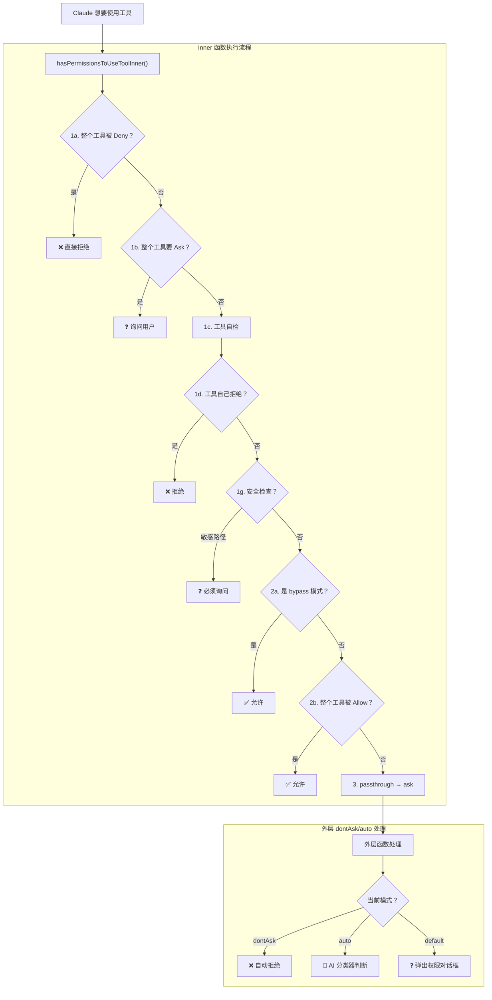
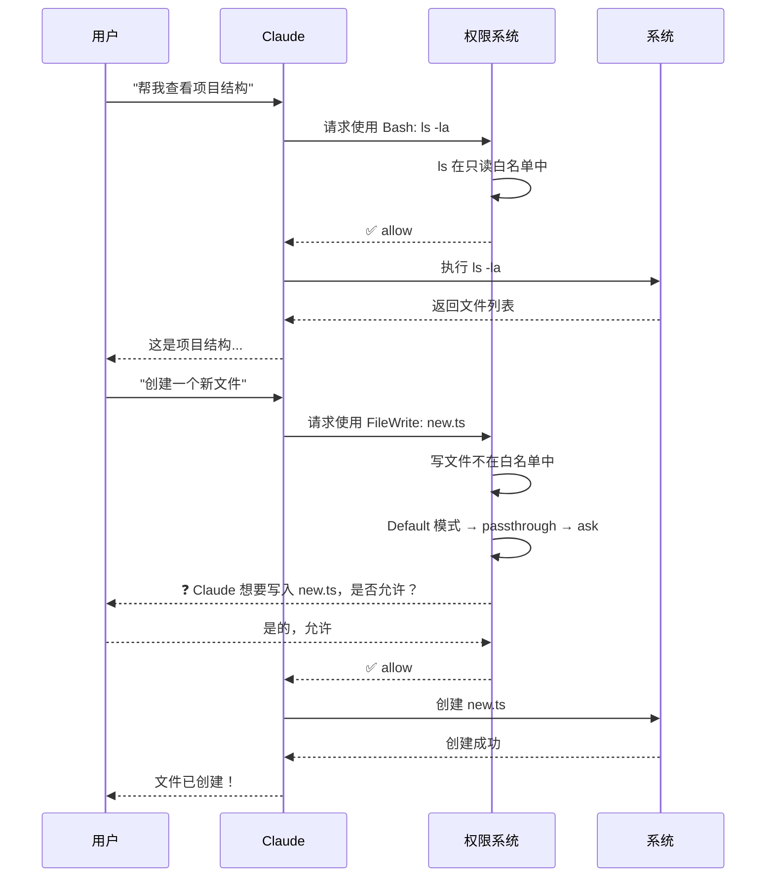
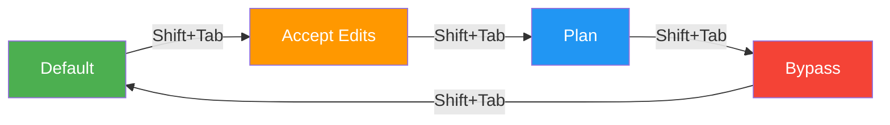

# 第二课：Default 模式——每次询问的安全哲学

> 🎯 Default 模式是 Claude Code 的默认安全策略，就像一个谨慎的新管家——每件事都先问主人。

---

## 📋 学习目标

1. 理解 Default 模式的设计理念和适用场景
2. 掌握 `hasPermissionsToUseTool` 核心函数的执行流程
3. 了解"只读命令"自动放行的白名单机制
4. 区分"passthrough"和"ask"行为的细微差异
5. 理解权限模式配置的数据结构

---

## 🏠 生活类比：谨慎的新管家

Default 模式就像你刚请来的新管家：

- 📖 看文件？可以，这是只读操作，不会造成损害
- ✏️ 改文件？等等，让我先问一下主人
- 🔧 装软件？这是大事，必须先得到批准
- 💣 删东西？绝对不行，除非主人亲自确认

**核心理念：宁可多问一次，不可多做一步。**

---

## 🔍 源码直击：Default 模式的定义

```typescript
// 源码位置：utils/permissions/PermissionMode.ts

const PERMISSION_MODE_CONFIG = {
  default: {
    title: 'Default',
    shortTitle: 'Default',
    symbol: '',        // 不需要特殊符号
    color: 'text',     // 普通文字颜色（不显眼，因为是默认）
    external: 'default',
  },
  // ... 其他模式
}
```

注意 `symbol` 是空字符串——因为 Default 是默认状态，不需要任何视觉提示。其他模式（如 bypass 的 `⏵⏵`）则用符号提醒用户当前处于非常规状态。

---

## 🏗️ 核心函数：`hasPermissionsToUseTool`

这是整个权限系统的"心脏"。每次 Claude 调用任何工具前，都要经过这个函数：



---

## 📝 核心源码解析

让我们逐步看 `hasPermissionsToUseToolInner` 在 Default 模式下的行为：

```typescript
// 源码位置：utils/permissions/permissions.ts（简化版）

async function hasPermissionsToUseToolInner(
  tool: Tool,
  input: { [key: string]: unknown },
  context: ToolUseContext,
): Promise<PermissionDecision> {

  // ======= 第一阶段：检查拒绝规则 =======

  // 1a. 整个工具是否被拒绝？
  const denyRule = getDenyRuleForTool(appState.toolPermissionContext, tool)
  if (denyRule) {
    return {
      behavior: 'deny',
      message: `Permission to use ${tool.name} has been denied.`,
      decisionReason: { type: 'rule', rule: denyRule },
    }
  }

  // 1b. 整个工具是否需要询问？
  const askRule = getAskRuleForTool(appState.toolPermissionContext, tool)
  if (askRule) {
    return {
      behavior: 'ask',
      message: createPermissionRequestMessage(tool.name),
      decisionReason: { type: 'rule', rule: askRule },
    }
  }

  // 1c. 让工具自己检查权限
  let toolPermissionResult = await tool.checkPermissions(parsedInput, context)

  // 1g. 安全检查（bypass-immune，不可绕过）
  if (
    toolPermissionResult?.behavior === 'ask' &&
    toolPermissionResult.decisionReason?.type === 'safetyCheck'
  ) {
    return toolPermissionResult
  }

  // ======= 第二阶段：模式检查 =======

  // 2a. bypass 模式直接放行（Default 模式不会走到这里）
  // 2b. 检查整个工具是否在 Allow 规则中

  // ======= 第三阶段：最终决定 =======

  // 3. passthrough 转为 ask（Default 模式的核心行为）
  const result = toolPermissionResult.behavior === 'passthrough'
    ? { ...toolPermissionResult, behavior: 'ask' }
    : toolPermissionResult

  return result
}
```

**关键理解**：在 Default 模式下，任何不被明确允许或拒绝的操作，最终都会变成 `ask`——即询问用户。

---

## 📖 只读命令：自动放行的白名单

虽然 Default 模式很严格，但它不会对每个 `ls` 或 `cat` 都弹窗。看看 BashTool 中的只读命令白名单：

```typescript
// 源码位置：tools/BashTool/readOnlyValidation.ts（精简版）

const READONLY_COMMANDS = [
  // 时间日期
  'cal', 'uptime',

  // 文件内容查看
  'cat', 'head', 'tail', 'wc', 'stat',

  // 系统信息
  'id', 'uname', 'free', 'df', 'du',

  // 路径信息
  'basename', 'dirname', 'realpath',

  // 文本处理（只读）
  'cut', 'paste', 'tr', 'column', 'diff',

  // 其他安全命令
  'sleep', 'which', 'type', 'true', 'false',
]
```

还有通过 Flag 解析来验证安全性的命令白名单：

```typescript
// 源码位置：tools/BashTool/readOnlyValidation.ts

const COMMAND_ALLOWLIST = {
  grep: {
    safeFlags: {
      '-i': 'none',  // 忽略大小写 → 安全
      '-r': 'none',  // 递归搜索 → 安全
      '-n': 'none',  // 显示行号 → 安全
      '-c': 'none',  // 只计数 → 安全
      // ...
    },
  },
  'git diff': {
    safeFlags: { /* ... */ },
  },
  // ...
}
```

---

## 🔄 Default 模式下的典型工作流



---

## 🔧 Accept Edits 模式：文件系统命令的快速通道

Default 模式的"进化版"是 Accept Edits 模式，它对特定文件系统操作自动放行：

```typescript
// 源码位置：tools/BashTool/modeValidation.ts

const ACCEPT_EDITS_ALLOWED_COMMANDS = [
  'mkdir',    // 创建目录
  'touch',    // 创建空文件
  'rm',       // 删除文件
  'rmdir',    // 删除目录
  'mv',       // 移动/重命名
  'cp',       // 复制
  'sed',      // 流编辑器
] as const

function checkPermissionMode(input, toolPermissionContext) {
  if (
    toolPermissionContext.mode === 'acceptEdits' &&
    isFilesystemCommand(baseCmd)
  ) {
    return {
      behavior: 'allow',
      decisionReason: { type: 'mode', mode: 'acceptEdits' },
    }
  }
  return { behavior: 'passthrough', message: '...' }
}
```

---

## 🔄 模式切换：Shift+Tab 循环

用户可以用 Shift+Tab 在模式间切换：

```typescript
// 源码位置：utils/permissions/getNextPermissionMode.ts

export function getNextPermissionMode(
  toolPermissionContext,
): PermissionMode {
  switch (toolPermissionContext.mode) {
    case 'default':
      return 'acceptEdits'    // Default → Accept Edits

    case 'acceptEdits':
      return 'plan'           // Accept Edits → Plan

    case 'plan':
      if (toolPermissionContext.isBypassPermissionsModeAvailable) {
        return 'bypassPermissions'  // Plan → Bypass（如果可用）
      }
      return 'default'        // Plan → Default（循环回来）

    case 'bypassPermissions':
      return 'default'        // Bypass → Default
  }
}
```



---

## ✏️ 动手练习

### 练习 1：流程追踪

假设在 Default 模式下，Claude 想执行 `npm install`，追踪权限检查流程：

1. `getDenyRuleForTool` 检查是否有拒绝规则 → ？
2. `getAskRuleForTool` 检查是否有询问规则 → ？
3. `tool.checkPermissions` 工具自检 → ？
4. 安全检查 → ？
5. 最终结果 → ？

<details>
<summary>点击查看答案</summary>

1. 没有拒绝规则 → 继续
2. 没有询问规则 → 继续
3. `npm install` 不是只读命令 → 返回 `passthrough`
4. 不涉及敏感路径 → 继续
5. `passthrough` 转为 `ask` → **弹出权限对话框询问用户**

</details>

### 练习 2：哪些命令会自动放行？

在 Default 模式下，以下命令哪些会自动放行（不询问）？

- [ ] `ls -la`
- [ ] `npm run build`
- [ ] `cat README.md`
- [ ] `git status`
- [ ] `rm -rf node_modules`
- [ ] `grep -r "TODO" .`

<details>
<summary>点击查看答案</summary>

- ✅ `ls -la` — 在只读白名单中
- ❌ `npm run build` — 会执行代码，需要询问
- ✅ `cat README.md` — 在只读白名单中
- ✅ `git status` — git 只读命令在白名单中
- ❌ `rm -rf node_modules` — 删除操作，需要询问
- ✅ `grep -r "TODO" .` — grep 在白名单中，flags 都是安全的

</details>

### 练习 3：思考题

为什么 Default 模式下 `git status` 可以自动放行，但 `git push` 不行？

<details>
<summary>点击查看思路</summary>

`git status` 只是查看当前仓库状态，不会修改任何内容（只读操作）。而 `git push` 会将代码推送到远程仓库——这是一个不可逆的网络操作，必须经过用户确认。源码中的 `GIT_READ_ONLY_COMMANDS` 明确列出了哪些 git 子命令是安全的只读操作。

</details>

---

## 📌 本课小结

| 要点 | 内容 |
|------|------|
| 设计理念 | 默认不信任，操作前先问——宁可多问不多做 |
| 核心函数 | `hasPermissionsToUseTool` 是权限检查的总入口 |
| passthrough | 工具返回"交由上层决定"，Default 模式将其转为 ask |
| 只读白名单 | `ls`、`cat`、`grep`、`git status` 等安全命令自动放行 |
| 模式切换 | Shift+Tab 在 Default → AcceptEdits → Plan → Bypass 间循环 |

---

## 🔜 下节预告

**第三课：Auto 模式——AI 分类器自动判断**

Default 模式的问题是太多询问让人烦躁。Auto 模式用另一个 AI（分类器）来判断操作是否安全，实现"安全的自动化"。我们将深入看 YOLO 分类器是如何工作的。

---

*本课对应漫画章节：第二格"谨慎的管家"*
