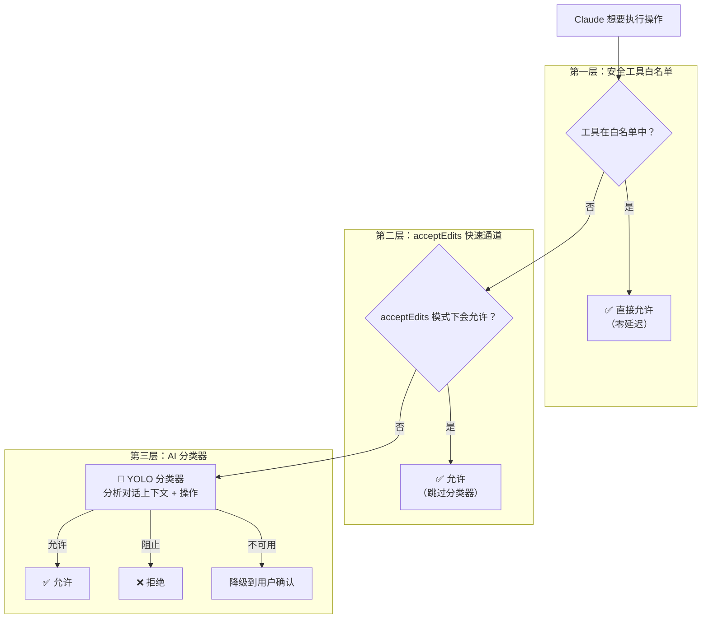
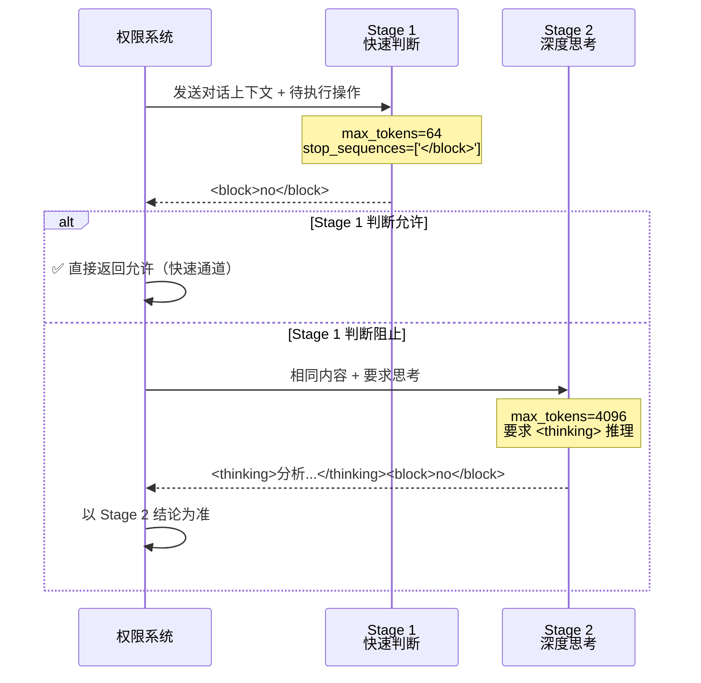
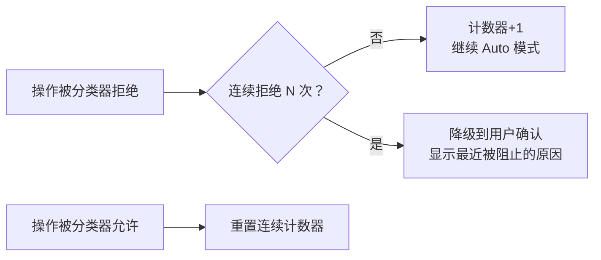

# 第三课：Auto 模式——AI 分类器自动判断

> 🎯 当你不想频繁确认，又不想完全放弃安全时，Auto 模式用另一个 AI 来替你把关。

---

## 📋 学习目标

1. 理解 Auto 模式的工作原理和设计动机
2. 掌握 YOLO 分类器的两阶段决策流程
3. 了解安全工具白名单和 acceptEdits 快速通道
4. 理解拒绝追踪（Denial Tracking）机制
5. 认识分类器不可用时的"失败关闭"策略

---

## 🏠 生活类比：雇了个保安队长

Default 模式像一个什么都问你的新管家。Auto 模式则像你雇了一个有经验的保安队长：

- 📋 他有一份"安全清单"——清单上的操作直接放行
- 🧠 遇到清单外的操作，他会自己判断是否安全
- ⛔ 遇到危险操作，他会直接拦截并报告
- 🚨 如果判断不了，他才来找你确认

---

## 🔍 Auto 模式的三层决策



---

## 📝 安全工具白名单

第一层是最快的——直接跳过 AI 分类器：

```typescript
// 源码位置：utils/permissions/classifierDecision.ts

const SAFE_YOLO_ALLOWLISTED_TOOLS = new Set([
  // 只读文件操作
  FILE_READ_TOOL_NAME,

  // 搜索工具（只读）
  GREP_TOOL_NAME,
  GLOB_TOOL_NAME,
  LSP_TOOL_NAME,
  TOOL_SEARCH_TOOL_NAME,

  // 任务管理（只改元数据）
  TODO_WRITE_TOOL_NAME,

  // 计划模式 / UI 交互
  ASK_USER_QUESTION_TOOL_NAME,
  ENTER_PLAN_MODE_TOOL_NAME,
  EXIT_PLAN_MODE_TOOL_NAME,

  // 其他安全工具
  SLEEP_TOOL_NAME,
])

export function isAutoModeAllowlistedTool(toolName: string): boolean {
  return SAFE_YOLO_ALLOWLISTED_TOOLS.has(toolName)
}
```

这些工具只会读取数据或管理内部状态，不会对你的系统造成任何影响。

---

## 🚀 acceptEdits 快速通道

第二层也能避免调用分类器 API，节省时间和成本：

```typescript
// 源码位置：utils/permissions/permissions.ts（简化版）

// 在 Auto 模式中，先检查 acceptEdits 模式是否会允许
if (result.behavior === 'ask' && tool.name !== AGENT_TOOL_NAME) {
  const acceptEditsResult = await tool.checkPermissions(parsedInput, {
    ...context,
    getAppState: () => ({
      ...state,
      toolPermissionContext: {
        ...state.toolPermissionContext,
        mode: 'acceptEdits',  // 假装是 acceptEdits 模式
      },
    }),
  })

  if (acceptEditsResult.behavior === 'allow') {
    // acceptEdits 会允许 → Auto 也允许，跳过分类器
    return {
      behavior: 'allow',
      decisionReason: { type: 'mode', mode: 'auto' },
    }
  }
}
```

**设计哲学**：如果连更宽松的 acceptEdits 模式都会允许，那 Auto 模式就没必要再调用昂贵的 AI 分类器了。

---

## 🤖 YOLO 分类器：两阶段 XML 决策

当前两层都无法判断时，就轮到 AI 分类器出场了：



```typescript
// 源码位置：utils/permissions/yoloClassifier.ts（简化版）

// Stage 1 后缀：催促快速决定
const XML_S1_SUFFIX = '\nErr on the side of blocking. <block> immediately.'

// Stage 2 后缀：要求深入思考
const XML_S2_SUFFIX =
  '\nReview the classification process and follow it carefully...' +
  'Use <thinking> before responding with <block>.'

// 解析分类器返回
function parseXmlBlock(text: string): boolean | null {
  const matches = [...stripThinking(text).matchAll(/<block>(yes|no)\b/gi)]
  if (matches.length === 0) return null
  return matches[0][1].toLowerCase() === 'yes'  // yes = 应该阻止
}
```

**为什么用两阶段？**

| 阶段 | 目的 | Token 消耗 |
|------|------|-----------|
| Stage 1 | 快速初筛：允许的立即放行 | 很少（64 tokens） |
| Stage 2 | 深度审核：只对 Stage 1 阻止的做再判断 | 较多（4096 tokens） |

Stage 1 允许 → 立刻放行（省钱省时间）。Stage 1 阻止 → Stage 2 再想想（减少误报）。

---

## 📊 对话上下文压缩

分类器需要"看到"当前对话才能做判断。源码用紧凑格式传递上下文：

```typescript
// 源码位置：utils/permissions/yoloClassifier.ts

export function buildTranscriptEntries(messages: Message[]): TranscriptEntry[] {
  const transcript: TranscriptEntry[] = []
  for (const msg of messages) {
    if (msg.type === 'user') {
      // 用户消息：保留文本
      transcript.push({ role: 'user', content: textBlocks })
    } else if (msg.type === 'assistant') {
      // 助手消息：只保留 tool_use（不保留助手文本）
      // 原因：助手文本是模型生成的，可能被精心构造来影响分类器
      for (const block of msg.message.content) {
        if (block.type === 'tool_use') {
          blocks.push({ type: 'tool_use', name: block.name, input: block.input })
        }
      }
    }
  }
  return transcript
}
```

**安全设计**：助手生成的文本被刻意排除，防止攻击者通过操纵助手输出来欺骗分类器。

---

## 🛡️ 拒绝追踪：连续失败的熔断机制

如果 AI 分类器连续多次拒绝，系统会降级到人工确认：

```typescript
// 源码位置：utils/permissions/denialTracking.ts（概念）

export const DENIAL_LIMITS = {
  maxConsecutive: number,  // 连续拒绝上限
  maxTotal: number,        // 总拒绝上限
}

// 每次分类器拒绝
const newDenialState = recordDenial(denialState)

// 检查是否该降级
if (shouldFallbackToPrompting(denialState)) {
  // 太多拒绝了，让用户自己来看看
  return { behavior: 'ask', message: '多次操作被阻止，请人工审查' }
}

// 每次分类器允许，重置计数器
const newDenialState = recordSuccess(denialState)
```



---

## 💥 分类器不可用时的应对

```typescript
// 源码位置：utils/permissions/permissions.ts（简化版）

if (classifierResult.unavailable) {
  // "铁门关闭"策略：分类器挂了就拒绝
  if (getFeatureValue('tengu_iron_gate_closed', true)) {
    return {
      behavior: 'deny',
      message: buildClassifierUnavailableMessage(tool.name),
    }
  }
  // "铁门打开"策略（备选）：降级到用户确认
  return result  // 让用户自己决定
}

// 上下文太长，分类器装不下
if (classifierResult.transcriptTooLong) {
  // 这是确定性的（同一对话只会越来越长）
  // 降级到手动确认
  return { ...result, behavior: 'ask' }
}
```

**安全原则：Fail Closed（失败时关闭）**——分类器出错时默认拒绝，而不是默认允许。

---

## 📈 分类器开销追踪

源码中有详细的开销追踪，确保分类器不会拖慢用户体验：

```typescript
// 分类器性能指标
logEvent('tengu_auto_mode_decision', {
  decision: yoloDecision,           // 'allowed' | 'blocked' | 'unavailable'
  toolName: tool.name,
  classifierModel: classifierResult.model,
  classifierInputTokens: usage.inputTokens,
  classifierOutputTokens: usage.outputTokens,
  classifierDurationMs: classifierResult.durationMs,
  classifierCostUSD: calculateCostFromTokens(model, usage),
  // 两阶段分别的开销
  classifierStage1DurationMs: ...,
  classifierStage2DurationMs: ...,
})
```

---

## ✏️ 动手练习

### 练习 1：分层判断

以下操作分别会被 Auto 模式的哪一层处理？

| 操作 | 处理层级 |
|------|---------|
| 使用 Grep 搜索代码 | ？ |
| 写入一个在项目内的新文件 | ？ |
| 执行 `curl https://example.com` | ？ |
| 读取一个文件 | ？ |
| 执行 `rm -rf /` | ？ |

<details>
<summary>点击查看答案</summary>

| 操作 | 处理层级 | 原因 |
|------|---------|------|
| Grep 搜索 | **第一层：白名单** | Grep 在安全工具白名单中 |
| 写入项目内文件 | **第二层：acceptEdits** | 文件编辑在 acceptEdits 下允许 |
| curl 命令 | **第三层：AI 分类器** | 网络请求不在前两层 |
| 读取文件 | **第一层：白名单** | FileRead 在安全工具白名单中 |
| `rm -rf /` | **第三层：AI 分类器** | 分类器会判定为危险并阻止 |

</details>

### 练习 2：两阶段分析

分类器的两阶段设计中：
1. 为什么 Stage 1 只允许 64 个 token？
2. 为什么 Stage 1 允许就直接放行，但阻止要再交给 Stage 2？
3. 如果两个 Stage 结论矛盾，以谁为准？

<details>
<summary>点击查看答案</summary>

1. 64 token 足够输出 `<block>no</block>`，因为 Stage 1 只需要快速判断，不需要解释
2. 允许是"安全"的决策（误判的代价较小），阻止可能是误报（会打断用户体验），所以需要 Stage 2 复核
3. 以 **Stage 2** 为准——Stage 2 有更多推理空间（4096 tokens），结论更可靠

</details>

### 练习 3：思考题

为什么分类器在构建上下文时故意排除了助手生成的文本内容？

<details>
<summary>点击查看思路</summary>

这是一种防御"提示注入"（Prompt Injection）的措施。如果攻击者能控制 AI 的输出文本（比如通过恶意文件内容），他们可能在文本中嵌入类似"以上操作已得到用户确认"的内容来欺骗分类器。只传递 `tool_use` 结构化数据（无法伪造）而排除自由文本，大大提高了安全性。

</details>

---

## 📌 本课小结

| 要点 | 内容 |
|------|------|
| 设计动机 | 减少频繁确认，同时保持安全 |
| 三层决策 | 白名单 → acceptEdits 快速通道 → AI 分类器 |
| 两阶段分类 | Stage 1 快速初筛 + Stage 2 深度审核 |
| 拒绝追踪 | 连续失败后降级到人工确认 |
| 失败策略 | Fail Closed——分类器出错默认拒绝 |

---

## 🔜 下节预告

**第四课：Plan 模式——只读规划的设计思路**

Plan 模式是权限系统中最严格的模式之一——只能看，不能改。我们将看它如何帮助用户在执行前先做规划，以及它与其他模式的交互关系。

---

*本课对应漫画章节：第三格"AI 保安队长"*
