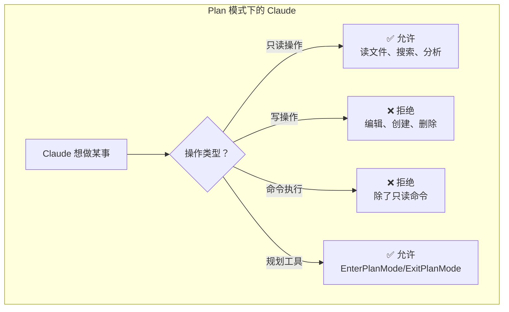
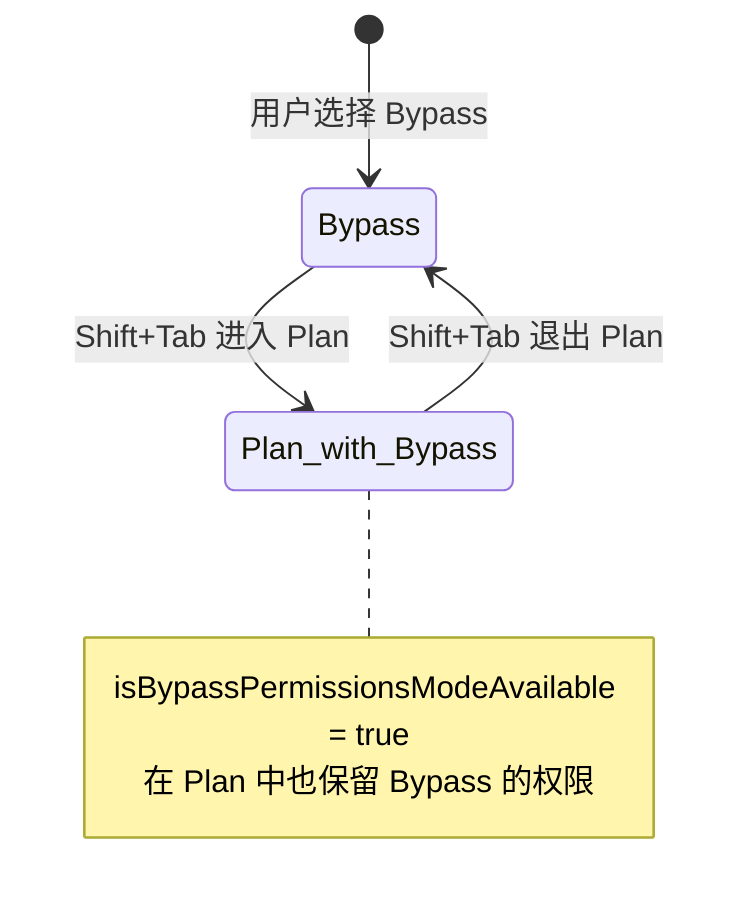
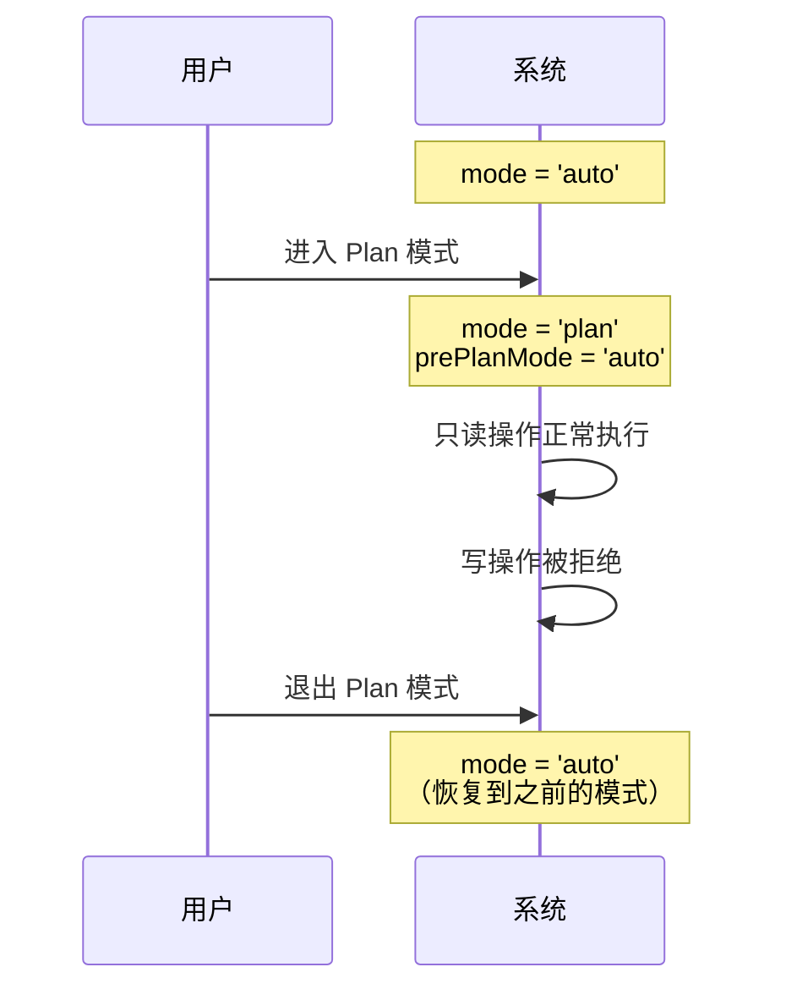
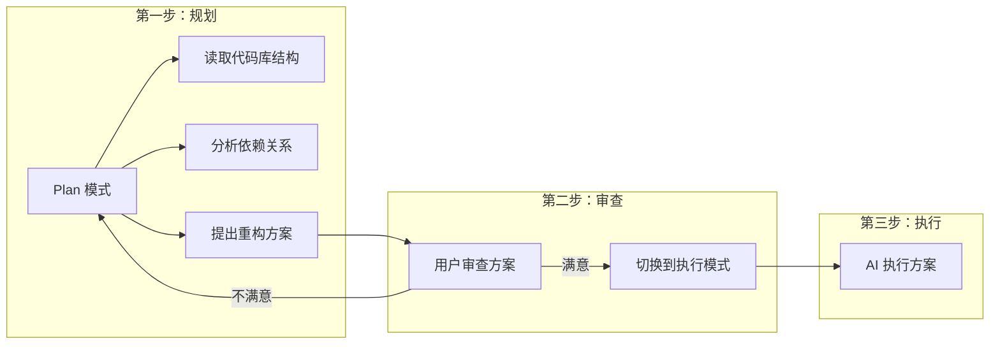

# 第四课：Plan 模式——只读规划的设计思路

> 🎯 "先想清楚再动手"——Plan 模式让你在 AI 真正行动前，先看到它打算做什么。

---

## 📋 学习目标

1. 理解 Plan 模式的设计理念——"只读规划"
2. 掌握 Plan 模式下工具调用的过滤逻辑
3. 了解 Plan 模式与 Bypass 模式的特殊组合关系
4. 理解 `prePlanMode` 的状态保存机制
5. 知道 Plan 模式如何与 Auto 模式交互

---

## 🏠 生活类比：建筑蓝图审查

在盖房子之前，你不会直接叫工人开工。你会：

1. 📐 让建筑师画蓝图（Plan 模式）
2. 🔍 审查蓝图是否合理
3. ✅ 确认无误后再开工（切换到其他模式）

Plan 模式就是这个"画蓝图"阶段——Claude 可以读取代码、分析结构、给出方案，但**不允许修改任何东西**。

---

## 🔍 源码直击：Plan 模式的配置

```typescript
// 源码位置：utils/permissions/PermissionMode.ts

const PERMISSION_MODE_CONFIG = {
  plan: {
    title: 'Plan Mode',
    shortTitle: 'Plan',
    symbol: PAUSE_ICON,    // ⏸ 暂停图标——暗示"暂停执行"
    color: 'planMode',     // 蓝色——冷静、思考的颜色
    external: 'plan',
  },
  // ...
}
```

注意那个 `PAUSE_ICON` ⏸——在 UI 中它提醒用户"当前是规划状态，没有在执行任何操作"。

---

## 🏗️ Plan 模式的工作原理



在权限检查的核心流程中，Plan 模式的处理位于步骤 2a：

```typescript
// 源码位置：utils/permissions/permissions.ts（第1262-1281行）

// 2a. 检查当前模式是否允许
const shouldBypassPermissions =
  appState.toolPermissionContext.mode === 'bypassPermissions' ||
  // 特殊情况：Plan 模式 + 之前是 Bypass 模式
  (appState.toolPermissionContext.mode === 'plan' &&
   appState.toolPermissionContext.isBypassPermissionsModeAvailable)

if (shouldBypassPermissions) {
  return {
    behavior: 'allow',
    updatedInput: getUpdatedInputOrFallback(toolPermissionResult, input),
    decisionReason: { type: 'mode', mode: appState.toolPermissionContext.mode },
  }
}
```

---

## 🔄 Plan + Bypass 的特殊组合

这里有一个精妙的设计：如果用户在 Bypass 模式下切换到 Plan 模式，系统会记住之前的 Bypass 状态。



**为什么？** 因为 Bypass 模式的用户已经做了一个"我信任 AI"的决定。当他们暂时切换到 Plan 模式审查方案时，他们不希望退出 Plan 后要重新激活 Bypass。

---

## 📝 Plan 模式与 Auto 模式的交互

当用户在 Auto 模式下进入 Plan 模式时：

```typescript
// 源码位置：utils/permissions/permissions.ts（第522-526行）

if (
  feature('TRANSCRIPT_CLASSIFIER') &&
  (appState.toolPermissionContext.mode === 'auto' ||
   // Plan 模式下，如果 Auto 模式仍然激活
   (appState.toolPermissionContext.mode === 'plan' &&
    autoModeStateModule?.isAutoModeActive()))
) {
  // Auto 模式的分类器仍然工作
  // 但 Plan 模式的只读限制优先
}
```

这意味着：即使分类器判断某个操作安全，Plan 模式仍然会拒绝写操作。**Plan 模式的只读限制是最高优先级**。

---

## 🛡️ 进入/退出 Plan 模式的工具

Claude Code 提供了专门的工具来管理 Plan 模式：

```typescript
// EnterPlanModeTool：进入 Plan 模式
// 作用：保存当前模式，切换到 Plan

// ExitPlanModeTool：退出 Plan 模式
// 作用：恢复之前的模式

// 这两个工具本身在安全白名单中（即使在 Auto 模式下也不需要分类器审查）
const SAFE_YOLO_ALLOWLISTED_TOOLS = new Set([
  // ...
  ENTER_PLAN_MODE_TOOL_NAME,
  EXIT_PLAN_MODE_TOOL_NAME,
  // ...
])
```

---

## 💡 `prePlanMode`：记住回去的路

```typescript
// 源码位置：types/permissions.ts

export type ToolPermissionContext = {
  readonly mode: PermissionMode
  // ... 其他字段
  readonly prePlanMode?: PermissionMode  // 进入 Plan 前的模式
}
```

当用户从任何模式进入 Plan 时，`prePlanMode` 保存了原来的模式。退出 Plan 时，系统恢复到这个模式。



---

## 🎯 Plan 模式的典型使用场景



---

## ✏️ 动手练习

### 练习 1：Plan 模式行为判断

在 Plan 模式下，以下操作结果是什么？

| 操作 | 结果 |
|------|------|
| 读取 `package.json` | ？ |
| 创建 `new-file.ts` | ？ |
| 执行 `ls -la` | ？ |
| 执行 `npm install` | ？ |
| 搜索代码中的 TODO | ？ |

<details>
<summary>点击查看答案</summary>

| 操作 | 结果 | 原因 |
|------|------|------|
| 读取 `package.json` | ✅ 允许 | 只读操作 |
| 创建 `new-file.ts` | ❌ 拒绝 | 写操作在 Plan 模式下被禁止 |
| 执行 `ls -la` | ✅ 允许 | 只读命令 |
| 执行 `npm install` | ❌ 拒绝 | 会修改文件系统 |
| 搜索 TODO | ✅ 允许 | Grep 是只读工具 |

</details>

### 练习 2：状态转换

画出从 Default 模式开始，经过以下操作后的模式变化：

1. Shift+Tab
2. Shift+Tab
3. 使用 EnterPlanMode 工具进入 Plan
4. 使用 ExitPlanMode 工具退出 Plan

<details>
<summary>点击查看答案</summary>

1. Default → **AcceptEdits**
2. AcceptEdits → **Plan**
3. 已经在 Plan 了，`prePlanMode = 'plan'`（不变）
4. 退出 Plan → 恢复到 **Plan**

注意：如果是从 AcceptEdits 通过 EnterPlanMode 进入 Plan，`prePlanMode = 'acceptEdits'`，退出后回到 AcceptEdits。

</details>

### 练习 3：思考题

为什么 Plan 模式需要 `prePlanMode` 来记住之前的模式，而不是直接退出时默认回到 Default？

<details>
<summary>点击查看思路</summary>

用户可能是从 Auto 模式或 Bypass 模式进入 Plan 的。如果退出后默认回到 Default，用户需要重新配置到之前的模式，非常不方便。更重要的是，Bypass 模式需要额外的安全确认才能激活，如果退出 Plan 就丢失了，用户体验会很差。

</details>

---

## 📌 本课小结

| 要点 | 内容 |
|------|------|
| 核心理念 | 只看不动——让 AI 先规划，用户审查后再执行 |
| 关键标识 | ⏸ 暂停图标 + 蓝色主题 |
| Bypass 组合 | Plan + Bypass 时保留 Bypass 权限 |
| 状态保存 | `prePlanMode` 记住进入前的模式 |
| 与 Auto 关系 | Plan 的只读限制优先于 Auto 分类器 |

---

## 🔜 下节预告

**第五课：Bypass 模式——最高权限也有底线**

Bypass 模式看似"全部放行"，但源码中隐藏了多层安全底线。下节课我们揭开这些看不见的防线。

---

*本课对应漫画章节：第四格"蓝图审查员"*
