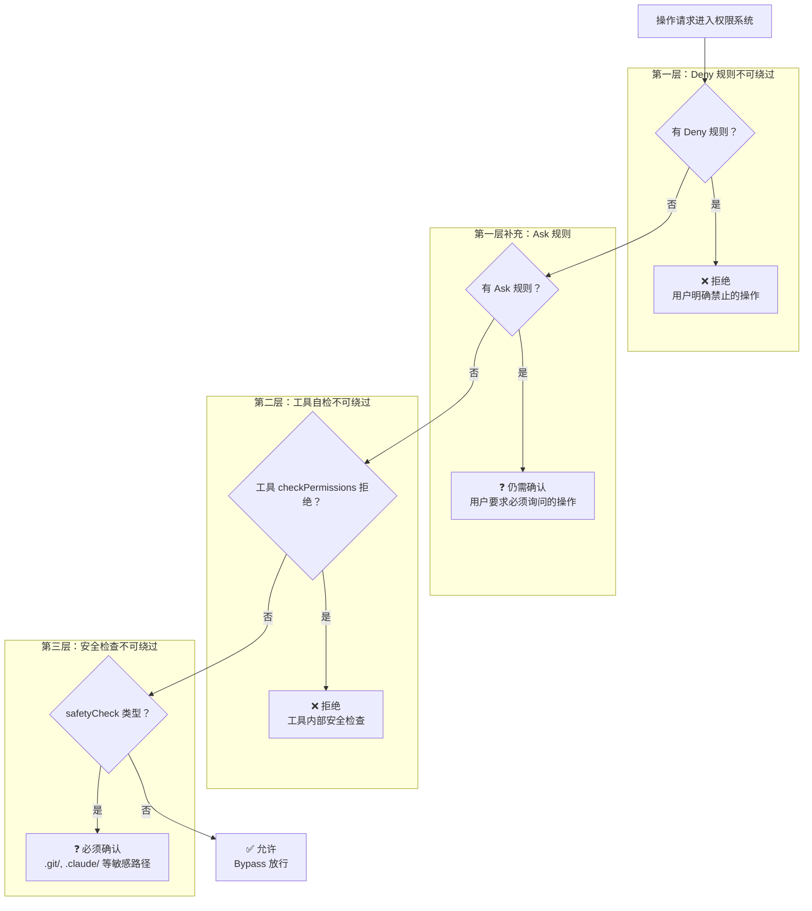
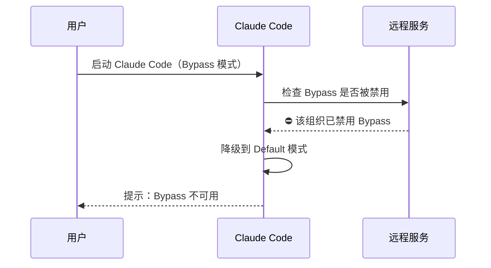

# 第五课：Bypass 模式——最高权限也有底线

> 🎯 Bypass 模式不是"无法无天"，而是"信任但验证"——即使全部放行，也有不可逾越的底线。

---

## 📋 学习目标

1. 理解 Bypass 模式的定位和适用场景
2. 掌握 Bypass 模式下仍然生效的三层安全底线
3. 了解 Bypass 模式的远程禁用（Killswitch）机制
4. 理解危险权限模式在 Auto 模式入口处的清理逻辑
5. 认识 dontAsk 模式的差异

---

## 🏠 生活类比：VIP 通道也有安检

飞机场的 VIP 通道可以跳过排队，但：

- ❌ 不能跳过安检——刀、枪还是不让带
- ❌ 不能带违禁品——炸弹不管你是谁都不行
- ❌ 不能去禁区——驾驶舱不是你花钱就能进

Bypass 模式就像这个 VIP 通道：**跳过了常规的询问流程，但核心安全检查一个都不少**。

---

## 🔍 源码直击：Bypass 模式的配置

```typescript
// 源码位置：utils/permissions/PermissionMode.ts

bypassPermissions: {
  title: 'Bypass Permissions',
  shortTitle: 'Bypass',
  symbol: '⏵⏵',       // 快进符号——暗示"跳过检查"
  color: 'error',       // 红色！——警告用户这是危险模式
  external: 'bypassPermissions',
},
```

注意 `color: 'error'`——Bypass 模式用**红色**显示在 UI 上，时刻提醒用户当前处于高风险状态。

---

## 🛡️ 三层安全底线



---

## 📝 源码中的三层底线

### 底线一：Deny 规则优先

```typescript
// 源码位置：utils/permissions/permissions.ts（第1169-1181行）

// 1a. 整个工具被拒绝——即使 Bypass 模式也不放过
const denyRule = getDenyRuleForTool(appState.toolPermissionContext, tool)
if (denyRule) {
  return {
    behavior: 'deny',
    message: `Permission to use ${tool.name} has been denied.`,
    decisionReason: { type: 'rule', rule: denyRule },
  }
}
```

### 底线二：内容级 Ask 规则

```typescript
// 源码位置：utils/permissions/permissions.ts（第1243-1250行）

// 1f. 用户配置的 Ask 规则优先于 Bypass
// 例如 Bash(npm publish:*) 配置了 ask 规则
if (
  toolPermissionResult?.behavior === 'ask' &&
  toolPermissionResult.decisionReason?.type === 'rule' &&
  toolPermissionResult.decisionReason.rule.ruleBehavior === 'ask'
) {
  return toolPermissionResult  // Bypass 模式也要问！
}
```

### 底线三：安全检查（Bypass-Immune）

```typescript
// 源码位置：utils/permissions/permissions.ts（第1252-1260行）

// 1g. 安全检查——bypass-immune（不可绕过的铁律）
// .git/, .claude/, .vscode/, shell 配置文件
if (
  toolPermissionResult?.behavior === 'ask' &&
  toolPermissionResult.decisionReason?.type === 'safetyCheck'
) {
  return toolPermissionResult  // 必须问！没有例外！
}
```

---

## 🔒 Bypass 不可绕过的路径

以下路径即使在 Bypass 模式下也必须征求用户同意：

```
.git/          → 修改 git 配置可能注入恶意 hooks
.claude/       → Claude 的配置文件，修改可能改变行为
.vscode/       → VSCode 配置，修改可能自动执行任务
~/.bashrc      → Shell 配置，修改可能植入持久化后门
~/.zshrc       → 同上
~/.profile     → 同上
```

为什么这些路径特殊？因为修改它们可能产生**持久化**影响——即使关闭 Claude Code，恶意修改仍然存在。

---

## 🚫 远程禁用（Killswitch）

组织管理员可以远程禁用 Bypass 模式：

```typescript
// 源码位置：utils/permissions/bypassPermissionsKillswitch.ts

export async function checkAndDisableBypassPermissionsIfNeeded(
  toolPermissionContext: ToolPermissionContext,
  setAppState: (f: (prev: AppState) => AppState) => void,
): Promise<void> {
  if (!toolPermissionContext.isBypassPermissionsModeAvailable) {
    return  // 本来就没有 Bypass，不需要检查
  }

  const shouldDisable = await shouldDisableBypassPermissions()
  if (!shouldDisable) {
    return  // 检查通过，保留 Bypass
  }

  // 远程指令：禁用 Bypass！
  setAppState(prev => ({
    ...prev,
    toolPermissionContext: createDisabledBypassPermissionsContext(
      prev.toolPermissionContext,
    ),
  }))
}
```



---

## 🧹 危险权限清理

当用户从其他模式切换到 Auto 模式时，系统会清理掉"过于宽泛"的权限规则：

```typescript
// 源码位置：utils/permissions/dangerousPatterns.ts

// 这些命令如果配了 Bash(xxx:*) 的 allow 规则，会被清理
export const DANGEROUS_BASH_PATTERNS: readonly string[] = [
  // 解释器——可以执行任意代码
  'python', 'python3', 'node', 'ruby', 'perl', 'php',
  // 包管理运行器
  'npx', 'npm run', 'yarn run', 'bun run',
  // Shell
  'bash', 'sh', 'zsh',
  // 危险命令
  'eval', 'exec', 'sudo', 'ssh',
  'env', 'xargs',
]
```

**为什么？** 如果用户之前在 Default 模式下允许了 `Bash(python:*)`（允许所有 python 命令），这在 Auto 模式下是不安全的——AI 分类器的快速通道会直接放行所有 python 命令，相当于绕过了分类器。

---

## 🆚 Bypass vs dontAsk 模式

| 特性 | Bypass | dontAsk |
|------|--------|---------|
| 遇到 ask 时 | ✅ 自动允许 | ❌ 自动拒绝 |
| Deny 规则 | 仍然拒绝 | 仍然拒绝 |
| 安全检查 | 仍然询问 | 仍然询问 |
| 使用场景 | 信任 AI，让它放手干 | 不想被打扰，不确定就别做 |

```typescript
// 源码位置：utils/permissions/permissions.ts（第503-516行）

// dontAsk 模式：ask → deny
if (appState.toolPermissionContext.mode === 'dontAsk') {
  return {
    behavior: 'deny',
    decisionReason: { type: 'mode', mode: 'dontAsk' },
    message: DONT_ASK_REJECT_MESSAGE(tool.name),
  }
}
```

**dontAsk 的哲学**：不确定的事情，宁可不做。Bypass 的哲学：不确定的事情，先做再说。

---

## ✏️ 动手练习

### 练习 1：Bypass 底线检验

在 Bypass 模式下，以下操作的结果是什么？

| 操作 | Bypass 模式结果 |
|------|----------------|
| 读取任意文件 | ？ |
| 删除 `node_modules/` | ？ |
| 修改 `.git/config` | ？ |
| 用户配了 Deny 的 `curl` | ？ |
| 执行 `npm install` | ？ |
| 修改 `~/.bashrc` | ？ |

<details>
<summary>点击查看答案</summary>

| 操作 | 结果 | 原因 |
|------|------|------|
| 读取文件 | ✅ 允许 | 只读操作 |
| 删除 node_modules | ✅ 允许 | 普通写操作，Bypass 放行 |
| 修改 .git/config | ❓ 询问 | safetyCheck 不可绕过 |
| Deny 的 curl | ❌ 拒绝 | Deny 规则优先于 Bypass |
| npm install | ✅ 允许 | 普通命令，Bypass 放行 |
| 修改 ~/.bashrc | ❓ 询问 | Shell 配置是安全敏感路径 |

</details>

### 练习 2：模式对比

将以下场景与最合适的模式匹配：

| 场景 | 推荐模式 |
|------|---------|
| 第一次使用 Claude Code | ？ |
| 在自己的测试项目中快速开发 | ？ |
| 先让 AI 分析代码再决定怎么改 | ？ |
| CI/CD 自动化任务 | ？ |

<details>
<summary>点击查看答案</summary>

| 场景 | 推荐模式 | 原因 |
|------|---------|------|
| 第一次使用 | **Default** | 最安全，每步都确认 |
| 测试项目开发 | **Bypass** 或 **Auto** | 效率优先，不怕出错 |
| 先分析再改 | **Plan** | 只读分析，不修改 |
| CI/CD 任务 | **dontAsk** 或 **Auto** | 无人值守，不确定就跳过 |

</details>

---

## 📌 本课小结

| 要点 | 内容 |
|------|------|
| 核心定位 | 跳过常规询问，但保留核心安全检查 |
| 三层底线 | Deny 规则 → Ask 规则 → 安全检查（safetyCheck） |
| 敏感路径 | `.git/`、`.claude/`、`~/.bashrc` 等永远需要确认 |
| 远程控制 | 组织管理员可通过 Killswitch 禁用 Bypass |
| vs dontAsk | Bypass 允许不确定的，dontAsk 拒绝不确定的 |

---

## 🔜 下节预告

**第六课：权限检查完整流水线源码解析**

我们将从头到尾完整走一遍权限检查的流水线，用一个 `npm install` 命令作为示例，追踪它在每一步的处理过程。

---

*本课对应漫画章节：第五格"VIP 通道的安检"*
