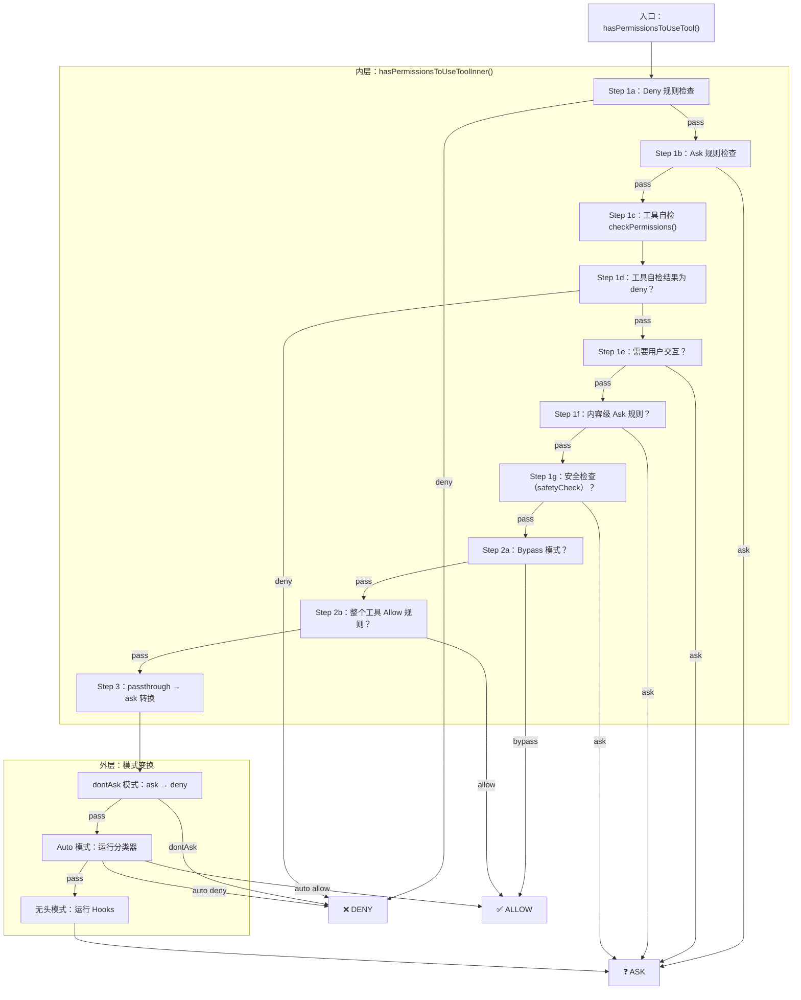
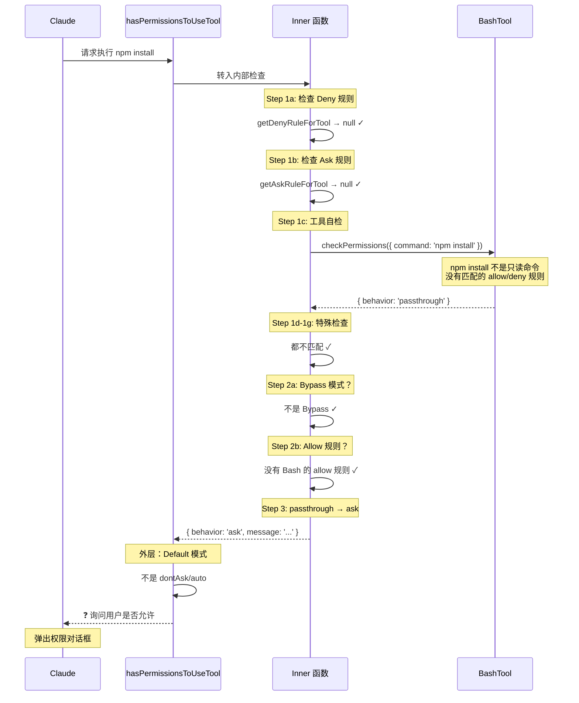

# 第六课：权限检查完整流水线源码解析

> 🎯 跟着一条 `npm install` 命令，走完权限系统从入口到出口的完整路径。

---

## 📋 学习目标

1. 掌握权限检查的完整 10 步流水线
2. 理解内层函数和外层函数的职责分工
3. 追踪一个真实命令在流水线中的完整路径
4. 了解 `passthrough` 行为在流水线中的转换时机
5. 理解权限建议（suggestions）的生成机制

---

## 🏠 生活类比：机场登机的完整流程

```
购票 → 值机 → 安检 → 海关 → 候机 → 登机口 → 验票 → 登机
```

权限系统也是一个**流水线**——命令从入口进来，经过层层检查，最终得到 allow/deny/ask 的判定。每一步都可能提前终止整个流程。

---

## 🏗️ 完整流水线架构



---

## 📝 逐步源码解析

### Step 1a-1b：规则检查（最高优先级）

```typescript
// 源码位置：utils/permissions/permissions.ts

// Step 1a：整个工具被拒绝
const denyRule = getDenyRuleForTool(appState.toolPermissionContext, tool)
if (denyRule) {
  return { behavior: 'deny', decisionReason: { type: 'rule', rule: denyRule } }
}

// Step 1b：整个工具需要询问
const askRule = getAskRuleForTool(appState.toolPermissionContext, tool)
if (askRule) {
  return { behavior: 'ask', decisionReason: { type: 'rule', rule: askRule } }
}
```

**类比**：就像机场入口检查是否在黑名单（deny）或需要额外审查（ask）。

### Step 1c-1d：工具自检

```typescript
// Step 1c：让工具自己检查
let toolPermissionResult = await tool.checkPermissions(parsedInput, context)

// Step 1d：工具自己拒绝
if (toolPermissionResult?.behavior === 'deny') {
  return toolPermissionResult
}
```

**类比**：安检机器自动扫描——机器说不行，那就不行。

### Step 1e-1g：特殊情况处理

```typescript
// Step 1e：工具需要用户交互（即使在 bypass 模式下也要问）
if (tool.requiresUserInteraction?.() && toolPermissionResult?.behavior === 'ask') {
  return toolPermissionResult
}

// Step 1f：内容级 Ask 规则（如 Bash(npm publish:*) 配了 ask）
if (toolPermissionResult?.behavior === 'ask' &&
    toolPermissionResult.decisionReason?.type === 'rule' &&
    toolPermissionResult.decisionReason.rule.ruleBehavior === 'ask') {
  return toolPermissionResult  // bypass 模式也要问
}

// Step 1g：安全检查（bypass-immune）
if (toolPermissionResult?.behavior === 'ask' &&
    toolPermissionResult.decisionReason?.type === 'safetyCheck') {
  return toolPermissionResult  // 铁律，不可绕过
}
```

### Step 2a-2b：模式和规则放行

```typescript
// Step 2a：Bypass 模式放行
if (shouldBypassPermissions) {
  return { behavior: 'allow', decisionReason: { type: 'mode', mode: currentMode } }
}

// Step 2b：整个工具在 Allow 规则中
const alwaysAllowedRule = toolAlwaysAllowedRule(context, tool)
if (alwaysAllowedRule) {
  return { behavior: 'allow', decisionReason: { type: 'rule', rule: alwaysAllowedRule } }
}
```

### Step 3：passthrough → ask 转换

```typescript
// Step 3：转换 passthrough 为 ask
const result = toolPermissionResult.behavior === 'passthrough'
  ? {
      ...toolPermissionResult,
      behavior: 'ask',
      message: createPermissionRequestMessage(tool.name, toolPermissionResult.decisionReason),
    }
  : toolPermissionResult
```

---

## 🎬 实战追踪：`npm install` 在 Default 模式下



---

## 📋 权限建议（Suggestions）的生成

当权限系统返回 `ask` 时，通常会附带一个"建议"，告诉用户可以一键添加 allow 规则：

```typescript
// 源码位置：tools/BashTool/bashPermissions.ts（概念）

// 对于 npm install，建议会是：
suggestions: [
  {
    type: 'addRules',
    rules: [{ toolName: 'Bash', ruleContent: 'npm install' }],
    behavior: 'allow',
    destination: 'localSettings',  // 保存到本地设置
  }
]
```

用户在权限对话框中可以选择：
- **Yes**：本次允许
- **Yes, and always allow**：允许并记住（添加 allow 规则）
- **No**：拒绝

---

## 🔄 外层函数的模式变换

内层函数返回结果后，外层函数根据当前模式做最终调整：

```typescript
// 源码位置：utils/permissions/permissions.ts

export const hasPermissionsToUseTool = async (...) => {
  const result = await hasPermissionsToUseToolInner(tool, input, context)

  // 允许的直接返回（所有模式都一样）
  if (result.behavior === 'allow') {
    return result
  }

  // 对 ask 结果做模式特定的变换
  if (result.behavior === 'ask') {
    // dontAsk 模式：ask → deny
    if (mode === 'dontAsk') {
      return { behavior: 'deny', message: DONT_ASK_REJECT_MESSAGE(tool.name) }
    }

    // Auto 模式：ask → 分类器判断
    if (mode === 'auto') {
      // ... 运行 AI 分类器（详见第三课）
    }

    // 无头模式（无 UI）：ask → 运行 hooks 或 auto-deny
    if (shouldAvoidPermissionPrompts) {
      // 先给 hooks 机会允许/拒绝
      const hookDecision = await runPermissionRequestHooksForHeadlessAgent(...)
      if (hookDecision) return hookDecision
      // hooks 也不管 → auto-deny
      return { behavior: 'deny', message: AUTO_REJECT_MESSAGE(tool.name) }
    }
  }

  return result
}
```

---

## 📊 完整流水线总览表

| 步骤 | 检查内容 | 可能结果 | 谁负责 |
|------|---------|---------|--------|
| 1a | 整个工具 Deny 规则 | deny | 内层 |
| 1b | 整个工具 Ask 规则 | ask | 内层 |
| 1c | 工具自检 | 各种 | 内层 |
| 1d | 工具自检 deny | deny | 内层 |
| 1e | 需要用户交互 | ask | 内层 |
| 1f | 内容级 Ask 规则 | ask | 内层 |
| 1g | 安全检查 | ask | 内层 |
| 2a | Bypass 模式 | allow | 内层 |
| 2b | 整个工具 Allow 规则 | allow | 内层 |
| 3 | passthrough → ask | ask | 内层 |
| 外层 | dontAsk/auto/无头 | deny/allow/ask | 外层 |

---

## ✏️ 动手练习

### 练习 1：流水线追踪

在 Auto 模式下，追踪 `git push origin main` 的完整路径：

<details>
<summary>点击查看答案</summary>

1. **Step 1a**：检查 Deny 规则 → 无匹配 → 继续
2. **Step 1b**：检查 Ask 规则 → 无匹配 → 继续
3. **Step 1c**：BashTool.checkPermissions → `git push` 不是只读命令 → passthrough
4. **Step 1d-1g**：无特殊情况 → 继续
5. **Step 2a**：不是 Bypass 模式 → 继续
6. **Step 2b**：无 Bash Allow 规则 → 继续
7. **Step 3**：passthrough → ask
8. **外层 Auto 模式**：
   - 检查 acceptEdits 快速通道 → `git push` 不是文件系统命令 → 不适用
   - 检查安全工具白名单 → Bash 不在白名单 → 不适用
   - 运行 AI 分类器 → 分类器评估 `git push` 的风险
   - 分类器很可能阻止（推送到远程仓库是高风险操作）

</details>

### 练习 2：找出短路点

以下哪些操作会在 Step 1 就结束，不会走到后面的步骤？

- [ ] 用户配了 `Deny: Bash` 规则后执行任何 Bash 命令
- [ ] 执行 `ls` 命令
- [ ] 用户配了 `Ask: FileWrite` 规则后写文件
- [ ] 在 Bypass 模式下修改 `.git/config`

<details>
<summary>点击查看答案</summary>

- ✅ **Deny: Bash** → Step 1a 就返回 deny
- ❌ `ls` → 要走到 Step 1c（BashTool 自检判断为只读）→ 最终 allow
- ✅ **Ask: FileWrite** → Step 1b 就返回 ask
- ❌ `.git/config` → 要走到 Step 1g（safetyCheck）才返回 ask

</details>

### 练习 3：设计题

如果你要设计一个新的权限模式叫"Paranoid"（偏执模式），它的特点是：
- 只读命令也要询问
- 所有写操作都拒绝
- 没有 allow 规则能覆盖

你会在流水线的哪个位置实现这个模式？

<details>
<summary>点击查看思路</summary>

可以在 **Step 2a** 的位置实现（模式检查）：

```typescript
if (mode === 'paranoid') {
  if (toolPermissionResult.behavior === 'allow') {
    // 只读命令改为 ask
    return { behavior: 'ask', message: '偏执模式：请确认只读操作' }
  }
  if (toolPermissionResult.behavior === 'passthrough') {
    // 写操作直接拒绝
    return { behavior: 'deny', message: '偏执模式：写操作被禁止' }
  }
}
```

同时需要在 Step 2b 之前拦截，确保 Allow 规则不能覆盖。

</details>

---

## 📌 本课小结

| 要点 | 内容 |
|------|------|
| 流水线结构 | 内层 10 步检查 + 外层模式变换 |
| 短路机制 | 任何步骤返回明确结果就终止 |
| passthrough | 工具说"我不确定"，交给上层决定 |
| 双层架构 | 内层处理规则/工具/模式，外层处理 dontAsk/auto/无头 |
| 建议系统 | ask 结果附带 suggestions，方便用户一键添加规则 |

---

## 🔜 下节预告

**第七课：规则系统——Allow/Deny/Ask 的优先级**

规则是权限系统的"法律体系"。下节课我们深入规则的来源、匹配、优先级和持久化机制。

---

*本课对应漫画章节：第六格"流水线安检"*
