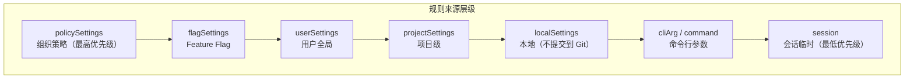
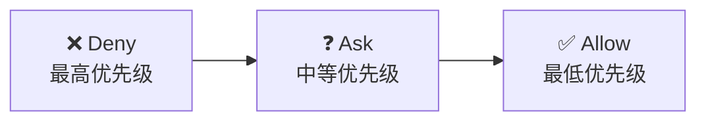
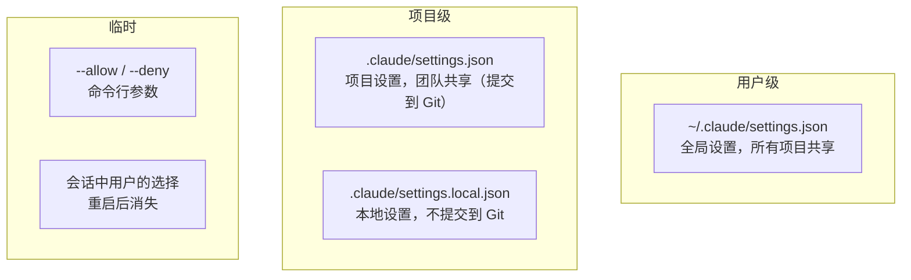

# 第七课：规则系统——Allow/Deny/Ask 的优先级

> 🎯 规则是权限系统的"法律"——理解谁说了算、谁能覆盖谁，是掌握系统的关键。

---

## 📋 学习目标

1. 掌握权限规则的三个维度：来源、行为、值
2. 理解七种规则来源的优先级关系
3. 学会规则匹配的四种模式：精确、前缀、通配符、工具级
4. 了解 Deny > Ask > Allow 的行为优先级
5. 理解规则持久化和同步机制

---

## 🏠 生活类比：公司制度体系

```
法律 > 行业规范 > 公司规章 > 部门制度 > 团队约定 > 个人习惯
```

权限规则也有这样的层级关系——高级别的规则覆盖低级别的。

---

## 🔍 规则的三个维度

```typescript
// 源码位置：types/permissions.ts

// 一条规则由三部分组成：
export type PermissionRule = {
  source: PermissionRuleSource    // 1. 来源：谁制定的
  ruleBehavior: PermissionBehavior // 2. 行为：allow/deny/ask
  ruleValue: PermissionRuleValue   // 3. 值：匹配什么
}

// 规则值：匹配的工具和可选内容
export type PermissionRuleValue = {
  toolName: string       // 工具名，如 'Bash'、'FileWrite'
  ruleContent?: string   // 可选内容，如 'npm install:*'
}
```

---

## 📊 七种规则来源

```typescript
// 源码位置：types/permissions.ts

export type PermissionRuleSource =
  | 'userSettings'      // 用户全局设置（~/.claude/settings.json）
  | 'projectSettings'   // 项目设置（.claude/settings.json）
  | 'localSettings'     // 本地设置（.claude/settings.local.json）
  | 'flagSettings'      // Feature Flag 设置
  | 'policySettings'    // 组织策略设置（管理员配置）
  | 'cliArg'            // 命令行参数
  | 'command'           // 命令行指定
  | 'session'           // 会话级临时规则
```



---

## 🔒 行为优先级：Deny > Ask > Allow

这是权限系统最核心的规则——**拒绝永远胜过允许**：



看源码中的实现：

```typescript
// 源码位置：tools/BashTool/bashPermissions.ts

export const bashToolCheckPermission = (input, toolPermissionContext) => {
  const { matchingDenyRules, matchingAskRules, matchingAllowRules } =
    matchingRulesForInput(input, toolPermissionContext, 'prefix')

  // 1. Deny 优先——有拒绝规则就直接拒绝
  if (matchingDenyRules[0] !== undefined) {
    return { behavior: 'deny', decisionReason: { type: 'rule', rule: matchingDenyRules[0] } }
  }

  // 2. Ask 次之——有询问规则就询问
  if (matchingAskRules[0] !== undefined) {
    return { behavior: 'ask', decisionReason: { type: 'rule', rule: matchingAskRules[0] } }
  }

  // 3. Allow 最后——只有没有 deny/ask 时才允许
  if (matchingAllowRules[0] !== undefined) {
    return { behavior: 'allow', decisionReason: { type: 'rule', rule: matchingAllowRules[0] } }
  }

  // 4. 都没有 → passthrough
  return { behavior: 'passthrough', message: 'This command requires approval' }
}
```

---

## 🎯 四种规则匹配模式

### 模式 1：工具级匹配

```
规则：Bash → deny
效果：禁止使用整个 Bash 工具
```

```typescript
// 源码位置：utils/permissions/permissions.ts

function toolMatchesRule(tool, rule): boolean {
  // 规则没有内容 → 匹配整个工具
  if (rule.ruleValue.ruleContent !== undefined) return false
  return rule.ruleValue.toolName === tool.name
}
```

### 模式 2：精确匹配

```
规则：Bash(npm install) → allow
效果：只允许 npm install，不允许 npm install --save
```

### 模式 3：前缀匹配

```
规则：Bash(npm:*) → allow
效果：允许所有以 npm 开头的命令
```

```typescript
// 源码位置：tools/BashTool/bashPermissions.ts

case 'prefix': {
  // 确保是单词边界：prefix 后面必须是空格或结尾
  if (cmdToMatch === bashRule.prefix) return true
  if (cmdToMatch.startsWith(bashRule.prefix + ' ')) return true
  return false
}
```

### 模式 4：通配符匹配

```
规则：Bash(npm * --save) → allow
效果：匹配 npm install --save、npm update --save 等
```

```typescript
// 源码位置：tools/BashTool/bashPermissions.ts

export function matchWildcardPattern(pattern: string, command: string): boolean {
  return sharedMatchWildcardPattern(pattern, command)
}
```

---

## 🛡️ Deny 规则的增强保护

Deny 规则比 Allow 规则更"激进"地剥离命令前缀：

```typescript
// 源码位置：tools/BashTool/bashPermissions.ts

// Allow 规则：只剥离安全的环境变量
// NODE_ENV=prod npm install → npm install（NODE_ENV 是安全的）
// DOCKER_HOST=evil npm install → 不剥离（DOCKER_HOST 不安全）

// Deny 规则：剥离所有环境变量！
// FOO=bar dangerous_command → dangerous_command
// 防止通过环境变量前缀绕过 deny 规则
const matchingDenyRules = filterRulesByContentsMatchingInput(
  input, denyRuleByContents, matchMode,
  { stripAllEnvVars: true }  // ← 关键：deny 规则剥离所有环境变量
)
```

**为什么？** 如果有 `Bash(claude:*)` 的 deny 规则，攻击者可能用 `FOO=bar claude` 来绕过。Deny 规则不能有这种漏洞。

---

## 📂 规则的存储位置



---

## 🔄 规则同步机制

当用户修改设置文件时，系统需要同步到内存：

```typescript
// 源码位置：utils/permissions/permissions.ts

export function syncPermissionRulesFromDisk(
  toolPermissionContext: ToolPermissionContext,
  rules: PermissionRule[],
): ToolPermissionContext {
  // 1. 清空所有磁盘来源的规则
  for (const diskSource of ['userSettings', 'projectSettings', 'localSettings']) {
    for (const behavior of ['allow', 'deny', 'ask']) {
      context = applyPermissionUpdate(context, {
        type: 'replaceRules',
        rules: [],
        behavior,
        destination: diskSource,
      })
    }
  }

  // 2. 重新加载所有规则
  const updates = convertRulesToUpdates(rules, 'replaceRules')
  return applyPermissionUpdates(context, updates)
}
```

**为什么要先清空再加载？** 如果用户删除了一条规则（比如从 deny 列表中移除了 `curl`），只做"添加"操作的话，旧的 deny 规则仍然存在。先清空确保删除操作生效。

---

## 📋 权限上下文的完整结构

```typescript
// 源码位置：types/permissions.ts

export type ToolPermissionContext = {
  readonly mode: PermissionMode                    // 当前模式
  readonly additionalWorkingDirectories: ReadonlyMap<...>  // 额外工作目录
  readonly alwaysAllowRules: ToolPermissionRulesBySource   // Allow 规则
  readonly alwaysDenyRules: ToolPermissionRulesBySource     // Deny 规则
  readonly alwaysAskRules: ToolPermissionRulesBySource      // Ask 规则
  readonly isBypassPermissionsModeAvailable: boolean        // Bypass 是否可用
  readonly strippedDangerousRules?: ToolPermissionRulesBySource  // 被清理的危险规则
  readonly shouldAvoidPermissionPrompts?: boolean           // 是否避免弹窗
}
```

其中规则按来源组织：

```typescript
export type ToolPermissionRulesBySource = {
  [T in PermissionRuleSource]?: string[]
}

// 示例结构：
{
  userSettings: ['Bash(git:*)', 'FileRead'],
  projectSettings: ['Bash(npm:*)'],
  localSettings: ['Bash(npm install)'],
  session: ['Bash(curl https://api.example.com)'],
}
```

---

## ✏️ 动手练习

### 练习 1：优先级判断

用户有以下规则，执行 `npm install` 会怎样？

- userSettings allow: `Bash(npm:*)`
- projectSettings deny: `Bash(npm install:*)`

<details>
<summary>点击查看答案</summary>

**结果：Deny（拒绝）**

原因：Deny 优先级 > Allow 优先级。即使 allow 规则更宽泛（`npm:*`），只要有匹配的 deny 规则，就会被拒绝。

</details>

### 练习 2：匹配模式

以下规则 `Bash(git commit:*)` 会匹配哪些命令？

- [ ] `git commit -m "fix"`
- [ ] `git commit`
- [ ] `git commit-tree`
- [ ] `git push`
- [ ] `NODE_ENV=test git commit -m "test"`

<details>
<summary>点击查看答案</summary>

- ✅ `git commit -m "fix"` — 前缀匹配 `git commit` + 空格
- ✅ `git commit` — 精确匹配前缀本身
- ❌ `git commit-tree` — 不是单词边界（`commit` 后不是空格）
- ❌ `git push` — 不匹配 `git commit` 前缀
- ✅ `NODE_ENV=test git commit -m "test"` — 剥离安全环境变量后匹配

</details>

### 练习 3：思考题

为什么 Deny 规则要"激进"地剥离所有环境变量，而 Allow 规则只剥离安全的环境变量？

<details>
<summary>点击查看思路</summary>

**安全不对称性**：

- **Deny 规则的目标**：确保危险命令无论如何都不能执行。如果只剥离安全环境变量，攻击者可以通过 `UNSAFE_VAR=val dangerous_cmd` 来绕过 deny 规则。
- **Allow 规则的目标**：确保只有用户明确允许的命令才放行。如果也激进地剥离所有环境变量，`DOCKER_HOST=evil docker ps` 就会匹配 `Bash(docker ps:*)` 的 allow 规则——但 `DOCKER_HOST` 改变了命令的行为（连接到恶意服务器），不应该自动放行。

总结：Deny 是"防守方"，宁可误伤不能遗漏；Allow 是"进攻方"，必须精确匹配。

</details>

---

## 📌 本课小结

| 要点 | 内容 |
|------|------|
| 三维度 | 来源（谁制定）× 行为（allow/deny/ask）× 值（匹配什么）|
| 行为优先级 | Deny > Ask > Allow |
| 四种匹配 | 工具级、精确、前缀（`:*`）、通配符 |
| 七种来源 | policy > flag > user > project > local > cli > session |
| Deny 增强 | 剥离所有环境变量防绕过 |

---

## 🔜 下节预告

**第八课：BashTool 的 AST 级命令分析**

Bash 命令是最危险的工具——因为 Shell 的语法太灵活了。下节课我们看 Claude Code 如何用 tree-sitter 做 AST 级别的安全分析。

---

*本课对应漫画章节：第七格"法律体系"*
