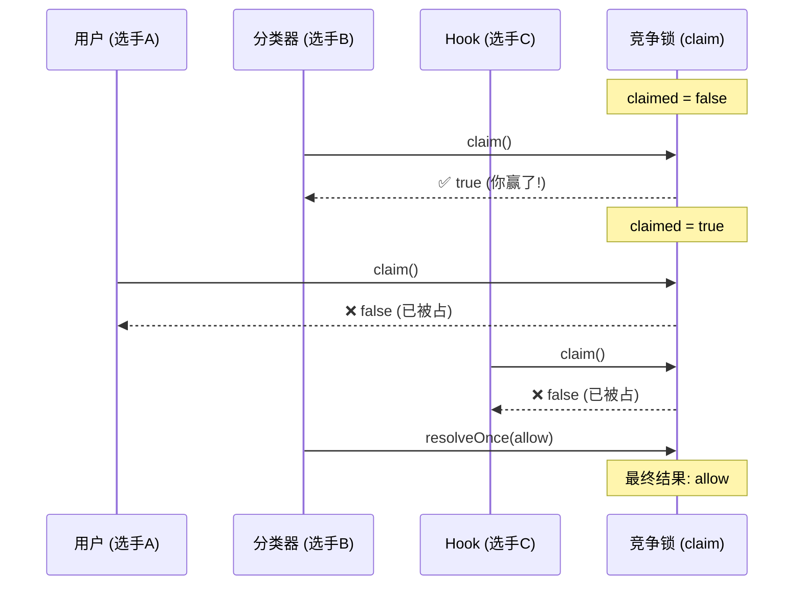
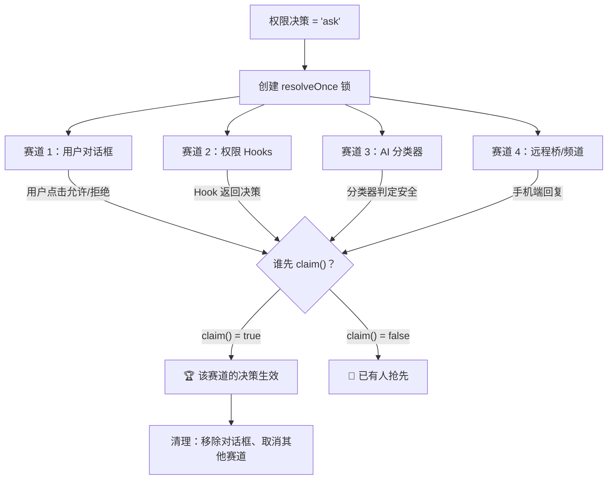
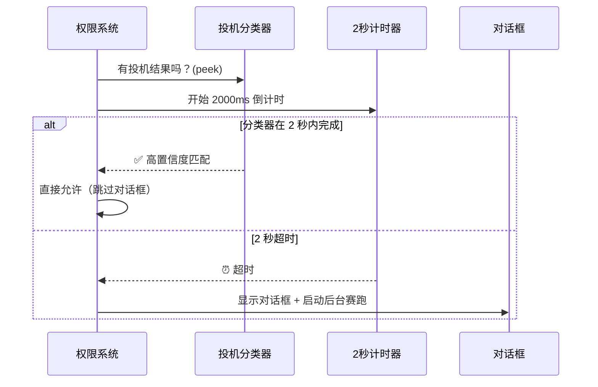
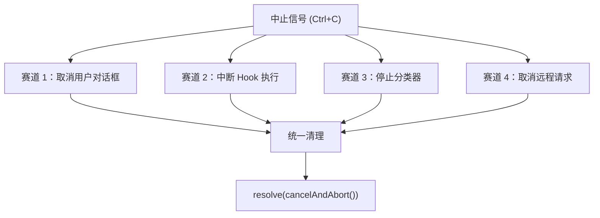
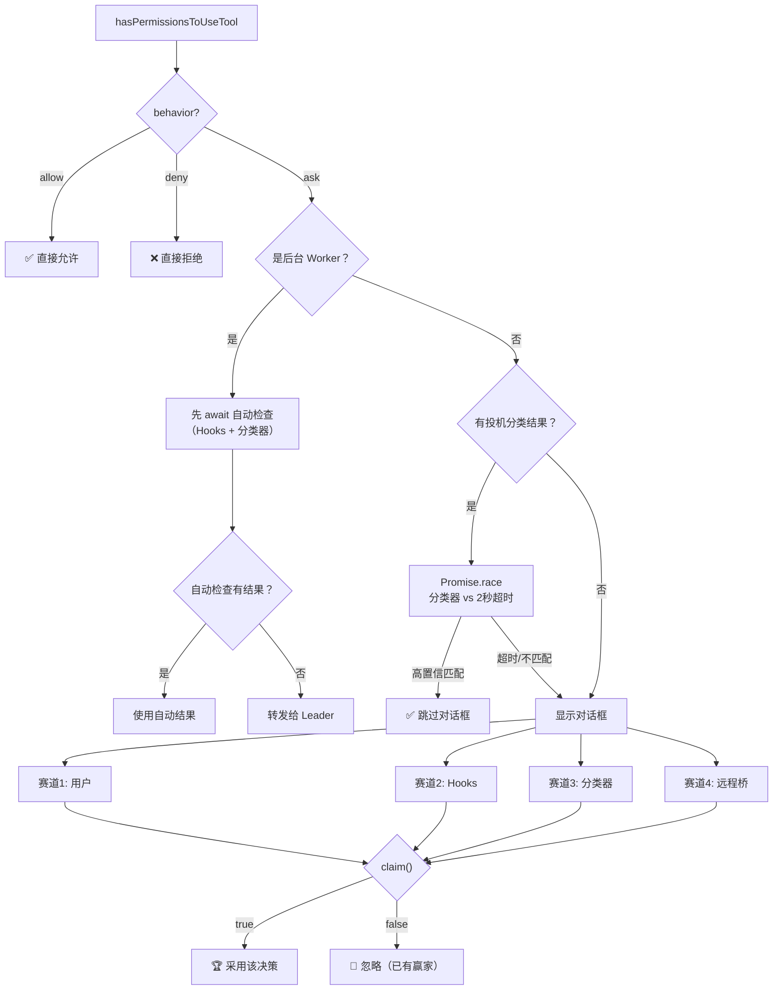

# 第九课：交互式权限——竞态赛跑与超时处理

> 🎯 当 AI 需要问用户"可以执行这个吗？"时，一场精密的赛跑开始了：用户在看对话框，分类器在后台跑，远程桥也在等回复——谁先完成谁就赢。

---

## 📋 学习目标

1. 理解"ask"决策如何触发交互式权限对话
2. 掌握 `createResolveOnce` 的原子竞争锁设计
3. 了解四个并行赛跑者（用户、Hooks、分类器、远程桥）的工作机制
4. 理解投机执行（speculative check）和宽限期的设计
5. 认识中止（abort）和超时的优雅处理

---

## 🏠 生活类比：多人抢答系统

想象一个问答节目：

- 主持人（权限系统）问了一个问题："这条命令安全吗？"
- **选手 A**（用户）：看屏幕上的对话框，手动点"允许"或"拒绝"
- **选手 B**（AI 分类器）：在后台快速分析，尝试自动回答
- **选手 C**（权限 Hook）：检查外部配置和自动化规则
- **选手 D**（远程桥/手机频道）：通过 claude.ai 或 Telegram 转发

**规则**：谁先按下抢答器（`claim()`），谁的答案就生效。其他人的回答全部作废。

---

## 🔐 createResolveOnce：原子级竞争锁

整个赛跑系统的核心是一个精妙的锁机制：

```typescript
// 源码位置：hooks/toolPermission/PermissionContext.ts

type ResolveOnce<T> = {
  resolve(value: T): void
  isResolved(): boolean
  /**
   * 原子性地检查并标记为已解决。
   * 如果这个调用者赢了比赛（还没人解决），返回 true。
   * 否则返回 false。
   *
   * 在 async 回调中 await 之前使用，
   * 关闭 isResolved() 检查和实际 resolve() 之间的窗口。
   */
  claim(): boolean
}

function createResolveOnce<T>(resolve: (value: T) => void): ResolveOnce<T> {
  let claimed = false
  let delivered = false
  return {
    resolve(value: T) {
      if (delivered) return
      delivered = true
      claimed = true
      resolve(value)
    },
    isResolved() {
      return claimed
    },
    claim() {
      if (claimed) return false
      claimed = true
      return true
    },
  }
}
```

### 为什么需要 `claim()` 而不只是 `isResolved()`？

```
❌ 有竞态的写法：
  if (!isResolved()) {        // ← 时刻 T1：检查没人解决
    await someAsyncWork()     // ← 时刻 T2：等待时其他人解决了！
    resolve(myAnswer)         // ← 时刻 T3：重复解决！💥
  }

✅ 无竞态的写法：
  if (!claim()) return        // ← 原子操作：检查 + 标记，一步完成
  await someAsyncWork()       // ← 安全：已经"占位"了
  resolveOnce(myAnswer)       // ← 即使其他人尝试也不会执行
```



---

## 🏗️ handleInteractivePermission：四路赛跑架构



### 赛道 1：用户对话框（永远在场）

```typescript
// 源码位置：hooks/toolPermission/handlers/interactiveHandler.ts（简化）

ctx.pushToQueue({
  // ... 把权限请求推入 UI 队列，显示对话框

  onUserInteraction() {
    // 用户开始交互（按方向键、Tab、打字反馈）
    // 200ms 宽限期：防止误按取消分类器
    const GRACE_PERIOD_MS = 200
    if (Date.now() - permissionPromptStartTimeMs < GRACE_PERIOD_MS) {
      return  // 忽略前 200ms 的操作
    }
    userInteracted = true
    clearClassifierChecking(ctx.toolUseID)  // 隐藏分类器指示器
  },

  async onAllow(updatedInput, permissionUpdates, feedback) {
    if (!claim()) return  // 原子检查：有人抢先了吗？
    // 处理用户允许...
    resolveOnce(await ctx.handleUserAllow(...))
  },

  onReject(feedback) {
    if (!claim()) return  // 原子检查
    // 处理用户拒绝...
    resolveOnce(ctx.cancelAndAbort(feedback))
  },

  onAbort() {
    if (!claim()) return
    // 处理用户中止（Ctrl+C、Esc）
    resolveOnce(ctx.cancelAndAbort(undefined, true))
  },
})
```

### 赛道 2：权限 Hooks（异步后台）

```typescript
// 异步执行 PermissionRequest hooks
void (async () => {
  if (isResolved()) return  // 快速退出
  const hookDecision = await ctx.runHooks(
    currentAppState.toolPermissionContext.mode,
    result.suggestions,
    result.updatedInput,
    permissionPromptStartTimeMs,
  )
  if (!hookDecision || !claim()) return  // Hook 没决策或有人抢先
  ctx.removeFromQueue()  // 移除对话框
  resolveOnce(hookDecision)
})()
```

### 赛道 3：AI 分类器（异步后台）

```typescript
// 条件：Bash 分类器特性开启 + 有待分类的检查 + 是 Bash 命令
if (feature('BASH_CLASSIFIER') && result.pendingClassifierCheck) {
  setClassifierChecking(ctx.toolUseID)  // UI 显示"分类器运行中"

  void executeAsyncClassifierCheck(result.pendingClassifierCheck, signal, {
    shouldContinue: () => !isResolved() && !userInteracted,

    onComplete: () => {
      clearClassifierChecking(ctx.toolUseID)
    },

    onAllow: (decisionReason) => {
      if (!claim()) return  // 关键的原子检查！

      // 显示自动审批的 ✓ 过渡动画
      ctx.updateQueueItem({
        classifierAutoApproved: true,
        classifierMatchedRule: matchedRule,
      })

      resolveOnce(ctx.buildAllow(ctx.input, { decisionReason }))

      // 保持 ✓ 标记可见一段时间再移除
      const checkmarkMs = getTerminalFocused() ? 3000 : 1000
      checkmarkTransitionTimer = setTimeout(() => {
        ctx.removeFromQueue()
      }, checkmarkMs)
    },
  })
}
```

### 赛道 4：远程桥（Bridge / Channel）

```typescript
// Bridge：来自 claude.ai 网页端
if (bridgeCallbacks && bridgeRequestId) {
  bridgeCallbacks.sendRequest(bridgeRequestId, ...)

  const unsubscribe = bridgeCallbacks.onResponse(bridgeRequestId, response => {
    if (!claim()) return  // 本地已响应
    ctx.removeFromQueue()

    if (response.behavior === 'allow') {
      resolveOnce(ctx.buildAllow(response.updatedInput ?? displayInput))
    } else {
      resolveOnce(ctx.cancelAndAbort(response.message))
    }
  })
}

// Channel：来自 Telegram/iMessage 等
if (channelCallbacks) {
  for (const client of channelClients) {
    // 发送权限请求到每个频道
    void client.client.notification({ method: 'permission_request', params })
  }

  channelCallbacks.onResponse(channelRequestId, response => {
    if (!claim()) return
    // 处理频道响应...
  })
}
```

---

## ⏱️ 投机执行与宽限期

在显示对话框之前，系统会先尝试"投机执行"——如果分类器已经在后台运行，等它一小会儿：

```typescript
// 源码位置：hooks/useCanUseTool.tsx（简化）

// 宽限期：等待 2 秒让投机分类器完成
const speculativePromise = peekSpeculativeClassifierCheck(input.command)

if (speculativePromise) {
  const raceResult = await Promise.race([
    // 赛道 A：分类器结果
    speculativePromise.then(r => ({ type: 'result', result: r })),
    // 赛道 B：2 秒超时
    new Promise(res => setTimeout(res, 2000, { type: 'timeout' })),
  ])

  if (raceResult.type === 'result'
      && raceResult.result.matches
      && raceResult.result.confidence === 'high') {
    // 2 秒内分类器完成 + 高置信度匹配 → 跳过对话框！
    resolve(ctx.buildAllow(...))
    return
  }
  // 超时或不匹配 → 继续显示对话框
}
```



---

## 🛑 中止信号的优雅处理

每个赛跑者都需要响应中止信号（用户按 Ctrl+C 或请求被取消）：

```typescript
// resolveIfAborted：在每个异步边界检查中止
if (ctx.resolveIfAborted(resolve)) return

// AbortController 信号监听
const signal = ctx.toolUseContext.abortController.signal
signal.addEventListener('abort', () => {
  // 清理资源
  if (checkmarkTransitionTimer) {
    clearTimeout(checkmarkTransitionTimer)
    ctx.removeFromQueue()
  }
}, { once: true })
```



---

## 🎨 UI 过渡动画的时序设计

当分类器自动批准时，不是立刻隐藏对话框，而是有一个优雅的过渡：

```
时间线：
  T+0ms   → 对话框出现，显示"分类器检查中..."指示器
  T+800ms → 分类器返回：允许！
            → 显示 ✓ 标记 + 变暗选项
  T+3800ms → ✓ 标记消失，对话框移除
            （如果终端不在前台，只显示 1 秒）

  用户可以随时按 Esc 提前关闭 ✓ 标记（onDismissCheckmark）
```

```typescript
// 自动批准后的 ✓ 显示时间
const checkmarkMs = getTerminalFocused() ? 3000 : 1000

checkmarkTransitionTimer = setTimeout(() => {
  ctx.removeFromQueue()  // 移除对话框
}, checkmarkMs)
```

---

## 🔄 recheckPermission：配置变更时重新检查

当用户在 claude.ai 上修改了权限模式（比如从 Default 切换到 Bypass），正在显示的对话框需要重新检查：

```typescript
async recheckPermission() {
  if (isResolved()) return  // 已经有结果了

  // 用最新的配置重新运行权限检查
  const freshResult = await hasPermissionsToUseTool(
    ctx.tool, ctx.input, ctx.toolUseContext,
    ctx.assistantMessage, ctx.toolUseID,
  )

  if (freshResult.behavior === 'allow') {
    // claim() 而不是 isResolved()——
    // 因为异步 hasPermissionsToUseTool 调用打开了一个窗口，
    // 其他赛道可能在这期间已经响应了
    if (!claim()) return
    ctx.removeFromQueue()
    resolveOnce(ctx.buildAllow(freshResult.updatedInput ?? ctx.input))
  }
}
```

---

## 🧩 完整的决策流程图



---

## ✏️ 动手练习

### 练习 1：竞态场景分析

以下场景中，谁的决策会生效？

**场景 A**：用户在 T+500ms 点击了"允许"，分类器在 T+800ms 返回"允许"。

**场景 B**：分类器在 T+300ms 返回"允许"，但用户在 T+150ms 按了方向键。

**场景 C**：远程桥在 T+1000ms 返回"拒绝"，但本地用户在 T+900ms 已经点了"允许"。

<details>
<summary>点击查看答案</summary>

**场景 A**：用户的"允许"生效（T+500ms < T+800ms，用户先 `claim()`）。分类器的 `claim()` 返回 false。

**场景 B**：分类器在 T+300ms 返回，但因为用户在 T+150ms 按了方向键（超过 200ms 宽限期？不，才 150ms < 200ms 宽限期），用户交互被忽略，`userInteracted` 仍然是 false。所以分类器的 `shouldContinue()` 返回 true，分类器的"允许"在 T+300ms 生效。

**场景 C**：用户的"允许"生效（T+900ms < T+1000ms，用户先 `claim()`）。远程桥的 `claim()` 返回 false，远程桥的拒绝被忽略。

</details>

### 练习 2：设计思考

为什么分类器自动批准后还要显示 ✓ 标记 3 秒（或 1 秒），而不是立刻隐藏？

<details>
<summary>点击查看思路</summary>

1. **用户感知**：让用户知道"刚才有个操作被自动批准了"，而不是默默执行
2. **可审计**：用户能看到哪个规则匹配了（`classifierMatchedRule`）
3. **可中断**：在 3 秒窗口内用户可以按 Esc 取消
4. **减少惊恐**：如果命令直接执行而用户没看到任何提示，会产生不安全感
5. **终端焦点优化**：终端不在前台时只显示 1 秒，避免阻塞后续操作

</details>

### 练习 3：代码阅读

在 `createResolveOnce` 中，为什么需要 `claimed` 和 `delivered` 两个变量？它们分别在什么时候设置？

<details>
<summary>点击查看答案</summary>

- `claimed`：在 `claim()` 或 `resolve()` 时设置为 true。表示"已经有人赢了比赛"
- `delivered`：只在 `resolve()` 时设置为 true。表示"结果已经交付"

两个变量的区别在于：`claim()` 只是"占位"（声明自己赢了），但可能还没交付结果（因为 claim 后可能还有 async 工作）。而 `resolve()` 是真正交付结果。

用 `delivered` 防止同一个赢家重复交付，用 `claimed` 防止多个赛道同时赢。

</details>

---

## 📌 本课小结

| 要点 | 内容 |
|------|------|
| 竞争锁 | `createResolveOnce` 提供 `claim()` 原子操作防止竞态 |
| 四路赛跑 | 用户、Hooks、分类器、远程桥同时竞争 |
| 投机执行 | 显示对话框前先等 2 秒看分类器是否能自动决定 |
| 宽限期 | 200ms 内忽略用户交互，防误触取消分类器 |
| 优雅过渡 | ✓ 标记显示 3s/1s 后自动消失，用户可 Esc 提前关闭 |
| 中止处理 | 所有赛道都响应 AbortController 信号 |

---

## 🔜 下节预告

**第十课：安全设计五原则与实战应用**

我们已经学完了 Claude Code 权限系统的所有技术细节。最后一课，我们站在更高的视角，提炼出五大安全设计原则，看看它们如何贯穿整个系统。

---

*本课对应漫画章节：第九格"多人抢答赛"*
