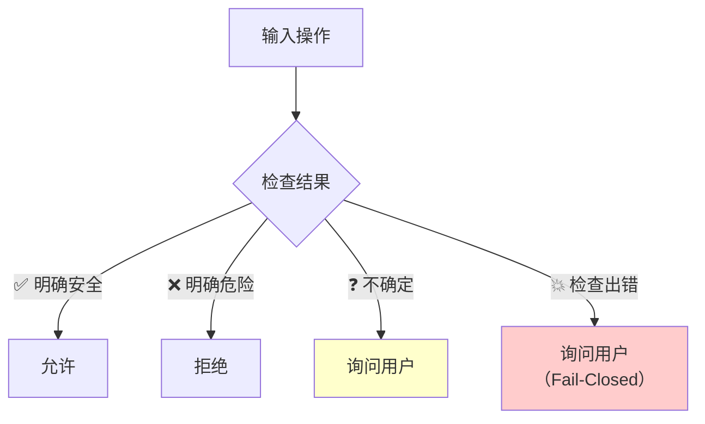
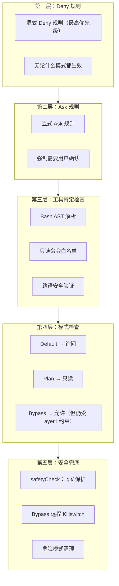
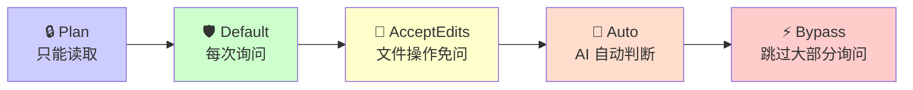
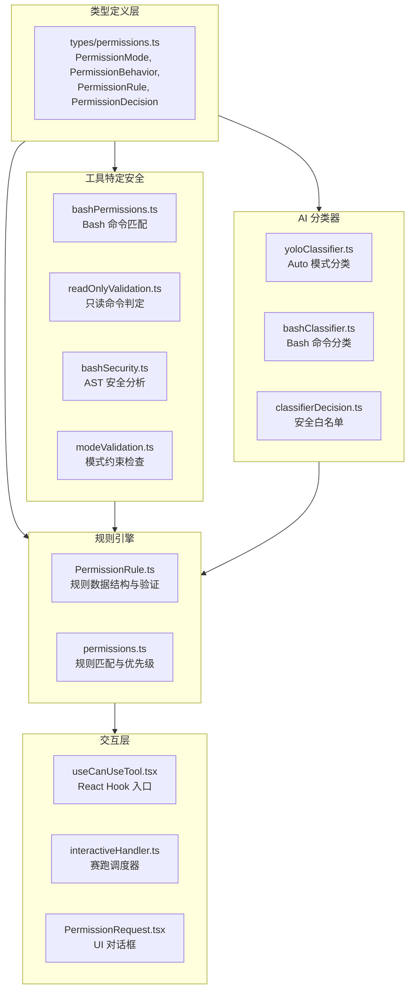
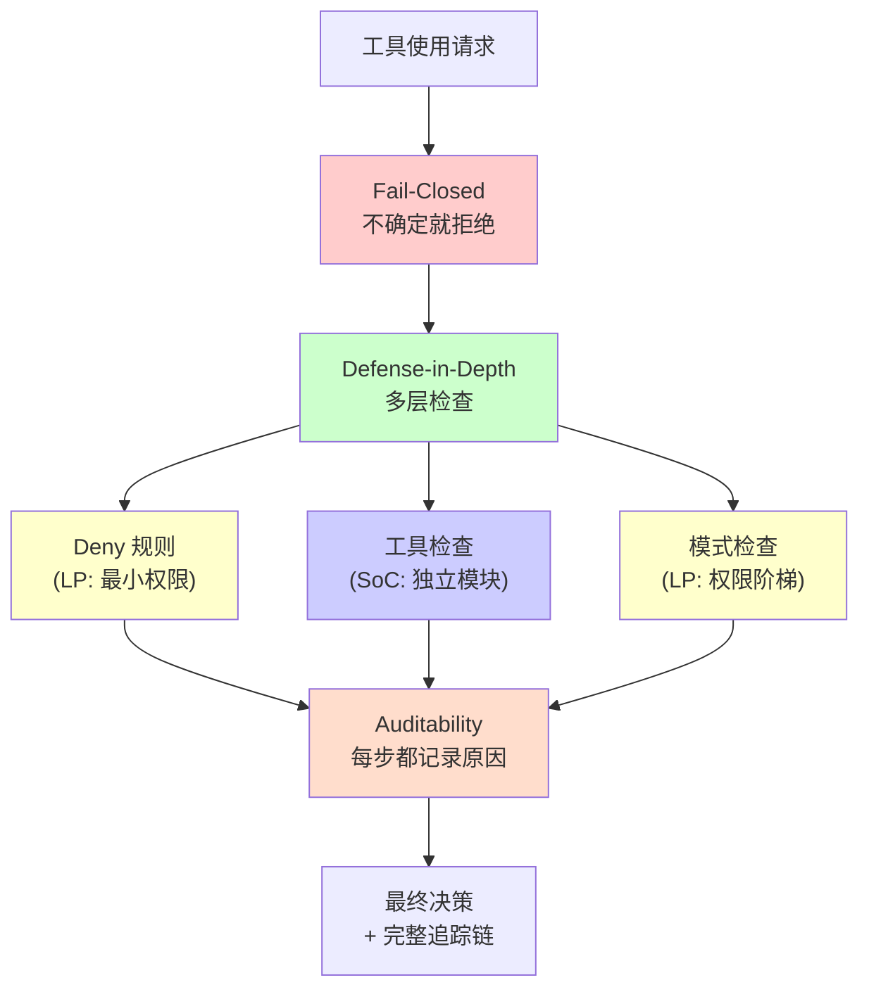
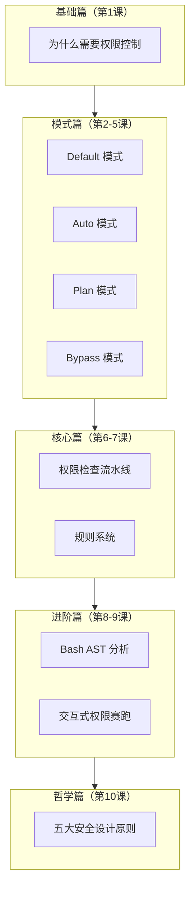

# 第十课：安全设计五原则与实战应用

> 🎯 站在更高视角回顾 Claude Code 权限系统。提炼五大安全设计原则，看它们如何贯穿于每一行代码。

---

## 📋 学习目标

1. 理解 Fail-Closed（故障时关闭）原则及其在权限系统中的体现
2. 掌握 Defense-in-Depth（纵深防御）的多层安全架构
3. 了解 Least Privilege（最小权限）在模式设计中的应用
4. 认识 Separation of Concerns（关注点分离）的模块化设计
5. 理解 Auditability（可审计性）在决策追踪中的价值

---

## 🏠 生活类比：一座安全的大楼

想象设计一座安全的办公大楼：

| 安全原则 | 大楼类比 | Claude Code 对应 |
|---------|---------|-----------------|
| Fail-Closed | 断电时所有门自动锁死 | 解析失败 → ask，分类器出错 → ask |
| Defense-in-Depth | 大门+楼道+办公室三层门禁 | Deny规则+模式检查+分类器+安全检查 |
| Least Privilege | 每人只有自己楼层的门卡 | Default 模式默认最小权限 |
| Separation of Concerns | 门禁系统和消防系统独立运作 | 规则检查、AST 解析、分类器各自独立 |
| Auditability | 所有刷卡记录可查询 | PermissionDecisionReason 完整追踪 |

---

## 原则一：Fail-Closed（故障时关闭）

### 核心思想

> 当系统遇到错误、异常或不确定情况时，默认拒绝（或询问），而不是默认允许。

### 在源码中的体现

#### 1. AST 解析失败 → 询问

```typescript
// 源码位置：tools/BashTool/bashPermissions.ts

// 解析器不可用 → 降级到旧版检查（更保守）
if (astResult.kind === 'parse-unavailable') {
  // 使用更简单但更保守的字符串匹配
}

// 命令太复杂 → 强制询问用户
if (astResult.kind === 'too-complex') {
  return { behavior: 'ask', message: astResult.reason }
}
```

#### 2. 分类器出错 → 不自动允许

```typescript
// 源码位置：hooks/toolPermission/handlers/interactiveHandler.ts

void executeAsyncClassifierCheck(...)
  .catch(error => {
    // 分类器 API 错误只记录日志，不传播为中断
    // 对话框继续显示，等用户手动决定
    logForDebugging(
      `Async classifier check failed: ${errorMessage(error)}`,
      { level: 'error' },
    )
  })
```

#### 3. Auto 模式拒绝次数超限 → 回退到用户询问

```typescript
// 源码位置：utils/permissions/permissions.ts（概念）

// Auto 模式连续拒绝超过阈值 → 回退到显示 ask 对话框
if (consecutiveDenials > MAX_CONSECUTIVE_DENIALS) {
  return { behavior: 'ask', ... }  // 不再信任分类器
}
```

#### 4. 变量展开无法静态验证 → 拒绝自动允许

```typescript
// 源码位置：tools/BashTool/readOnlyValidation.ts

// 任何包含 $ 的 token 都不被自动允许
if (tokens[i].includes('$')) {
  return false  // 无法确定运行时值 → 不自动放行
}
```



---

## 原则二：Defense-in-Depth（纵深防御）

### 核心思想

> 不依赖单一防线。即使某一层被绕过，后面的层仍然能挡住攻击。

### 权限检查的防御层次



### Bypass 模式不是万能的

即使在最高权限的 Bypass 模式下，仍然有三层不可绕过的防线：

```typescript
// 第一层：Deny 规则永远优先
const denyRules = getMatchingRules(context, 'deny')
if (denyRules.length > 0) {
  return { behavior: 'deny', ... }  // 即使 Bypass 也被拒绝
}

// 第二层：工具自身的 deny 检查
const toolSpecificDeny = tool.isToolUseAllowed?.(input)
if (toolSpecificDeny?.type === 'deny') {
  return { behavior: 'deny', ... }
}

// 第三层：安全兜底检查
const safety = tool.safetyCheck?.(input)
if (safety === false) {
  return { behavior: 'ask', ... }  // 连 Bypass 也要问
}
```

---

## 原则三：Least Privilege（最小权限）

### 核心思想

> 默认给予最小的权限，用户需要主动提升权限级别。

### 模式设计的权限阶梯



### Default 模式的只读白名单

```typescript
// 只有这些命令不需要询问（最小权限集）
const READONLY_COMMANDS = [
  'cat', 'ls', 'pwd', 'echo', 'head', 'tail',
  'wc', 'sort', 'uniq', 'find', 'which', 'whoami',
  'date', 'du', 'df', 'file', 'stat', 'uname',
  // ...
]

// 带限制的命令（只允许特定安全 flag）
const COMMAND_ALLOWLIST = {
  'git': { allowedFlags: ['status', 'log', 'diff', 'show', ...] },
  'grep': { allowedFlags: ['-r', '-n', '-l', ...] },
  // ...
}
```

### Auto 模式的安全白名单

```typescript
// 这些工具被认为足够安全，跳过 AI 分类器
const SAFE_YOLO_ALLOWLISTED_TOOLS = new Set([
  'Read',        // 只是读文件
  'Glob',        // 只是搜索文件名
  'Grep',        // 只是搜索内容
  'LS',          // 只是列目录
  'ExitPlanMode', // 只是退出计划模式
])
```

### 危险 Allow 规则的自动清理

```typescript
// 进入 Auto 模式时，清理掉过于宽泛的 allow 规则
const DANGEROUS_BASH_PATTERNS = [
  'python:*',     // 允许任何 python 命令太危险
  'python3:*',
  'node:*',
  'bash:*',
  'sh:*',
  'sudo:*',
  'curl:*',
  'wget:*',
  // ...
]
```

---

## 原则四：Separation of Concerns（关注点分离）

### 核心思想

> 每个模块只负责一个安全维度，不越界、不耦合。

### 权限系统的模块职责



### 替换一个模块不影响其他

| 场景 | 只需修改 | 不受影响 |
|------|---------|---------|
| 新增一个权限模式 | `PermissionMode.ts` | 规则引擎、AST 解析 |
| 升级 AI 分类器 | `yoloClassifier.ts` | 规则引擎、UI 组件 |
| 新增一种工具 | 该工具的权限文件 | 其他工具、分类器 |
| 新增规则来源 | `PermissionRuleSource` | UI 层、工具层 |

---

## 原则五：Auditability（可审计性）

### 核心思想

> 每一个权限决策都必须可追溯：谁做的、为什么、基于什么依据。

### PermissionDecisionReason 的完整追踪

```typescript
// 源码位置：types/permissions.ts

export type PermissionDecisionReason =
  | { type: 'rule'; rule: PermissionRule }
  // → "因为规则 X 来自来源 Y"

  | { type: 'mode'; mode: PermissionMode }
  // → "因为当前模式是 Z"

  | { type: 'classifier'; classifier: 'bash_allow' | 'auto-mode'; reason: string }
  // → "AI 分类器判定为安全，原因是..."

  | { type: 'safetyCheck' }
  // → "安全兜底检查触发"

  | { type: 'toolSpecificDeny'; message: string }
  // → "工具自身拒绝，原因是..."

  | { type: 'readOnlyCommand' }
  // → "这是一个只读命令"

  | { type: 'dontAskMode'; matchedCommand: string }
  // → "dontAsk 模式下匹配了命令前缀"

  // ... 更多类型
```

### 决策日志记录

```typescript
// 源码位置：hooks/toolPermission/permissionLogging.ts（概念）

function logPermissionDecision(context, decision) {
  // 记录：工具名、输入参数、决策结果、决策来源、时间戳
  logEvent('permission_decision', {
    toolName: context.tool.name,
    behavior: decision.behavior,
    reason: decision.decisionReason?.type,
    source: decision.source,
    timestamp: Date.now(),
  })
}

// 交互式权限的时间追踪
ctx.logDecision(
  { decision: 'accept', source: { type: 'user', permanent: true } },
  { permissionPromptStartTimeMs }  // 记录对话框显示了多长时间
)
```

### 用户可见的决策链

```
用户执行：npm install

决策追踪：
  1. ❓ 规则检查 → 无匹配规则
  2. ❓ AST 解析 → kind: 'simple', commands: ['npm install']
  3. ❓ 只读检查 → npm 不在只读列表
  4. ❓ 模式检查 → Default 模式 → ask
  5. 🏁 显示对话框
  6. ✅ 用户允许 + 创建规则 Bash(npm:*)

  PermissionDecisionReason: {
    type: 'mode',
    mode: 'default'
  }
```

---

## 🔗 五原则的协同作用



---

## 📊 全系统源码结构回顾

```
claude-code-cli-master/
├── types/
│   └── permissions.ts          ← 核心类型定义（第1课）
├── utils/permissions/
│   ├── permissions.ts          ← 权限检查流水线（第6课）
│   ├── PermissionMode.ts       ← 模式定义（第2-5课）
│   ├── PermissionRule.ts       ← 规则结构（第7课）
│   ├── PermissionResult.ts     ← 决策结果
│   ├── yoloClassifier.ts       ← Auto 模式分类器（第3课）
│   ├── classifierDecision.ts   ← 分类器安全白名单（第3课）
│   ├── bashClassifier.ts       ← Bash 分类器
│   ├── bypassPermissionsKillswitch.ts ← Bypass 远程开关（第5课）
│   ├── dangerousPatterns.ts    ← 危险模式列表（第5课）
│   └── getNextPermissionMode.ts ← 模式切换（第2课）
├── tools/BashTool/
│   ├── bashPermissions.ts      ← Bash 权限检查（第8课）
│   ├── readOnlyValidation.ts   ← 只读命令验证（第2课）
│   ├── modeValidation.ts       ← 模式约束验证（第2课）
│   └── bashSecurity.ts         ← AST 安全分析（第8课）
├── hooks/
│   ├── useCanUseTool.tsx        ← React Hook 入口（第9课）
│   └── toolPermission/
│       ├── PermissionContext.ts  ← 竞争锁设计（第9课）
│       └── handlers/
│           └── interactiveHandler.ts ← 四路赛跑（第9课）
└── utils/
    └── classifierApprovals.ts   ← 分类器审批追踪（第9课）
```

---

## ✏️ 动手练习

### 练习 1：原则识别

以下每个设计决策体现了哪个安全原则？（可能体现多个）

| 设计决策 | 体现的原则 |
|---------|-----------|
| Default 模式默认询问所有非只读操作 | ？ |
| `PermissionDecisionReason` 记录每个决策的原因 | ？ |
| Bypass 模式下 Deny 规则仍然生效 | ？ |
| AST 解析器和规则引擎是独立模块 | ？ |
| 分类器 API 出错时对话框继续显示 | ？ |

<details>
<summary>点击查看答案</summary>

| 设计决策 | 体现的原则 |
|---------|-----------|
| Default 模式默认询问 | **Least Privilege** + **Fail-Closed** |
| PermissionDecisionReason 追踪 | **Auditability** |
| Bypass 下 Deny 仍生效 | **Defense-in-Depth** |
| 独立模块设计 | **Separation of Concerns** |
| 分类器出错 → 继续显示对话框 | **Fail-Closed** + **Defense-in-Depth** |

</details>

### 练习 2：系统设计

如果你要为 Claude Code 新增一个"Team"权限模式（多人协作，需要任意两个用户同时批准），你会修改哪些模块？

<details>
<summary>点击查看思路</summary>

1. **types/permissions.ts**：添加 `'team'` 到 `ExternalPermissionMode`
2. **PermissionMode.ts**：添加 `team` 的配置（标题、符号、颜色）
3. **getNextPermissionMode.ts**：把 `team` 加入模式循环
4. **permissions.ts**：在 `hasPermissionsToUseToolInner` 中添加 `team` 模式的处理逻辑
5. **interactiveHandler.ts**：新增"赛道 5"——第二个用户的确认
6. **PermissionContext.ts**：修改 `resolveOnce` 为"需要两个 claim 才算赢"

注意：由于 **Separation of Concerns**，你不需要修改 AST 解析器、Bash 权限检查、分类器等模块。

</details>

### 练习 3：安全审计

检查以下虚构的代码片段，找出违反了哪些安全原则：

```typescript
// ⚠️ 故意写的坏代码
async function checkPermission(command: string) {
  try {
    const result = await classifier.classify(command)
    return result  // 分类器说什么就是什么
  } catch {
    return { behavior: 'allow' }  // 出错就放行
  }
}
```

<details>
<summary>点击查看答案</summary>

1. **违反 Fail-Closed**：`catch` 中返回 `allow`，应该返回 `ask` 或 `deny`
2. **违反 Defense-in-Depth**：只依赖分类器一层检查，没有规则检查、AST 分析等
3. **违反 Auditability**：没有记录为什么做出这个决策（无 `decisionReason`）
4. **违反 Least Privilege**：出错时给予最高权限而非最低权限

</details>

---

## 📌 全课程总结

### 十课知识地图



### 核心概念速查表

| 概念 | 一句话解释 | 相关课程 |
|------|-----------|---------|
| PermissionBehavior | allow/deny/ask 三种基本行为 | 第1课 |
| PermissionMode | 五种权限模式控制整体安全级别 | 第2-5课 |
| PermissionRule | 来源+行为+值构成的权限规则 | 第7课 |
| hasPermissionsToUseTool | 权限检查的主入口函数 | 第6课 |
| tree-sitter AST | 命令的语法树级安全分析 | 第8课 |
| YOLO Classifier | Auto 模式的 AI 安全分类器 | 第3课 |
| createResolveOnce | 多赛道竞争的原子锁 | 第9课 |
| Fail-Closed | 不确定时默认拒绝 | 第10课 |

---

## 🎓 结语

Claude Code 的权限系统告诉我们：

**安全不是一个功能，而是一种思维方式。**

它不是在系统建好之后再"加一道锁"，而是从第一个类型定义开始，就把安全原则编织进每一层架构中。从 `PermissionBehavior` 的三个值，到 `createResolveOnce` 的原子操作；从 Deny 规则的不可绕过，到分类器出错时的 Fail-Closed——每一个设计决策都在问同一个问题：

> "如果这里出了问题，最坏情况是什么？"

而 Claude Code 的答案始终是：**最坏情况下，我们多问用户一次，而不是让一条危险命令悄悄执行。**

---

*本课对应漫画章节：第十格"安全大楼全景图"*

*🎉 恭喜你完成了全部十节课的学习！*
