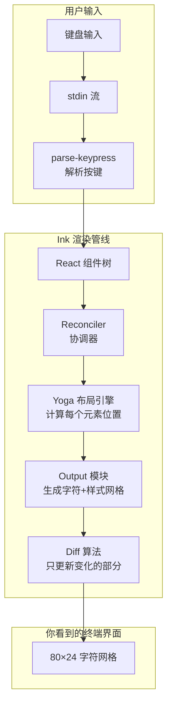
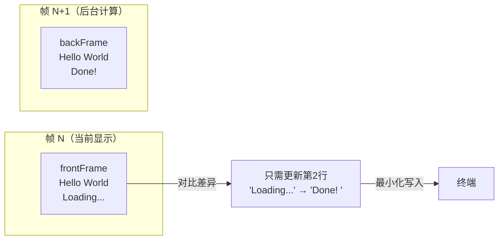

# 第 1 课：终端 UI 基础——从 console.log 到 React

## 学习目标

1. 理解终端 UI 与浏览器 UI 的根本区别
2. 了解 ANSI 转义码如何控制终端的颜色和光标
3. 掌握 Claude Code 如何用 React 渲染终端界面
4. 理解"字符网格"思维模型
5. 认识 Ink 框架在 Claude Code 中的角色

---

## 1.1 终端不是"黑底白字"那么简单

### 生活类比：打字机 vs 画板

想象你面前有两种工具：

- **打字机**（传统终端）：只能一行一行往下打字，打错了就用 XXX 划掉
- **画板**（现代终端 UI）：可以在任意位置写字、擦除、重写，还能用不同颜色

Claude Code 的终端 UI 就像把一台"智能画板"塞进了终端窗口。它不是简单地 `console.log` 一行行输出，而是精确控制终端的每一个字符位置。

### 终端的本质：字符网格

终端的显示区域本质上是一个**二维字符网格**：

```
列(col): 0  1  2  3  4  5  ... 79
行(row):
  0      H  e  l  l  o  _  ...
  1      W  o  r  l  d  _  ...
  ...
  23     _  _  _  _  _  _  ...
```

每个格子可以放一个字符，并附带颜色、加粗、下划线等样式属性。典型的终端是 80 列 × 24 行。

---

## 1.2 ANSI 转义码：终端的"画笔"

终端之所以能显示颜色、移动光标，靠的是 **ANSI 转义码**——一种特殊的字符序列。

### 颜色控制

```javascript
// 普通输出
console.log("Hello")

// 红色输出（ANSI 转义码）
console.log("\x1b[31mHello\x1b[0m")
//          ↑ 开始红色    ↑ 重置颜色
```

### 光标控制

```javascript
// 移动光标到第 5 行第 10 列
process.stdout.write("\x1b[5;10H")

// 清除当前行
process.stdout.write("\x1b[2K")

// 隐藏光标
process.stdout.write("\x1b[?25l")
```

### Claude Code 中的 ANSI 控制

在 Claude Code 源码中，终端控制序列被封装在 `ink/termio/` 目录下：

```typescript
// 源码: ink/termio/dec.ts
// DEC 私有模式控制（光标显示/隐藏、鼠标跟踪等）
export const HIDE_CURSOR = '\x1b[?25l'
export const SHOW_CURSOR = '\x1b[?25h'
```

当 Ink 的 App 组件挂载时，它会自动隐藏光标：

```typescript
// 源码: ink/components/App.tsx（简化）
override componentDidMount() {
  if (this.props.stdout.isTTY) {
    this.props.stdout.write(HIDE_CURSOR)
  }
}

override componentWillUnmount() {
  if (this.props.stdout.isTTY) {
    this.props.stdout.write(SHOW_CURSOR)
  }
}
```

> 💡 **为什么要隐藏光标？** 因为 Claude Code 使用 React 全面接管了终端绘制，原生闪烁的光标会和自定义 UI 产生冲突。

---

## 1.3 从 console.log 到 React：思维跃迁

### 传统方式：命令式

```javascript
// 传统 CLI 工具的做法
console.log("正在加载...")
// 做一些事情
console.log("\r完成！      ")  // \r 回到行首覆盖
```

这种方式只能处理最简单的场景。一旦你需要：
- 同时显示进度条和日志
- 响应键盘输入并更新界面
- 显示复杂的多行布局

传统方式就力不从心了。

### React 方式：声明式

```jsx
// Claude Code 的做法（伪代码）
function App() {
  const [loading, setLoading] = useState(true)
  
  return (
    <Box flexDirection="column">
      {loading ? <Spinner /> : <Text>完成！</Text>}
      <MessageList messages={messages} />
      <TextInput onSubmit={handleSubmit} />
    </Box>
  )
}
```

**核心区别**：你不再告诉终端"先清除这行，再写这些字符"，而是声明"我希望界面长这样"，React 帮你算出需要哪些变更。

---

## 1.4 架构全景图



这就是 Claude Code 终端 UI 的完整流程：

1. **React 组件**描述界面应该长什么样
2. **Reconciler**（协调器）比较新旧组件树的差异
3. **Yoga** 计算每个元素在字符网格中的精确位置
4. **Output** 将布局结果转换为字符和样式
5. **Diff** 只将变化的字符写入终端（避免闪烁）

---

## 1.5 Ink 渲染器：字符网格的"画家"

让我们看一下渲染器的核心代码：

```typescript
// 源码: ink/renderer.ts（简化）
export default function createRenderer(
  node: DOMElement,
  stylePool: StylePool,
): Renderer {
  let output: Output | undefined
  
  return options => {
    const { frontFrame, backFrame, terminalWidth, terminalRows } = options
    
    // 获取 Yoga 计算的布局尺寸
    const width = Math.floor(node.yogaNode.getComputedWidth())
    const height = Math.floor(node.yogaNode.getComputedHeight())
    
    // 创建或重用 Output 对象
    if (output) {
      output.reset(width, height, screen)
    } else {
      output = new Output({ width, height, stylePool, screen })
    }
    
    // 将组件树渲染到字符网格
    renderNodeToOutput(node, output, { prevScreen })
    
    return {
      screen: output.get(),
      viewport: { width: terminalWidth, height: terminalRows },
      cursor: { x: 0, y: screen.height, visible: !isTTY }
    }
  }
}
```

关键要点：
- `Output` 对象维护一个字符网格（screen buffer）
- `renderNodeToOutput` 递归遍历 DOM 树，将每个节点写入网格的正确位置
- 返回的 `screen` 会和上一帧对比，只写入变化的部分

---

## 1.6 双缓冲与 Diff：消除闪烁

### 生活类比：翻页动画

想象你在画翻页动画书：

1. 在 **背面页**（back buffer）画好新一帧
2. 和 **正面页**（front buffer，当前显示的）对比
3. 只擦除和重画有变化的部分
4. 翻页！

这就是 Claude Code 的双缓冲策略：



渲染器代码中可以看到这个模式：

```typescript
// 源码: ink/renderer.ts
renderNodeToOutput(node, output, {
  // 传入上一帧的 screen 用于 blit（局部拷贝）优化
  prevScreen: absoluteRemoved || options.prevFrameContaminated
    ? undefined    // 上一帧被污染，不能复用
    : prevScreen,  // 正常情况下可以局部复用
})
```

---

## 1.7 动手练习

### 练习 1：理解 ANSI 转义码

在终端中运行以下 Node.js 代码，观察效果：

```javascript
// exercise1.js
const stdout = process.stdout

// 1. 彩色输出
stdout.write('\x1b[31m红色\x1b[0m ')
stdout.write('\x1b[32m绿色\x1b[0m ')
stdout.write('\x1b[34m蓝色\x1b[0m\n')

// 2. 光标移动
stdout.write('第一行\n')
stdout.write('第二行\n')
stdout.write('\x1b[2A')        // 上移 2 行
stdout.write('\x1b[6C')        // 右移 6 列
stdout.write('\x1b[33m插入\x1b[0m\n') // 在"第一行"后面写入
```

### 练习 2：思考题

1. 为什么 Claude Code 使用 `stdout.write()` 而不是 `console.log()`？
   > 提示：`console.log` 会自动加换行符，而精确的终端控制需要原始写入。

2. 如果终端窗口只有 40 列宽，一条 80 字符的消息会怎样？
   > 提示：Ink 框架中的 `textWrap` 样式属性可以控制换行或截断行为。

3. 为什么需要"双缓冲"？直接全部重绘不行吗？
   > 提示：全部重绘会导致肉眼可见的闪烁，尤其在内容多的时候。

### 练习 3：查看源码

打开 `ink/termio/` 目录，找到以下文件并回答：
- `csi.ts` 中定义了哪些 CSI（Control Sequence Introducer）序列？
- `dec.ts` 中 `HIDE_CURSOR` 和 `SHOW_CURSOR` 用了什么转义码？
- `sgr.ts` 处理的是什么类型的终端控制？

---

## 本课小结

| 概念 | 说明 |
|------|------|
| 字符网格 | 终端显示区域是一个二维字符数组 |
| ANSI 转义码 | 控制终端颜色、光标位置的特殊字符序列 |
| 声明式 UI | React 方式：描述"想要什么"而非"怎么做" |
| Ink 框架 | React → 终端的桥梁，替代浏览器 DOM |
| 双缓冲 | 后台计算新帧，只写入变化部分，避免闪烁 |

## 下节预告

下一课我们将深入 **Ink 框架**——了解它如何将 React 的 `<Box>` 和 `<Text>` 组件翻译成终端上的字符和样式。我们会看到 Ink 的自定义 Reconciler 如何工作，以及 Yoga 布局引擎如何在终端中实现 Flexbox 布局。
