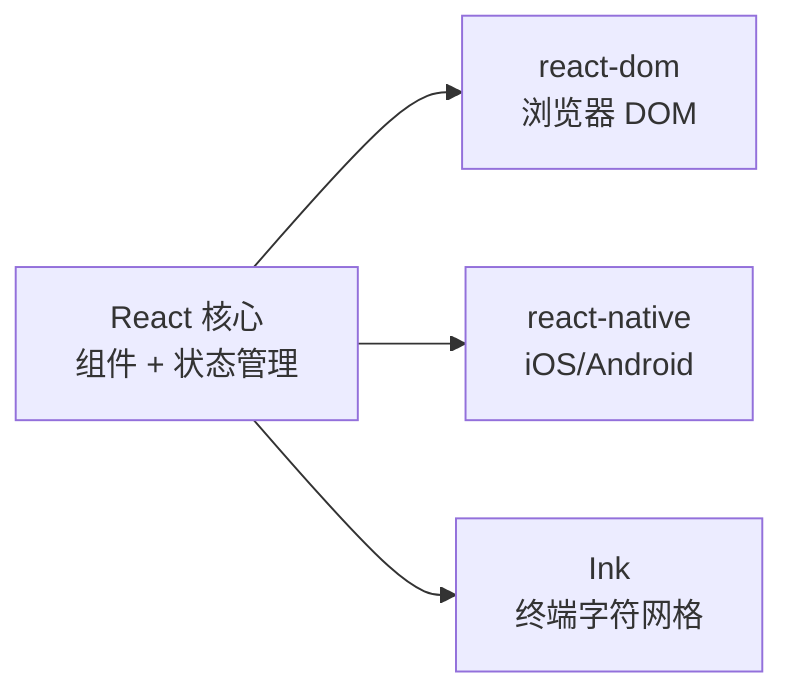
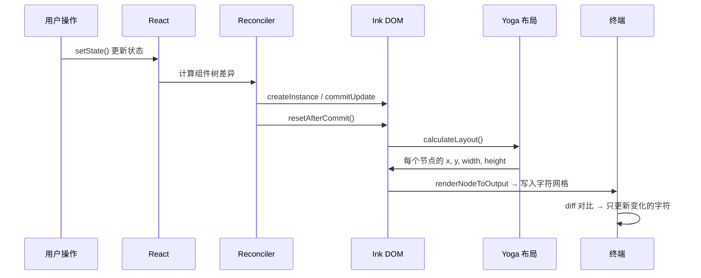
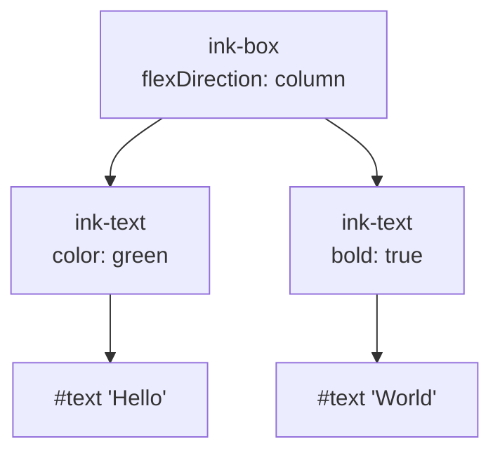

# 第 2 课：Ink 框架入门——React 渲染到终端

## 学习目标

1. 理解 Ink 框架的核心思想：React 的"终端后端"
2. 掌握 `<Box>` 和 `<Text>` 两个基础组件的用法
3. 了解 Ink 自定义 Reconciler 的工作原理
4. 理解 Yoga 布局引擎如何实现终端 Flexbox
5. 学会阅读 Ink 的 DOM 节点结构

---

## 2.1 Ink 是什么？React 的"终端渲染器"

### 生活类比：翻译官

React 本身不知道怎么画界面——它只负责管理组件树和状态变更。真正的"画"交给了**渲染器**：

- **react-dom**：翻译官 A，把 React 组件翻译成浏览器 DOM
- **react-native**：翻译官 B，翻译成手机原生控件
- **Ink**：翻译官 C，翻译成终端字符网格



Claude Code 的 Ink 是一个**深度定制版本**——不是 npm 上的 `ink` 包，而是 fork 后大幅修改的内部版本，位于 `ink/` 目录。

---

## 2.2 `<Box>` 组件：终端中的 `<div>`

在浏览器中，`<div>` 是最基本的布局容器。在 Ink 中，`<Box>` 扮演同样的角色：

```typescript
// 源码: ink/components/Box.tsx（原始 TSX，编译前）
// <Box> 就像浏览器中的 <div style="display: flex">

function Box({
  children,
  flexWrap = 'nowrap',
  flexDirection = 'row',    // 默认水平排列
  flexGrow = 0,
  flexShrink = 1,
  ref, tabIndex, autoFocus,
  onClick, onFocus, onBlur,
  onKeyDown, onMouseEnter, onMouseLeave,
  ...style
}: PropsWithChildren<Props>): React.ReactNode {
  return (
    <ink-box
      ref={ref}
      tabIndex={tabIndex}
      autoFocus={autoFocus}
      onClick={onClick}
      style={{
        flexWrap, flexDirection, flexGrow, flexShrink,
        ...style,
        overflowX: style.overflowX ?? style.overflow ?? 'visible',
        overflowY: style.overflowY ?? style.overflow ?? 'visible',
      }}
    >
      {children}
    </ink-box>
  )
}
```

注意 `<ink-box>` 不是浏览器标签——它是 Ink 自定义的虚拟 DOM 元素。

### 常用布局模式

```jsx
// 垂直堆叠（像 flexDirection: column）
<Box flexDirection="column">
  <Text>第一行</Text>
  <Text>第二行</Text>
</Box>

// 水平排列 + 间距
<Box flexDirection="row" gap={2}>
  <Text>左边</Text>
  <Text>右边</Text>
</Box>

// 固定高度 + 内边距
<Box height={3} paddingX={1} borderStyle="round">
  <Text>带边框的内容</Text>
</Box>
```

---

## 2.3 `<Text>` 组件：终端中的"画笔"

`<Text>` 是显示文字和控制样式的组件：

```typescript
// 源码: ink/components/Text.tsx（原始 TSX，编译前）
export default function Text({
  color,
  backgroundColor,
  bold,
  dim,
  italic = false,
  underline = false,
  strikethrough = false,
  inverse = false,
  wrap = 'wrap',
  children,
}: Props): React.ReactNode {
  if (children === undefined || children === null) {
    return null
  }

  const textStyles: TextStyles = {
    ...(color && { color }),
    ...(backgroundColor && { backgroundColor }),
    ...(bold && { bold }),
    ...(dim && { dim }),
    ...(italic && { italic }),
    ...(underline && { underline }),
    ...(strikethrough && { strikethrough }),
    ...(inverse && { inverse }),
  }

  return (
    <ink-text style={memoizedStylesForWrap[wrap]} textStyles={textStyles}>
      {children}
    </ink-text>
  )
}
```

### 样式映射到 ANSI

每个 `textStyles` 属性最终会映射到 ANSI 转义码：

| Props | ANSI 效果 | 视觉 |
|-------|-----------|------|
| `bold` | `\x1b[1m` | **加粗** |
| `dim` | `\x1b[2m` | 暗淡 |
| `italic` | `\x1b[3m` | *斜体* |
| `underline` | `\x1b[4m` | 下划线 |
| `inverse` | `\x1b[7m` | 反色（前景↔背景） |
| `color="red"` | `\x1b[31m` | 红色文字 |

> ⚠️ **bold 和 dim 互斥**：终端中加粗和暗淡不能同时使用。Text 组件用 TypeScript 类型系统强制了这个约束。

---

## 2.4 自定义 Reconciler：Ink 的核心引擎

### 什么是 Reconciler？

Reconciler（协调器）是 React 的"核心翻译模块"。它告诉 React：

- 怎么**创建**一个节点
- 怎么**更新**一个节点的属性
- 怎么**添加/删除**子节点

```typescript
// 源码: ink/reconciler.ts（关键部分）
const reconciler = createReconciler({
  // 创建元素实例
  createInstance(originalType, newProps, _root, hostContext) {
    // 在 <Text> 内部的 <Text> 变成虚拟文本节点
    const type = originalType === 'ink-text' && hostContext.isInsideText
      ? 'ink-virtual-text'
      : originalType

    const node = createNode(type)  // 创建 DOM 节点

    for (const [key, value] of Object.entries(newProps)) {
      applyProp(node, key, value)  // 应用样式和属性
    }

    return node
  },

  // 创建文本节点（纯文字）
  createTextInstance(text, _root, hostContext) {
    if (!hostContext.isInsideText) {
      throw new Error(
        `Text string "${text}" must be rendered inside <Text> component`
      )
    }
    return createTextNode(text)
  },

  // 提交更新后，触发重新布局和渲染
  resetAfterCommit(rootNode) {
    // 1. 调用 Yoga 计算布局
    rootNode.onComputeLayout()
    // 2. 触发渲染到终端
    rootNode.onRender?.()
  },

  // 更新节点属性（React 19 直接传 oldProps/newProps）
  commitUpdate(node, _type, oldProps, newProps) {
    const props = diff(oldProps, newProps)
    if (props) {
      for (const [key, value] of Object.entries(props)) {
        if (key === 'style') setStyle(node, value)
        else setAttribute(node, key, value)
      }
    }
  },
})
```

### 渲染流程图



---

## 2.5 Yoga 布局引擎：终端中的 Flexbox

[Yoga](https://yogalayout.dev/) 是 Facebook 开发的跨平台 Flexbox 布局引擎。Claude Code 使用它来计算每个 `<Box>` 在字符网格中的精确位置。

### 布局计算示例

```jsx
<Box flexDirection="column" width={40}>
  <Box height={1}><Text>标题栏</Text></Box>
  <Box flexGrow={1}><Text>内容区域</Text></Box>
  <Box height={1}><Text>状态栏</Text></Box>
</Box>
```

Yoga 会计算出：

```
┌────────────────────────────────────────┐ row 0
│ 标题栏                                  │ height=1
├────────────────────────────────────────┤ row 1
│                                        │
│ 内容区域                                │ height=22 (flexGrow=1)
│                                        │
├────────────────────────────────────────┤ row 23
│ 状态栏                                  │ height=1
└────────────────────────────────────────┘ row 24
```

### 为什么不自己写布局？

因为布局计算极其复杂！考虑：
- 文字换行
- 中文字符占 2 列
- Emoji 宽度
- 嵌套的 flex 容器
- `flexGrow` / `flexShrink` 分配剩余空间

Yoga 用 C++ 实现（通过 WASM 或 NAPI 调用），性能极好。

---

## 2.6 Ink DOM：虚拟的"终端 DOM"

和浏览器 DOM 类似，Ink 也维护一棵虚拟 DOM 树：

```typescript
// 源码: ink/dom.ts 中的节点结构
type DOMElement = {
  nodeName: ElementNames       // 'ink-box' | 'ink-text' | ...
  style: Styles                // flexDirection, width, height 等
  textStyles?: TextStyles      // color, bold 等文字样式
  yogaNode?: YogaNode          // Yoga 布局节点
  parentNode: DOMElement | null
  childNodes: (DOMElement | TextNode)[]
  // 事件处理
  _eventHandlers?: Record<string, unknown>
  // 调试信息
  debugOwnerChain?: string[]
}
```

一个简单组件对应的 DOM 树：

```jsx
<Box flexDirection="column">
  <Text color="green">Hello</Text>
  <Text bold>World</Text>
</Box>
```



---

## 2.7 事件系统：键盘、鼠标、焦点

Ink 的 App 组件负责接收用户输入并分发事件：

```typescript
// 源码: ink/components/App.tsx（简化）
handleReadable = (): void => {
  let chunk
  while ((chunk = this.props.stdin.read()) !== null) {
    this.processInput(chunk)
  }
}

processInput = (input: string | Buffer | null): void => {
  // 用状态机解析按键（处理转义序列）
  const [keys, newState] = parseMultipleKeypresses(
    this.keyParseState, input
  )
  this.keyParseState = newState

  // 在一次 discreteUpdates 中批量处理所有按键
  if (keys.length > 0) {
    reconciler.discreteUpdates(
      processKeysInBatch, this, keys, undefined, undefined
    )
  }
}
```

关键设计：
- `stdin` 以 `readable` 事件方式读取（不是 `data` 事件），避免丢失输入
- 使用 `discreteUpdates` 批量处理，防止快速输入时触发过多渲染
- 按键解析器是一个**状态机**，能正确处理多字节转义序列

---

## 2.8 动手练习

### 练习 1：理解组件层级

阅读以下 JSX 代码，画出对应的 Ink DOM 树：

```jsx
<Box flexDirection="column" padding={1}>
  <Box>
    <Text bold color="blue">Claude Code</Text>
    <Text dim> v1.0</Text>
  </Box>
  <Box marginTop={1} borderStyle="single">
    <Text>请输入您的问题...</Text>
  </Box>
</Box>
```

### 练习 2：样式计算

对于以下布局，计算每个 Box 的实际尺寸（假设终端宽 60 列，高 20 行）：

```jsx
<Box flexDirection="row" width={60}>
  <Box width={20}><Text>侧边栏</Text></Box>
  <Box flexGrow={1}><Text>主内容区</Text></Box>
</Box>
```

### 练习 3：查看源码

1. 在 `ink/reconciler.ts` 中找到 `createTextInstance` 函数，理解为什么文字必须放在 `<Text>` 内部
2. 在 `ink/components/Text.tsx` 中找到 `memoizedStylesForWrap`，看看有哪些文本换行模式
3. 找到 `ink/dom.ts` 中的 `createNode` 函数，理解节点创建过程

---

## 本课小结

| 概念 | 说明 |
|------|------|
| Ink | React 的终端渲染器，将 JSX 翻译为字符网格 |
| `<Box>` | 布局容器，等价于浏览器的 `<div style="display:flex">` |
| `<Text>` | 文本显示组件，支持颜色、加粗等终端样式 |
| Reconciler | React 的核心翻译模块，管理虚拟 DOM 的增删改 |
| Yoga | Facebook 的 Flexbox 布局引擎，计算字符级精确定位 |
| Ink DOM | 虚拟 DOM 树，每个节点关联一个 Yoga 布局节点 |

## 下节预告

下一课我们将探索 Claude Code 的**双层 App 架构**——业务层的 `components/App.tsx` 和基础设施层的 `ink/components/App.tsx` 如何各司其职，以及 Context Provider 的洋葱模型。
