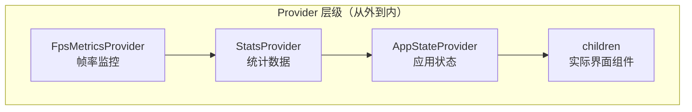
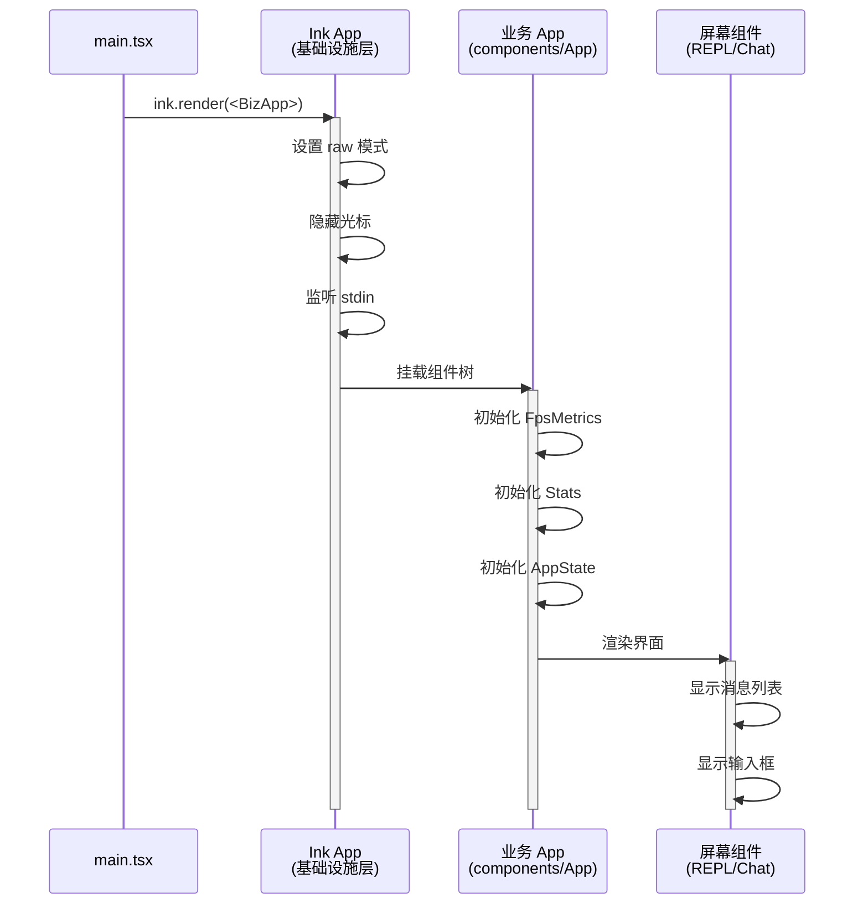
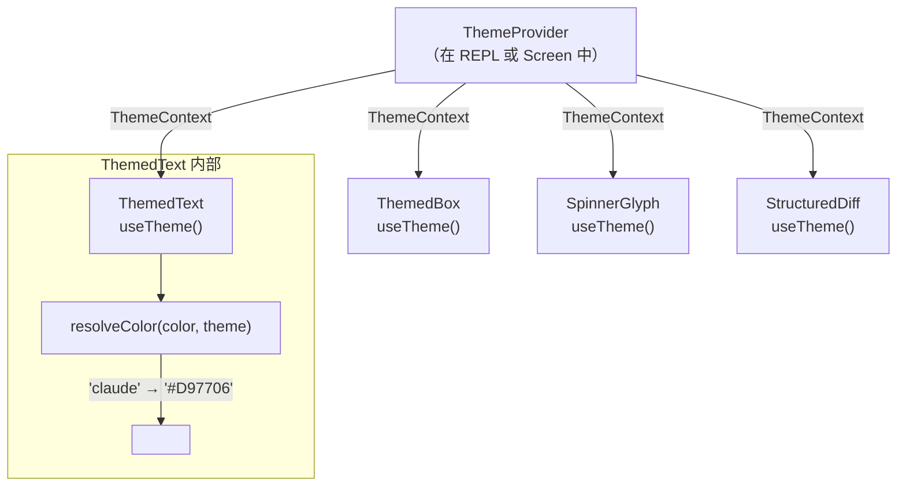

# 第 3 课：双层 App 架构——业务 App + Ink App

## 学习目标

1. 理解 Claude Code 为什么需要两层 App 架构
2. 掌握业务层 `components/App.tsx` 的 Context Provider 洋葱模型
3. 了解基础设施层 `ink/components/App.tsx` 的终端管理职责
4. 理解 React Context 在终端 UI 中的应用
5. 学会追踪数据从顶层 Provider 流向底层组件的路径

---

## 3.1 为什么需要两层 App？

### 生活类比：酒店的前台与后勤

想象一家酒店：

- **前台**（业务层 App）：接待客人、管理房间状态、处理预订——这是"业务逻辑"
- **后勤**（基础设施层 Ink App）：供水供电、中央空调、安保系统——这是"基础设施"

客人不需要知道空调怎么运行，前台也不需要了解水管走向。分层让各自专注于自己的职责。

Claude Code 的两个 App 同样如此：

| 层级 | 文件 | 职责 |
|------|------|------|
| 业务层 | `components/App.tsx` | 应用状态、FPS 指标、统计数据 |
| 基础设施层 | `ink/components/App.tsx` | 终端 I/O、光标、输入解析、渲染触发 |

---

## 3.2 业务层 App：Context Provider 的洋葱

```typescript
// 源码: components/App.tsx（还原 TSX）
export function App({
  getFpsMetrics,
  stats,
  initialState,
  children,
}: Props): React.ReactNode {
  return (
    <FpsMetricsProvider getFpsMetrics={getFpsMetrics}>
      <StatsProvider store={stats}>
        <AppStateProvider
          initialState={initialState}
          onChangeAppState={onChangeAppState}
        >
          {children}
        </AppStateProvider>
      </StatsProvider>
    </FpsMetricsProvider>
  )
}
```

这就是经典的 **Provider 洋葱模型**——每一层 Provider 包裹内层，提供不同的上下文数据。

### 洋葱结构图



### 每层 Provider 的作用

**FpsMetricsProvider**（最外层）
- 提供 `getFpsMetrics()` 函数
- 让任何子组件都能获取当前帧率
- 用于性能监控和调试

**StatsProvider**（中间层）
- 提供统计数据存储（StatsStore）
- 跟踪各种运行时指标

**AppStateProvider**（最内层）
- 管理核心应用状态（AppState）
- 包含对话历史、当前模式、工具状态等
- `onChangeAppState` 在状态变化时触发副作用

---

## 3.3 基础设施层 Ink App：终端的"管家"

```typescript
// 源码: ink/components/App.tsx（简化）
class InkApp extends React.Component {
  // === 生命周期 ===
  componentDidMount() {
    // 隐藏终端光标
    this.props.stdout.write(HIDE_CURSOR)
    // 监听 stdin 的 readable 事件
    this.props.stdin.on('readable', this.handleReadable)
  }

  componentWillUnmount() {
    // 恢复光标
    this.props.stdout.write(SHOW_CURSOR)
    // 清理事件监听
    this.props.stdin.off('readable', this.handleReadable)
  }

  // === 输入处理 ===
  handleReadable = () => {
    let chunk
    while ((chunk = this.props.stdin.read()) !== null) {
      this.processInput(chunk)
    }
  }

  processInput = (input) => {
    // 解析按键（处理转义序列、组合键等）
    const [keys, newState] = parseMultipleKeypresses(
      this.keyParseState, input
    )
    this.keyParseState = newState

    // 批量处理按键事件
    if (keys.length > 0) {
      reconciler.discreteUpdates(
        processKeysInBatch, this, keys
      )
    }
  }
}
```

基础设施层的核心职责：

1. **终端控制**：隐藏/恢复光标、设置 raw 模式
2. **输入处理**：读取 stdin → 解析按键 → 分发事件
3. **渲染管理**：触发 React 更新 → Yoga 布局 → Diff 输出

---

## 3.4 完整启动流程



---

## 3.5 Context 数据流示例

让我们追踪一个具体的数据流：**主题（Theme）**是怎么从顶层流到每个组件的。



```typescript
// 源码: components/design-system/ThemedText.tsx（简化）
function ThemedText({ color, dimColor, bold, children, ...rest }) {
  const [themeName] = useTheme()
  const theme = getTheme(themeName)

  // 把 'claude' 这样的主题 key 解析为实际颜色
  const resolvedColor = resolveColor(color, theme)

  return (
    <Text color={resolvedColor} bold={bold} {...rest}>
      {children}
    </Text>
  )
}

function resolveColor(color, theme) {
  // 如果已经是原始颜色值（rgb(...)、#...），直接返回
  if (color?.startsWith('rgb(') || color?.startsWith('#')) {
    return color
  }
  // 否则当作主题 key 查找
  return theme[color]  // 'claude' → '#D97706'
}
```

---

## 3.6 为什么不合并成一个 App？

| 考量 | 分离的好处 |
|------|-----------|
| 关注点分离 | 基础设施改动不影响业务逻辑 |
| 可测试性 | 业务层可以在无终端环境中测试 |
| 复用性 | Ink App 可以被不同的业务 App 复用 |
| 渲染优化 | 基础设施变更不触发业务组件重渲染 |
| 代码可读性 | 每个文件职责清晰，新人容易理解 |

> 💡 这种分层模式在 React 生态中非常常见。比如 Next.js 的 `_app.tsx` 和 `layout.tsx` 也是类似的思路。

---

## 3.7 React Compiler 优化

你可能注意到源码中有很多 `_c()` 和 `$[0]` 这样的代码：

```typescript
// 编译后的代码
export function App(t0) {
  const $ = _c(9);
  const { getFpsMetrics, stats, initialState, children } = t0;

  let t1;
  if ($[0] !== children || $[1] !== initialState) {
    t1 = <AppStateProvider ...>{children}</AppStateProvider>;
    $[0] = children;
    $[1] = initialState;
    $[2] = t1;
  } else {
    t1 = $[2];  // 缓存命中！跳过创建
  }
  // ...
}
```

这是 **React Compiler**（原 React Forget）的输出。它自动实现了 `useMemo` 和 `useCallback` 的效果：
- `$` 数组是缓存槽位
- 只有当依赖项变化时才重新计算
- 大幅减少不必要的重渲染

---

## 3.8 动手练习

### 练习 1：绘制 Provider 层级

打开 Claude Code 的 REPL 屏幕，找到完整的 Provider 嵌套层级。提示：除了 `App.tsx` 中的三层，还有 `ThemeProvider`、`KeybindingProvider` 等。

试着画出完整的洋葱图。

### 练习 2：追踪数据流

选择以下其中一个数据，追踪它从 Provider 到消费组件的完整路径：
1. `AppState`（应用状态）→ 在哪些组件中被使用？
2. `Theme`（主题）→ 颜色是如何从 `'dark'` 变成 `'#D97706'` 的？

### 练习 3：思考题

1. 如果把 `FpsMetricsProvider` 放在最内层而不是最外层，会有什么影响？
   > 提示：Provider 的位置决定了它的重渲染范围。
2. 为什么 `onChangeAppState` 是从外部传入而不是在 Provider 内部定义？
   > 提示：依赖注入——让 Provider 的副作用可测试、可替换。
3. 为什么 Ink App 使用 Class Component 而不是函数组件？
   > 提示：生命周期方法、错误边界、以及历史原因。

---

## 本课小结

| 概念 | 说明 |
|------|------|
| 双层 App | 业务层管状态，基础设施层管终端 I/O |
| Provider 洋葱 | 多层 Context Provider 嵌套，每层提供不同数据 |
| 基础设施层 | 光标控制、输入解析、渲染触发 |
| 业务层 | FPS 监控、统计、应用状态 |
| React Compiler | 自动缓存优化，减少重渲染 |
| 主题解析 | 主题 key → resolveColor → 实际颜色值 |

## 下节预告

下一课我们将深入**消息列表与虚拟滚动**——当对话有上千条消息时，如何只渲染可见的部分来保持流畅？我们会看到 `useVirtualScroll` 如何用"占位 + 测量"策略实现 O(1) 的纤维（fiber）开销。
