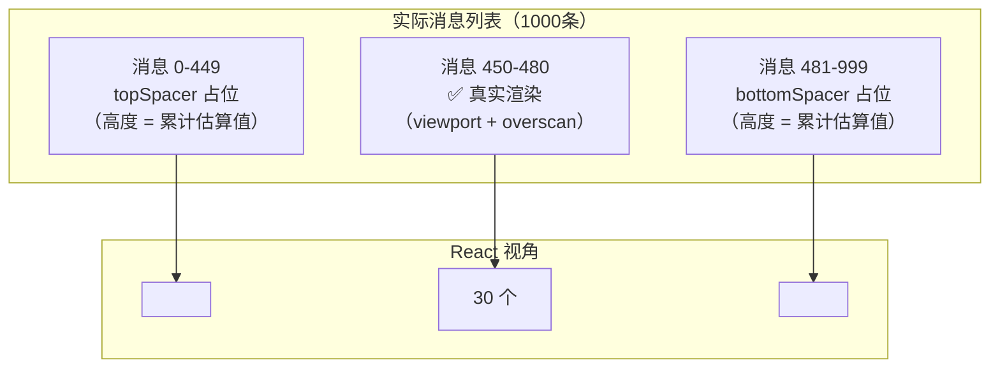
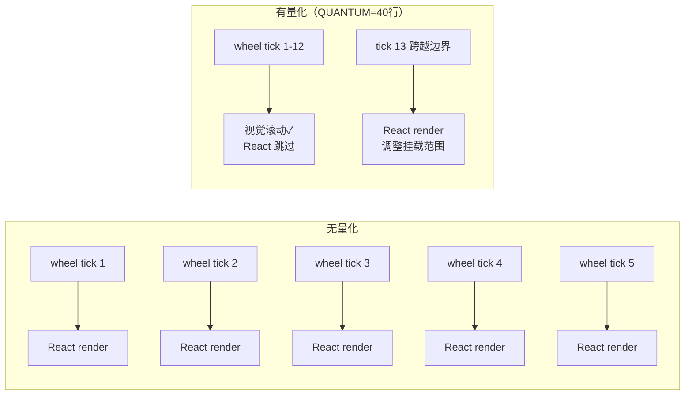
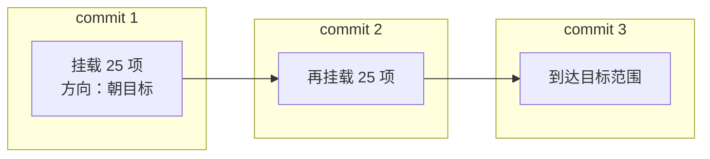

# 第 4 课：消息列表与虚拟滚动优化

## 学习目标

1. 理解为什么大量消息需要虚拟滚动
2. 掌握 `useVirtualScroll` hook 的核心算法
3. 了解高度估算、测量与缓存的三段式策略
4. 理解滚动量化（Scroll Quantum）如何减少渲染次数
5. 学会分析虚拟滚动中的性能瓶颈

---

## 4.1 问题：1000 条消息的噩梦

### 生活类比：图书馆的书架

想象你在一个图书馆里：

- **方案 A**：把 10000 本书全部摆在一面墙上 → 你站在中间，但左边和右边的书你根本看不到
- **方案 B**：只摆出你面前能看到的 20 本，其余的用空架子占位 → 需要哪本就取出来

方案 B 就是**虚拟滚动**的核心思想。

### 性能数据

源码注释中给出了精确的数字：

```
每个 MessageRow ≈ 250 KB RSS
1000 条消息 = ~250 MB 内存（grow-only）
包括：Ink screen buffer、WASM 线性内存、JSC 页面
```

没有虚拟滚动时，所有 React fiber 和 Yoga 节点都会被分配，即使用户只能看到其中 20 条。

---

## 4.2 虚拟滚动的核心思路



关键数字（来自源码常量）：

```typescript
// 源码: hooks/useVirtualScroll.ts
const DEFAULT_ESTIMATE = 3      // 未测量项的估算高度（行数）
const OVERSCAN_ROWS = 80        // 视口上下各多渲染 80 行
const COLD_START_COUNT = 30     // 冷启动时先渲染 30 项
const PESSIMISTIC_HEIGHT = 1    // 覆盖率计算用的最坏高度
const MAX_MOUNTED_ITEMS = 300   // 挂载项上限
const SLIDE_STEP = 25           // 每次提交最多新挂载 25 项
```

---

## 4.3 高度估算的三段式策略

### 第一段：估算

```typescript
const DEFAULT_ESTIMATE = 3  // 故意偏低
```

为什么故意偏低？源码注释解释得很清楚：

> 高估会导致空白区域（我们过早停止挂载，视口底部出现空的 spacer），
> 低估只是多挂载几个进 overscan 区域。不对称性意味着宁可低估。

### 第二段：测量

```typescript
measureRef: (key: string) => (el: DOMElement | null) => void
```

每个渲染出的 MessageRow 通过 `measureRef` 回调获取实际高度：

```jsx
// 使用方式（简化）
const { range, measureRef, topSpacer, bottomSpacer } = useVirtualScroll(
  scrollRef, itemKeys, columns
)

{messages.slice(range[0], range[1]).map((msg, i) => (
  <Box ref={measureRef(msg.key)} key={msg.key}>
    <MessageRow message={msg} />
  </Box>
))}
```

### 第三段：缓存

测量结果存入 `heightCache`，下次渲染直接使用：

```typescript
const heightCache = useRef(new Map<string, number>())
```

---

## 4.4 滚动量化：减少 React 提交

这是一个精妙的优化。正常情况下，每个滚轮 tick（每个 notch 有 3-5 个 tick）都会触发一次完整的 React commit + Yoga 布局 + Ink diff。

```typescript
// 源码: hooks/useVirtualScroll.ts
const SCROLL_QUANTUM = OVERSCAN_ROWS >> 1  // = 40
```

原理：将 scrollTop 按 40 行为一个量子进行"取整"，只有跨越量子边界时才触发 React 重渲染。



> 视觉滚动始终流畅——`ScrollBox.forceRender` 在每次 `scrollBy` 时触发，Ink 直接从 DOM 节点读取真实 scrollTop，和 React 的认知无关。

---

## 4.5 终端宽度变化：缩放而非清除

窗口调整大小时，所有文本重新换行，缓存的高度全部失效。天真的做法是清除 heightCache，但这会导致严重问题：

```typescript
// 源码: hooks/useVirtualScroll.ts
if (prevColumns.current !== columns) {
  const ratio = prevColumns.current / columns
  // 缩放而非清除！
  for (const [k, h] of heightCache.current) {
    heightCache.current.set(k, Math.max(1, Math.round(h * ratio)))
  }
}
```

为什么缩放而不是清除？

```
清除 heightCache
→ 所有项变成 PESSIMISTIC_HEIGHT=1
→ 需要走 190 项才能覆盖 viewport + 2×overscan
→ 每个新挂载 ≈ 3ms（marked.lexer + 语法高亮）
→ 190 × 3ms ≈ 600ms 卡顿！
```

缩放保持 heightCache 有内容 → 回溯用真实高度 → 挂载范围紧凑。

---

## 4.6 滑动步进：限制单次挂载

快速滚动到未渲染区域时，理论上需要一次挂载 190 项。每项 1.5ms，总共 290ms 的同步阻塞！

```typescript
const SLIDE_STEP = 25  // 每次提交最多新挂载 25 项
```

策略：分多次 commit 逐步"滑向"目标范围。同时通过 `scrollClampMin/Max` 钳制视口到已挂载内容的边缘，避免空白。



---

## 4.7 VirtualMessageList 组件

```typescript
// 源码: components/VirtualMessageList.tsx（简化结构）
function VirtualMessageList({
  messages,
  scrollRef,
  columns,
  itemKey,
  renderItem,
  // ...
}: Props) {
  const {
    range,           // [startIndex, endIndex) 半开区间
    topSpacer,       // 顶部占位高度
    bottomSpacer,    // 底部占位高度
    measureRef,      // 测量回调工厂
    spacerRef,       // 顶部 spacer 的 ref（用于定位）
    offsets,         // 每项的累计偏移量
    scrollToIndex,   // 滚动到指定项
  } = useVirtualScroll(scrollRef, itemKeys, columns)

  return (
    <>
      <Box ref={spacerRef} height={topSpacer} />
      {messages.slice(range[0], range[1]).map((msg, i) => (
        <VirtualItem
          key={itemKey(msg)}
          itemKey={itemKey(msg)}
          msg={msg}
          idx={range[0] + i}
          measureRef={measureRef}
          renderItem={renderItem}
        />
      ))}
      <Box height={bottomSpacer} />
    </>
  )
}
```

---

## 4.8 动手练习

### 练习 1：计算挂载范围

假设：
- 终端高度 = 30 行
- OVERSCAN_ROWS = 80
- 当前 scrollTop 在消息 #500 附近
- 所有消息已测量，平均高度 = 4 行

问：大约会挂载哪些消息？挂载总数是多少？

### 练习 2：分析滚动量化

如果用户连续快速滚动 200 行：
1. 没有滚动量化时，React 会触发多少次渲染？（提示：每个 wheel tick ≈ 3 行）
2. 有量化（QUANTUM=40）时呢？

### 练习 3：查看源码

1. 在 `useVirtualScroll.ts` 中找到 `useSyncExternalStore` 的使用——它是怎么监听 ScrollBox 滚动事件的？
2. 在 `VirtualMessageList.tsx` 中找到搜索功能相关的代码——虚拟滚动下，搜索如何找到未渲染的消息？

---

## 本课小结

| 概念 | 说明 |
|------|------|
| 虚拟滚动 | 只渲染视口内 + overscan 的项目，其余用 spacer 占位 |
| 高度估算 | 未测量项用 DEFAULT_ESTIMATE=3 估算，故意偏低 |
| 滚动量化 | scrollTop 按 QUANTUM=40 行取整，减少 React 重渲染 |
| 高度缩放 | 窗口大小变化时按比例缩放缓存高度，避免全量重算 |
| 滑动步进 | 快速滚动时每次最多挂载 25 项，分多次 commit 完成 |
| 测量缓存 | WeakMap/Map 存储已测量的真实高度，下次直接复用 |

## 下节预告

下一课我们将探索**输入框设计**——`TextInput` 如何处理多行编辑、光标移动、Kill Ring、历史导航，以及语音录制时的波形光标效果。
