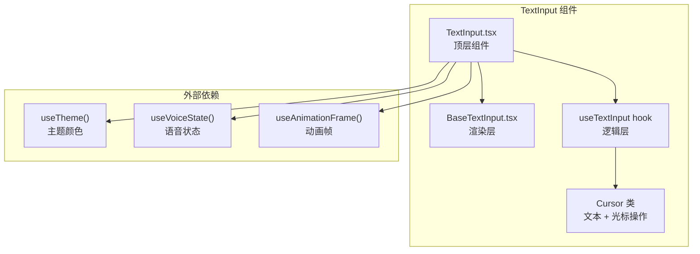
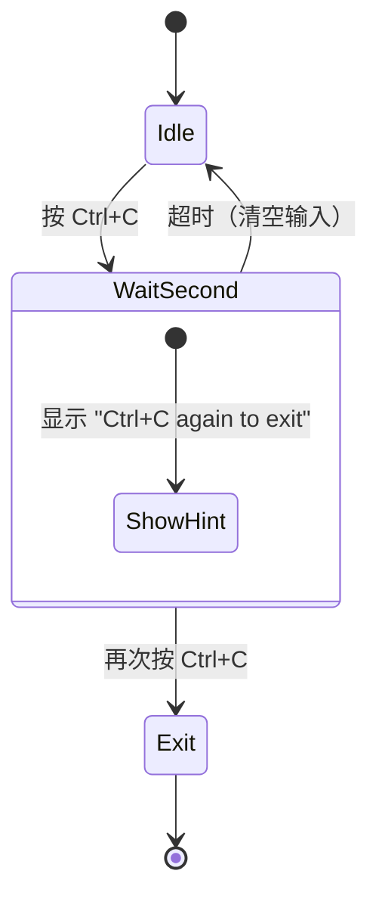
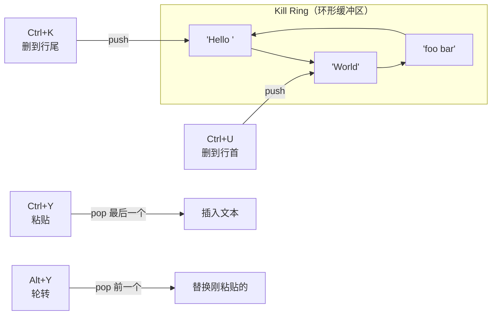

# 第 5 课：输入框设计——TextInput 与多行编辑

## 学习目标

1. 理解终端输入框与浏览器 `<input>` 的根本差异
2. 掌握 `useTextInput` hook 的核心架构
3. 了解 Cursor 类如何管理文本和光标位置
4. 理解 Kill Ring（剪贴板环）和 Emacs 风格编辑
5. 学会分析双击退出、图片粘贴等特殊输入处理

---

## 5.1 终端输入框 ≠ 浏览器输入框

### 生活类比：手动排版 vs Word

- **浏览器的 `<input>`**：像 Word——光标自动闪烁、选区自动高亮、撤销历史自动管理
- **终端的输入框**：像手动排版——你得自己画光标、自己计算换行位置、自己管理编辑历史

终端没有"原生输入框"这个概念。Claude Code 的输入框是**纯 React 组件**，一切都是手工实现的。

---

## 5.2 架构总览



---

## 5.3 useTextInput：输入处理的核心

```typescript
// 源码: hooks/useTextInput.ts（简化）
export function useTextInput({
  value: originalValue,
  onChange,
  onSubmit,
  onExit,
  multiline = false,
  cursorChar,
  invert,
  columns,
  // ...更多配置
}: UseTextInputProps): TextInputState {

  // 用 Cursor 类管理文本和光标
  const cursor = Cursor.fromText(originalValue, columns, offset)

  // 特殊按键处理
  const handleCtrlC = useDoublePress(
    show => onExitMessage?.(show, 'Ctrl-C'),  // 第一次：显示提示
    () => onExit?.(),                          // 第二次：真的退出
    () => {                                     // 单次按下：清空输入
      if (originalValue) {
        onChange('')
        setOffset(0)
      }
    },
  )

  // Emacs 风格的 Kill Ring
  function killToLineEnd(): Cursor {
    const { cursor: newCursor, killed } = cursor.deleteToLineEnd()
    pushToKillRing(killed, 'append')
    return newCursor
  }

  function killToLineStart(): Cursor {
    const { cursor: newCursor, killed } = cursor.deleteToLineStart()
    pushToKillRing(killed, 'prepend')
    return newCursor
  }

  function yank(): Cursor {
    const text = getLastKill()
    if (text.length > 0) {
      recordYank(text.length)
      return cursor.insert(text)
    }
    return cursor
  }

  // ...返回 TextInputState 供渲染层使用
}
```

---

## 5.4 Cursor 类：文本操作的瑞士军刀

`Cursor` 类封装了所有文本编辑操作，让 `useTextInput` 不需要直接操作字符串索引：

```typescript
// Cursor 类的核心方法（概念展示）
class Cursor {
  text: string       // 完整文本
  pos: number        // 光标位置（字符索引）
  columns: number    // 终端宽度

  // 工厂方法
  static fromText(text: string, columns: number, offset: number): Cursor

  // 移动
  moveLeft(): Cursor
  moveRight(): Cursor
  moveUp(): Cursor
  moveDown(): Cursor
  moveToLineStart(): Cursor
  moveToLineEnd(): Cursor
  moveWordForward(): Cursor
  moveWordBackward(): Cursor

  // 编辑
  insert(text: string): Cursor
  del(): Cursor                              // 向前删除（Delete 键）
  backspace(): Cursor                        // 向后删除（Backspace 键）
  deleteToLineEnd(): { cursor: Cursor; killed: string }
  deleteToLineStart(): { cursor: Cursor; killed: string }
  deleteWordBefore(): { cursor: Cursor; killed: string }
}
```

> 💡 每个操作返回**新的 Cursor 实例**（不可变模式），这使得撤销和重做变得简单。

---

## 5.5 双击安全机制

退出 Claude Code 需要双击 Ctrl+C 或 Escape，防止误操作：

```typescript
// 源码: hooks/useTextInput.ts
const handleCtrlC = useDoublePress(
  // 第一次按下：显示提示
  show => {
    onExitMessage?.(show, 'Ctrl-C')
  },
  // 第二次按下（在时间窗口内）：执行退出
  () => onExit?.(),
  // 超时后单次处理：清空当前输入
  () => {
    if (originalValue) {
      onChange('')
      setOffset(0)
      onHistoryReset?.()
    }
  },
)

const handleEscape = useDoublePress(
  (show) => {
    if (!originalValue || !show) return
    addNotification({
      key: 'escape-again-to-clear',
      text: 'Esc again to clear',
      priority: 'immediate',
      timeoutMs: 1000,
    })
  },
  () => {
    removeNotification('escape-again-to-clear')
    // 双击 Escape：保存到历史 + 清空
    if (originalValue.trim() !== '') {
      addToHistory(originalValue)
    }
    onChange('')
  },
)
```



---

## 5.6 Kill Ring：Emacs 风格剪贴板

Kill Ring 是一个**环形剪贴板**，存储多次删除的文本：



操作说明：
- **Ctrl+K**：删除从光标到行尾的文本 → 存入 Kill Ring
- **Ctrl+U**：删除从行首到光标的文本 → 存入 Kill Ring
- **Ctrl+W / Alt+Backspace**：删除前一个单词 → 存入 Kill Ring
- **Ctrl+Y**：粘贴 Kill Ring 最近的内容
- **Alt+Y**（连续按）：轮转 Kill Ring，替换成更早的内容

---

## 5.7 语音录制的波形光标

Claude Code 支持语音输入，录制时光标会变成动态波形：

```typescript
// 源码: components/TextInput.tsx（简化）
const BARS = ' ▁▂▃▄▅▆▇█'  // 波形字符

if (isVoiceRecording && !reducedMotion) {
  const smoothed = smoothedRef.current
  const raw = audioLevels[audioLevels.length - 1] ?? 0
  const target = Math.min(raw * LEVEL_BOOST, 1)

  // EMA 指数移动平均平滑
  smoothed[0] = (smoothed[0] ?? 0) * SMOOTH + target * (1 - SMOOTH)

  const displayLevel = smoothed[0] ?? 0
  const barIndex = Math.max(1, Math.min(
    Math.round(displayLevel * (BARS.length - 1)),
    BARS.length - 1
  ))

  // 静默时灰色，有声音时彩虹色
  const isSilent = raw < SILENCE_THRESHOLD  // 0.15
  const hue = (animTime / 1000) * 90 % 360
  const { r, g, b } = isSilent
    ? { r: 128, g: 128, b: 128 }
    : hueToRgb(hue)

  invert = () => chalk.rgb(r, g, b)(BARS[barIndex]!)
}
```

效果：光标位置显示一个跟着音量跳动的竖条 ▃▅█，颜色随时间变化。

---

## 5.8 多行编辑

当 `multiline=true` 时，Enter 键插入换行而非提交：

```typescript
// 概念展示
function handleInput(input: string, key: Key) {
  if (key.return) {
    if (multiline) {
      // 多行模式：插入换行
      return cursor.insert('\n')
    } else {
      // 单行模式：提交
      onSubmit?.(originalValue)
    }
  }
}
```

多行模式下还需要处理：
- **上下方向键**：在行间移动光标
- **视口滚动**：文本超过 `maxVisibleLines` 时自动滚动
- **行号计算**：`Cursor` 需要知道终端宽度来正确换行

---

## 5.9 动手练习

### 练习 1：按键映射表

列出 `useTextInput` 中所有处理的快捷键及其功能。提示：搜索 `mapInput` 函数。

### 练习 2：Cursor 操作模拟

给定文本 `"Hello World"` 和光标在 `o` 后面（位置 5），执行以下操作后文本和光标分别是什么：
1. `deleteToLineEnd()` → ?
2. 然后 `insert('!')` → ?
3. 然后 `moveToLineStart()` → ?

### 练习 3：思考题

1. 为什么 `useTextInput` 返回的是 `TextInputState` 而不是直接渲染？
   > 提示：逻辑与渲染分离，方便 VimTextInput 等变体复用。
2. 为什么波形光标使用 EMA（指数移动平均）而不是原始值？
   > 提示：原始音频数据抖动太大，EMA 让视觉效果更平滑。

---

## 本课小结

| 概念 | 说明 |
|------|------|
| useTextInput | 核心 hook，处理所有输入逻辑 |
| Cursor 类 | 不可变的文本+光标操作封装 |
| 双击安全 | Ctrl+C / Escape 需要两次确认才退出 |
| Kill Ring | Emacs 风格环形剪贴板 |
| 波形光标 | 语音录制时用 block 字符显示音量 |
| 多行编辑 | Enter 插入换行，上下键在行间移动 |

## 下节预告

下一课我们将进入**Vim 模式**——了解 Claude Code 如何用状态机实现 Vim 风格的文本编辑，包括 Normal/Insert 模式切换、操作符+动作组合、以及 dot-repeat。
