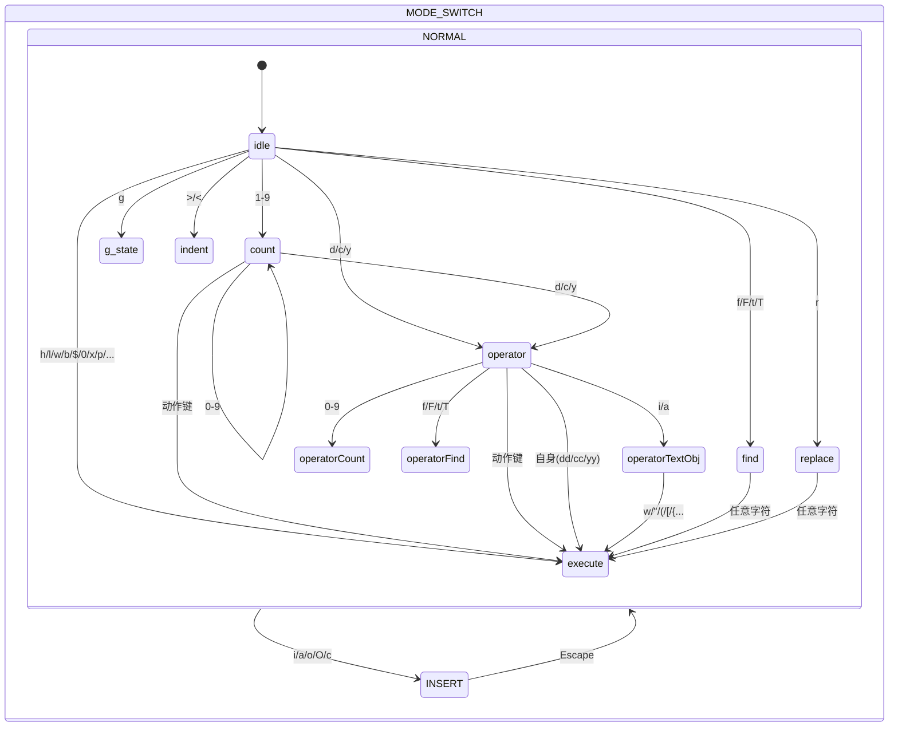
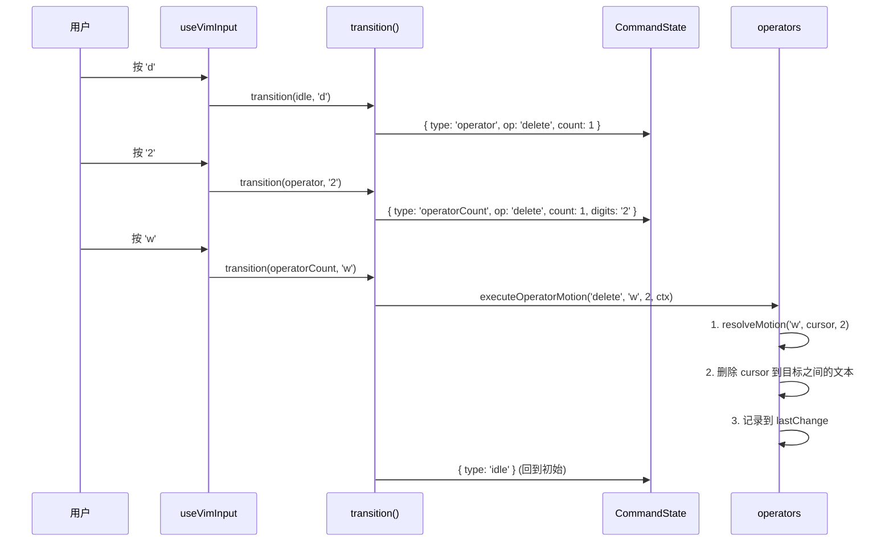

# 第 6 课：Vim 模式实现——状态机详解

## 学习目标

1. 理解 Vim 编辑的"操作符+动作"组合模型
2. 掌握 Claude Code 中 Vim 状态机的完整类型系统
3. 了解 INSERT 和 NORMAL 模式的切换机制
4. 理解状态转换表的设计思路
5. 学会追踪一个 Vim 命令从按键到执行的完整路径

---

## 6.1 Vim 编辑模式简介

### 生活类比：遥控器的模式切换

想象一个万能遥控器：

- **Normal 模式**（浏览模式）：按方向键移动，按数字键选择频道，按 `d` 删除录制
- **Insert 模式**（输入模式）：按键直接输入文字——搜索、命名录制

Vim 的核心思想就是**模式分离**：同一个按键在不同模式下有完全不同的含义。

---

## 6.2 状态机类型系统

Claude Code 的 Vim 实现用 TypeScript 类型系统精确描述了整个状态机：

```typescript
// 源码: vim/types.ts
// 顶层状态：只有两种模式
export type VimState =
  | { mode: 'INSERT'; insertedText: string }
  | { mode: 'NORMAL'; command: CommandState }
```

INSERT 模式很简单——记录用户输入的文字（用于 dot-repeat）。复杂性在 NORMAL 模式的 CommandState：

```typescript
// 源码: vim/types.ts
export type CommandState =
  | { type: 'idle' }                              // 等待输入
  | { type: 'count'; digits: string }             // 输入数字前缀 (3dw)
  | { type: 'operator'; op: Operator; count: number }     // 等待动作
  | { type: 'operatorCount'; op: Operator; count: number; digits: string }
  | { type: 'operatorFind'; op: Operator; count: number; find: FindType }
  | { type: 'operatorTextObj'; op: Operator; count: number; scope: TextObjScope }
  | { type: 'find'; find: FindType; count: number }        // f/F/t/T 查找
  | { type: 'g'; count: number }                            // g 前缀
  | { type: 'operatorG'; op: Operator; count: number }
  | { type: 'replace'; count: number }                      // r 替换
  | { type: 'indent'; dir: '>' | '<'; count: number }       // 缩进
```

---

## 6.3 状态转换图



---

## 6.4 核心类型详解

### 操作符（Operator）

```typescript
export type Operator = 'delete' | 'change' | 'yank'

export const OPERATORS = {
  d: 'delete',   // 删除
  c: 'change',   // 修改（删除后进入 Insert 模式）
  y: 'yank',     // 复制
} as const
```

### 动作（Motion）

```typescript
export const SIMPLE_MOTIONS = new Set([
  'h', 'l', 'j', 'k',   // 方向
  'w', 'b', 'e',         // 词
  'W', 'B', 'E',         // 大词（以空格分隔）
  '0', '^', '$',         // 行位置
])
```

### 文本对象（Text Object）

```typescript
export const TEXT_OBJ_SCOPES = {
  i: 'inner',    // 内部（不含分隔符）
  a: 'around',   // 周围（含分隔符）
} as const

export const TEXT_OBJ_TYPES = new Set([
  'w', 'W',        // 词
  '"', "'", '`',   // 引号
  '(', ')', 'b',   // 小括号
  '[', ']',        // 方括号
  '{', '}', 'B',   // 大括号
  '<', '>',        // 尖括号
])
```

### 组合示例

| 按键 | 解读 | 效果 |
|------|------|------|
| `dw` | delete + word | 删除一个词 |
| `3dw` | 3 × (delete + word) | 删除三个词 |
| `ci"` | change + inner + `"` | 修改引号内的内容 |
| `yy` | yank + line | 复制整行 |
| `d$` | delete + 行尾 | 删除到行尾 |

---

## 6.5 转换函数：状态机的"引擎"

```typescript
// 源码: vim/transitions.ts
export function transition(
  state: CommandState,
  input: string,
  ctx: TransitionContext,
): TransitionResult {
  switch (state.type) {
    case 'idle':         return fromIdle(input, ctx)
    case 'count':        return fromCount(state, input, ctx)
    case 'operator':     return fromOperator(state, input, ctx)
    case 'operatorCount':return fromOperatorCount(state, input, ctx)
    case 'operatorFind': return fromOperatorFind(state, input, ctx)
    case 'operatorTextObj': return fromOperatorTextObj(state, input, ctx)
    case 'find':         return fromFind(state, input, ctx)
    case 'g':            return fromG(state, input, ctx)
    case 'operatorG':    return fromOperatorG(state, input, ctx)
    case 'replace':      return fromReplace(state, input, ctx)
    case 'indent':       return fromIndent(state, input, ctx)
  }
}
```

返回值类型：

```typescript
export type TransitionResult = {
  next?: CommandState   // 下一个状态（如果有）
  execute?: () => void  // 要执行的操作（如果有）
}
```

### 从 idle 处理输入

```typescript
function fromIdle(input: string, ctx: TransitionContext) {
  // 操作符按键 → 进入 operator 状态
  if (isOperatorKey(input)) {
    return { next: { type: 'operator', op: OPERATORS[input], count: 1 } }
  }

  // 动作按键 → 直接执行移动
  if (SIMPLE_MOTIONS.has(input)) {
    return {
      execute: () => {
        const target = resolveMotion(input, ctx.cursor, 1)
        ctx.setOffset(target.offset)
      },
    }
  }

  // 查找按键 → 等待目标字符
  if (FIND_KEYS.has(input)) {
    return { next: { type: 'find', find: input, count: 1 } }
  }

  // 快捷操作
  if (input === 'D') {
    return { execute: () => executeOperatorMotion('delete', '$', 1, ctx) }
  }
  if (input === 'C') {
    return { execute: () => executeOperatorMotion('change', '$', 1, ctx) }
  }
  // ...
}
```

---

## 6.6 Dot Repeat（点重复）

Vim 的 `.` 命令可以重复上一次修改操作。为此需要记录操作：

```typescript
// 源码: vim/types.ts
export type RecordedChange =
  | { type: 'insert'; text: string }
  | { type: 'operator'; op: Operator; motion: string; count: number }
  | { type: 'operatorTextObj'; op: Operator; objType: string; scope: TextObjScope; count: number }
  | { type: 'operatorFind'; op: Operator; find: FindType; char: string; count: number }
  | { type: 'replace'; char: string; count: number }
  | { type: 'x'; count: number }
  | { type: 'toggleCase'; count: number }
  | { type: 'indent'; dir: '>' | '<'; count: number }
  | { type: 'openLine'; direction: 'above' | 'below' }
  | { type: 'join'; count: number }
```

持久化状态（跨命令保持）：

```typescript
export type PersistentState = {
  lastChange: RecordedChange | null   // 上次修改（用于 . 重复）
  lastFind: { type: FindType; char: string } | null  // 上次查找（用于 ; 重复）
  register: string                     // 寄存器内容（yank/delete 的文本）
  registerIsLinewise: boolean          // 寄存器是否为整行
}
```

---

## 6.7 追踪完整操作：`d2w`

让我们追踪 `d2w`（删除 2 个词）的完整执行路径：



---

## 6.8 动手练习

### 练习 1：状态推演

对于以下按键序列，追踪 CommandState 的变化：
1. `3dd` → 每次按键后状态是什么？最终执行什么操作？
2. `ci(` → 每次按键后状态是什么？
3. `2fax` → 注意 `fa` 是查找，`x` 是新命令

### 练习 2：添加新命令

假设你想给 Vim 模式添加 `gU`（转大写）命令。需要修改哪些类型和函数？

### 练习 3：查看源码

1. 打开 `vim/transitions.ts`，找到 `fromOperator` 函数。当 operator 按下自身（如 `dd`）时会怎么处理？
2. 在 `vim/types.ts` 中找到 `MAX_VIM_COUNT`（= 10000）。为什么需要这个限制？
3. 在 `hooks/useVimInput.ts` 中找到模式切换的代码——`Escape` 如何从 INSERT 切到 NORMAL？

---

## 本课小结

| 概念 | 说明 |
|------|------|
| VimState | 顶层状态：INSERT（记录文本） 或 NORMAL（命令状态机）|
| CommandState | 11 种子状态，TypeScript 确保穷举处理 |
| 操作符+动作 | `d` + `w` = 删除一个词，组合式命令 |
| 文本对象 | `i"` = 引号内部，`a(` = 包含括号 |
| transition() | 纯函数状态转换，返回下一状态或执行动作 |
| Dot Repeat | RecordedChange 记录操作，`.` 键重放 |
| PersistentState | 跨命令保持的记忆：寄存器、上次查找等 |

## 下节预告

下一课我们将探索**Spinner 加载动画**——如何在终端中实现流畅的旋转动画，同时避免不必要的性能开销？共享时钟、离屏暂停和减弱动效的设计哲学。
