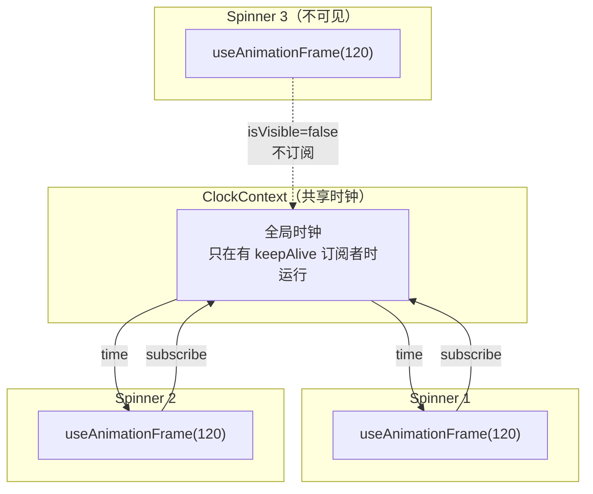
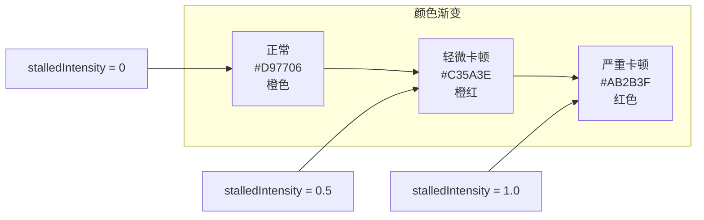
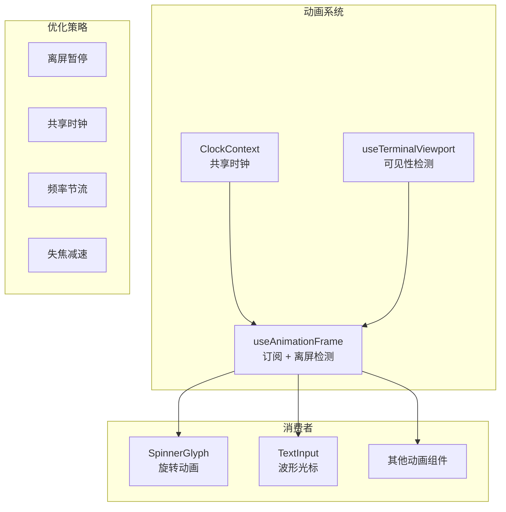

# 第 7 课：Spinner 加载动画的性能设计

## 学习目标

1. 理解终端动画与浏览器动画的根本差异
2. 掌握共享时钟（Shared Clock）的设计原理
3. 了解 `useAnimationFrame` hook 的离屏暂停机制
4. 理解 Spinner 的帧动画、颜色插值和减弱动效
5. 学会设计低开销的终端动画

---

## 7.1 终端动画的挑战

### 生活类比：老式翻页钟 vs 数字钟

- **浏览器动画**像数字钟：有 `requestAnimationFrame`，GPU 加速，60fps 轻松达到
- **终端动画**像翻页钟：每一"帧"都要重新算布局、生成字符网格、diff 比较、写入 stdout

终端动画的每一帧成本远高于浏览器。所以 Claude Code 的动画系统围绕一个核心原则：**尽可能少地触发重渲染**。

---

## 7.2 Spinner 字符动画

```typescript
// 源码: components/Spinner/SpinnerGlyph.tsx（还原 TSX）
const DEFAULT_CHARACTERS = getDefaultCharacters()
// 正序 + 反序 = 平滑来回动画
const SPINNER_FRAMES = [
  ...DEFAULT_CHARACTERS,
  ...[...DEFAULT_CHARACTERS].reverse(),
]

export function SpinnerGlyph({
  frame,                    // 当前帧号
  messageColor,             // 主题颜色 key
  stalledIntensity = 0,     // 卡顿强度 0-1
  reducedMotion = false,    // 减弱动效
  time = 0,                 // 当前时间（用于减弱动效模式）
}: Props) {
  const [themeName] = useTheme()
  const theme = getTheme(themeName)

  // 减弱动效：慢闪烁圆点
  if (reducedMotion) {
    const isDim = Math.floor(time / (2000 / 2)) % 2 === 1
    return (
      <Box flexWrap="wrap" height={1} width={2}>
        <Text color={messageColor} dimColor={isDim}>●</Text>
      </Box>
    )
  }

  // 正常动画：从帧数组中取字符
  const spinnerChar = SPINNER_FRAMES[frame % SPINNER_FRAMES.length]

  return (
    <Box flexWrap="wrap" height={1} width={2}>
      <Text color={messageColor}>{spinnerChar}</Text>
    </Box>
  )
}
```

动画帧序列（假设默认字符是 Braille 图案）：

```
帧 0: ⠋  帧 1: ⠙  帧 2: ⠹  帧 3: ⠸
帧 4: ⠼  帧 5: ⠴  帧 6: ⠦  帧 7: ⠧
帧 8: ⠇  帧 9: ⠏  (然后反序回来...)
```

---

## 7.3 共享时钟：useAnimationFrame

所有 Spinner 共用一个时钟，这样它们会**同步旋转**而非各跑各的：

```typescript
// 源码: ink/hooks/use-animation-frame.ts
export function useAnimationFrame(
  intervalMs: number | null = 16,
): [ref: (element: DOMElement | null) => void, time: number] {
  const clock = useContext(ClockContext)
  const [viewportRef, { isVisible }] = useTerminalViewport()
  const [time, setTime] = useState(() => clock?.now() ?? 0)

  const active = isVisible && intervalMs !== null

  useEffect(() => {
    if (!clock || !active) return

    let lastUpdate = clock.now()

    const onChange = (): void => {
      const now = clock.now()
      if (now - lastUpdate >= intervalMs!) {
        lastUpdate = now
        setTime(now)
      }
    }

    // keepAlive: true — 可见的动画驱动时钟
    return clock.subscribe(onChange, true)
  }, [clock, intervalMs, active])

  return [viewportRef, time]
}
```

### 关键设计



1. **共享时钟**：所有动画从 `ClockContext` 读取同一个时间，保持同步
2. **离屏暂停**：`isVisible` 为 false 时不订阅时钟，不触发重渲染
3. **按需驱动**：时钟只在有 `keepAlive` 订阅者时运行，没有动画时自动停止
4. **节流**：`intervalMs` 控制更新频率，不是每个 tick 都更新

---

## 7.4 卡顿检测：颜色渐变反馈

当 AI 响应卡顿时，Spinner 颜色从主题色渐变到红色，给用户视觉反馈：

```typescript
// 源码: components/Spinner/SpinnerGlyph.tsx（还原）
const ERROR_RED = { r: 171, g: 43, b: 63 }

if (stalledIntensity > 0) {
  const baseColorStr = theme[messageColor]
  const baseRGB = baseColorStr ? parseRGB(baseColorStr) : null

  if (baseRGB) {
    // 线性插值：stalledIntensity=0 时完全基色，=1 时完全红色
    const interpolated = interpolateColor(
      baseRGB, ERROR_RED, stalledIntensity
    )
    return (
      <Box flexWrap="wrap" height={1} width={2}>
        <Text color={toRGBColor(interpolated)}>{spinnerChar}</Text>
      </Box>
    )
  }

  // ANSI 主题的回退方案
  const color = stalledIntensity > 0.5 ? 'error' : messageColor
  return (
    <Box flexWrap="wrap" height={1} width={2}>
      <Text color={color}>{spinnerChar}</Text>
    </Box>
  )
}
```



颜色插值公式（线性插值）：

```
结果.r = 基色.r × (1 - t) + 红色.r × t
结果.g = 基色.g × (1 - t) + 红色.g × t
结果.b = 基色.b × (1 - t) + 红色.b × t
```

其中 `t = stalledIntensity`（0 到 1 之间）。

---

## 7.5 减弱动效（Reduced Motion）

对于有运动敏感的用户，Spinner 切换为慢闪烁圆点：

```typescript
// 减弱动效模式
const REDUCED_MOTION_DOT = '●'
const REDUCED_MOTION_CYCLE_MS = 2000  // 2秒一周期

if (reducedMotion) {
  // 1秒亮 + 1秒暗
  const isDim = Math.floor(time / (REDUCED_MOTION_CYCLE_MS / 2)) % 2 === 1
  return (
    <Text color={messageColor} dimColor={isDim}>
      {REDUCED_MOTION_DOT}
    </Text>
  )
}
```

减弱动效的判断来自用户设置：

```typescript
const settings = useSettings()
const reducedMotion = settings.prefersReducedMotion ?? false
```

---

## 7.6 性能对比

| 方面 | 天真实现 | Claude Code 实现 |
|------|----------|-----------------|
| 时钟 | 每个 Spinner 有独立 setInterval | 共享 ClockContext |
| 不可见时 | 继续触发更新 | isVisible=false 时暂停 |
| 更新频率 | 每 16ms | intervalMs 控制（120ms） |
| 同步性 | 各自独立，不同步 | 共享时间源，完全同步 |
| 终端失焦 | 继续消耗 CPU | 时钟自动减速 |

### 为什么 120ms 而不是 16ms？

浏览器用 16ms（60fps）因为 GPU 渲染很快。终端每帧需要：
1. React reconcile
2. Yoga 布局计算
3. 字符网格生成
4. Diff 比较
5. stdout 写入

120ms（约 8fps）对旋转动画来说足够流畅，同时将 CPU 开销降低到 1/7。

---

## 7.7 动画系统架构



---

## 7.8 动手练习

### 练习 1：帧计算

假设 `SPINNER_FRAMES` 有 20 个字符（10 正序 + 10 反序），`intervalMs=120`：
1. 1 秒内 Spinner 完成多少个完整周期？
2. 如果 3 个 Spinner 都可见，每秒触发多少次 React 更新？

### 练习 2：颜色插值

给定基色 `{ r: 217, g: 119, b: 6 }`（橙色）和目标色 `{ r: 171, g: 43, b: 63 }`（红色），当 `stalledIntensity = 0.3` 时，计算插值后的 RGB 值。

### 练习 3：查看源码

1. 在 `ink/hooks/use-animation-frame.ts` 中，`keepAlive: true` 是什么意思？如果所有 Spinner 都离屏，时钟会怎样？
2. 找到 `components/Spinner/utils.ts` 中的 `getDefaultCharacters` 函数，看看默认的 Spinner 字符是什么。
3. 找到 `ClockContext` 的定义，理解时钟的 subscribe/unsubscribe 机制。

---

## 本课小结

| 概念 | 说明 |
|------|------|
| 共享时钟 | ClockContext 确保所有动画同步 |
| useAnimationFrame | 统一的动画 hook，支持离屏暂停 |
| 帧动画 | 正序+反序字符数组，循环播放 |
| 颜色插值 | stalledIntensity 从主题色渐变到红色 |
| 减弱动效 | reducedMotion 时用慢闪烁圆点替代 |
| 性能优化 | 120ms 间隔、离屏暂停、失焦减速 |

## 下节预告

下一课我们将深入**代码 Diff 展示**——Claude Code 如何使用 Rust NAPI 进行语法高亮，以及 WeakMap 缓存和双列分割的渲染优化策略。
