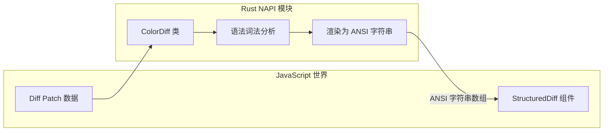
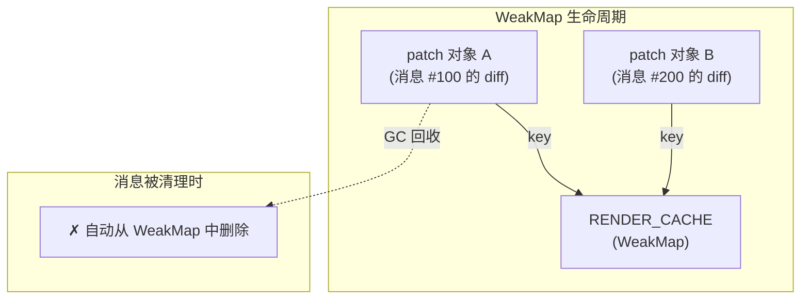
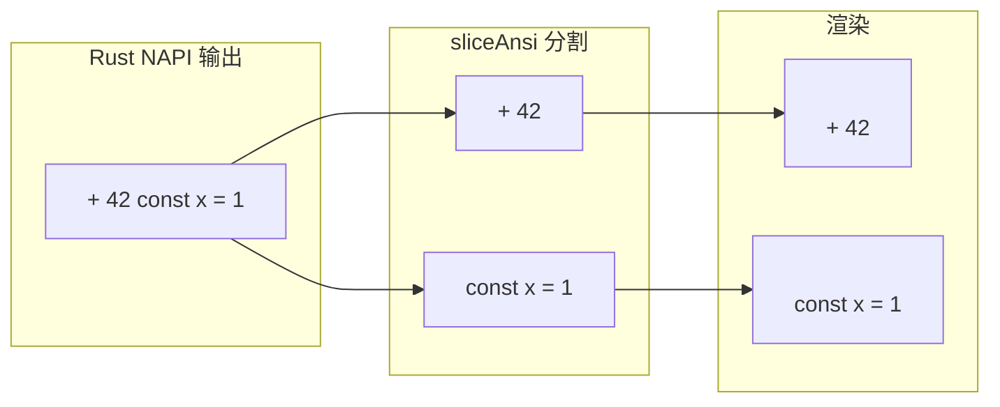
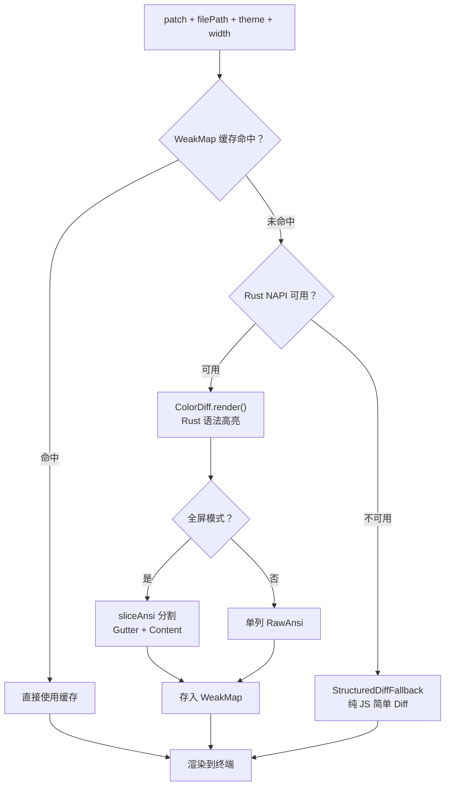

# 第 8 课：代码 Diff 展示——Rust NAPI 高亮

## 学习目标

1. 理解代码 Diff 在终端中的展示挑战
2. 掌握 Rust NAPI 语法高亮的工作原理
3. 了解 WeakMap 缓存策略如何避免重复计算
4. 理解双列分割（Gutter + Content）的渲染优化
5. 学会分析 StructuredDiff 组件的性能设计

---

## 8.1 终端中的代码 Diff

### 生活类比：报纸的校对标记

想象编辑校对报纸：

- **删除的文字**：用红色横线划掉
- **新增的文字**：用绿色标注
- **修改的部分**：在字级别用更深的颜色高亮

Claude Code 的 Diff 展示就是把这种"校对标记"用终端字符实现：

```
│- const greeting = "hello"     ← 红色背景，删除行
│+ const greeting = "Hello!"    ← 绿色背景，新增行
│          修改位置 ^^^^        ← 字级别高亮
```

---

## 8.2 为什么用 Rust？

JavaScript 的语法高亮库（如 highlight.js、Shiki）在处理大文件时性能不足。Claude Code 使用 **Rust 编写的 NAPI（N-API）模块**：



性能对比（概念性）：
- **JS 高亮**：解析 1000 行 ≈ 50-200ms
- **Rust NAPI 高亮**：解析 1000 行 ≈ 2-10ms

速度快 10-50 倍，且不占用 JS 主线程的 GC 压力。

---

## 8.3 StructuredDiff 组件架构

```typescript
// 源码: components/StructuredDiff.tsx（简化）
type Props = {
  patch: StructuredPatchHunk  // Diff 补丁数据
  dim: boolean                // 是否暗淡显示
  filePath: string            // 文件路径（语言检测）
  firstLine: string | null    // 首行（shebang 检测）
  fileContent?: string        // 完整文件内容（多行上下文）
  width: number               // 终端宽度
  skipHighlighting?: boolean  // 跳过语法高亮
}

export const StructuredDiff = memo(function StructuredDiff({
  patch, dim, filePath, firstLine, fileContent,
  width, skipHighlighting = false,
}: Props) {
  const [theme] = useTheme()
  const settings = useSettings()
  const syntaxHighlightingDisabled =
    settings.syntaxHighlightingDisabled ?? false
  const safeWidth = Math.max(1, Math.floor(width))

  // 尝试使用 Rust NAPI 高亮
  const splitGutter = isFullscreenEnvEnabled()
  const cached = skipHighlighting || syntaxHighlightingDisabled
    ? null
    : renderColorDiff(patch, firstLine, filePath,
        fileContent ?? null, theme, safeWidth, dim, splitGutter)

  if (!cached) {
    // 回退到纯 JS 的简单 Diff 展示
    return <StructuredDiffFallback patch={patch} dim={dim} width={width} />
  }

  // 使用缓存的 NAPI 渲染结果
  const { lines, gutterWidth, gutters, contents } = cached

  // 双列分割渲染...
})
```

---

## 8.4 WeakMap 缓存：精巧的内存管理

核心问题：用户切换 transcript/prompt 视图时，整个消息树会卸载/重挂载，React 的 memo 缓存丢失。如何避免重新高亮？

```typescript
// 源码: components/StructuredDiff.tsx
type CachedRender = {
  lines: string[]          // NAPI 输出的 ANSI 行
  gutterWidth: number      // 行号列宽度
  gutters: string[] | null // 行号列（预分割）
  contents: string[] | null // 内容列（预分割）
}

// 模块级 WeakMap 缓存！
const RENDER_CACHE = new WeakMap<StructuredPatchHunk, Map<string, CachedRender>>()
```

### 为什么用 WeakMap？



- **WeakMap** 以 `patch` 对象为 key。当消息被 compaction 清理后，patch 对象被 GC 回收，缓存条目自动消失
- **模块级**（非组件级）：即使组件卸载/重挂载，缓存仍在
- 内部 Map 按 `${theme}|${width}|${dim}|${gutterWidth}` 做二级缓存

### 缓存容量限制

```typescript
// 每个 patch 最多缓存 4 个变体
if (perHunk.size >= 4) perHunk.clear()
perHunk.set(key, entry)
```

为什么限制 4 个？因为 key 包含 `width`，用户调整窗口大小会不断产生新宽度。4 个变体覆盖了稳态场景（2 个宽度 × dim 开/关），超过就全部清理。

---

## 8.5 Gutter 宽度计算

行号列的宽度取决于最大行号：

```typescript
// 源码: components/StructuredDiff.tsx
function computeGutterWidth(patch: StructuredPatchHunk): number {
  const maxLineNumber = Math.max(
    patch.oldStart + patch.oldLines - 1,
    patch.newStart + patch.newLines - 1,
    1
  )
  return maxLineNumber.toString().length + 3
  // marker(1) + space + 右对齐行号(N) + space = N+3
}
```

示例：
- 行号最大 99 → gutter 宽度 = 2 + 3 = 5
- 行号最大 1000 → gutter 宽度 = 4 + 3 = 7

```
│+  42 │const x = 1     ← gutter = 5
│ marker  line  content
│(1)  (2) (1)
│     spaces
```

---

## 8.6 双列分割渲染

全屏模式下，Diff 被分割为 Gutter 列和 Content 列：

```typescript
// 源码: components/StructuredDiff.tsx（简化）
if (gutterWidth > 0 && gutters && contents) {
  return (
    <Box>
      {/* 行号列：禁止选中 */}
      <NoSelect>
        <RawAnsi width={gutterWidth}>{gutters.join('\n')}</RawAnsi>
      </NoSelect>
      {/* 内容列 */}
      <RawAnsi width={safeWidth - gutterWidth}>
        {contents.join('\n')}
      </RawAnsi>
    </Box>
  )
}
```

### 为什么要分割？

1. **`<NoSelect>`**：行号列不可被终端选中复制——用户复制代码时不会带上行号
2. **性能**：用 `<RawAnsi>` 直接输出 ANSI 字符串，跳过 Ink 的文本解析
3. **宽度精确**：`sliceAnsi` 按字符位置分割 ANSI 字符串，保持样式完整



---

## 8.7 回退方案

当 Rust NAPI 模块不可用时，使用纯 JS 的 `StructuredDiffFallback`：

```typescript
// 无语法高亮的简单 Diff
if (!cached) {
  return (
    <Box>
      <StructuredDiffFallback
        patch={patch}
        dim={dim}
        width={width}
      />
    </Box>
  )
}
```

回退方案不做语法高亮，只显示行级别的增删标记：
- `+` 行用 `diffAdded` 主题色
- `-` 行用 `diffRemoved` 主题色
- 上下文行用默认颜色

---

## 8.8 渲染管线总结



---

## 8.9 动手练习

### 练习 1：缓存 key 分析

给定缓存 key 格式 `${theme}|${width}|${dim}|${gutterWidth}|${firstLine}|${filePath}`：

在以下场景下，缓存能否命中？
1. 用户切换了暗色/亮色主题
2. 用户调整了终端宽度
3. 用户按 Ctrl+O 切换到 transcript 视图再切回来

### 练习 2：Gutter 宽度计算

对于一个 patch，`oldStart=95, oldLines=10, newStart=95, newLines=12`：
1. 最大行号是多少？
2. Gutter 宽度是多少？

### 练习 3：思考题

1. 为什么 `RENDER_CACHE` 的内部 Map 限制在 4 个条目而不是更多？
   > 提示：内存 vs 命中率的权衡，以及窗口大小调整的场景。
2. 为什么用 `<RawAnsi>` 而不是 `<Text>`？
   > 提示：RawAnsi 跳过 Ink 的 ANSI 解析，直接输出——避免对已经着色的字符串再次解析。
3. 如果 Rust NAPI 编译失败（某些平台），用户体验会怎样？
   > 提示：优雅降级——回退到无高亮的 Fallback，功能完整但不漂亮。

---

## 本课小结

| 概念 | 说明 |
|------|------|
| Rust NAPI | 用 Rust 写语法高亮，速度快 10-50 倍 |
| WeakMap 缓存 | 模块级缓存，patch 被 GC 时自动清理 |
| 双列分割 | Gutter(NoSelect) + Content(RawAnsi) |
| sliceAnsi | 按字符位置分割 ANSI 字符串，保持样式 |
| 优雅降级 | NAPI 不可用时回退到纯 JS 方案 |
| 缓存容量 | 每个 patch 最多 4 个变体，避免内存膨胀 |

## 下节预告

下一课我们将探索**键盘绑定系统**——快捷键如何定义、解析和分发？多上下文的优先级规则是什么？chord（组合键序列）又是怎么实现的？
