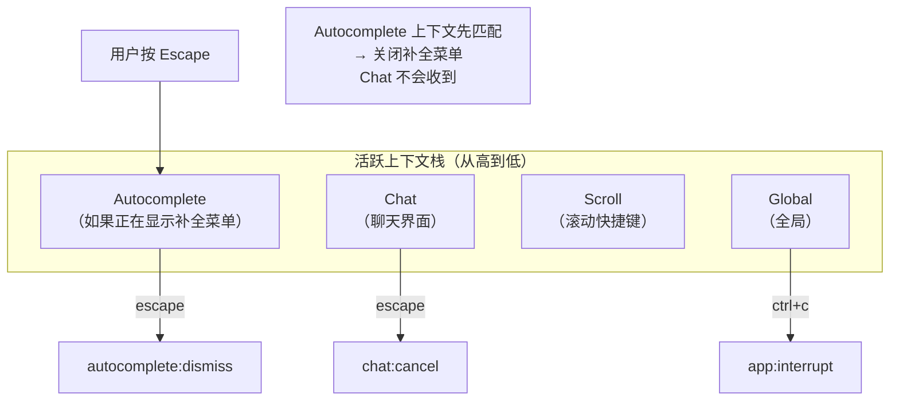
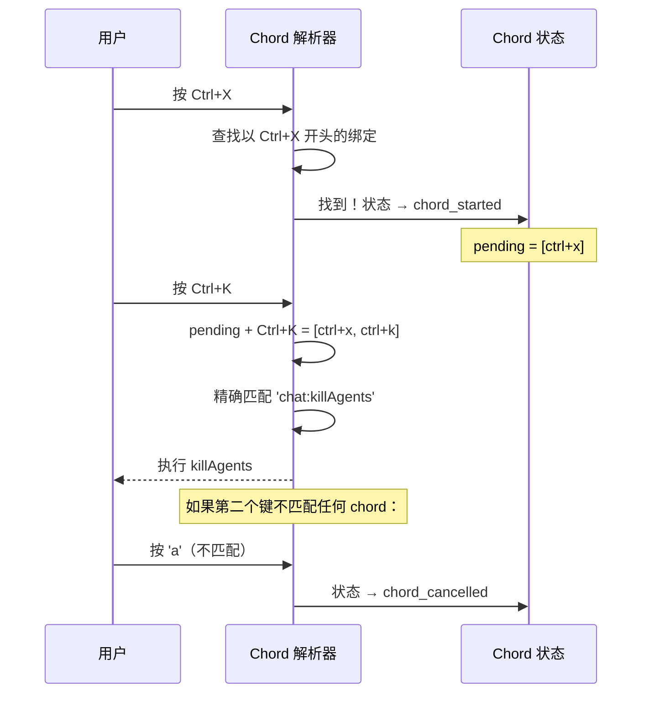
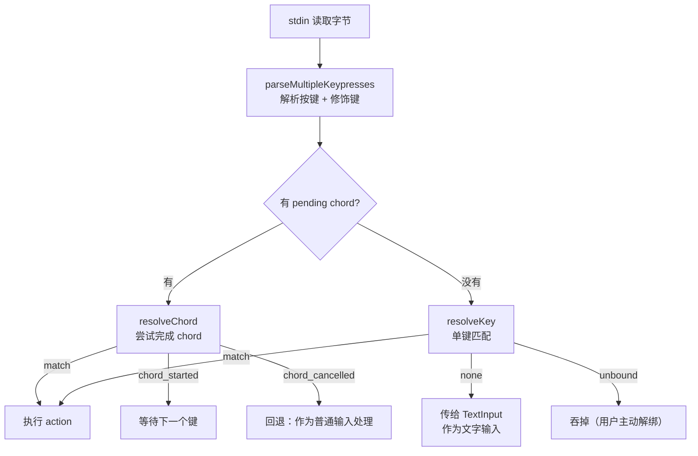

# 第 9 课：键盘绑定系统——快捷键优先级与 Chord

## 学习目标

1. 理解多上下文键盘绑定的优先级模型
2. 掌握默认绑定的声明方式和平台适配
3. 了解 Chord（组合键序列）的解析机制
4. 理解 `resolveKey` 的匹配算法
5. 学会追踪一个快捷键从按下到执行的完整路径

---

## 9.1 问题：一个按键，多种含义

### 生活类比：办公大楼的门禁卡

- 在**大厅**刷卡 → 开大门
- 在**办公室**刷卡 → 开办公室门
- 在**电梯**刷卡 → 激活楼层按钮

同一张卡（按键），在不同区域（上下文）有不同的效果。

Claude Code 中 `Escape` 键就是这样：
- **聊天界面**：取消当前操作
- **自动补全**：关闭补全菜单
- **设置面板**：返回上一级
- **确认对话框**：选择"否"

---

## 9.2 绑定声明：defaultBindings

```typescript
// 源码: keybindings/defaultBindings.ts（简化）
export const DEFAULT_BINDINGS: KeybindingBlock[] = [
  {
    context: 'Global',
    bindings: {
      'ctrl+c': 'app:interrupt',
      'ctrl+d': 'app:exit',
      'ctrl+l': 'app:redraw',
      'ctrl+t': 'app:toggleTodos',
      'ctrl+o': 'app:toggleTranscript',
      'ctrl+r': 'history:search',
    },
  },
  {
    context: 'Chat',
    bindings: {
      escape: 'chat:cancel',
      'ctrl+x ctrl+k': 'chat:killAgents',  // ← Chord!
      'shift+tab': 'chat:cycleMode',
      'meta+p': 'chat:modelPicker',
      enter: 'chat:submit',
      up: 'history:previous',
      down: 'history:next',
      'ctrl+_': 'chat:undo',
      'ctrl+x ctrl+e': 'chat:externalEditor',
      'ctrl+s': 'chat:stash',
    },
  },
  {
    context: 'Autocomplete',
    bindings: {
      tab: 'autocomplete:accept',
      escape: 'autocomplete:dismiss',
      up: 'autocomplete:previous',
      down: 'autocomplete:next',
    },
  },
  {
    context: 'Settings',
    bindings: {
      escape: 'confirm:no',
      up: 'select:previous',
      down: 'select:next',
      j: 'select:previous',
      k: 'select:next',
      space: 'select:accept',
      enter: 'settings:close',
      '/': 'settings:search',
    },
  },
  {
    context: 'Confirmation',
    bindings: {
      y: 'confirm:yes',
      n: 'confirm:no',
      enter: 'confirm:yes',
      escape: 'confirm:no',
    },
  },
  // ...更多上下文
]
```

---

## 9.3 上下文优先级



匹配规则：
1. 按**上下文**顺序查找绑定
2. **最后一个**匹配的绑定胜出（支持用户覆盖）
3. 未匹配 → 返回 `{ type: 'none' }`
4. 被解绑（action=null） → 返回 `{ type: 'unbound' }`

---

## 9.4 resolveKey：匹配算法

```typescript
// 源码: keybindings/resolver.ts
export function resolveKey(
  input: string,
  key: Key,
  activeContexts: KeybindingContextName[],
  bindings: ParsedBinding[],
): ResolveResult {
  let match: ParsedBinding | undefined
  const ctxSet = new Set(activeContexts)

  for (const binding of bindings) {
    // 只看单键绑定（chord 由 resolveChord 处理）
    if (binding.chord.length !== 1) continue
    // 必须在活跃的上下文中
    if (!ctxSet.has(binding.context)) continue

    if (matchesBinding(input, key, binding)) {
      match = binding  // 最后一个匹配的胜出
    }
  }

  if (!match) return { type: 'none' }
  if (match.action === null) return { type: 'unbound' }
  return { type: 'match', action: match.action }
}
```

### 匹配细节

```typescript
// 源码: keybindings/resolver.ts（简化）
function buildKeystroke(input: string, key: Key): ParsedKeystroke | null {
  const keyName = getKeyName(input, key)
  if (!keyName) return null

  // Escape 键的特殊处理：Ink 会设置 key.meta=true
  // 但我们不应该把它记录为 meta 修饰符
  const effectiveMeta = key.escape ? false : key.meta

  return {
    key: keyName,
    ctrl: key.ctrl,
    alt: effectiveMeta,
    shift: key.shift,
    meta: effectiveMeta,
    super: key.super,
  }
}
```

---

## 9.5 Chord：组合键序列

Chord 是**按顺序按下的多个键组合**，比如 `Ctrl+X Ctrl+K`：



```typescript
// 源码: keybindings/resolver.ts
export type ChordResolveResult =
  | { type: 'match'; action: string }
  | { type: 'none' }
  | { type: 'unbound' }
  | { type: 'chord_started'; pending: ParsedKeystroke[] }
  | { type: 'chord_cancelled' }
```

### 前缀匹配

```typescript
// 检查按键序列是否是某个绑定的前缀
function chordPrefixMatches(
  prefix: ParsedKeystroke[],
  binding: ParsedBinding,
): boolean {
  if (prefix.length >= binding.chord.length) return false
  for (let i = 0; i < prefix.length; i++) {
    if (!keystrokesEqual(prefix[i]!, binding.chord[i]!)) return false
  }
  return true
}
```

---

## 9.6 平台适配

```typescript
// 源码: keybindings/defaultBindings.ts
// Windows 上 Ctrl+V 是系统粘贴，用 Alt+V 代替
const IMAGE_PASTE_KEY =
  getPlatform() === 'windows' ? 'alt+v' : 'ctrl+v'

// 某些终端不支持 Shift+Tab
const SUPPORTS_TERMINAL_VT_MODE =
  getPlatform() !== 'windows' || // 非 Windows 总是支持
  (isRunningWithBun()
    ? satisfies(process.versions.bun, '>=1.2.23')
    : satisfies(process.versions.node, '>=22.17.0'))

const MODE_CYCLE_KEY = SUPPORTS_TERMINAL_VT_MODE
  ? 'shift+tab'     // 大多数终端
  : 'meta+m'         // Windows 老版本 fallback
```

---

## 9.7 修饰键的等价性

终端无法区分 Alt 和 Meta（Cmd on macOS），所以它们被视为等价：

```typescript
// 源码: keybindings/resolver.ts
export function keystrokesEqual(
  a: ParsedKeystroke,
  b: ParsedKeystroke,
): boolean {
  return (
    a.key === b.key &&
    a.ctrl === b.ctrl &&
    a.shift === b.shift &&
    (a.alt || a.meta) === (b.alt || b.meta) &&  // Alt ≡ Meta
    a.super === b.super  // Super(Cmd/Win) 独立——只有 Kitty 协议支持
  )
}
```

---

## 9.8 完整的按键处理流程



---

## 9.9 动手练习

### 练习 1：上下文分析

在以下场景中，`Escape` 键分别触发什么 action？
1. 正在显示自动补全菜单
2. 在聊天界面（无补全菜单）
3. 在设置面板中
4. 在确认对话框中

### 练习 2：Chord 状态推演

用户依次按下 `Ctrl+X`、`Ctrl+E`。推演 chord 解析器的状态变化。

### 练习 3：自定义绑定

如果用户想把 `Ctrl+G` 从 `chat:externalEditor` 改为 `chat:cancel`，需要在 keybindings.json 中写什么？

### 练习 4：查看源码

1. 在 `defaultBindings.ts` 中找到所有使用 `feature()` 的条件绑定。哪些功能是 feature flag 控制的？
2. 在 `resolver.ts` 中找到 `getBindingDisplayText` 函数——它是怎么把内部格式转成用户可读的快捷键文字的？
3. 找到 `reservedShortcuts.ts`，看看哪些快捷键不允许用户覆盖。

---

## 本课小结

| 概念 | 说明 |
|------|------|
| 多上下文 | 同一按键在不同上下文有不同含义 |
| 优先级 | 按上下文顺序匹配，最后一个胜出 |
| Chord | 多键序列，如 `Ctrl+X Ctrl+K` |
| 平台适配 | Windows/macOS/Linux 不同的默认绑定 |
| Alt ≡ Meta | 终端无法区分，视为等价 |
| 用户覆盖 | action=null 可以解绑默认快捷键 |

## 下节预告

下一课是最后一课——**设计系统与主题**。我们将看到 Claude Code 如何用 Theme 类型定义完整的颜色体系，以及 `ThemedText`、`ThemedBox` 等组件如何构建统一的 UI 风格。
