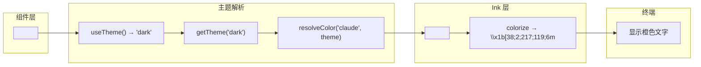
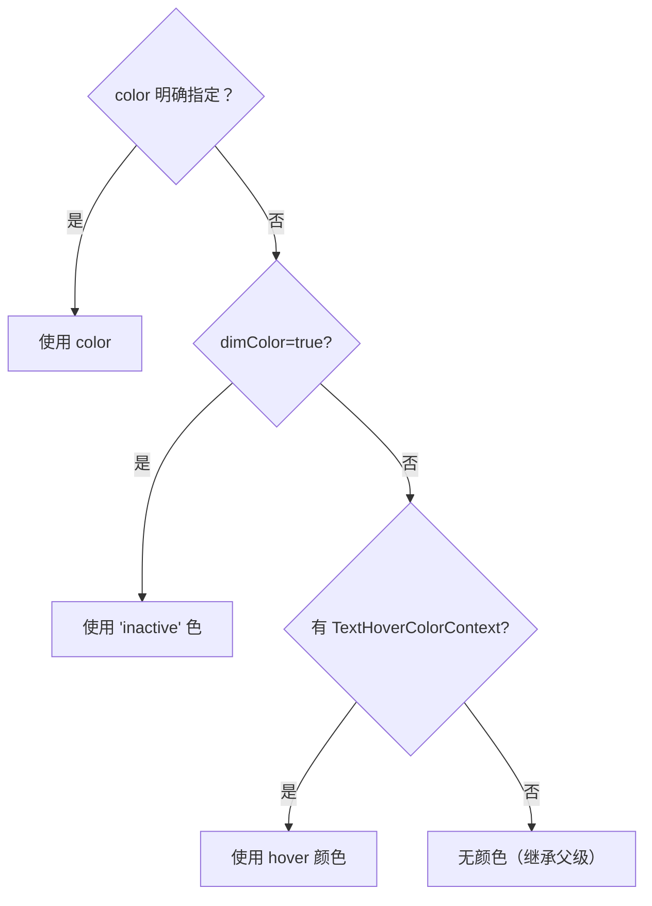
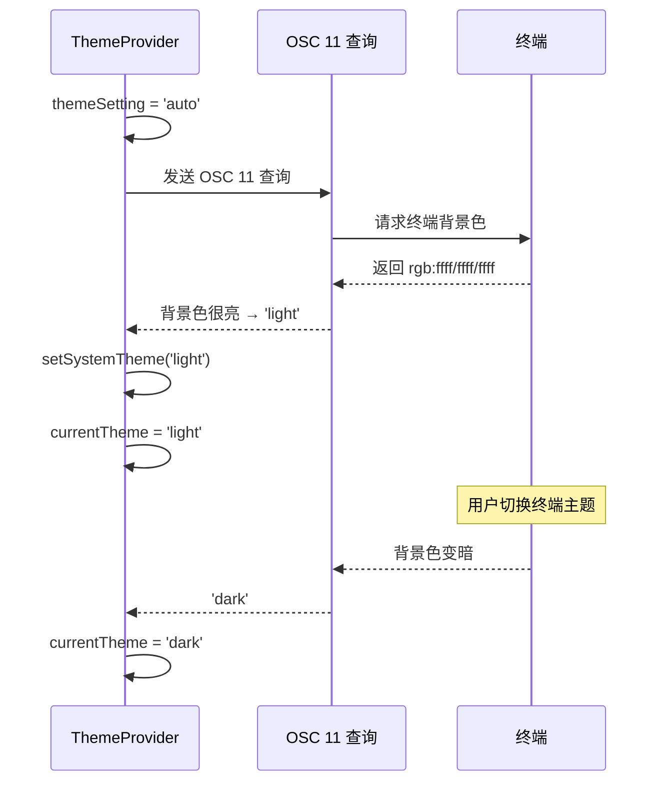
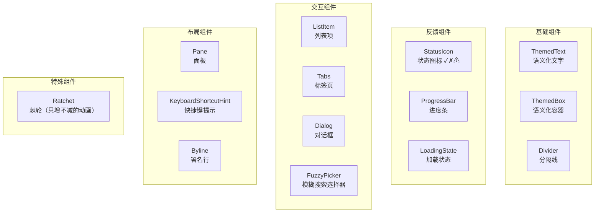

# 第 10 课：设计系统与主题——构建统一的 UI 风格

## 学习目标

1. 理解终端 UI 设计系统的独特挑战
2. 掌握 Theme 类型系统的完整结构
3. 了解 `ThemedText` 和 `ThemedBox` 的主题解析机制
4. 理解自动主题检测（Auto Theme）的工作原理
5. 认识 Claude Code 设计系统中的核心组件

---

## 10.1 终端设计系统的挑战

### 生活类比：黑白照片上色

- **浏览器设计系统**：像数字绘画——想用什么颜色就用什么，CSS 变量一改全变
- **终端设计系统**：像给黑白照片上色——色彩受限（256 色或 RGB）、没有圆角、没有阴影、一切用字符拼

但 Claude Code 证明了终端也能有优雅的设计系统！关键在于：
1. **统一的颜色语义**——不是 `#D97706`，而是 `claude`（语义色名）
2. **主题切换**——同一套语义色，在暗色/亮色主题下映射到不同的实际颜色
3. **组件库**——`ThemedText`、`ThemedBox`、`Divider` 等封装了主题解析

---

## 10.2 Theme 类型：颜色的"字典"

```typescript
// 源码: utils/theme.ts（简化）
export type Theme = {
  // 品牌色
  claude: string              // Claude 的主品牌色
  claudeShimmer: string       // 更亮的版本（微光效果）
  permission: string          // 权限相关
  planMode: string            // Plan 模式

  // 功能色
  text: string                // 主要文字
  inverseText: string         // 反色文字
  inactive: string            // 非活跃/禁用
  subtle: string              // 微弱提示
  suggestion: string          // 建议
  background: string          // 背景

  // 语义色
  success: string             // 成功
  error: string               // 错误
  warning: string             // 警告

  // Diff 色
  diffAdded: string           // 新增行
  diffRemoved: string         // 删除行
  diffAddedDimmed: string     // 暗淡新增
  diffRemovedDimmed: string   // 暗淡删除
  diffAddedWord: string       // 字级新增高亮
  diffRemovedWord: string     // 字级删除高亮

  // 界面色
  promptBorder: string        // 输入框边框
  bashBorder: string          // Bash 边框
  userMessageBackground: string
  userMessageBackgroundHover: string
  selectionBg: string         // 文本选区背景

  // 进度条
  rate_limit_fill: string
  rate_limit_empty: string

  // ...还有更多
}
```

### 可用的主题

```typescript
export const THEME_NAMES = [
  'dark',              // 深色
  'light',             // 浅色
  'light-daltonized',  // 色盲友好浅色
  'dark-daltonized',   // 色盲友好深色
  'light-ansi',        // ANSI 16 色浅色（兼容性最好）
  'dark-ansi',         // ANSI 16 色深色
] as const
```

---

## 10.3 颜色解析链

从组件中使用 `color="claude"` 到终端输出实际颜色，经历了几个步骤：



---

## 10.4 ThemedText：语义化文本

```typescript
// 源码: components/design-system/ThemedText.tsx（还原 TSX）
export default function ThemedText({
  color,            // 主题 key 或原始颜色
  backgroundColor,  // 背景主题 key
  dimColor,         // 是否用 inactive 色替代
  bold,
  italic,
  underline,
  wrap,
  children,
}: Props) {
  const [themeName] = useTheme()
  const theme = getTheme(themeName)

  // 优先级：明确指定的 color > hover 颜色 > dimColor
  const hoverColor = useContext(TextHoverColorContext)
  const resolvedColor = resolveColor(
    color ?? (dimColor ? 'inactive' : hoverColor),
    theme
  )
  const resolvedBg = resolveColor(backgroundColor, theme)

  return (
    <Text
      color={resolvedColor}
      backgroundColor={resolvedBg}
      bold={bold}
      italic={italic}
      underline={underline}
      wrap={wrap}
    >
      {children}
    </Text>
  )
}
```

### 颜色优先级



---

## 10.5 ThemedBox：语义化容器

```typescript
// 源码: components/design-system/ThemedBox.tsx（还原 TSX）
function ThemedBox({
  borderColor,
  borderTopColor,
  borderBottomColor,
  borderLeftColor,
  borderRightColor,
  backgroundColor,
  children,
  ref,
  ...rest
}: Props) {
  const [themeName] = useTheme()
  const theme = getTheme(themeName)

  // 把所有颜色 props 都解析为实际颜色
  const resolvedBorderColor = resolveColor(borderColor, theme)
  const resolvedBorderTopColor = resolveColor(borderTopColor, theme)
  const resolvedBorderBottomColor = resolveColor(borderBottomColor, theme)
  // ...

  return (
    <Box
      ref={ref}
      borderColor={resolvedBorderColor}
      borderTopColor={resolvedBorderTopColor}
      borderBottomColor={resolvedBorderBottomColor}
      // ...
      {...rest}
    >
      {children}
    </Box>
  )
}
```

### resolveColor 函数

```typescript
function resolveColor(
  color: keyof Theme | Color | undefined,
  theme: Theme,
): Color | undefined {
  if (!color) return undefined

  // 已经是原始颜色值 → 直接返回
  if (
    color.startsWith('rgb(') ||
    color.startsWith('#') ||
    color.startsWith('ansi256(') ||
    color.startsWith('ansi:')
  ) {
    return color as Color
  }

  // 是主题 key → 查表
  return theme[color as keyof Theme] as Color
}
```

---

## 10.6 ThemeProvider：主题状态管理

```typescript
// 源码: components/design-system/ThemeProvider.tsx（还原 TSX）
export function ThemeProvider({
  children,
  initialState,
  onThemeSave = defaultSaveTheme,
}: Props) {
  const [themeSetting, setThemeSetting] = useState(
    initialState ?? defaultInitialTheme
  )
  const [previewTheme, setPreviewTheme] = useState(null)
  const [systemTheme, setSystemTheme] = useState(() =>
    themeSetting === 'auto' ? getSystemThemeName() : 'dark'
  )

  // 预览主题优先于保存的设置
  const activeSetting = previewTheme ?? themeSetting
  // 'auto' 解析为系统主题
  const currentTheme = activeSetting === 'auto'
    ? systemTheme
    : activeSetting

  // ...
}

// 使用者
export function useTheme(): [ThemeName, (s: ThemeSetting) => void] {
  const { currentTheme, setThemeSetting } = useContext(ThemeContext)
  return [currentTheme, setThemeSetting]
}
```

### 自动主题检测



当 `themeSetting = 'auto'` 时：
1. 通过 OSC 11 序列查询终端背景色
2. 判断亮度 → 决定用 `light` 还是 `dark`
3. 监听终端主题变化，实时切换

---

## 10.7 设计系统组件一览



每个组件都自动适配主题：

```jsx
// 使用示例
<ThemedBox borderColor="promptBorder" borderStyle="round" padding={1}>
  <ThemedText color="claude" bold>Claude Code</ThemedText>
  <Divider />
  <ThemedText dimColor>请输入您的问题...</ThemedText>
  <ProgressBar
    value={0.7}
    fillColor="rate_limit_fill"
    emptyColor="rate_limit_empty"
  />
</ThemedBox>
```

---

## 10.8 color() 工具函数

用于非组件场景（如 chalk 字符串着色）：

```typescript
// 源码: components/design-system/color.ts
export function color(
  c: keyof Theme | Color | undefined,
  theme: ThemeName,
  type: ColorType = 'foreground',
): (text: string) => string {
  return text => {
    if (!c) return text
    // 原始颜色值 → 直接着色
    if (c.startsWith('rgb(') || c.startsWith('#') || ...) {
      return colorize(text, c, type)
    }
    // 主题 key → 查表后着色
    return colorize(text, getTheme(theme)[c as keyof Theme], type)
  }
}

// 使用
const applyColor = color('claude', 'dark')
const result = applyColor('Hello')
// → '\x1b[38;2;217;119;6mHello\x1b[0m'
```

---

## 10.9 设计原则总结

| 原则 | 实现 |
|------|------|
| 语义化颜色 | 用 `'claude'`、`'error'` 而非硬编码 `'#D97706'` |
| 主题可切换 | 同一语义色在不同主题下映射不同值 |
| 无障碍 | `daltonized` 主题适配色盲用户 |
| 兼容性 | `ansi` 主题只用 16 色，适配旧终端 |
| 自动检测 | `auto` 模式通过 OSC 11 检测终端亮度 |
| 实时预览 | ThemePicker 修改 previewTheme 即时生效 |
| 渐进增强 | 从 16 色 ANSI 到 RGB 真彩色，逐级提升 |

---

## 10.10 动手练习

### 练习 1：主题对比

打开 `utils/theme.ts`，对比 `dark` 和 `light` 主题中以下颜色的值：
1. `claude`（品牌色）
2. `text`（文字色）
3. `background`（背景色）
4. `error`（错误色）

它们在暗色和亮色主题下有什么规律？

### 练习 2：创建主题化组件

使用 `ThemedText` 和 `ThemedBox`，设计一个"通知卡片"组件：
- 边框使用 `warning` 颜色
- 标题使用 `warning` + bold
- 内容使用默认 `text` 颜色
- 底部显示 `dimColor` 的时间戳

### 练习 3：追踪主题切换

画出用户通过 ThemePicker 切换主题时的完整数据流：
1. `setPreviewTheme('light')` → 哪些组件会重渲染？
2. `savePreview()` → 数据持久化到哪里？
3. 如果选择 `'auto'`，接下来会发生什么？

### 练习 4：查看源码

1. 在 `utils/theme.ts` 中找到 `env.terminal === 'Apple_Terminal'` 的特殊处理——Apple 终端有什么不同？
2. 找到 `design-system/` 目录下所有组件，按功能分类整理。
3. 找到 `color.ts` 中的 `colorize` 函数被哪些地方调用。

---

## 本课小结

| 概念 | 说明 |
|------|------|
| Theme 类型 | 定义完整的语义化颜色体系（50+ 颜色） |
| resolveColor | 主题 key → 实际颜色值 → ANSI 转义码 |
| ThemedText | 自动解析主题色的 Text 包装器 |
| ThemedBox | 自动解析边框和背景色的 Box 包装器 |
| ThemeProvider | 管理主题状态、预览和持久化 |
| 自动主题 | OSC 11 查询终端背景色，自动选择明暗 |
| 设计系统 | 16 个核心组件，统一的 UI 风格 |

---

## 课程完结

恭喜你完成了 Claude Code 终端 UI 系统的全部 10 节课！让我们回顾一下学到的内容：

| 课程 | 主题 | 核心收获 |
|------|------|----------|
| 第 1 课 | 终端 UI 基础 | ANSI 转义码、字符网格、React 声明式 |
| 第 2 课 | Ink 框架 | Box/Text 组件、Reconciler、Yoga 布局 |
| 第 3 课 | 双层 App | Provider 洋葱模型、业务与基础设施分离 |
| 第 4 课 | 虚拟滚动 | 高度估算、滚动量化、滑动步进 |
| 第 5 课 | TextInput | Cursor 类、Kill Ring、双击安全 |
| 第 6 课 | Vim 模式 | 状态机、操作符+动作、dot-repeat |
| 第 7 课 | Spinner | 共享时钟、离屏暂停、颜色插值 |
| 第 8 课 | Diff 展示 | Rust NAPI、WeakMap 缓存、双列分割 |
| 第 9 课 | 键盘绑定 | 多上下文、Chord 序列、平台适配 |
| 第 10 课 | 设计系统 | Theme 类型、语义化颜色、主题切换 |

这些知识不仅适用于 Claude Code，也是构建任何复杂终端 UI 的通用模式。祝你在终端 UI 的世界中继续探索！
